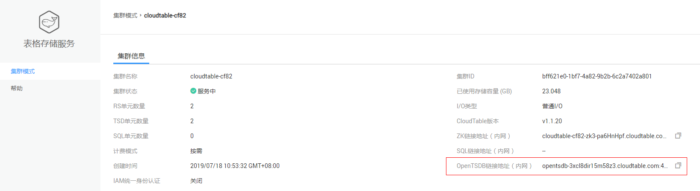
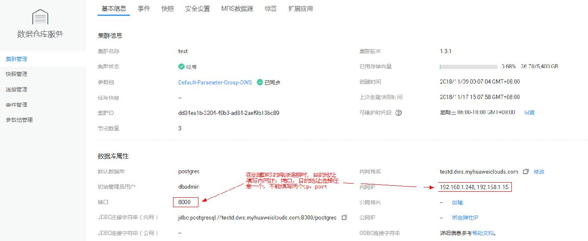
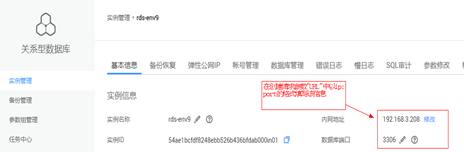
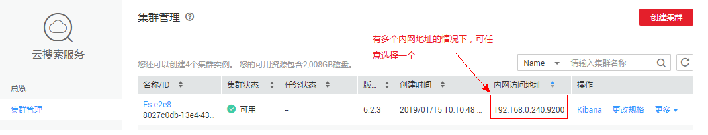

# 创建经典型跨源连接<a name="dli_02_0144"></a>

## 功能介绍<a name="section13287428103611"></a>

该API用于创建与其他服务的经典型跨源连接。

> **说明：**   
>-   如果需要了解Console界面的使用方法，可参考《数据湖探索用户指南》中的“经典型跨源连接”。  
>-   系统default队列不支持使用跨源连接。  

## URI<a name="section52924285361"></a>

-   URI格式

    POST /v2.0/\{project\_id\}/datasource-connection

-   参数说明

    **表 1**  URI参数

    <a name="table18299172853614"></a>
    <table><thead align="left"><tr id="row947592853614"><th class="cellrowborder" valign="top" width="16.28%" id="mcps1.2.4.1.1"><p id="p1347513282368"><a name="p1347513282368"></a><a name="p1347513282368"></a>名称</p>
    </th>
    <th class="cellrowborder" valign="top" width="13.459999999999999%" id="mcps1.2.4.1.2"><p id="p74757287366"><a name="p74757287366"></a><a name="p74757287366"></a>是否必选</p>
    </th>
    <th class="cellrowborder" valign="top" width="70.26%" id="mcps1.2.4.1.3"><p id="p1475182833610"><a name="p1475182833610"></a><a name="p1475182833610"></a>说明</p>
    </th>
    </tr>
    </thead>
    <tbody><tr id="row16475152833619"><td class="cellrowborder" valign="top" width="16.28%" headers="mcps1.2.4.1.1 "><p id="p1547552803615"><a name="p1547552803615"></a><a name="p1547552803615"></a>project_id</p>
    </td>
    <td class="cellrowborder" valign="top" width="13.459999999999999%" headers="mcps1.2.4.1.2 "><p id="p19475828123613"><a name="p19475828123613"></a><a name="p19475828123613"></a>是</p>
    </td>
    <td class="cellrowborder" valign="top" width="70.26%" headers="mcps1.2.4.1.3 "><p id="p1310472724012"><a name="p1310472724012"></a><a name="p1310472724012"></a>项目编号，用于资源隔离。获取方式请参考<a href="获取项目ID.md">获取项目ID</a>。</p>
    </td>
    </tr>
    </tbody>
    </table>


## 请求消息<a name="section1831452873613"></a>

**表 2**  请求参数

<a name="table19317132814368"></a>
<table><thead align="left"><tr id="row6476182803617"><th class="cellrowborder" valign="top" width="18.39%" id="mcps1.2.5.1.1"><p id="p7476142811364"><a name="p7476142811364"></a><a name="p7476142811364"></a>参数</p>
</th>
<th class="cellrowborder" valign="top" width="9.9%" id="mcps1.2.5.1.2"><p id="p16476102818360"><a name="p16476102818360"></a><a name="p16476102818360"></a>是否必选</p>
</th>
<th class="cellrowborder" valign="top" width="10.59%" id="mcps1.2.5.1.3"><p id="p147652813365"><a name="p147652813365"></a><a name="p147652813365"></a>参数类型</p>
</th>
<th class="cellrowborder" valign="top" width="61.12%" id="mcps1.2.5.1.4"><p id="p447622833612"><a name="p447622833612"></a><a name="p447622833612"></a>说明</p>
</th>
</tr>
</thead>
<tbody><tr id="row4179115221218"><td class="cellrowborder" valign="top" width="18.39%" headers="mcps1.2.5.1.1 "><p id="p1859310416134"><a name="p1859310416134"></a><a name="p1859310416134"></a>name</p>
</td>
<td class="cellrowborder" valign="top" width="9.9%" headers="mcps1.2.5.1.2 "><p id="p1259316417131"><a name="p1259316417131"></a><a name="p1259316417131"></a>是</p>
</td>
<td class="cellrowborder" valign="top" width="10.59%" headers="mcps1.2.5.1.3 "><p id="p15935415137"><a name="p15935415137"></a><a name="p15935415137"></a>String</p>
</td>
<td class="cellrowborder" valign="top" width="61.12%" headers="mcps1.2.5.1.4 "><p id="p135938431310"><a name="p135938431310"></a><a name="p135938431310"></a>连接名称。</p>
</td>
</tr>
<tr id="row12180352141212"><td class="cellrowborder" valign="top" width="18.39%" headers="mcps1.2.5.1.1 "><p id="p165931846130"><a name="p165931846130"></a><a name="p165931846130"></a>service</p>
</td>
<td class="cellrowborder" valign="top" width="9.9%" headers="mcps1.2.5.1.2 "><p id="p165931341133"><a name="p165931341133"></a><a name="p165931341133"></a>是</p>
</td>
<td class="cellrowborder" valign="top" width="10.59%" headers="mcps1.2.5.1.3 "><p id="p1859318414131"><a name="p1859318414131"></a><a name="p1859318414131"></a>String</p>
</td>
<td class="cellrowborder" valign="top" width="61.12%" headers="mcps1.2.5.1.4 "><p id="p85937411135"><a name="p85937411135"></a><a name="p85937411135"></a>服务名称，目前为CloudTable.OpenTSDB/CloudTable，MRS.OPENTSDB，DWS，RDS，CSS。</p>
<div class="note" id="note627413509012"><a name="note627413509012"></a><a name="note627413509012"></a><span class="notetitle"> 说明： </span><div class="notebody"><p id="p1027625011013"><a name="p1027625011013"></a><a name="p1027625011013"></a>大小写不敏感。</p>
</div></div>
</td>
</tr>
<tr id="row11476132833616"><td class="cellrowborder" valign="top" width="18.39%" headers="mcps1.2.5.1.1 "><p id="p1985012475115"><a name="p1985012475115"></a><a name="p1985012475115"></a>security_group_id</p>
</td>
<td class="cellrowborder" valign="top" width="9.9%" headers="mcps1.2.5.1.2 "><p id="p8849747141118"><a name="p8849747141118"></a><a name="p8849747141118"></a>是</p>
</td>
<td class="cellrowborder" valign="top" width="10.59%" headers="mcps1.2.5.1.3 "><p id="p1884834715115"><a name="p1884834715115"></a><a name="p1884834715115"></a>String</p>
</td>
<td class="cellrowborder" valign="top" width="61.12%" headers="mcps1.2.5.1.4 "><p id="p15848194710119"><a name="p15848194710119"></a><a name="p15848194710119"></a>用户指定安全组ID，即为需要建立连接的服务所在的安全组。</p>
</td>
</tr>
<tr id="row17476828143615"><td class="cellrowborder" valign="top" width="18.39%" headers="mcps1.2.5.1.1 "><p id="p4844447161110"><a name="p4844447161110"></a><a name="p4844447161110"></a>network_id</p>
</td>
<td class="cellrowborder" valign="top" width="9.9%" headers="mcps1.2.5.1.2 "><p id="p14844204719110"><a name="p14844204719110"></a><a name="p14844204719110"></a>是</p>
</td>
<td class="cellrowborder" valign="top" width="10.59%" headers="mcps1.2.5.1.3 "><p id="p6842104751111"><a name="p6842104751111"></a><a name="p6842104751111"></a>String</p>
</td>
<td class="cellrowborder" valign="top" width="61.12%" headers="mcps1.2.5.1.4 "><p id="p138427472111"><a name="p138427472111"></a><a name="p138427472111"></a>对应服务的子网网络ID，即为需要建立连接的服务所在的子网。</p>
</td>
</tr>
<tr id="row8477328193612"><td class="cellrowborder" valign="top" width="18.39%" headers="mcps1.2.5.1.1 "><p id="p1980914761112"><a name="p1980914761112"></a><a name="p1980914761112"></a>url</p>
</td>
<td class="cellrowborder" valign="top" width="9.9%" headers="mcps1.2.5.1.2 "><p id="p4808547171117"><a name="p4808547171117"></a><a name="p4808547171117"></a>是</p>
</td>
<td class="cellrowborder" valign="top" width="10.59%" headers="mcps1.2.5.1.3 "><p id="p198072047191115"><a name="p198072047191115"></a><a name="p198072047191115"></a>String</p>
</td>
<td class="cellrowborder" valign="top" width="61.12%" headers="mcps1.2.5.1.4 "><p id="p14805134771118"><a name="p14805134771118"></a><a name="p14805134771118"></a>对应服务对外提供的访问url。长度不能超过512个字符。获取方式请参考<a href="#table426634215174">表3</a>。</p>
</td>
</tr>
</tbody>
</table>

**表 3**  各服务URL获取方式

<a name="table426634215174"></a>
<table><thead align="left"><tr id="row526864201713"><th class="cellrowborder" valign="top" width="15.340000000000002%" id="mcps1.2.3.1.1"><p id="p2268842131717"><a name="p2268842131717"></a><a name="p2268842131717"></a>服务名称</p>
</th>
<th class="cellrowborder" valign="top" width="84.66%" id="mcps1.2.3.1.2"><p id="p126812421175"><a name="p126812421175"></a><a name="p126812421175"></a>URL获取方式</p>
</th>
</tr>
</thead>
<tbody><tr id="row172681442191716"><td class="cellrowborder" valign="top" width="15.340000000000002%" headers="mcps1.2.3.1.1 "><p id="p1024182713101"><a name="p1024182713101"></a><a name="p1024182713101"></a>Cloud Table</p>
</td>
<td class="cellrowborder" valign="top" width="84.66%" headers="mcps1.2.3.1.2 "><a name="ul64611037181719"></a><a name="ul64611037181719"></a><ul id="ul64611037181719"><li>HBase<p id="p2268164218177"><a name="p2268164218177"></a><a name="p2268164218177"></a><a name="image1541217125496"></a><a name="image1541217125496"></a><span></span></p>
</li><li>OpenTSDB<p id="p732411579164"><a name="p732411579164"></a><a name="p732411579164"></a><a name="image181315367399"></a><a name="image181315367399"></a><span></span></p>
</li></ul>
</td>
</tr>
<tr id="row11268114271718"><td class="cellrowborder" valign="top" width="15.340000000000002%" headers="mcps1.2.3.1.1 "><p id="p1224115271101"><a name="p1224115271101"></a><a name="p1224115271101"></a>DWS</p>
</td>
<td class="cellrowborder" valign="top" width="84.66%" headers="mcps1.2.3.1.2 "><p id="p2268042151711"><a name="p2268042151711"></a><a name="p2268042151711"></a><a name="image958322785011"></a><a name="image958322785011"></a><span></span></p>
</td>
</tr>
<tr id="row19268104281718"><td class="cellrowborder" valign="top" width="15.340000000000002%" headers="mcps1.2.3.1.1 "><p id="p142411227121020"><a name="p142411227121020"></a><a name="p142411227121020"></a>RDS</p>
</td>
<td class="cellrowborder" valign="top" width="84.66%" headers="mcps1.2.3.1.2 "><p id="p102681242181715"><a name="p102681242181715"></a><a name="p102681242181715"></a><a name="image16013234512"></a><a name="image16013234512"></a><span></span></p>
</td>
</tr>
<tr id="row13535953113"><td class="cellrowborder" valign="top" width="15.340000000000002%" headers="mcps1.2.3.1.1 "><p id="p20356129173115"><a name="p20356129173115"></a><a name="p20356129173115"></a>CSS</p>
</td>
<td class="cellrowborder" valign="top" width="84.66%" headers="mcps1.2.3.1.2 "><p id="p113569933110"><a name="p113569933110"></a><a name="p113569933110"></a><a name="image512412143411"></a><a name="image512412143411"></a><span></span></p>
</td>
</tr>
<tr id="row16402347194"><td class="cellrowborder" valign="top" width="15.340000000000002%" headers="mcps1.2.3.1.1 "><p id="p114035413198"><a name="p114035413198"></a><a name="p114035413198"></a>MRS</p>
</td>
<td class="cellrowborder" valign="top" width="84.66%" headers="mcps1.2.3.1.2 "><p id="p1640374131910"><a name="p1640374131910"></a><a name="p1640374131910"></a><a name="image7822123113314"></a><a name="image7822123113314"></a><span></span></p>
<p id="p9681545172411"><a name="p9681545172411"></a><a name="p9681545172411"></a><a name="image1144052753213"></a><a name="image1144052753213"></a><span></span></p>
</td>
</tr>
</tbody>
</table>

## 响应消息<a name="section134515287360"></a>

-   返回码

    201


-   响应参数

**表 4**  响应参数

<a name="table8348112818368"></a>
<table><thead align="left"><tr id="row11478132863610"><th class="cellrowborder" valign="top" width="19.67%" id="mcps1.2.5.1.1"><p id="p04782028173616"><a name="p04782028173616"></a><a name="p04782028173616"></a>参数</p>
</th>
<th class="cellrowborder" valign="top" width="15.049999999999999%" id="mcps1.2.5.1.2"><p id="p897919323479"><a name="p897919323479"></a><a name="p897919323479"></a>是否必选</p>
</th>
<th class="cellrowborder" valign="top" width="16.32%" id="mcps1.2.5.1.3"><p id="p34781128193612"><a name="p34781128193612"></a><a name="p34781128193612"></a>参数类型</p>
</th>
<th class="cellrowborder" valign="top" width="48.96%" id="mcps1.2.5.1.4"><p id="p1347917286364"><a name="p1347917286364"></a><a name="p1347917286364"></a>说明</p>
</th>
</tr>
</thead>
<tbody><tr id="row18479182813362"><td class="cellrowborder" valign="top" width="19.67%" headers="mcps1.2.5.1.1 "><p id="zh-cn_topic_0069077904_p63831923"><a name="zh-cn_topic_0069077904_p63831923"></a><a name="zh-cn_topic_0069077904_p63831923"></a>is_success</p>
</td>
<td class="cellrowborder" valign="top" width="15.049999999999999%" headers="mcps1.2.5.1.2 "><p id="p297923220476"><a name="p297923220476"></a><a name="p297923220476"></a>否</p>
</td>
<td class="cellrowborder" valign="top" width="16.32%" headers="mcps1.2.5.1.3 "><p id="zh-cn_topic_0069077904_p41939966"><a name="zh-cn_topic_0069077904_p41939966"></a><a name="zh-cn_topic_0069077904_p41939966"></a>Boolean</p>
</td>
<td class="cellrowborder" valign="top" width="48.96%" headers="mcps1.2.5.1.4 "><p id="p15380173521417"><a name="p15380173521417"></a><a name="p15380173521417"></a>执行请求是否成功。<span class="parmvalue" id="parmvalue10405423161014"><a name="parmvalue10405423161014"></a><a name="parmvalue10405423161014"></a>“true”</span>表示请求执行成功。</p>
</td>
</tr>
<tr id="row193581808325"><td class="cellrowborder" valign="top" width="19.67%" headers="mcps1.2.5.1.1 "><p id="p16358180103211"><a name="p16358180103211"></a><a name="p16358180103211"></a>message</p>
</td>
<td class="cellrowborder" valign="top" width="15.049999999999999%" headers="mcps1.2.5.1.2 "><p id="p7979103211475"><a name="p7979103211475"></a><a name="p7979103211475"></a>否</p>
</td>
<td class="cellrowborder" valign="top" width="16.32%" headers="mcps1.2.5.1.3 "><p id="p1635890103217"><a name="p1635890103217"></a><a name="p1635890103217"></a>String</p>
</td>
<td class="cellrowborder" valign="top" width="48.96%" headers="mcps1.2.5.1.4 "><p id="p535830163217"><a name="p535830163217"></a><a name="p535830163217"></a>系统提示信息，执行成功时，信息可能为空。</p>
</td>
</tr>
<tr id="row18100163216132"><td class="cellrowborder" valign="top" width="19.67%" headers="mcps1.2.5.1.1 "><p id="p10551134501310"><a name="p10551134501310"></a><a name="p10551134501310"></a>connection_id</p>
</td>
<td class="cellrowborder" valign="top" width="15.049999999999999%" headers="mcps1.2.5.1.2 "><p id="p99795329477"><a name="p99795329477"></a><a name="p99795329477"></a>否</p>
</td>
<td class="cellrowborder" valign="top" width="16.32%" headers="mcps1.2.5.1.3 "><p id="p25515459134"><a name="p25515459134"></a><a name="p25515459134"></a>String</p>
</td>
<td class="cellrowborder" valign="top" width="48.96%" headers="mcps1.2.5.1.4 "><p id="p05511845181319"><a name="p05511845181319"></a><a name="p05511845181319"></a>连接ID，用于标识跨源连接的UUID。</p>
</td>
</tr>
</tbody>
</table>

## 示例<a name="section910624615450"></a>

-   请求样例：

    ```
    {
        "name": "test1",
        "security_group_id": "a07ab107-a4ad-4835-ad09-08a2f2efccdb",
        "network_id": "e83ba67d-e812-42d3-908d-6ea0b2cc5ecb",
        "url": "cloudtable-8636-zk2-ldQklrNa.mycloudtable.com:2181,cloudtable-8636-zk3-N9EEH4mI.mycloudtable.com:2181,cloudtable-8636-zk1-78Lt0l8L.mycloudtable.com:2181",
        "service": "ct"
    }
    ```


-   成功响应样例:

    ```
    {
        "is_success": true,
        "message": "",
        "connection_id": "68233202-63bf-4f27-a99b-fa5f5a2dbae1"
    }
    ```

    > **说明：**   
    >调用接口出错后，将不会返回上述结果，而是返回错误码和错误信息，详细介绍请参见[错误码](错误码.md)。  


