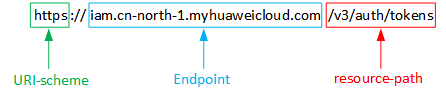

# 构造请求<a name="dli_02_0180"></a>

本章节介绍REST API请求的组成，并以调用IAM服务的[获取用户Token](https://support.huaweicloud.com/api-iam/iam_30_0001.html)接口说明如何调用API，该API获取用户的Token，Token可以用于调用其他API时进行鉴权。

您还可以通过这个视频教程了解如何构造请求调用API：[https://bbs.huaweicloud.com/videos/102987](https://bbs.huaweicloud.com/videos/102987)  。

## 请求URI<a name="section12595174817554"></a>

请求URI由如下部分组成。

**\{URI-scheme\} :// \{Endpoint\} / \{resource-path\} ? \{query-string\}**

尽管请求URI包含在请求消息头中，但大多数语言或框架都要求您从请求消息中单独传递它，所以在此单独强调。

-   **URI-scheme**：表示用于传输请求的协议，当前所有API均采用**HTTPS**协议。
-   **Endpoint**：指定承载REST服务端点的服务器域名或IP，不同服务不同区域的Endpoint不同，您可以从[地区和终端节点](https://developer.huaweicloud.com/endpoint?dli)中获取。例如IAM服务在“华北-北京一”区域的Endpoint为“iam.cn-north-1.myhuaweicloud.com”。
-   **resource-path**：资源路径，即API访问路径。从具体API的URI模块获取，例如“获取用户Token”API的resource-path为“/v3/auth/tokens”。
-   **query-string**：查询参数，是可选部分，并不是每个API都有查询参数。查询参数前面需要带一个“？”，形式为“参数名=参数取值”，例如“limit=10”，表示查询不超过10条数据。

例如，您需要获取IAM在“华北-北京一”区域的Token，则需使用“华北-北京一”区域的Endpoint（iam.cn-north-1.myhuaweicloud.com），并在[获取用户Token](https://support.huaweicloud.com/api-iam/iam_30_0001.html)的URI部分找到resource-path（/v3/auth/tokens），拼接起来如下所示。

```
https://iam.cn-north-1.myhuaweicloud.com/v3/auth/tokens
```

**图 1**  URI示意图<a name="fig78937484553"></a>  


> **说明：** 
>为查看方便，在每个具体API的URI部分，只给出resource-path部分，并将请求方法写在一起。这是因为URI-scheme都是HTTPS，而Endpoint在同一个区域也是相同，所以简洁起见将这两部分省略。

## 请求方法<a name="section1963113485550"></a>

HTTP请求方法（也称为操作或动词），可告知服务正在请求什么类型的操作。

-   **GET**：请求服务器返回指定资源。
-   **PUT**：请求服务器更新指定资源。
-   **POST**：请求服务器新增资源或执行特殊操作。
-   **DELETE**：请求服务器删除指定资源，如删除对象等。
-   **HEAD**：请求服务器资源头部。
-   **PATCH**：请求服务器更新资源的部分内容。当资源不存在的时候，PATCH可能会去创建一个新的资源。

例如，在IAM[获取用户Token](https://support.huaweicloud.com/api-iam/iam_30_0001.html)的URI部分，您可以看到其请求方法为“POST”，则其请求为：

```
POST https://iam.cn-north-1.myhuaweicloud.com/v3/auth/tokens
```

## 请求消息头<a name="section186371948105515"></a>

附加请求消息头字段，如指定的URI和HTTP方法所要求的字段。例如，定义消息体类型的请求消息头“Content-Type”，请求鉴权信息等。

如下公共消息头需要添加到请求中。

**表 1**  公共请求头

<a name="table79201754125516"></a>
<table><thead align="left"><tr id="row11921754105516"><th class="cellrowborder" valign="top" width="20.77%" id="mcps1.2.5.1.1"><p id="p59213540553"><a name="p59213540553"></a><a name="p59213540553"></a>参数</p>
</th>
<th class="cellrowborder" valign="top" width="17.31%" id="mcps1.2.5.1.2"><p id="p26894511163327"><a name="p26894511163327"></a><a name="p26894511163327"></a>是否必选</p>
</th>
<th class="cellrowborder" valign="top" width="33.97%" id="mcps1.2.5.1.3"><p id="p3921195414551"><a name="p3921195414551"></a><a name="p3921195414551"></a>说明</p>
</th>
<th class="cellrowborder" valign="top" width="27.950000000000003%" id="mcps1.2.5.1.4"><p id="p19221354195519"><a name="p19221354195519"></a><a name="p19221354195519"></a>示例</p>
</th>
</tr>
</thead>
<tbody><tr id="row31246211475"><td class="cellrowborder" valign="top" width="20.77%" headers="mcps1.2.5.1.1 "><p id="p356512604720"><a name="p356512604720"></a><a name="p356512604720"></a>Content-Type</p>
</td>
<td class="cellrowborder" valign="top" width="17.31%" headers="mcps1.2.5.1.2 "><p id="p956515616479"><a name="p956515616479"></a><a name="p956515616479"></a>是</p>
</td>
<td class="cellrowborder" valign="top" width="33.97%" headers="mcps1.2.5.1.3 "><p id="p13565126104710"><a name="p13565126104710"></a><a name="p13565126104710"></a>消息体的类型（格式），默认取值为“application/json”，有其他取值时会在具体接口中专门说明。</p>
</td>
<td class="cellrowborder" valign="top" width="27.950000000000003%" headers="mcps1.2.5.1.4 "><p id="p156517610474"><a name="p156517610474"></a><a name="p156517610474"></a>application/json</p>
</td>
</tr>
<tr id="row91241264718"><td class="cellrowborder" valign="top" width="20.77%" headers="mcps1.2.5.1.1 "><p id="p9565186134718"><a name="p9565186134718"></a><a name="p9565186134718"></a>X-Auth-Token</p>
</td>
<td class="cellrowborder" valign="top" width="17.31%" headers="mcps1.2.5.1.2 "><p id="p35653611473"><a name="p35653611473"></a><a name="p35653611473"></a>使用Token方式认证时必选</p>
</td>
<td class="cellrowborder" valign="top" width="33.97%" headers="mcps1.2.5.1.3 "><p id="p85652644714"><a name="p85652644714"></a><a name="p85652644714"></a>用户Token。例如，IAM用户Token也就是调用<a href="https://support.huaweicloud.com/api-iam/iam_30_0001.html" target="_blank" rel="noopener noreferrer">获取用户Token</a>接口的响应值，该接口是唯一不需要认证的接口。</p>
</td>
<td class="cellrowborder" valign="top" width="27.950000000000003%" headers="mcps1.2.5.1.4 "><p id="p5565126204711"><a name="p5565126204711"></a><a name="p5565126204711"></a>-</p>
</td>
</tr>
<tr id="row1812511217478"><td class="cellrowborder" valign="top" width="20.77%" headers="mcps1.2.5.1.1 "><p id="p16565136204712"><a name="p16565136204712"></a><a name="p16565136204712"></a>X-Project-ID</p>
</td>
<td class="cellrowborder" valign="top" width="17.31%" headers="mcps1.2.5.1.2 "><p id="p856526124716"><a name="p856526124716"></a><a name="p856526124716"></a>否</p>
</td>
<td class="cellrowborder" valign="top" width="33.97%" headers="mcps1.2.5.1.3 "><p id="p1156614664713"><a name="p1156614664713"></a><a name="p1156614664713"></a>子项目ID。在多项目场景中使用，用于不同项目获取token。</p>
</td>
<td class="cellrowborder" valign="top" width="27.950000000000003%" headers="mcps1.2.5.1.4 "><p id="p1556613654710"><a name="p1556613654710"></a><a name="p1556613654710"></a>e9993fc787d94b6c886cbaa340f9c0f4</p>
</td>
</tr>
<tr id="row19221554195519"><td class="cellrowborder" valign="top" width="20.77%" headers="mcps1.2.5.1.1 "><p id="p209229541553"><a name="p209229541553"></a><a name="p209229541553"></a>Authorization</p>
</td>
<td class="cellrowborder" valign="top" width="17.31%" headers="mcps1.2.5.1.2 "><p id="p1717835163327"><a name="p1717835163327"></a><a name="p1717835163327"></a>使用AK/SK认证时必选。</p>
</td>
<td class="cellrowborder" valign="top" width="33.97%" headers="mcps1.2.5.1.3 "><p id="p119221548555"><a name="p119221548555"></a><a name="p119221548555"></a>签名认证信息。该值来源于请求签名结果。</p>
</td>
<td class="cellrowborder" valign="top" width="27.950000000000003%" headers="mcps1.2.5.1.4 "><p id="p892313542557"><a name="p892313542557"></a><a name="p892313542557"></a>-</p>
</td>
</tr>
<tr id="row58733336483"><td class="cellrowborder" valign="top" width="20.77%" headers="mcps1.2.5.1.1 "><p id="p14731153774817"><a name="p14731153774817"></a><a name="p14731153774817"></a>X-Sdk-Date</p>
</td>
<td class="cellrowborder" valign="top" width="17.31%" headers="mcps1.2.5.1.2 "><p id="p1173116372481"><a name="p1173116372481"></a><a name="p1173116372481"></a>使用AK/SK认证时必选。</p>
</td>
<td class="cellrowborder" valign="top" width="33.97%" headers="mcps1.2.5.1.3 "><p id="p1731193719487"><a name="p1731193719487"></a><a name="p1731193719487"></a>请求的发生时间，格式为(YYYYMMDD'T'HHMMSS'Z')。</p>
<p id="p147311337164814"><a name="p147311337164814"></a><a name="p147311337164814"></a>取值为当前系统的GMT时间。</p>
</td>
<td class="cellrowborder" valign="top" width="27.950000000000003%" headers="mcps1.2.5.1.4 "><p id="p1673114373488"><a name="p1673114373488"></a><a name="p1673114373488"></a>20150907T101459Z</p>
</td>
</tr>
<tr id="row149231854175512"><td class="cellrowborder" valign="top" width="20.77%" headers="mcps1.2.5.1.1 "><p id="p2923754185510"><a name="p2923754185510"></a><a name="p2923754185510"></a>Host</p>
</td>
<td class="cellrowborder" valign="top" width="17.31%" headers="mcps1.2.5.1.2 "><p id="p44342733163327"><a name="p44342733163327"></a><a name="p44342733163327"></a>使用AK/SK认证时必选。</p>
</td>
<td class="cellrowborder" valign="top" width="33.97%" headers="mcps1.2.5.1.3 "><p id="p992311547556"><a name="p992311547556"></a><a name="p992311547556"></a>请求的服务器信息，从服务API的URL中获取。值为hostname[:port]。端口缺省时使用默认的端口，https的默认端口为443。</p>
</td>
<td class="cellrowborder" valign="top" width="27.950000000000003%" headers="mcps1.2.5.1.4 "><p id="p159230543556"><a name="p159230543556"></a><a name="p159230543556"></a>code.test.com</p>
<p id="p109234542551"><a name="p109234542551"></a><a name="p109234542551"></a>or</p>
<p id="p392375455515"><a name="p392375455515"></a><a name="p392375455515"></a>code.test.com:443</p>
</td>
</tr>
<tr id="row792415547558"><td class="cellrowborder" valign="top" width="20.77%" headers="mcps1.2.5.1.1 "><p id="p292485445514"><a name="p292485445514"></a><a name="p292485445514"></a>Content-Length</p>
</td>
<td class="cellrowborder" valign="top" width="17.31%" headers="mcps1.2.5.1.2 "><p id="p846764163327"><a name="p846764163327"></a><a name="p846764163327"></a>POST/PUT请求必填。 GET不能包含。</p>
</td>
<td class="cellrowborder" valign="top" width="33.97%" headers="mcps1.2.5.1.3 "><p id="p49241154125519"><a name="p49241154125519"></a><a name="p49241154125519"></a>请求body长度，单位为Byte。</p>
</td>
<td class="cellrowborder" valign="top" width="27.950000000000003%" headers="mcps1.2.5.1.4 "><p id="p17924165410550"><a name="p17924165410550"></a><a name="p17924165410550"></a>3495</p>
</td>
</tr>
<tr id="row1092516548559"><td class="cellrowborder" valign="top" width="20.77%" headers="mcps1.2.5.1.1 "><p id="p159253541550"><a name="p159253541550"></a><a name="p159253541550"></a>X-Language</p>
</td>
<td class="cellrowborder" valign="top" width="17.31%" headers="mcps1.2.5.1.2 "><p id="p44502271163327"><a name="p44502271163327"></a><a name="p44502271163327"></a>否</p>
</td>
<td class="cellrowborder" valign="top" width="33.97%" headers="mcps1.2.5.1.3 "><p id="p17925145417553"><a name="p17925145417553"></a><a name="p17925145417553"></a>请求语言，支持配置如下值：</p>
<a name="ul139258543555"></a><a name="ul139258543555"></a><ul id="ul139258543555"><li>zh-cn：中文</li><li>en-us：英文</li></ul>
</td>
<td class="cellrowborder" valign="top" width="27.950000000000003%" headers="mcps1.2.5.1.4 "><p id="p1192655413551"><a name="p1192655413551"></a><a name="p1192655413551"></a>en-us</p>
</td>
</tr>
</tbody>
</table>

> **说明：** 
>华为云API同时支持使用AK/SK认证，AK/SK认证是使用SDK对请求进行签名，签名过程会自动往请求中添加Authorization（签名认证信息）和X-Sdk-Date（请求发送的时间）请求头。

例如，对于IAM[获取用户Token](https://support.huaweicloud.com/api-iam/iam_30_0001.html)接口，由于不需要认证，所以只添加“Content-Type”即可，添加消息头后的请求如下所示。

```
POST https://iam.cn-north-1.myhuaweicloud.com/v3/auth/tokens  Content-Type: application/json
```

## 请求消息体<a name="section56461948115514"></a>

请求消息体通常以结构化格式发出，与请求消息头中Content-type对应，传递除请求消息头之外的内容。若请求消息体中参数支持中文，则中文字符必须为UTF-8编码。

每个接口的请求消息体内容不同，也并不是每个接口都需要有请求消息体（或者说消息体为空），GET、DELETE操作类型的接口就不需要消息体，消息体具体内容需要根据具体接口而定。

例如，对于IAM[获取用户Token](https://support.huaweicloud.com/api-iam/iam_30_0001.html)接口，您可以从接口的请求部分看到所需的请求参数及参数说明。将消息体加入后的请求如下所示，加粗的斜体字段需要根据实际值填写，其中**_username_**为用户名，**_domainname_**为用户所属的账号名称，**_\*\*\*\*\*\*\*\*_**为用户登录密码，**_xxxxxxxxxxxxxxxxxx_**为project的名称，例如cn-north-1，可以从[地区和终端节点](https://developer.huaweicloud.com/endpoint?all)中获取。

> **说明：** 
>scope参数定义了Token的作用域，下面示例中IAM获取的Token仅能访问project下的资源。您还可以设置Token额作用域为某个账号下所有资源或账号的某个project下的资源，详细定义请参见IAM[获取用户Token](https://support.huaweicloud.com/api-iam/iam_30_0001.html)。

```
POSThttps: //iam.cn-north-1.myhuaweicloud.com/v3/auth/tokensContent-Type: application/json{
    "auth": {
        "identity": {
            "methods": [
                "password"
            ],
            "password": {
                "user": {
                    "name": "username",
                    "password": "********",
                    "domain": {
                        "name": "domainname"
                    }
                }
            }
        },
        "scope": {
            "project": {
                "name": "xxxxxxxxxxxxxxxxxx"
            }
        }
    }
}
```

到这里为止这个请求需要的内容就具备齐全了，您可以使用[curl](https://curl.haxx.se/)、[Postman](https://www.getpostman.com/)或直接编写代码等方式发送请求调用API。对于IAM[获取用户Token](https://support.huaweicloud.com/api-iam/iam_30_0001.html)接口，返回的响应消息头中“x-subject-token”就是需要获取的用户Token。有了Token之后，您就可以使用Token认证调用其他API。

