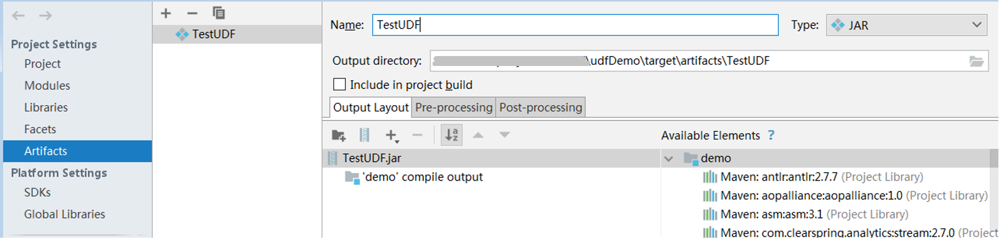
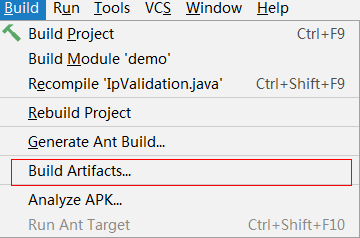

# DLI使用UDF操作指导<a name="dli_01_0412"></a>

## 操作场景<a name="section20910549205110"></a>

DLI支持用户使用Hive UDF（User Defined Function，用户定义函数）进行数据查询等操作。

## 操作步骤<a name="section164701187527"></a>

1.  编写UDF。

    根据业务需要新建或修改样例代码中SumUdDemo.java的内容。

    **图 1**  新建或修改SumUdDemo.java的内容<a name="fig15832169165616"></a>  
    

2.  生成jar包，设置输出jar包为TestUDF.jar，执行Build Artifacts。

    **图 2**  选择Artifacts<a name="fig149751056131613"></a>  
    

    **图 3**  执行Build Artifact<a name="fig1291232319178"></a>  
    

    在对应的路径下会生成一个TestUDF.jar，根据[图2](#fig149751056131613)，此处的路径为：udfDemo\\target\\artifacts\\TestUDF。

3.  上传TestUDF.jar至OBS上。上传数据至OBS可参考[提交SQL作业](提交SQL作业.md)中[步骤2：上传数据至OBS](提交SQL作业.md#section61379418181550)。
4.  <a name="li9516133616203"></a>创建Function。

    在DLI Console上输入下列命令创建Function:

    CREATE FUNCTION fun1 AS 'com.huawei.demo.SumUdDemo' using jar 's3a://udf/TestUDF.jar';

5.  使用Function。

    在查询语句中使用[4](#li9516133616203)中创建的Function:

    select fun1\(ip\) from ip\_tables;

6.  删除Function。

    如果不再使用该Function，可执行以下语句删除Function:

    Drop FUNCTION fun1;


## 样例代码<a name="section10593204711240"></a>

SumUdfDemo.java中的样例代码如下所示：

```
package com.huawei.demo;
  import org.apache.hadoop.hive.ql.exec.UDF;
  public class SumUdfDemo extends UDF {
    public Int evaluate(Int a, Int b) {
     return a + b;
  }
 }
```

