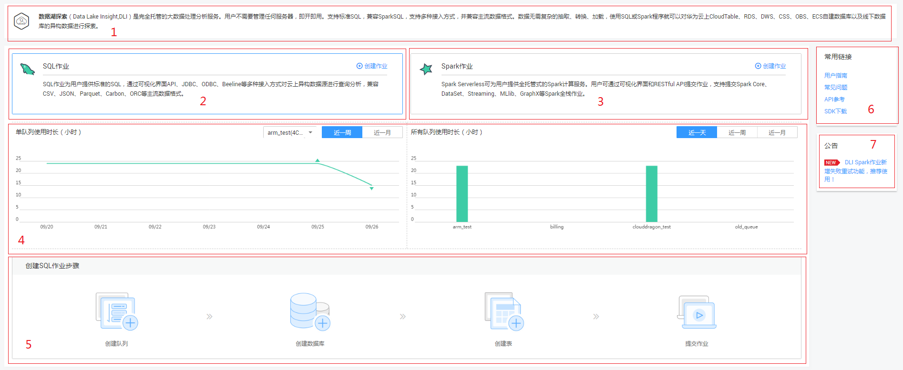

# DLI控制台总览

在[数据湖探索产品](https://www.huaweicloud.com/product/dli.html)页面，单击“进入控制台”进入“总览”页面。

**图 1**  DLI控制台总览页面  

**表 1**  区域说明

<table><thead align="left"><tr id="zh-cn_topic_0093946815_row19196955171120"><th class="cellrowborder" valign="top" width="5.99009900990099%" id="mcps1.2.4.1.1">
序号

</th>
<th class="cellrowborder" valign="top" width="16.366336633663366%" id="mcps1.2.4.1.2">
区域

</th>
<th class="cellrowborder" valign="top" width="77.64356435643565%" id="mcps1.2.4.1.3">
描述

</th>
</tr>
</thead>
<tbody><tr id="row6996420121612"><td class="cellrowborder" valign="top" width="5.99009900990099%" headers="mcps1.2.4.1.1 ">
1

</td>
<td class="cellrowborder" valign="top" width="16.366336633663366%" headers="mcps1.2.4.1.2 ">
数据湖探索简介

</td>
<td class="cellrowborder" valign="top" width="77.64356435643565%" headers="mcps1.2.4.1.3 ">
数据湖探索（Data Lake Insight,DLI）是完全托管的大数据处理分析服务。用户不需要管理任何服务器，即开即用。支持标准SQL，兼容SparkSQL，支持多种接入方式，并兼容主流数据格式。数据无需复杂的抽取、转换、加载，使用SQL或Spark程序就可以对华为云上CloudTable、RDS、DWS等异构数据进行探索。

</td>
</tr>
<tr id="row1099418791615"><td class="cellrowborder" valign="top" width="5.99009900990099%" headers="mcps1.2.4.1.1 ">
2

</td>
<td class="cellrowborder" valign="top" width="16.366336633663366%" headers="mcps1.2.4.1.2 ">
SQL作业简介

</td>
<td class="cellrowborder" valign="top" width="77.64356435643565%" headers="mcps1.2.4.1.3 "><ul id="ul109031859184112"><li>单击本区域或右上角，可进入SQL作业“作业编辑器”页面。详细介绍请参考<a href="SQL作业编辑器.md">SQL作业编辑器</a>。</li><li>鼠标移至该区域，可在区域5显示创建SQL作业步骤。</li></ul>
</td>
</tr>
<tr id="row127891135877"><td class="cellrowborder" valign="top" width="5.99009900990099%" headers="mcps1.2.4.1.1 ">
3

</td>
<td class="cellrowborder" valign="top" width="16.366336633663366%" headers="mcps1.2.4.1.2 ">
Spark作业简介

</td>
<td class="cellrowborder" valign="top" width="77.64356435643565%" headers="mcps1.2.4.1.3 "><ul id="ul209511121144218"><li>单击本区域或右上角，可进入Spark作业“作业编辑器”页面。详细介绍请参考<a href="Spark作业编辑器.md">Spark作业编辑器</a>。</li><li>鼠标移至该区域，可在区域5显示创建Spark作业步骤。</li></ul>
</td>
</tr>
<tr id="row187892354715"><td class="cellrowborder" valign="top" width="5.99009900990099%" headers="mcps1.2.4.1.1 ">
4

</td>
<td class="cellrowborder" valign="top" width="16.366336633663366%" headers="mcps1.2.4.1.2 ">
队列/队列使用时长

</td>
<td class="cellrowborder" valign="top" width="77.64356435643565%" headers="mcps1.2.4.1.3 ">
SQL作业和Spark作业单个和所有队列的使用时长，可查看对应队列近一周或一个月的使用情况。

</td>
</tr>
<tr id="row16131132095916"><td class="cellrowborder" valign="top" width="5.99009900990099%" headers="mcps1.2.4.1.1 ">
5

</td>
<td class="cellrowborder" valign="top" width="16.366336633663366%" headers="mcps1.2.4.1.2 ">
创建作业操作步骤

</td>
<td class="cellrowborder" valign="top" width="77.64356435643565%" headers="mcps1.2.4.1.3 ">
包括：

<ul id="ul6952525105019"><li>创建SQL作业的步骤</li><li>创建Spark作业的步骤</li></ul>
</td>
</tr>
<tr id="row8132320165914"><td class="cellrowborder" valign="top" width="5.99009900990099%" headers="mcps1.2.4.1.1 ">
6

</td>
<td class="cellrowborder" valign="top" width="16.366336633663366%" headers="mcps1.2.4.1.2 ">
常用链接

</td>
<td class="cellrowborder" valign="top" width="77.64356435643565%" headers="mcps1.2.4.1.3 ">
包括：

<ul id="ul105372361709"><li>用户指南</li><li>常见问题</li><li>API参考</li><li>SDK下载</li></ul>
</td>
</tr>
<tr id="row036204542216"><td class="cellrowborder" valign="top" width="5.99009900990099%" headers="mcps1.2.4.1.1 ">
7

</td>
<td class="cellrowborder" valign="top" width="16.366336633663366%" headers="mcps1.2.4.1.2 ">
公告

</td>
<td class="cellrowborder" valign="top" width="77.64356435643565%" headers="mcps1.2.4.1.3 ">
通知用户最新上线的功能。

</td>
</tr>
</tbody>
</table>

