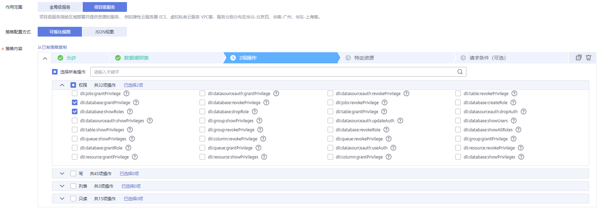
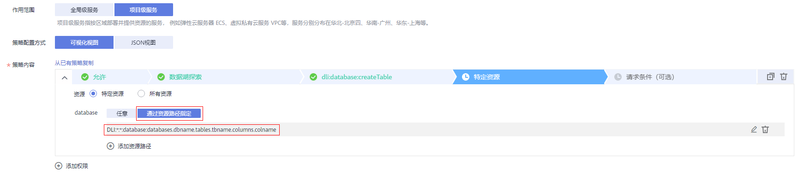
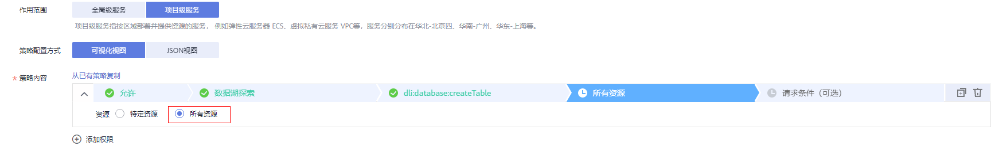

# DLI自定义策略<a name="dli_01_0451"></a>

如果系统预置的DLI权限，不满足您的授权要求，可以创建自定义策略。自定义策略中可以添加的授权项（Action）请参考[权限策略和授权项](https://support.huaweicloud.com/api-dli/dli_02_0201.html)。

目前华为云支持以下两种方式创建自定义策略：

-   可视化视图创建自定义策略：无需了解策略语法，按可视化视图导航栏选择云服务、操作、资源、条件等策略内容，可自动生成策略。
-   JSON视图创建自定义策略：可以在选择策略模板后，根据具体需求编辑策略内容；也可以直接在编辑框内编写JSON格式的策略内容。

具体创建步骤请参见：[创建自定义策略](https://support.huaweicloud.com/usermanual-iam/iam_01_0605.html)。本章为您介绍常用的DLI自定义策略样例。

## 策略字段介绍<a name="section6236135403114"></a>

以授权用户拥有在所有区域中所有数据库的创建表权限为例进行说明：

```
{
    "Version": "1.1",
    "Statement": [
        {
            "Effect": "Allow",
            "Action": [
                "dli:database:create_table"
            ],
            "Resource": [
                "dli:*:*:database:*"
            ]
        }
    ]
}
```

-   Version

    版本信息，1.1： 策略。IAM最新提供的一种细粒度授权的能力，可以精确到具体服务的操作、资源以及请求条件等。

-   Effect

    作用。包含两类：允许（Allow）和拒绝（Deny），既有Allow又有Deny的授权语句时，遵循Deny优先的原则。

-   Action

    授权项，指对资源的具体操作权限，不超过100个，如[图1](#fig382471417543)所示。

    **图 1**  DLI授权项<a name="fig382471417543"></a>  
    

    > **说明：** 
    >-   格式为：服务名:资源类型:操作，例：dli:queue:submit\_job。
    >-   服务名为产品名称，例如dli、evs和vpc等，服务名仅支持小写。资源类型和操作没有大小写，要求支持通配符号\*，无需罗列全部授权项。
    >-   资源类型可以参考[DLI资源](DLI资源.md)中的资源类型。
    >-   操作：操作以IAM服务中已经注册的action为准。

-   Condition

    限制条件：使策略生效的特定条件，包括条件键和运算符。

    条件键表示策略语句的 Condition 元素中的键值，分为全局级条件键和服务级条件键。

    -   全局级条件键（前缀为g:）适用于所有操作。
    -   服务级条件键（前缀为服务缩写，如dli:，目前DLI未提供服务级条件键）仅适用于对应服务的操作。

    运算符与条件键一起使用，构成完整的条件判断语句。具体内容请参考[DLI请求条件](DLI请求条件.md)。

-   Resource

    格式为：服务名:region:domainId:资源类型:资源路径, 通配符号\*表示所有，资源路径可以参考[DLI资源](DLI资源.md)。

    示例：

    "dli:\*:\*:queue:\*":    表示所有的队列。


## 创建DLI自定义策略<a name="section15041715821"></a>

用户可以根据场景设置不同级别的Action和Resource。

1.  定义Action

    Action由服务名:资源类型:操作三段组成，通配符为\*。例如：

    **表 1**  Action

    <a name="table1584816432919"></a>
    <table><thead align="left"><tr id="row42931127111113"><th class="cellrowborder" valign="top" width="50%" id="mcps1.2.3.1.1"><p id="p92941727111113"><a name="p92941727111113"></a><a name="p92941727111113"></a>Action</p>
    </th>
    <th class="cellrowborder" valign="top" width="50%" id="mcps1.2.3.1.2"><p id="p14295727151114"><a name="p14295727151114"></a><a name="p14295727151114"></a>说明</p>
    </th>
    </tr>
    </thead>
    <tbody><tr id="row19174434918"><td class="cellrowborder" valign="top" width="50%" headers="mcps1.2.3.1.1 "><p id="p99179439915"><a name="p99179439915"></a><a name="p99179439915"></a>dli:queue:submit_job</p>
    </td>
    <td class="cellrowborder" valign="top" width="50%" headers="mcps1.2.3.1.2 "><p id="p291764313910"><a name="p291764313910"></a><a name="p291764313910"></a>DLI队列的提交操作</p>
    </td>
    </tr>
    <tr id="row29175434911"><td class="cellrowborder" valign="top" width="50%" headers="mcps1.2.3.1.1 "><p id="p1391714431899"><a name="p1391714431899"></a><a name="p1391714431899"></a>dli:queue:*</p>
    </td>
    <td class="cellrowborder" valign="top" width="50%" headers="mcps1.2.3.1.2 "><p id="p1918114316913"><a name="p1918114316913"></a><a name="p1918114316913"></a>DLI队列的全部操作</p>
    </td>
    </tr>
    <tr id="row4918134312919"><td class="cellrowborder" valign="top" width="50%" headers="mcps1.2.3.1.1 "><p id="p17918174313915"><a name="p17918174313915"></a><a name="p17918174313915"></a>dli:*:*</p>
    </td>
    <td class="cellrowborder" valign="top" width="50%" headers="mcps1.2.3.1.2 "><p id="p1991884313917"><a name="p1991884313917"></a><a name="p1991884313917"></a>DLI所有资源类型的所有操作</p>
    </td>
    </tr>
    </tbody>
    </table>

    更多操作与系统权限的关系请参考[常用操作与系统权限关系](常用操作与系统权限关系.md)。

2.  定义Resource

    Resource由<服务名:region:domainId:资源类型:资源路径\>5个字段组成，通配符号\*表示所有资源。5个字段可以灵活设置，资源路径可以按照场景需要，设置不同级别的权限控制，DLI资源路径和资源类型可以参考[DLI资源](DLI资源.md)。当需要设置该服务下的所有资源时，可以不指定该字段。例如：

    **表 2**  Resource

    <a name="table16314044101614"></a>
    <table><thead align="left"><tr id="row144854714187"><th class="cellrowborder" valign="top" width="44.72%" id="mcps1.2.3.1.1"><p id="p145094717186"><a name="p145094717186"></a><a name="p145094717186"></a>Resource</p>
    </th>
    <th class="cellrowborder" valign="top" width="55.279999999999994%" id="mcps1.2.3.1.2"><p id="p105134771813"><a name="p105134771813"></a><a name="p105134771813"></a>说明</p>
    </th>
    </tr>
    </thead>
    <tbody><tr id="row13563124471618"><td class="cellrowborder" valign="top" width="44.72%" headers="mcps1.2.3.1.1 "><p id="p156384461618"><a name="p156384461618"></a><a name="p156384461618"></a>DLI:*:*:table:databases.dbname.tables.*</p>
    </td>
    <td class="cellrowborder" valign="top" width="55.279999999999994%" headers="mcps1.2.3.1.2 "><p id="p125635440163"><a name="p125635440163"></a><a name="p125635440163"></a>DLI服务，任意region，任意帐号ID下，数据库名为dbname下的所有表资源。</p>
    </td>
    </tr>
    <tr id="row7563144413162"><td class="cellrowborder" valign="top" width="44.72%" headers="mcps1.2.3.1.1 "><p id="p1256384461610"><a name="p1256384461610"></a><a name="p1256384461610"></a>DLI:*:*:database:databases.dbname</p>
    </td>
    <td class="cellrowborder" valign="top" width="55.279999999999994%" headers="mcps1.2.3.1.2 "><p id="p6563744121615"><a name="p6563744121615"></a><a name="p6563744121615"></a>DLI服务，任意region，任意帐号ID下，数据库名为dbname的队列。</p>
    </td>
    </tr>
    <tr id="row125634443168"><td class="cellrowborder" valign="top" width="44.72%" headers="mcps1.2.3.1.1 "><p id="p8563184412161"><a name="p8563184412161"></a><a name="p8563184412161"></a>DLI:cn-north-1:xxx:column: databases.db.tables.tb.columns.col</p>
    </td>
    <td class="cellrowborder" valign="top" width="55.279999999999994%" headers="mcps1.2.3.1.2 "><p id="p1156424415161"><a name="p1156424415161"></a><a name="p1156424415161"></a>DLI服务，cn-north-1，帐号ID为xxx，数据库名为db，表名为tb，列名为col的资源。</p>
    </td>
    </tr>
    <tr id="row356494415169"><td class="cellrowborder" valign="top" width="44.72%" headers="mcps1.2.3.1.1 "><p id="p4564244131615"><a name="p4564244131615"></a><a name="p4564244131615"></a>DLI:*:*:queue:queues.*</p>
    </td>
    <td class="cellrowborder" valign="top" width="55.279999999999994%" headers="mcps1.2.3.1.2 "><p id="p12564144471620"><a name="p12564144471620"></a><a name="p12564144471620"></a>DLI服务，任意region，任意帐号ID下，任意队列资源。</p>
    </td>
    </tr>
    <tr id="row0564104410162"><td class="cellrowborder" valign="top" width="44.72%" headers="mcps1.2.3.1.1 "><p id="p3564194441613"><a name="p3564194441613"></a><a name="p3564194441613"></a>DLI:*:*:jobs:jobs.flink.1</p>
    </td>
    <td class="cellrowborder" valign="top" width="55.279999999999994%" headers="mcps1.2.3.1.2 "><p id="p1756484401611"><a name="p1756484401611"></a><a name="p1756484401611"></a>DLI服务，任意region，任意帐号ID下，作业Id为1的flink作业。</p>
    </td>
    </tr>
    </tbody>
    </table>

    -   特定资源：

        **图 2**  特定资源<a name="fig24455228213"></a>  
        

    -   所有资源： 指该服务下的所有资源

        **图 3**  所有资源<a name="fig9785723227"></a>  
        

3.  将上述的所有字段拼接为一个json就是一个完整的策略了，其中action和resource均可以设置多个，当然也可以通过IAM提供的可视化界面进行创建，例如：

    授权用户拥有DLI服务，任意region，任意帐号ID下，任意数据库的创建删除权限，任意队列的提交作业权限，任意表的删除权限。

    ```
    {
        "Version": "1.1",
        "Statement": [
            {
                "Effect": " Allow",
                "Action": [
                      "dli:database:create_database",
                    "dli:database:drop_database",
                      "dli:queue:submit_job",
                      "dli:table:drop_table"
                ],
                "Resource": [
                      "dli:*:*:database:*",
                    "dli:*:*:queue:*",
                    "dli:*:*:table:*"
                ]
            }
        ]
    }
    ```


## DLI自定义策略样例<a name="section1493518251395"></a>

-   示例1：允许
    -   授权用户拥有在所有区域中所有数据库的创建表权限

        ```
        {
            "Version": "1.1",
            "Statement": [
                {
                    "Effect": "Allow",
                    "Action": [
                        "dli:database:create_table"
                    ],
                    "Resource": [
                        "dli:*:*:database:*"
                    ]
                }
            ]
        }
        ```

    -   授权用户拥有在所在区域中数据库db中表tb中列col的查询权限

        ```
        {
            "Version": "1.1",
            "Statement": [
                {
                    "Effect": "Allow",
                    "Action": [
                        "dli:column:select"
                    ],
                    "Resource": [
                        "dli:cn-north-7:*:column:databases.db.tables.tb.columns.col"
                    ]
                }
            ]
        }
        ```


-   示例2：拒绝

    拒绝策略需要同时配合其他策略使用，否则没有实际作用。用户被授予的策略中，一个授权项的作用如果同时存在Allow和Deny，则遵循Deny优先。

    -   授权用户不能创建数据库，删除数据库，提交作业（default队列除外），删除表

        ```
        {
            "Version": "1.1",
            "Statement": [
                {
                    "Effect": "Deny",
                    "Action": [
                        "dli:database:create_database",
                        "dli:database:drop_database",
                        "dli:queue:submit_job",
                        "dli:table:drop_table"
                    ],
                    "Resource": [
                        "dli:*:*:database:*",
                        "dli:*:*:queue:*",
                        "dli:*:*:table:*"
                    ]
                }
            ]
        }
        ```

    -   授权用户不能在队列名为demo的队列上提交作业

        ```
        {
            "Version": "1.1",
            "Statement": [
                {
                    "Effect": "Deny",
                    "Action": [
                        "dli:queue:submit_job"
                    ],
                    "Resource": [
                        "dli:*:*:queue:queues.demo"
                    ]
                }
            ]
        }
        ```


