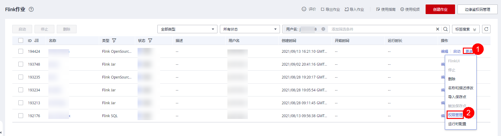
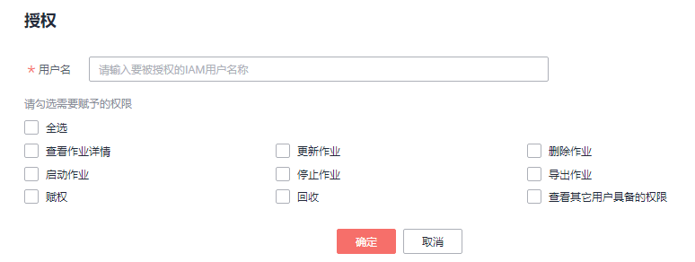

# Flink作业权限管理

## Flink作业权限操作场景

-   针对不同用户，可以通过权限设置分配不同的作业，不同用户之间的作业效率互不影响，保障作业性能。
-   管理员用户和作业的所有者拥有所有权限，不需要进行权限设置且其他用户无法修改其作业权限。
-   给新用户设置作业权限时，该用户所在用户组的所属区域需具有Tenant Guest权限。关于Tenant Guest权限的介绍和开通方法，详细参见《[权限策略](https://support.huaweicloud.com/usermanual-permissions/iam_01_0001.html)》和《统一身份认证服务用户指南》中的[创建用户组](https://support.huaweicloud.com/usermanual-iam/iam_03_0001.html)。

## Flink作业权限相关操作步骤

1.  在DLI管理控制台的左侧，选择“作业管理“\>“Flink作业”。
2.  选择待设置的作业，单击其“操作”列中的“更多”\>“权限管理”。“用户权限信息”区域展示了当前具备此作业权限的用户列表。

    

    权限设置有3种场景：为新用户赋予权限，为已有权限的用户修改权限，回收某用户具备的所有权限。

    -   为新用户赋予权限

        新用户指之前不具备此作业权限的用户。

        1.  单击“权限信息”右侧的“授权”，弹出“授权“对话框。
        2.  填写“用户名“，并勾选对应权限。
        3.  单击“确定“，完成新用户的添加。

            待设置的参数说明如[表1](#table15710625151416)所示。

            **图 1**  Flink作业授权  
            

            **表 1**  Flink作业授权参数说明

            
            <table><thead align="left"><tr id="row1771212551410"><th class="cellrowborder" valign="top" width="20%" id="mcps1.2.3.1.1">
参数名称

            </th>
            <th class="cellrowborder" valign="top" width="80%" id="mcps1.2.3.1.2">
描述

            </th>
            </tr>
            </thead>
            <tbody><tr id="row207191525121418"><td class="cellrowborder" valign="top" width="20%" headers="mcps1.2.3.1.1 ">
用户名

            </td>
            <td class="cellrowborder" valign="top" width="80%" headers="mcps1.2.3.1.2 ">
被授权用户的名称。

            
 说明： 

该用户名称是已存在的IAM用户名称。

            

            </td>
            </tr>
            <tr id="row1273232517141"><td class="cellrowborder" valign="top" width="20%" headers="mcps1.2.3.1.1 ">
权限设置

            </td>
            <td class="cellrowborder" valign="top" width="80%" headers="mcps1.2.3.1.2 "><ul id="ul651141553017"><li>查看作业详情：查看此作业的作业详情。</li><li>更新作业：编辑修改此作业。</li><li>删除作业：删除此作业。</li><li>启动作业：启动该作业权限。</li><li>停止作业：停止该作业。</li><li>导出作业：导出该作业。</li><li>赋权：当前用户可将作业的权限赋予其他用户。</li><li>回收：当前用户可回收其他用户具备的该作业的权限，但不能回收该作业所有者的权限。</li><li>查看其他用户具备的权限：当前用户可查看其他用户具备的该作业的权限。</li></ul>
            </td>
            </tr>
            </tbody>
            </table>

    -   为已有权限的用户赋予权限或回收权限。
        1.  在对应作业“用户权限信息”区域的用户列表中，选择需要修改权限的用户，在“操作”列单击“权限设置”。
        2.  在作业“权限设置”对话框中，对当前用户具备的权限进行修改。详细权限描述如[表1](#table15710625151416)所示。

            当“权限设置”中的选项为灰色时，表示您不具备修改此作业权限的权限。可以向管理员用户、作业所有者等具有赋权权限的用户申请“作业的赋权”和“作业权限的回收”权限。

        3.  单击“确定“完成权限设置。

    -   回收某用户具备的所有权限。

        在对应作业“权限信息”区域的用户列表中，选择需要删除权限的用户，在“操作”列单击“回收”。在“回收”对话框中单击“确定”后，此用户将不具备该作业的任意权限。

## Flink作业权限使用说明

-   **查看作业**
    -   租户以及admin用户可以查看和操作所有作业。
    -   子用户以及拥有只读权限的用户只能查看自己的作业，以及他人赋权给该子用户任意权限的作业。

-   **启动作业**
    -   使用独享队列时，用户需要同时拥有队列的提交作业权限以及作业的启动作业权限。
    -   使用共享队列时，用户只需要拥有作业的启动作业权限。

-   **停止作业**
    -   使用独享队列时，用户需要同时拥有队列的停止作业权限以及作业的停止作业权限。
    -   使用共享队列时，用户只需要拥有作业的停止作业权限。

-   **删除作业**
    -   如果作业在可删除状态，则用户拥有作业的删除权限即可。
    -   如果作业在不可删除状态，用户删除作业时，系统会先停止作业，停止作业权限说明可以参考[•停止作业](#li5290184073819)，并且用户还需要拥有作业的删除权限。

-   **创建作业**
    -   子用户默认不能创建作业。
    -   创建作业时，用户需要拥有创建作业的权限。目前只有admin用户创建作业的权限，同时用户还需要拥有该作业使用的相关程序包组权限或者程序包权限。

-   **编辑作业**

    编辑作业时，用户需要拥有更新作业的权限，同时用户还需要拥有该作业使用的相关程序包所属组权限或者程序包权限。

