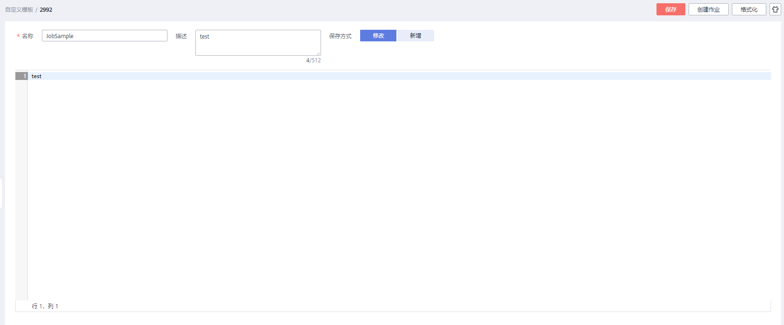
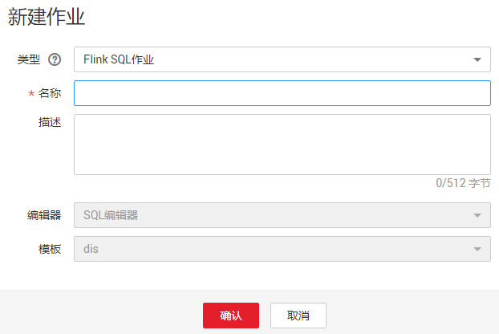

# Flink模板管理

作业模板是指用户在使用SQL类型作业时，系统提供的SQL作业相关的模板。用户在实际使用SQL作业时可以在已有的模板中进行修改SQL语句，来实现实际的作业逻辑需求，可以节约用户编辑SQL语句的时间。用户也可以自定义作业模板，根据自己的习惯和方法创建作业模板，方便后续作业可以直接调用或修改。用户可以在“作业模板“页面中创建模板和管理模板。

本章内容包含如下：

-   [自定义模板列表](#section4777152184911)
-   [新建模板](#section5417513171115)
-   [基于模板新建作业](#section123515484542)
-   [查看模板详情](#section1695414016571)
-   [修改模板](#section735234815411)
-   [删除模板](#section1035264818548)

## 自定义模板列表

“作业模板“页面的自定义模板列表显示所有的自定义作业模板，自定义模板列表参数说明如[表 1](#table17778105244916)所示。

**表 1**  自定义模板列表参数

<table><thead align="left"><tr id="row97781952154913"><th class="cellrowborder" valign="top" width="20%" id="mcps1.2.3.1.1">
参数

</th>
<th class="cellrowborder" valign="top" width="80%" id="mcps1.2.3.1.2">
参数说明

</th>
</tr>
</thead>
<tbody><tr id="row1477895215491"><td class="cellrowborder" valign="top" width="20%" headers="mcps1.2.3.1.1 ">
名称

</td>
<td class="cellrowborder" valign="top" width="80%" headers="mcps1.2.3.1.2 ">
模板名称，只能由英文、中文、数字、中划线和下划线组成，并且长度为1～64个字符。

</td>
</tr>
<tr id="row577885210496"><td class="cellrowborder" valign="top" width="20%" headers="mcps1.2.3.1.1 ">
描述

</td>
<td class="cellrowborder" valign="top" width="80%" headers="mcps1.2.3.1.2 ">
模板的相关描述，且长度为0～512个字符。

</td>
</tr>
<tr id="row377885219499"><td class="cellrowborder" valign="top" width="20%" headers="mcps1.2.3.1.1 ">
创建时间

</td>
<td class="cellrowborder" valign="top" width="80%" headers="mcps1.2.3.1.2 ">
创建模板的时间。

</td>
</tr>
<tr id="row8778852154910"><td class="cellrowborder" valign="top" width="20%" headers="mcps1.2.3.1.1 ">
更新时间

</td>
<td class="cellrowborder" valign="top" width="80%" headers="mcps1.2.3.1.2 ">
最后修改模板的时间。

</td>
</tr>
<tr id="row27784522494"><td class="cellrowborder" valign="top" width="20%" headers="mcps1.2.3.1.1 ">
操作

</td>
<td class="cellrowborder" valign="top" width="80%" headers="mcps1.2.3.1.2 "><ul id="ul1460194517206"><li>单击“编辑”，对已经创建好的模板进行修改。</li><li>单击“新建作业”，直接在该模板下创建作业，创建完后，系统跳转到“作业管理”下的作业编辑页面。</li><li>单击“删除”，将已经创建的模板删除。</li></ul>
</td>
</tr>
</tbody>
</table>

**表 2**  按钮说明

<table><thead align="left"><tr id="row10339107195419"><th class="cellrowborder" valign="top" width="20%" id="mcps1.2.3.1.1">
按钮

</th>
<th class="cellrowborder" valign="top" width="80%" id="mcps1.2.3.1.2">
说明

</th>
</tr>
</thead>
<tbody><tr id="row16648164442513"><td class="cellrowborder" valign="top" width="20%" headers="mcps1.2.3.1.1 ">
新建

</td>
<td class="cellrowborder" valign="top" width="80%" headers="mcps1.2.3.1.2 ">
单击“新建”，创建一个自定义模板。

</td>
</tr>
<tr id="row15404541162512"><td class="cellrowborder" valign="top" width="20%" headers="mcps1.2.3.1.1 ">
删除

</td>
<td class="cellrowborder" valign="top" width="80%" headers="mcps1.2.3.1.2 ">
单击“删除”，删除一个或者多个自定义模板。

</td>
</tr>
<tr id="row133406755419"><td class="cellrowborder" valign="top" width="20%" headers="mcps1.2.3.1.1 ">

</td>
<td class="cellrowborder" valign="top" width="80%" headers="mcps1.2.3.1.2 ">
在搜索框中输入模板名称，单击，搜索模板。

</td>
</tr>
<tr id="row934067205412"><td class="cellrowborder" valign="top" width="20%" headers="mcps1.2.3.1.1 ">

</td>
<td class="cellrowborder" valign="top" width="80%" headers="mcps1.2.3.1.2 ">
单击，手动刷新模板列表。

</td>
</tr>
</tbody>
</table>

## 新建模板

创建作业模板，有以下四种方法。

-   进入“作业模板“页面新建模板。
    1.  在DLI管理控制台的左侧导航栏中，单击“作业模板“\>“Flink模板“，单击“自定义模板“页签。
    2.  单击页面右上角“新建模板“，弹出“新建模板“页面。
    3.  输入“名称“和“描述“。

        **图 1**  新建模板  
        

        **表 3**  模板配置信息

        
        <table><thead align="left"><tr id="row042184317411"><th class="cellrowborder" valign="top" width="14.14%" id="mcps1.2.3.1.1">
参数

        </th>
        <th class="cellrowborder" valign="top" width="85.86%" id="mcps1.2.3.1.2">
参数说明

        </th>
        </tr>
        </thead>
        <tbody><tr id="row1421174311418"><td class="cellrowborder" valign="top" width="14.14%" headers="mcps1.2.3.1.1 ">
名称

        </td>
        <td class="cellrowborder" valign="top" width="85.86%" headers="mcps1.2.3.1.2 ">
模板名称，只能由字母、中文、数字、中划线和下划线组成，并且长度为1～64个字符。

        
 说明： 

模板名称必须是唯一的。

        

        </td>
        </tr>
        <tr id="row154213431043"><td class="cellrowborder" valign="top" width="14.14%" headers="mcps1.2.3.1.1 ">
描述

        </td>
        <td class="cellrowborder" valign="top" width="85.86%" headers="mcps1.2.3.1.2 ">
模板的相关描述，且长度为0～512字符。

        </td>
        </tr>
        </tbody>
        </table>

    4.  单击“确认“，进入“编辑“页面。

        **图 2**  编辑作业模板  
        

        **表 4**  功能介绍

        
        <table><thead align="left"><tr id="row97759154113"><th class="cellrowborder" valign="top" width="19.75%" id="mcps1.2.3.1.1">
名称

        </th>
        <th class="cellrowborder" valign="top" width="80.25%" id="mcps1.2.3.1.2">
描述

        </th>
        </tr>
        </thead>
        <tbody><tr id="row11775131511117"><td class="cellrowborder" valign="top" width="19.75%" headers="mcps1.2.3.1.1 ">
SQL语句编辑区域

        </td>
        <td class="cellrowborder" valign="top" width="80.25%" headers="mcps1.2.3.1.2 ">
输入详细的SQL语句，实现业务逻辑功能。SQL语句的编写请参考<a href="https://support.huaweicloud.com/sqlreference-dli/dli_08_0219.html" target="_blank" rel="noopener noreferrer">《数据湖探索SQL语法参考》</a>。

        </td>
        </tr>
        <tr id="row877691510116"><td class="cellrowborder" valign="top" width="19.75%" headers="mcps1.2.3.1.1 ">
保存

        </td>
        <td class="cellrowborder" valign="top" width="80.25%" headers="mcps1.2.3.1.2 ">
保存用户编写的SQL语句。

        </td>
        </tr>
        <tr id="row187777152118"><td class="cellrowborder" valign="top" width="19.75%" headers="mcps1.2.3.1.1 ">
另存为

        </td>
        <td class="cellrowborder" valign="top" width="80.25%" headers="mcps1.2.3.1.2 ">
可选功能，将新建模板另存为一个作业模板。

        </td>
        </tr>
        <tr id="row982893814405"><td class="cellrowborder" valign="top" width="19.75%" headers="mcps1.2.3.1.1 ">

        </td>
        <td class="cellrowborder" valign="top" width="80.25%" headers="mcps1.2.3.1.2 ">
可选功能，修改模板名称和描述。

        </td>
        </tr>
        <tr id="row15379135241612"><td class="cellrowborder" valign="top" width="19.75%" headers="mcps1.2.3.1.1 ">

        </td>
        <td class="cellrowborder" valign="top" width="80.25%" headers="mcps1.2.3.1.2 ">
可选功能，将SQL格式化，将SQL语句格式化后，需要重新编辑SQL语句。

        </td>
        </tr>
        <tr id="row15591758111619"><td class="cellrowborder" valign="top" width="19.75%" headers="mcps1.2.3.1.1 ">

        </td>
        <td class="cellrowborder" valign="top" width="80.25%" headers="mcps1.2.3.1.2 ">
可选功能，设置页面主题，可以设置字体大小，自动换行和页面风格。

        </td>
        </tr>
        <tr id="row111752975113"><td class="cellrowborder" valign="top" width="19.75%" headers="mcps1.2.3.1.1 ">

        </td>
        <td class="cellrowborder" valign="top" width="80.25%" headers="mcps1.2.3.1.2 ">
可选功能，帮助中心，为用户提供产品文档，帮助用户详细了解产品含义以及使用方法。

        </td>
        </tr>
        </tbody>
        </table>

    5.  SQL语句编辑区域，输入SQL语句，实现业务逻辑功能。SQL语句的编写请参考[《数据湖探索SQL语法参考》](https://support.huaweicloud.com/sqlreference-dli/dli_08_0219.html)。
    6.  SQL编辑完成后，单击“保存“。

        创建模板成功后，在自定义模板列表中会显示创建的模板。用户可以直接单击模板“操作“列的“新建作业“基于模板创建作业。新建作业请参考[创建Flink SQL作业](创建Flink-SQL作业.md)。

-   基于现有作业模板新建模板
    1.  在DLI管理控制台的左侧导航栏中，单击“作业模板“\>“Flink模板“，单击“自定义模板“页签。
    2.  在自定义模板列表中，选中一个作业模板，单击“操作“列中的“编辑“，进入“模板编辑“页面。
    3.  单击“另存为“，弹出“模板另存为“窗口。
    4.  输入“名称“和“描述“，单击“确认“，完成另存一个新模板。

-   基于新建作业新建模板
    1.  在DLI管理控制台的左侧导航栏中，单击“作业管理“\>“Flink作业“，进入“Flink作业“页面。
    2.  单击右上角“新建作业“，弹出“新建作业“页面。
    3.  配置作业信息，输入“名称”和“描述”，选择“模板”。
    4.  单击“确认“，进入“作业编辑“页面。
    5.  SQL编辑完成后，单击“设为模板“，弹出“设为模板“窗口。
    6.  输入“名称“和“描述“，单击“确认“，完成另存一个新模板。

-   基于现有作业新建模板
    1.  在DLI管理控制台的左侧导航栏中，单击“作业管理“\>“Flink作业“，进入“Flink作业“页面。
    2.  在作业列表中，选择一个需要设置为模板的作业，在“操作“列单击“编辑“，进入“作业编辑“页面。
    3.  单击右上角“更多“\>“设为模板“，弹出“设为模板“窗口。
    4.  输入“名称“和“描述“，单击“确认“，完成将作业设置为模板的操作。

## 基于模板新建作业

用户可以基于样例模板或者自定义模板新建作业。

1.  在DLI管理控制台的左侧导航栏中，单击“作业模板“\>“Flink模板“。
2.  在样例模板列表中，单击对应模板“操作“列中的“新建作业“。具体操作步骤请参见[创建Flink SQL作业](创建Flink-SQL作业.md)。

    **图 3**  基于模板新建作业  
    

## 查看模板详情

1.  在DLI管理控制台的左侧导航栏中，单击“作业模板“\>“Flink模板“。
2.  在样例模板列表或者自定义模板列表的“名称“一列中，单击需要查看的模板名称，进入“模板信息“页面。

    显示当前模板的描述和SQL语句等信息。

3.  （可选）当查看自定义模板时，单击右上方的“编辑“，进入“编辑“页面，可对模板进行修改。

## 修改模板

用户创建完自定义模板后，可以根据实际需求修改自定义模板，样例模板不支持修改。

1.  在DLI管理控制台的左侧导航栏中，单击“作业模板“\>“Flink模板“，单击“自定义模板“页签。
2.  在自定义模板列表中，选择一个需要修改的模板，单击“操作“列中的“编辑“，进入“编辑“页面。
3.  在SQL语句编辑区，根据需要修改SQL语句。
4.  （可选）单击修改模板的名称和描述。
5.  单击“保存“，保存修改的内容。

    > **说明：**   
    >用户也可以通过“模板信息“页面进入“编辑“页面。具体操作如下：  
    >1.  在自定义模板列表中，选中一个需要修改的模板，在“名称“列单击对应的作业模板名称，进入“模板信息“页面。  
    >2.  单击“编辑“，进入“编辑“页面。  

## 删除模板

用户可以根据需求删除不需要的自定义模板，样例模板不支持删除。模板删除后无法恢复，请谨慎操作。

1.  在DLI管理控制台的左侧导航栏中，单击“作业模板“\>“Flink模板“，单击“自定义模板“页签。
2.  在自定义模板列表中，勾选需要删除的模板，支持多选，单击自定义模板列表左上方的“删除“。

    用户也可以在自定义模板列表中，勾选需要删除的模板，单击“操作“栏中“删除“，删除对应的模板。

3.  在弹出的删除确认窗口中，单击“确认“。

