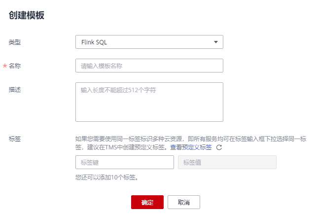

# Flink模板管理

Flink模板包括样例模板和自定义模板。用户可以在已有的样例模板中进行修改，来实现实际的作业逻辑需求，节约编辑SQL语句的时间。也可以根据自己的习惯和方法自定义作业模板，方便后续可以直接调用或修改。

Flink模板管理主要包括如下功能：

-   [样例模板](#section3576173115914)
-   [自定义模板](#section4777152184911)
-   [新建模板](#section5417513171115)
-   [基于模板新建作业](#section123515484542)
-   [修改模板](#section735234815411)
-   [删除模板](#section1035264818548)

## 样例模板

样例模板列表显示已有的样例作业模板，样例模板列表参数说明如[表 1](#table17778105244916)所示。

**表 1**  样例模板列表参数

<table><thead align="left"><tr id="row64828111162"><th class="cellrowborder" valign="top" width="20%" id="mcps1.2.3.1.1">
参数

</th>
<th class="cellrowborder" valign="top" width="80%" id="mcps1.2.3.1.2">
参数说明

</th>
</tr>
</thead>
<tbody><tr id="row1248221171613"><td class="cellrowborder" valign="top" width="20%" headers="mcps1.2.3.1.1 ">
名称

</td>
<td class="cellrowborder" valign="top" width="80%" headers="mcps1.2.3.1.2 ">
模板名称，只能由英文、中文、数字、中划线和下划线组成，并且长度为1～64个字符。

</td>
</tr>
<tr id="row18482141141615"><td class="cellrowborder" valign="top" width="20%" headers="mcps1.2.3.1.1 ">
描述

</td>
<td class="cellrowborder" valign="top" width="80%" headers="mcps1.2.3.1.2 ">
模板的相关描述，且长度为0～512个字符。

</td>
</tr>
<tr id="row104837115166"><td class="cellrowborder" valign="top" width="20%" headers="mcps1.2.3.1.1 ">
操作

</td>
<td class="cellrowborder" valign="top" width="80%" headers="mcps1.2.3.1.2 ">
“创建作业”：直接在该模板下创建作业，创建完后，系统跳转到“作业管理”下的作业编辑页面。

</td>
</tr>
</tbody>
</table>

当前已有的样例模板包括如下场景：

-   NGINX访问日志实时ETL入库
-   套牌车辆检测
-   电子围栏告警
-   车辆偏航告警
-   车辆超速告警
-   流式随机森林异常检测
-   CloudTable-DLI Flink-CloudTable
-   DIS-DLI Flink-CSS\(Elasticsearch\)
-   DIS-DLI Flink-CloudTable\(OpenTSDB\)
-   DIS-DLI Flink-CloudTable
-   DIS-DLI Flink-DCS
-   DIS-DLI Flink-DDS\(MongoDB\)
-   DIS-DLI Flink-DIS
-   DIS-DLI Flink-OBS-DWS
-   DIS-DLI Flink-SMN
-   Kafka-DLI Flink-Kafka
-   OBS-DLI Flink-RDS
-   Stream-Join-Table\(DCS\)
-   Stream-Join-Table\(RDS\)

## 自定义模板

自定义模板列表显示所有的自定义作业模板，自定义模板列表参数说明如[表 1](#table17778105244916)所示。

**表 2**  自定义模板列表参数

<table><thead align="left"><tr id="row97781952154913"><th class="cellrowborder" valign="top" width="20%" id="mcps1.2.3.1.1">
参数

</th>
<th class="cellrowborder" valign="top" width="80%" id="mcps1.2.3.1.2">
参数说明

</th>
</tr>
</thead>
<tbody><tr id="row1477895215491"><td class="cellrowborder" valign="top" width="20%" headers="mcps1.2.3.1.1 ">
名称

</td>
<td class="cellrowborder" valign="top" width="80%" headers="mcps1.2.3.1.2 ">
模板名称，只能由英文、中文、数字、中划线和下划线组成，并且长度为1～64个字符。

</td>
</tr>
<tr id="row577885210496"><td class="cellrowborder" valign="top" width="20%" headers="mcps1.2.3.1.1 ">
描述

</td>
<td class="cellrowborder" valign="top" width="80%" headers="mcps1.2.3.1.2 ">
模板的相关描述，且长度为0～512个字符。

</td>
</tr>
<tr id="row377885219499"><td class="cellrowborder" valign="top" width="20%" headers="mcps1.2.3.1.1 ">
创建时间

</td>
<td class="cellrowborder" valign="top" width="80%" headers="mcps1.2.3.1.2 ">
创建模板的时间。

</td>
</tr>
<tr id="row8778852154910"><td class="cellrowborder" valign="top" width="20%" headers="mcps1.2.3.1.1 ">
更新时间

</td>
<td class="cellrowborder" valign="top" width="80%" headers="mcps1.2.3.1.2 ">
最后修改模板的时间。

</td>
</tr>
<tr id="row27784522494"><td class="cellrowborder" valign="top" width="20%" headers="mcps1.2.3.1.1 ">
操作

</td>
<td class="cellrowborder" valign="top" width="80%" headers="mcps1.2.3.1.2 "><ul id="ul1460194517206"><li>“编辑”：对已经创建好的模板进行修改。</li><li>“创建作业”：直接在该模板下创建作业，创建完后，系统跳转到“作业管理”下的作业编辑页面。</li><li>“删除”：将已经创建的模板删除。</li></ul>
</td>
</tr>
</tbody>
</table>

## 新建模板

创建作业模板，有以下四种方法。

-   进入“作业模板“页面新建模板。
    1.  在DLI管理控制台的左侧导航栏中，单击“作业模板“\>“Flink模板“。
    2.  单击页面右上角“创建模板“，弹出“创建模板“页面。
    3.  输入“名称“和“描述“。

        **图 1**  新建模板  
        

        **表 3**  模板配置信息

        
        <table><thead align="left"><tr id="row042184317411"><th class="cellrowborder" valign="top" width="14.14%" id="mcps1.2.3.1.1">
参数

        </th>
        <th class="cellrowborder" valign="top" width="85.86%" id="mcps1.2.3.1.2">
参数说明

        </th>
        </tr>
        </thead>
        <tbody><tr id="row1421174311418"><td class="cellrowborder" valign="top" width="14.14%" headers="mcps1.2.3.1.1 ">
名称

        </td>
        <td class="cellrowborder" valign="top" width="85.86%" headers="mcps1.2.3.1.2 ">
模板名称，只能由字母、中文、数字、中划线和下划线组成，并且长度为1～64个字符。

        
 说明： 

模板名称必须是唯一的。

        

        </td>
        </tr>
        <tr id="row154213431043"><td class="cellrowborder" valign="top" width="14.14%" headers="mcps1.2.3.1.1 ">
描述

        </td>
        <td class="cellrowborder" valign="top" width="85.86%" headers="mcps1.2.3.1.2 ">
模板的相关描述，且长度为0～512字符。

        </td>
        </tr>
        </tbody>
        </table>

    4.  单击“确认“，进入“编辑“页面。

        **图 2**  编辑作业模板  
        

        按照从左到右，从上到下的顺序说明如下：

        **表 4**  界面介绍

        
        <table><thead align="left"><tr id="row97759154113"><th class="cellrowborder" valign="top" width="18.98%" id="mcps1.2.3.1.1">
功能

        </th>
        <th class="cellrowborder" valign="top" width="81.02000000000001%" id="mcps1.2.3.1.2">
描述

        </th>
        </tr>
        </thead>
        <tbody><tr id="row552923111371"><td class="cellrowborder" valign="top" width="18.98%" headers="mcps1.2.3.1.1 ">
名称

        </td>
        <td class="cellrowborder" valign="top" width="81.02000000000001%" headers="mcps1.2.3.1.2 ">
可以修改模板名称。

        </td>
        </tr>
        <tr id="row148316183817"><td class="cellrowborder" valign="top" width="18.98%" headers="mcps1.2.3.1.1 ">
描述

        </td>
        <td class="cellrowborder" valign="top" width="81.02000000000001%" headers="mcps1.2.3.1.2 ">
可以修改模板描述。

        </td>
        </tr>
        <tr id="row776216413916"><td class="cellrowborder" valign="top" width="18.98%" headers="mcps1.2.3.1.1 ">
保存方式

        </td>
        <td class="cellrowborder" valign="top" width="81.02000000000001%" headers="mcps1.2.3.1.2 "><ul id="ul17263191433914"><li>修改：将修改保存至当前的模板中。</li><li>新增：将修改另存为新的模板。</li></ul>
        </td>
        </tr>
        <tr id="row11775131511117"><td class="cellrowborder" valign="top" width="18.98%" headers="mcps1.2.3.1.1 ">
SQL语句编辑区域

        </td>
        <td class="cellrowborder" valign="top" width="81.02000000000001%" headers="mcps1.2.3.1.2 ">
输入详细的SQL语句，实现业务逻辑功能。SQL语句的编写请参考<a href="https://support.huaweicloud.com/sqlreference-dli/dli_08_0219.html" target="_blank" rel="noopener noreferrer">《数据湖探索SQL语法参考》</a>。

        </td>
        </tr>
        <tr id="row877691510116"><td class="cellrowborder" valign="top" width="18.98%" headers="mcps1.2.3.1.1 ">
保存

        </td>
        <td class="cellrowborder" valign="top" width="81.02000000000001%" headers="mcps1.2.3.1.2 ">
保存修改。

        </td>
        </tr>
        <tr id="row982893814405"><td class="cellrowborder" valign="top" width="18.98%" headers="mcps1.2.3.1.1 ">
创建作业

        </td>
        <td class="cellrowborder" valign="top" width="81.02000000000001%" headers="mcps1.2.3.1.2 ">
使用当前模板创建作业。

        </td>
        </tr>
        <tr id="row15379135241612"><td class="cellrowborder" valign="top" width="18.98%" headers="mcps1.2.3.1.1 ">
格式化

        </td>
        <td class="cellrowborder" valign="top" width="81.02000000000001%" headers="mcps1.2.3.1.2 ">
对SQL语句进行格式化，将SQL语句格式化后，需要重新编辑SQL语句。

        </td>
        </tr>
        <tr id="row15591758111619"><td class="cellrowborder" valign="top" width="18.98%" headers="mcps1.2.3.1.1 ">

        </td>
        <td class="cellrowborder" valign="top" width="81.02000000000001%" headers="mcps1.2.3.1.2 ">
更改页面风格（黑色底或白色底）。

        </td>
        </tr>
        </tbody>
        </table>

    5.  在SQL语句编辑区域，输入SQL语句，实现业务逻辑功能。SQL语句的编写请参考[《数据湖探索SQL语法参考》](https://support.huaweicloud.com/sqlreference-dli/dli_08_0219.html)。
    6.  SQL编辑完成后，单击右上角的“保存“，完成创建模板。
    7.  （可选）如果不需要进行修改，也可以单击右上角的“创建作业“基于当前模板创建作业。创建作业请参考[创建Flink SQL作业](创建Flink-SQL作业.md)和[创建Flink自定义作业](创建Flink自定义作业.md)。

-   基于现有作业模板新建模板
    1.  在DLI管理控制台的左侧导航栏中，单击“作业模板“\>“Flink模板“，单击“自定义模板“页签。
    2.  在自定义模板列表中，单击所需作业模板“操作“列中的“编辑“，进入“模板编辑“页面。
    3.  修改完成后，“保存方式”选择“新增”。
    4.  单击右上角“保存“，完成另存一个新模板。

-   基于新建作业新建模板
    1.  在DLI管理控制台的左侧导航栏中，单击“作业管理“\>“Flink作业“，进入“Flink作业“页面。
    2.  单击右上角“创建作业“，弹出“创建作业“页面。
    3.  配置作业信息，输入“名称”和“描述”，选择“模板”。
    4.  单击“确认“，进入“作业编辑“页面。
    5.  SQL编辑完成后，单击“设为模板“，弹出“设为模板“窗口。
    6.  输入“名称“和“描述“，单击“确认“，完成另存一个新模板。

-   基于现有作业新建模板
    1.  在DLI管理控制台的左侧导航栏中，单击“作业管理“\>“Flink作业“，进入“Flink作业“页面。
    2.  在作业列表中，选择一个需要设置为模板的作业，在“操作“列单击“编辑“，进入“作业编辑“页面。
    3.  SQL编辑完成后，单击“设为模板“，弹出“设为模板“窗口。
    4.  输入“名称“和“描述“，单击“确认“，完成另存一个新模板。

## 基于模板新建作业

用户可以基于样例模板或者自定义模板新建作业。

1.  在DLI管理控制台的左侧导航栏中，单击“作业模板“\>“Flink模板“。
2.  在样例模板列表中，单击对应模板“操作“列中的“创建作业“。创建作业请参考[创建Flink SQL作业](创建Flink-SQL作业.md)和[创建Flink自定义作业](创建Flink自定义作业.md)。

## 修改模板

用户创建完自定义模板后，可以根据实际需求修改自定义模板。样例模板不支持修改，但是可以查看。

1.  在DLI管理控制台的左侧导航栏中，单击“作业模板“\>“Flink模板“，单击“自定义模板“页签。
2.  在自定义模板列表中，选择一个需要修改的模板，单击模板名称或该模板“操作“列中的“编辑“，进入“编辑“页面。
3.  在SQL语句编辑区，根据需要修改SQL语句。
4.  “保存方式”选择“修改”。
5.  单击右上角“保存“，保存当前模板修改的内容。

## 删除模板

用户可以根据需求删除不需要的自定义模板，不支持删除样例模板。模板删除后无法恢复，请谨慎操作。

1.  在DLI管理控制台的左侧导航栏中，单击“作业模板“\>“Flink模板“，单击“自定义模板“页签。
2.  在自定义模板列表中，勾选需要删除的模板，支持多选，单击自定义模板列表左上方的“删除“。

    用户也可以在自定义模板列表中，勾选需要删除的模板，单击“操作“栏中“删除“，删除对应的模板。

3.  在弹出的删除确认窗口中，单击“确认“。

