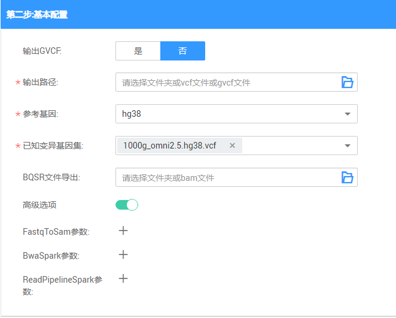
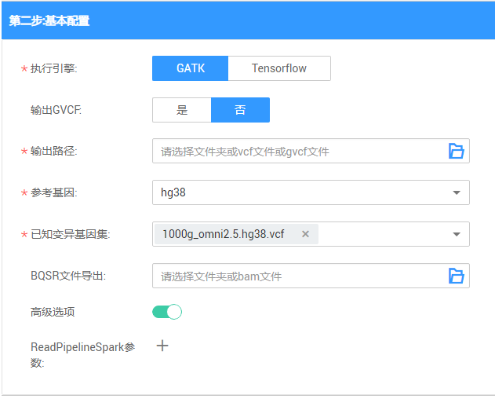
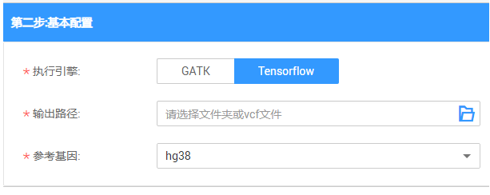
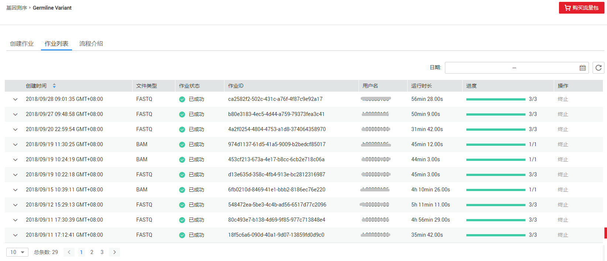
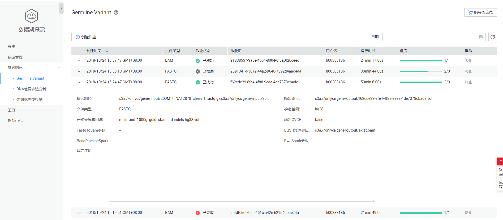
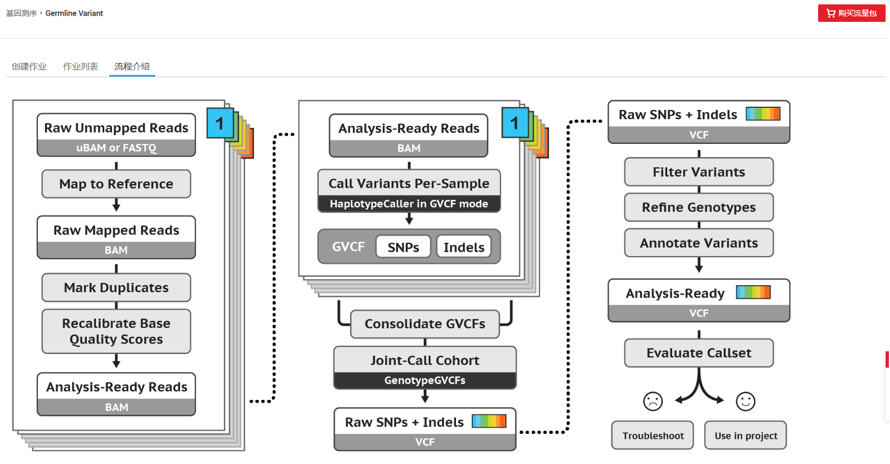

# Germline Variant

## Germline Variant概述

DLI全托管式的DNA测序流程, 基于GATK4.0标准测序流程进行分布式优化, 性能相对于单机版测序流程提升10倍有余。目前支持人类样本的WGS\(全基因组测序\)和WES\(外显子测序\)流程。

> **说明：**   
>提交Germline Variant作业需进行实名认证，并且需要进行委托授权。具体操作请参考[准备工作](准备工作.md)。  

## 创建作业

**图 1**  Germline Variant创建作业  

1.  数据导入。

    **图 2**  Germline Variant数据导入  
    

    **表 1**  参数说明

    
    <table><thead align="left"><tr id="row111151534153010"><th class="cellrowborder" valign="top" width="13.25%" id="mcps1.2.4.1.1">
参数名称

    </th>
    <th class="cellrowborder" valign="top" width="74.42%" id="mcps1.2.4.1.2">
描述

    </th>
    <th class="cellrowborder" valign="top" width="12.33%" id="mcps1.2.4.1.3">
示例

    </th>
    </tr>
    </thead>
    <tbody><tr id="row121231434203019"><td class="cellrowborder" valign="top" width="13.25%" headers="mcps1.2.4.1.1 ">
文件类型

    </td>
    <td class="cellrowborder" valign="top" width="74.42%" headers="mcps1.2.4.1.2 ">
选择FASTQ或BAM类型的输入文件。

    </td>
    <td class="cellrowborder" valign="top" width="12.33%" headers="mcps1.2.4.1.3 ">
FASTQ

    </td>
    </tr>
    <tr id="row11381434123019"><td class="cellrowborder" valign="top" width="13.25%" headers="mcps1.2.4.1.1 ">
输入路径

    </td>
    <td class="cellrowborder" valign="top" width="74.42%" headers="mcps1.2.4.1.2 ">
选择文件所在的OBS路径。

    <ul id="ul4142934153015"><li>当输入文件类型为FASTQ时，需要指定两个OBS上的FASTQ文件路径。</li><li>当输入文件类型为BAM时，需要指定一个OBS上的BAM文件路径。</li></ul>
    </td>
    <td class="cellrowborder" valign="top" width="12.33%" headers="mcps1.2.4.1.3 ">
-

    </td>
    </tr>
    </tbody>
    </table>

2.  基本参数配置。
    -   若输入文件为FASTQ类型，需配置如下参数：

        **图 3**  FASTQ类型参数配置  
        

    -   若输入文件为BAM类型，需配置如下参数：

        -   执行引擎选择GATK

            **图 4**  BAM类型参数配置  
            

        -   执行引擎选择Tensorflow

            **图 5**  执行引擎Tensorflow参数配置  
            

        **表 2**  参数说明

        
        <table><thead align="left"><tr id="row16583353145419"><th class="cellrowborder" valign="top" width="13.25%" id="mcps1.2.4.1.1">
参数名称

        </th>
        <th class="cellrowborder" valign="top" width="77.18%" id="mcps1.2.4.1.2">
描述

        </th>
        <th class="cellrowborder" valign="top" width="9.569999999999999%" id="mcps1.2.4.1.3">
示例

        </th>
        </tr>
        </thead>
        <tbody><tr id="row1869515111719"><td class="cellrowborder" valign="top" width="13.25%" headers="mcps1.2.4.1.1 ">
执行引擎

        </td>
        <td class="cellrowborder" valign="top" width="77.18%" headers="mcps1.2.4.1.2 ">
选择BAM类型的输入文件时，需要选择对应的执行引擎，如下所示：

        <ul id="ul11651316376"><li>GATK：标准GATK流程</li><li>Tensorflow：利用深度学习模型进行变异检测</li></ul>
        </td>
        <td class="cellrowborder" valign="top" width="9.569999999999999%" headers="mcps1.2.4.1.3 ">
GATK

        </td>
        </tr>
        <tr id="row10620155317542"><td class="cellrowborder" valign="top" width="13.25%" headers="mcps1.2.4.1.1 ">
输出GVCF

        </td>
        <td class="cellrowborder" valign="top" width="77.18%" headers="mcps1.2.4.1.2 ">
选择是否输出GVCF格式文件。

        </td>
        <td class="cellrowborder" valign="top" width="9.569999999999999%" headers="mcps1.2.4.1.3 ">
否

        </td>
        </tr>
        <tr id="row962795375414"><td class="cellrowborder" valign="top" width="13.25%" headers="mcps1.2.4.1.1 ">
输出路径

        </td>
        <td class="cellrowborder" valign="top" width="77.18%" headers="mcps1.2.4.1.2 ">
基因检测结果的OBS输出路径。

        </td>
        <td class="cellrowborder" valign="top" width="9.569999999999999%" headers="mcps1.2.4.1.3 ">
-

        </td>
        </tr>
        <tr id="row156354531547"><td class="cellrowborder" valign="top" width="13.25%" headers="mcps1.2.4.1.1 ">
参考基因

        </td>
        <td class="cellrowborder" valign="top" width="77.18%" headers="mcps1.2.4.1.2 ">
基因行业内标准的基因库，目前支持hg19和hg38。

        </td>
        <td class="cellrowborder" valign="top" width="9.569999999999999%" headers="mcps1.2.4.1.3 ">
hg38

        </td>
        </tr>
        <tr id="row17643155311544"><td class="cellrowborder" valign="top" width="13.25%" headers="mcps1.2.4.1.1 ">
已知变异基因集

        </td>
        <td class="cellrowborder" valign="top" width="77.18%" headers="mcps1.2.4.1.2 ">
根据给定的下拉框，选择需要进行比对的已知变异基因集合，可以多选。

        </td>
        <td class="cellrowborder" valign="top" width="9.569999999999999%" headers="mcps1.2.4.1.3 ">
-

        </td>
        </tr>
        <tr id="row76501535546"><td class="cellrowborder" valign="top" width="13.25%" headers="mcps1.2.4.1.1 ">
BQSR文件导出

        </td>
        <td class="cellrowborder" valign="top" width="77.18%" headers="mcps1.2.4.1.2 ">
比对文件导出。基因检测过程中间会生成BAM类型的文件，用户可以选择将这个BAM文件保存至OBS，以供日后使用。

        </td>
        <td class="cellrowborder" valign="top" width="9.569999999999999%" headers="mcps1.2.4.1.3 ">
-

        </td>
        </tr>
        <tr id="row176568536544"><td class="cellrowborder" valign="top" width="13.25%" headers="mcps1.2.4.1.1 ">
高级选项

        </td>
        <td class="cellrowborder" valign="top" width="77.18%" headers="mcps1.2.4.1.2 ">
打开高级选项，可在基因变异检测过程中，进行参数设置，参数格式为“key value”。具体描述请参考<a href="#table19583102475616">表3</a>。

        </td>
        <td class="cellrowborder" valign="top" width="9.569999999999999%" headers="mcps1.2.4.1.3 ">
-

        </td>
        </tr>
        </tbody>
        </table>

        **表 3**  高级选项参数说明

        
        <table><thead align="left"><tr id="row559342411563"><th class="cellrowborder" valign="top" width="22.182218221822183%" id="mcps1.2.4.1.1">
参数名称

        </th>
        <th class="cellrowborder" valign="top" width="68.21682168216822%" id="mcps1.2.4.1.2">
描述

        </th>
        <th class="cellrowborder" valign="top" width="9.6009600960096%" id="mcps1.2.4.1.3">
示例

        </th>
        </tr>
        </thead>
        <tbody><tr id="row3602182425611"><td class="cellrowborder" valign="top" width="22.182218221822183%" headers="mcps1.2.4.1.1 ">
FastqToSam

        </td>
        <td class="cellrowborder" valign="top" width="68.21682168216822%" headers="mcps1.2.4.1.2 ">
执行FastqToSam方法时业务相关的配置项，用户可手动添加。

        </td>
        <td class="cellrowborder" valign="top" width="9.6009600960096%" headers="mcps1.2.4.1.3 ">
-

        </td>
        </tr>
        <tr id="row1860942435618"><td class="cellrowborder" valign="top" width="22.182218221822183%" headers="mcps1.2.4.1.1 ">
BwaSpark

        </td>
        <td class="cellrowborder" valign="top" width="68.21682168216822%" headers="mcps1.2.4.1.2 ">
执行GATK BwaSpark方法时业务相关的配置项，用户可手动添加。

        
 说明： 

暂不支持关于输出文件格式以及输入输出路径相关的配置项。

        

        </td>
        <td class="cellrowborder" valign="top" width="9.6009600960096%" headers="mcps1.2.4.1.3 ">
-

        </td>
        </tr>
        <tr id="row17617122425612"><td class="cellrowborder" valign="top" width="22.182218221822183%" headers="mcps1.2.4.1.1 ">
ReadsPipelineSpark

        </td>
        <td class="cellrowborder" valign="top" width="68.21682168216822%" headers="mcps1.2.4.1.2 ">
执行GATK ReadsPipelineSpark方法时业务相关的配置项，用户可手动添加。

        
 说明： 

暂不支持关于输出文件格式以及输入输出路径相关的配置项。

        

        </td>
        <td class="cellrowborder" valign="top" width="9.6009600960096%" headers="mcps1.2.4.1.3 ">
-

        </td>
        </tr>
        </tbody>
        </table>

3.  单击“提交”。

## 作业列表

**图 6**  Germline Variant作业列表  

作业列表显示所有的Germline Variant作业，作业数量较多时，系统分页显示，您可以查看所有历史提交的作业。作业列表默认按创建时间排列，可选择升序或降序排列；也可以选择时间范围，查看特定时间范围内提交的作业。

**表 4**  作业列表参数

<table><thead align="left"><tr id="row185419444235"><th class="cellrowborder" valign="top" width="21.18%" id="mcps1.2.3.1.1">
参数

</th>
<th class="cellrowborder" valign="top" width="78.82000000000001%" id="mcps1.2.3.1.2">
参数说明

</th>
</tr>
</thead>
<tbody><tr id="row3854044162316"><td class="cellrowborder" valign="top" width="21.18%" headers="mcps1.2.3.1.1 ">
创建时间

</td>
<td class="cellrowborder" valign="top" width="78.82000000000001%" headers="mcps1.2.3.1.2 ">
每个作业的创建时间，目前按创建时间倒序显示作业列表。

</td>
</tr>
<tr id="row285474452317"><td class="cellrowborder" valign="top" width="21.18%" headers="mcps1.2.3.1.1 ">
文件类型

</td>
<td class="cellrowborder" valign="top" width="78.82000000000001%" headers="mcps1.2.3.1.2 ">
有FASTQ和BAM两种类型的输入文件。

</td>
</tr>
<tr id="row2855134432310"><td class="cellrowborder" valign="top" width="21.18%" headers="mcps1.2.3.1.1 ">
作业状态

</td>
<td class="cellrowborder" valign="top" width="78.82000000000001%" headers="mcps1.2.3.1.2 ">
作业的状态信息，包括如下六种状态。

<ul id="ul1385594452311"><li>提交（launching）</li><li>运行中（running）</li><li>完成（finished）</li><li>失败（failed）</li><li>取消（cancelled）</li><li>取消中（canceling）</li></ul>
</td>
</tr>
<tr id="row1585510448230"><td class="cellrowborder" valign="top" width="21.18%" headers="mcps1.2.3.1.1 ">
作业ID

</td>
<td class="cellrowborder" valign="top" width="78.82000000000001%" headers="mcps1.2.3.1.2 ">
所提交基因作业的ID，由系统默认生成的唯一标识。

</td>
</tr>
<tr id="row19855144472314"><td class="cellrowborder" valign="top" width="21.18%" headers="mcps1.2.3.1.1 ">
用户名

</td>
<td class="cellrowborder" valign="top" width="78.82000000000001%" headers="mcps1.2.3.1.2 ">
提交基因作业的用户名称。

</td>
</tr>
<tr id="row158554442233"><td class="cellrowborder" valign="top" width="21.18%" headers="mcps1.2.3.1.1 ">
运行时长

</td>
<td class="cellrowborder" valign="top" width="78.82000000000001%" headers="mcps1.2.3.1.2 ">
作业运行的时间长度。

</td>
</tr>
<tr id="row138571744182316"><td class="cellrowborder" valign="top" width="21.18%" headers="mcps1.2.3.1.1 ">
进度

</td>
<td class="cellrowborder" valign="top" width="78.82000000000001%" headers="mcps1.2.3.1.2 ">
作业运行的进度， 例如：1/3表示总共有三个步骤，当前执行到第一步。

</td>
</tr>
<tr id="row18572445232"><td class="cellrowborder" valign="top" width="21.18%" headers="mcps1.2.3.1.1 ">
操作

</td>
<td class="cellrowborder" valign="top" width="78.82000000000001%" headers="mcps1.2.3.1.2 ">
终止作业。

 说明： 

只能终止“提交中”或“运行中”的作业。

</td>
</tr>
</tbody>
</table>

-   查找作业

    在[图6](#fig15853644132319)右上侧“日期”栏，单击选择“开始时间”和“结束时间”，可查找对应时间段内提交的作业。

-   查看作业详情

    在[图6](#fig15853644132319)页面，选中一条作业，单击该作业对应的，可查看该条作业的详细信息。

    包括：输入路径，输出路径，文件类型，参考基因，已知变异基因集，输出GVCF，FastqToSam参数，BwaSpark参数，ReadPipelineSpark参数（若输入文件为BAM，则只显示该参数），BQSR文件导出（创建作业时，若没有选择，则不显示），执行引擎（若输入文件为BAM，则显示该参数），日志详情（如果作业执行失败，会显示失败原因）。

    **图 7**  Germline Variant作业详情  
    

## 流程介绍

**图 8**  Germline Variant流程介绍  

