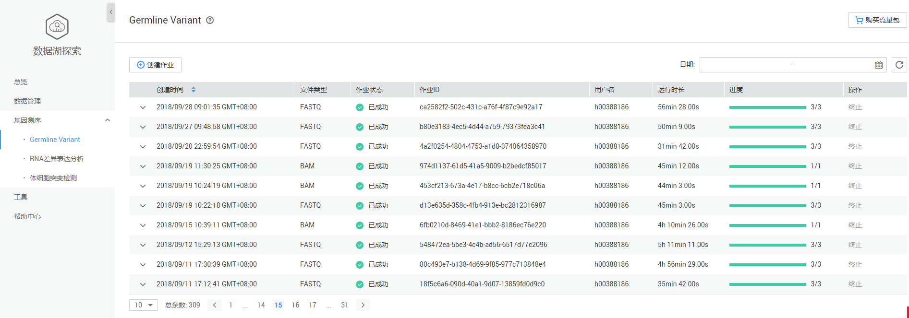
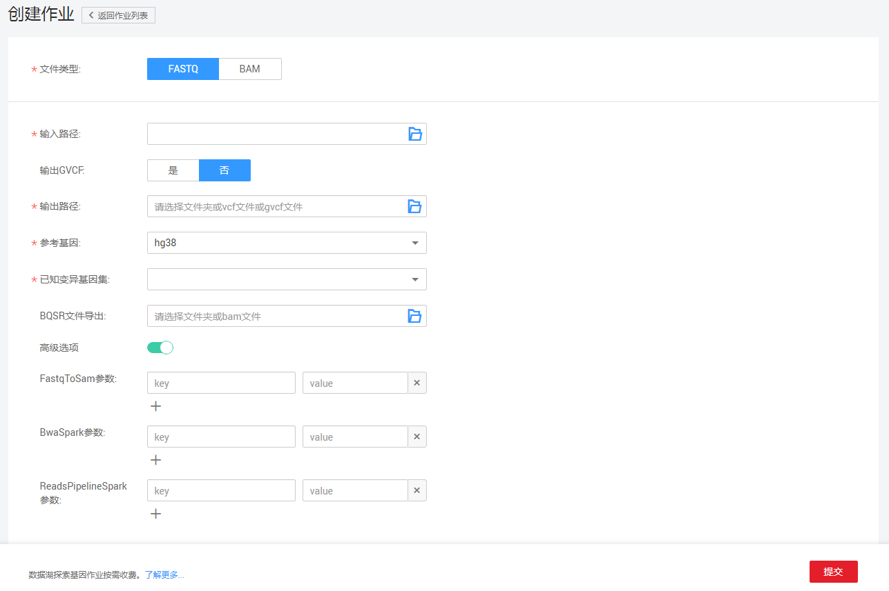

# Germline Variant

## Germline Variant页面说明

DLI全托管式的DNA测序流程, 基于GATK4.0标准测序流程进行分布式优化, 性能相对于单机版测序流程提升10倍有余。目前支持人类样本的WGS\(全基因组测序\)和WES\(外显子测序\)流程。

**图 1**  Germline Variant  

Germline Variant页面显示所有的基因作业，作业数量较多时，系统分页显示，您可以查看所有历史提交的作业。作业列表默认按创建时间排列，可选择升序或降序排列；也可以选择时间范围，查看特定时间范围内提交的作业。

**表 1**  作业列表参数

<table><thead align="left"><tr id="row2555468715120"><th class="cellrowborder" valign="top" width="21.18%" id="mcps1.2.3.1.1">
参数

</th>
<th class="cellrowborder" valign="top" width="78.82000000000001%" id="mcps1.2.3.1.2">
参数说明

</th>
</tr>
</thead>
<tbody><tr id="row46758327132"><td class="cellrowborder" valign="top" width="21.18%" headers="mcps1.2.3.1.1 ">
创建时间

</td>
<td class="cellrowborder" valign="top" width="78.82000000000001%" headers="mcps1.2.3.1.2 ">
每个作业的创建时间，目前按创建时间倒序显示作业列表。

</td>
</tr>
<tr id="row32873162171713"><td class="cellrowborder" valign="top" width="21.18%" headers="mcps1.2.3.1.1 ">
文件类型

</td>
<td class="cellrowborder" valign="top" width="78.82000000000001%" headers="mcps1.2.3.1.2 ">
有FASTQ和BAM两种类型的输入文件。

</td>
</tr>
<tr id="row31011923151038"><td class="cellrowborder" valign="top" width="21.18%" headers="mcps1.2.3.1.1 ">
作业状态

</td>
<td class="cellrowborder" valign="top" width="78.82000000000001%" headers="mcps1.2.3.1.2 ">
作业的状态信息，包括如下六种状态。

<ul id="ul32930526154023"><li>提交（launching）</li><li>运行中（running）</li><li>完成（finished）</li><li>失败（failed）</li><li>取消（cancelled）</li><li>取消中（canceling）</li></ul>
</td>
</tr>
<tr id="row36301606171658"><td class="cellrowborder" valign="top" width="21.18%" headers="mcps1.2.3.1.1 ">
作业ID

</td>
<td class="cellrowborder" valign="top" width="78.82000000000001%" headers="mcps1.2.3.1.2 ">
所提交基因作业的ID，由系统默认生成的唯一标识。

</td>
</tr>
<tr id="row2019117553311"><td class="cellrowborder" valign="top" width="21.18%" headers="mcps1.2.3.1.1 ">
用户名

</td>
<td class="cellrowborder" valign="top" width="78.82000000000001%" headers="mcps1.2.3.1.2 ">
提交基因作业的用户名称。

</td>
</tr>
<tr id="row6424839516213"><td class="cellrowborder" valign="top" width="21.18%" headers="mcps1.2.3.1.1 ">
运行时长

</td>
<td class="cellrowborder" valign="top" width="78.82000000000001%" headers="mcps1.2.3.1.2 ">
作业运行的时间长度。

</td>
</tr>
<tr id="row1662880815250"><td class="cellrowborder" valign="top" width="21.18%" headers="mcps1.2.3.1.1 ">
进度

</td>
<td class="cellrowborder" valign="top" width="78.82000000000001%" headers="mcps1.2.3.1.2 ">
作业运行的进度， 例如：1/3表示总共有三个步骤，当前执行到第一步。

</td>
</tr>
<tr id="row83661120381"><td class="cellrowborder" valign="top" width="21.18%" headers="mcps1.2.3.1.1 ">
操作

</td>
<td class="cellrowborder" valign="top" width="78.82000000000001%" headers="mcps1.2.3.1.2 ">
终止作业。

 NOTE: 

只能终止“提交中”或“运行中”的作业。

</td>
</tr>
</tbody>
</table>

## 创建作业

在[图1](#fig48381724346)中，单击，进入[图2](#fig5850193418534)页面。

**图 2**  创建Germline Variant作业  

参见[表2](#table34159998103738)输入相关参数。

**表 2**  参数说明

<table><thead align="left"><tr id="row18398987103738"><th class="cellrowborder" valign="top" width="13.25%" id="mcps1.2.4.1.1">
参数名称

</th>
<th class="cellrowborder" valign="top" width="79.63%" id="mcps1.2.4.1.2">
描述

</th>
<th class="cellrowborder" valign="top" width="7.12%" id="mcps1.2.4.1.3">
示例

</th>
</tr>
</thead>
<tbody><tr id="row40392508173520"><td class="cellrowborder" valign="top" width="13.25%" headers="mcps1.2.4.1.1 ">
文件类型

</td>
<td class="cellrowborder" valign="top" width="79.63%" headers="mcps1.2.4.1.2 ">
FASTQ和BAM类型的输入文件。

</td>
<td class="cellrowborder" valign="top" width="7.12%" headers="mcps1.2.4.1.3 ">
FASTQ

</td>
</tr>
<tr id="row21981226113610"><td class="cellrowborder" valign="top" width="13.25%" headers="mcps1.2.4.1.1 ">
执行引擎

</td>
<td class="cellrowborder" valign="top" width="79.63%" headers="mcps1.2.4.1.2 ">
选择BAM类型的输入文件时，需要选择对应的执行引擎，如下所示：

<ul id="ul12896193018372"><li>GATK：标准GATK流程</li><li>Tensorflow：利用深度学习模型进行变异检测</li></ul>
</td>
<td class="cellrowborder" valign="top" width="7.12%" headers="mcps1.2.4.1.3 ">
GATK

</td>
</tr>
<tr id="row16142559103738"><td class="cellrowborder" valign="top" width="13.25%" headers="mcps1.2.4.1.1 ">
输入路径

</td>
<td class="cellrowborder" valign="top" width="79.63%" headers="mcps1.2.4.1.2 ">
输入文件所在的OBS路径。

<ul id="ul196801533248"><li>当输入文件类型为FASTQ时，需要指定两个OBS上的FASTQ文件路径。</li><li>当输入文件类型为BAM时，需要指定一个OBS上的BAM文件路径。</li></ul>
</td>
<td class="cellrowborder" valign="top" width="7.12%" headers="mcps1.2.4.1.3 ">
-

</td>
</tr>
<tr id="row092512615107"><td class="cellrowborder" valign="top" width="13.25%" headers="mcps1.2.4.1.1 ">
输出GVCF

</td>
<td class="cellrowborder" valign="top" width="79.63%" headers="mcps1.2.4.1.2 ">
选择是否输出GVCF格式文件。

</td>
<td class="cellrowborder" valign="top" width="7.12%" headers="mcps1.2.4.1.3 ">
-

</td>
</tr>
<tr id="row37659849105931"><td class="cellrowborder" valign="top" width="13.25%" headers="mcps1.2.4.1.1 ">
输出路径

</td>
<td class="cellrowborder" valign="top" width="79.63%" headers="mcps1.2.4.1.2 ">
基因检测结果的OBS输出路径。

</td>
<td class="cellrowborder" valign="top" width="7.12%" headers="mcps1.2.4.1.3 ">
-

</td>
</tr>
<tr id="row16943758105944"><td class="cellrowborder" valign="top" width="13.25%" headers="mcps1.2.4.1.1 ">
参考基因

</td>
<td class="cellrowborder" valign="top" width="79.63%" headers="mcps1.2.4.1.2 ">
基因行业内标准的基因库，目前支持hg19和hg38。

</td>
<td class="cellrowborder" valign="top" width="7.12%" headers="mcps1.2.4.1.3 ">
hg38

</td>
</tr>
<tr id="row8664577112415"><td class="cellrowborder" valign="top" width="13.25%" headers="mcps1.2.4.1.1 ">
已知变异基因集

</td>
<td class="cellrowborder" valign="top" width="79.63%" headers="mcps1.2.4.1.2 ">
根据给定的下拉框，选择需要进行比对的已知变异基因集合，可以多选。

</td>
<td class="cellrowborder" valign="top" width="7.12%" headers="mcps1.2.4.1.3 ">
-

</td>
</tr>
<tr id="row208095231057"><td class="cellrowborder" valign="top" width="13.25%" headers="mcps1.2.4.1.1 ">
BQSR文件导出

</td>
<td class="cellrowborder" valign="top" width="79.63%" headers="mcps1.2.4.1.2 ">
比对文件导出。基因检测过程中间会生成BAM类型的文件，用户可以选择将这个BAM文件保存至OBS，以供日后使用。

</td>
<td class="cellrowborder" valign="top" width="7.12%" headers="mcps1.2.4.1.3 ">
-

</td>
</tr>
<tr id="row562270711021"><td class="cellrowborder" valign="top" width="13.25%" headers="mcps1.2.4.1.1 ">
高级选项

</td>
<td class="cellrowborder" valign="top" width="79.63%" headers="mcps1.2.4.1.2 ">
打开高级选项，可在基因变异检测过程中，进行参数设置，参数格式为“key value”。具体描述请参考<a href="#dli_01_0393__table31006304347">表3</a>。

</td>
<td class="cellrowborder" valign="top" width="7.12%" headers="mcps1.2.4.1.3 ">
-

</td>
</tr>
</tbody>
</table>

**表 3**  高级选项参数说明

<table><thead align="left"><tr id="row2101113013417"><th class="cellrowborder" valign="top" width="19.491949194919492%" id="mcps1.2.4.1.1">
参数名称

</th>
<th class="cellrowborder" valign="top" width="47.17471747174717%" id="mcps1.2.4.1.2">
描述

</th>
<th class="cellrowborder" valign="top" width="33.33333333333333%" id="mcps1.2.4.1.3">
示例

</th>
</tr>
</thead>
<tbody><tr id="row1610310305348"><td class="cellrowborder" valign="top" width="19.491949194919492%" headers="mcps1.2.4.1.1 ">
FastqToSam

</td>
<td class="cellrowborder" valign="top" width="47.17471747174717%" headers="mcps1.2.4.1.2 ">
执行FastqToSam方法时业务相关的配置项，用户可手动添加。

</td>
<td class="cellrowborder" valign="top" width="33.33333333333333%" headers="mcps1.2.4.1.3 ">
-

</td>
</tr>
<tr id="row1310303033416"><td class="cellrowborder" valign="top" width="19.491949194919492%" headers="mcps1.2.4.1.1 ">
BwaSpark

</td>
<td class="cellrowborder" valign="top" width="47.17471747174717%" headers="mcps1.2.4.1.2 ">
执行GATK BwaSpark方法时业务相关的配置项，用户可手动添加。

 NOTE: 

暂不支持关于输出文件格式以及输入输出路径相关的配置项。

</td>
<td class="cellrowborder" valign="top" width="33.33333333333333%" headers="mcps1.2.4.1.3 ">
-

</td>
</tr>
<tr id="row510353093412"><td class="cellrowborder" valign="top" width="19.491949194919492%" headers="mcps1.2.4.1.1 ">
ReadsPipelineSpark

</td>
<td class="cellrowborder" valign="top" width="47.17471747174717%" headers="mcps1.2.4.1.2 ">
执行GATK ReadsPipelineSpark方法时业务相关的配置项，用户可手动添加。

 NOTE: 

暂不支持关于输出文件格式以及输入输出路径相关的配置项。

</td>
<td class="cellrowborder" valign="top" width="33.33333333333333%" headers="mcps1.2.4.1.3 ">
-

</td>
</tr>
</tbody>
</table>

> **说明：**   
>提交Germline Variant作业需进行实名认证，并且需要进行委托授权。具体操作请参考[准备工作](准备工作.md)。  

## 查找作业

在[图1](#fig48381724346)右上侧“日期”栏，单击选择“开始时间”和“结束时间”，可查找对应时间段内提交的作业。

## 查看作业详情

在[图1](#fig48381724346)页面，选中一条作业，单击该作业对应的，可查看该条作业的详细信息。

包括：输入路径，输出路径，文件类型，参考基因，已知变异基因集，输出GVCF，FastqToSam参数，BwaSpark参数，ReadPipelineSpark参数（若输入文件为BAM，则只显示该参数），BQSR文件导出（创建作业时，若没有选择，则不显示），执行引擎（若输入文件为BAM，则显示该参数），日志详情（如果作业执行失败，会显示失败原因）。

**图 3**  Germline Variant作业详情  

