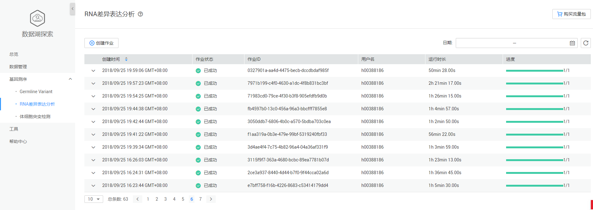
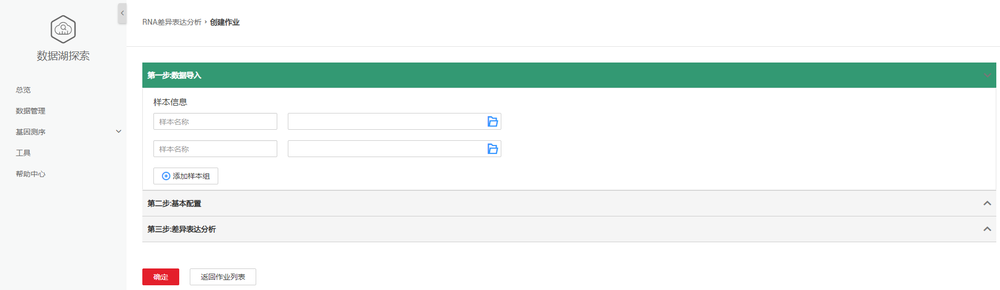
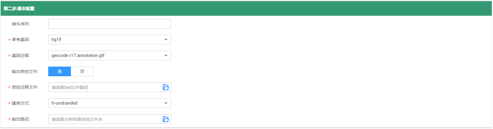

# RNA差异表达分析

## RNA差异表达分析页面说明

DLI全托管的有参考基因组的RNA差异表达分析流程。该流程一键式地完成了FASTQ文件的过滤，参考基因组的对齐，count矩阵的生成，不同样本（组）基因表达的差异分析等处理，并最终输出差异分析结果。

**图 1**  RNA差异表达分析  

RNA差异表达分析页面显示所有的基因作业，作业数量较多时，系统分页显示，您可以查看所有历史提交的作业。作业列表默认按创建时间排列，可选择升序或降序排列；也可以选择时间范围，查看特定时间范围内提交的作业。

**表 1**  作业列表参数

<table><thead align="left"><tr id="row2555468715120"><th class="cellrowborder" valign="top" width="21.18%" id="mcps1.2.3.1.1">
参数

</th>
<th class="cellrowborder" valign="top" width="78.82000000000001%" id="mcps1.2.3.1.2">
参数说明

</th>
</tr>
</thead>
<tbody><tr id="row46758327132"><td class="cellrowborder" valign="top" width="21.18%" headers="mcps1.2.3.1.1 ">
创建时间

</td>
<td class="cellrowborder" valign="top" width="78.82000000000001%" headers="mcps1.2.3.1.2 ">
每个作业的创建时间，目前按创建时间倒序显示作业列表。

</td>
</tr>
<tr id="row31011923151038"><td class="cellrowborder" valign="top" width="21.18%" headers="mcps1.2.3.1.1 ">
作业状态

</td>
<td class="cellrowborder" valign="top" width="78.82000000000001%" headers="mcps1.2.3.1.2 ">
作业的状态信息，包括如下六种状态。

<ul id="ul691214351291"><li>提交中（launching）</li><li>运行中（running）</li><li>已成功（finished）</li><li>已失败（failed）</li><li>已删除（deleted）</li><li>未知异常（unknown）</li></ul>
</td>
</tr>
<tr id="row36301606171658"><td class="cellrowborder" valign="top" width="21.18%" headers="mcps1.2.3.1.1 ">
作业ID

</td>
<td class="cellrowborder" valign="top" width="78.82000000000001%" headers="mcps1.2.3.1.2 ">
所提交基因作业的ID，由系统默认生成的唯一标识。

</td>
</tr>
<tr id="row2019117553311"><td class="cellrowborder" valign="top" width="21.18%" headers="mcps1.2.3.1.1 ">
用户名

</td>
<td class="cellrowborder" valign="top" width="78.82000000000001%" headers="mcps1.2.3.1.2 ">
提交基因作业的用户名称。

</td>
</tr>
<tr id="row6424839516213"><td class="cellrowborder" valign="top" width="21.18%" headers="mcps1.2.3.1.1 ">
运行时长

</td>
<td class="cellrowborder" valign="top" width="78.82000000000001%" headers="mcps1.2.3.1.2 ">
作业运行的时间长度。

</td>
</tr>
<tr id="row1662880815250"><td class="cellrowborder" valign="top" width="21.18%" headers="mcps1.2.3.1.1 ">
进度

</td>
<td class="cellrowborder" valign="top" width="78.82000000000001%" headers="mcps1.2.3.1.2 ">
作业运行的进度， 例如：1/1表示该作业有一个步骤，当前已完成。

</td>
</tr>
</tbody>
</table>

## 创建作业

在[图1](#fig48381724346)中，单击，进入[图2](#fig5850193418534)页面。

**图 2**  创建RNA差异表达分析作业  

1.  数据导入

    **图 3**  RNA差异表达分析数据导入  
    

    在“样本信息”中，输入样本名称，选择输入文件OBS路径，根据需要增加样本组。

    例如：

    **图 4**  数据导入示例  
    

2.  基本配置

    **图 5**  RNA差异表达分析基本配置  
    

    参见[表2](#table34159998103738)输入相关参数。

    **表 2**  参数说明

    
    <table><thead align="left"><tr id="row18398987103738"><th class="cellrowborder" valign="top" width="12.606060606060607%" id="mcps1.2.4.1.1">
参数名称

    </th>
    <th class="cellrowborder" valign="top" width="61.7979797979798%" id="mcps1.2.4.1.2">
描述

    </th>
    <th class="cellrowborder" valign="top" width="25.5959595959596%" id="mcps1.2.4.1.3">
示例

    </th>
    </tr>
    </thead>
    <tbody><tr id="row37659849105931"><td class="cellrowborder" valign="top" width="12.606060606060607%" headers="mcps1.2.4.1.1 ">
接头序列

    </td>
    <td class="cellrowborder" valign="top" width="61.7979797979798%" headers="mcps1.2.4.1.2 ">
测序过程中使用的adapter序列，用于去除输入数据中的对应序列。

    </td>
    <td class="cellrowborder" valign="top" width="25.5959595959596%" headers="mcps1.2.4.1.3 ">
-

    </td>
    </tr>
    <tr id="row16943758105944"><td class="cellrowborder" valign="top" width="12.606060606060607%" headers="mcps1.2.4.1.1 ">
参考基因

    </td>
    <td class="cellrowborder" valign="top" width="61.7979797979798%" headers="mcps1.2.4.1.2 ">
基因行业内标准的基因库，目前支持hg19和hg38。

    </td>
    <td class="cellrowborder" valign="top" width="25.5959595959596%" headers="mcps1.2.4.1.3 ">
hg19

    </td>
    </tr>
    <tr id="row8664577112415"><td class="cellrowborder" valign="top" width="12.606060606060607%" headers="mcps1.2.4.1.1 ">
基因注释

    </td>
    <td class="cellrowborder" valign="top" width="61.7979797979798%" headers="mcps1.2.4.1.2 ">
参考基因组注释文件，来源于gencode数据库。

    </td>
    <td class="cellrowborder" valign="top" width="25.5959595959596%" headers="mcps1.2.4.1.3 ">
gencode.v17.annotation.gtf

    </td>
    </tr>
    <tr id="row1161063874114"><td class="cellrowborder" valign="top" width="12.606060606060607%" headers="mcps1.2.4.1.1 ">
输出质控文件

    </td>
    <td class="cellrowborder" valign="top" width="61.7979797979798%" headers="mcps1.2.4.1.2 ">
选择“是”，需选择质控注释文件。

    </td>
    <td class="cellrowborder" valign="top" width="25.5959595959596%" headers="mcps1.2.4.1.3 ">
否

    </td>
    </tr>
    <tr id="row1549165112513"><td class="cellrowborder" valign="top" width="12.606060606060607%" headers="mcps1.2.4.1.1 ">
质控注释文件

    </td>
    <td class="cellrowborder" valign="top" width="61.7979797979798%" headers="mcps1.2.4.1.2 ">
RSeQC质控所需要的基因注释文件。

    </td>
    <td class="cellrowborder" valign="top" width="25.5959595959596%" headers="mcps1.2.4.1.3 ">
-

    </td>
    </tr>
    <tr id="row208095231057"><td class="cellrowborder" valign="top" width="12.606060606060607%" headers="mcps1.2.4.1.1 ">
建库方式

    </td>
    <td class="cellrowborder" valign="top" width="61.7979797979798%" headers="mcps1.2.4.1.2 ">
输入数据的链特异性建库方式。

    </td>
    <td class="cellrowborder" valign="top" width="25.5959595959596%" headers="mcps1.2.4.1.3 ">
fr-unstranded

    </td>
    </tr>
    <tr id="row562270711021"><td class="cellrowborder" valign="top" width="12.606060606060607%" headers="mcps1.2.4.1.1 ">
输出路径

    </td>
    <td class="cellrowborder" valign="top" width="61.7979797979798%" headers="mcps1.2.4.1.2 ">
存放分析结果的OBS路径。

    </td>
    <td class="cellrowborder" valign="top" width="25.5959595959596%" headers="mcps1.2.4.1.3 ">
-

    </td>
    </tr>
    </tbody>
    </table>

3.  差异表达分析

    **图 6**  差异表达分析  
    

    勾选需要对比的样本。

    > **说明：**   
    >可勾选多组样本。  

4.  单击“确定”。

> **说明：**   
>提交RNA差异表达分析作业需进行实名认证，并且需要进行委托授权。具体操作请参考[准备工作](准备工作.md)。  

## 查找作业

在[图1](#fig48381724346)右上侧“日期”栏，单击选择“开始时间”和“结束时间”，可查找对应时间段内提交的作业。

## 查看作业详情

在[图1](#fig48381724346)页面，选中一条作业，单击该作业对应的，可查看该条作业的详细信息。

-   基本配置

    包括：参考基因，建库方式，基因注释，输出路径，输出质控文件，质控注释文件，接头序列。

-   样本信息

**图 7**  RNA差异表达分析作业详情  

