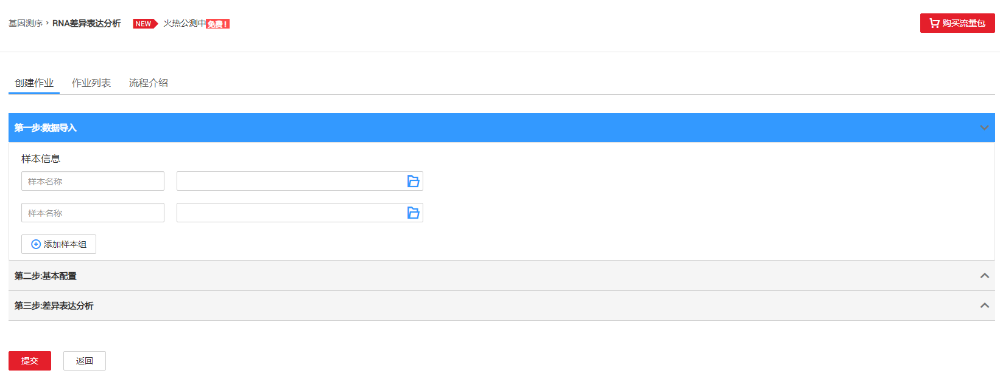
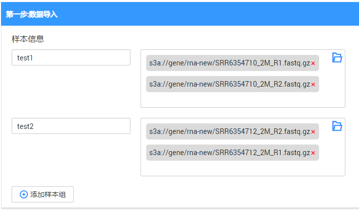
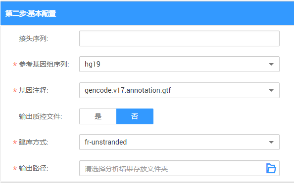
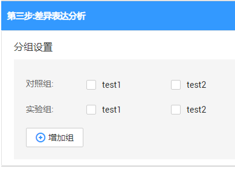
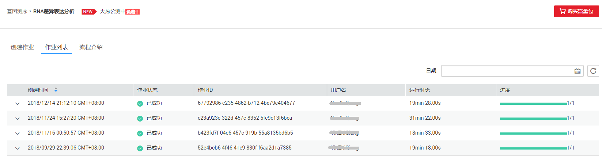
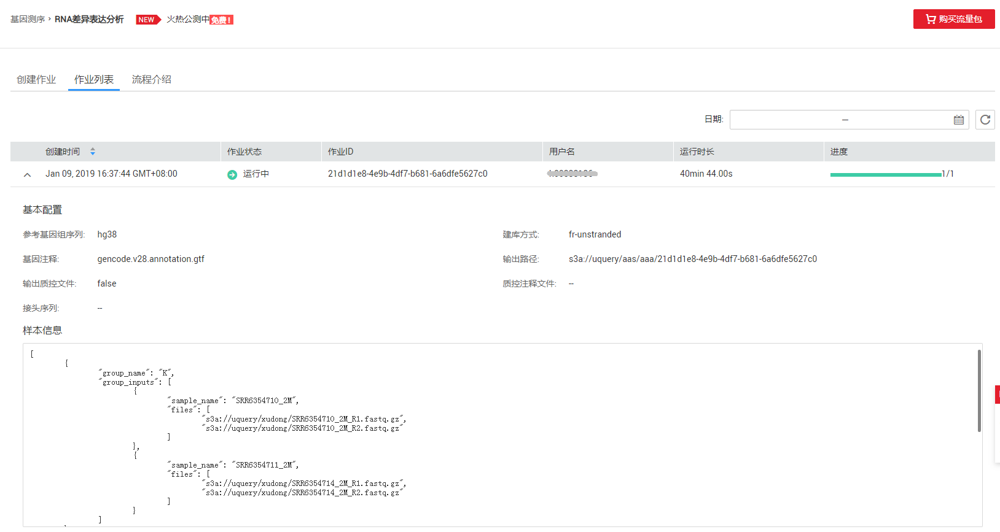
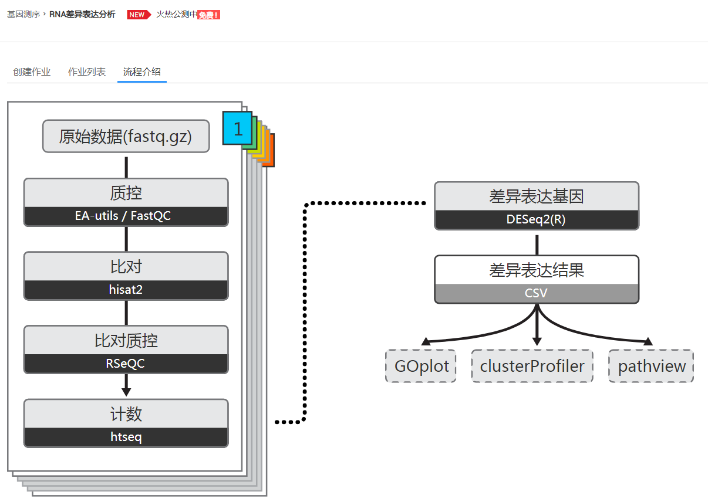

# RNA差异表达分析

## RNA差异表达分析概述

有参RNA-Seq差异表达分析流程。该流程一键式地完成了FASTQ文件的过滤，参考基因组的比对，不同样本（组）间基因表达的差异进行分析等处理，并最终输出差异表达及GO/KEGG富集分析结果。

> **说明：**   
>提交RNA差异表达分析作业需进行实名认证，并且需要进行委托授权。具体操作请参考[准备工作](准备工作.md)。  

## 创建作业

**图 1**  RNA差异表达分析创建作业  

1.  数据导入

    **图 2**  RNA差异表达分析数据导入  
    

    在“样本信息”中，输入样本名称（自定义），选择输入文件的OBS路径。可根据需要添加样本组。例如：

    **图 3**  数据导入示例  
    

2.  基本参数配置

    **图 4**  RNA差异表达分析基本参数配置  
    

    **表 1**  参数说明

    
    <table><thead align="left"><tr id="row18398987103738"><th class="cellrowborder" valign="top" width="15.646464646464645%" id="mcps1.2.4.1.1">
参数名称

    </th>
    <th class="cellrowborder" valign="top" width="57.28282828282828%" id="mcps1.2.4.1.2">
描述

    </th>
    <th class="cellrowborder" valign="top" width="27.070707070707066%" id="mcps1.2.4.1.3">
示例

    </th>
    </tr>
    </thead>
    <tbody><tr id="row37659849105931"><td class="cellrowborder" valign="top" width="15.646464646464645%" headers="mcps1.2.4.1.1 ">
接头序列

    </td>
    <td class="cellrowborder" valign="top" width="57.28282828282828%" headers="mcps1.2.4.1.2 ">
测序过程中使用的adapter序列，用于去除输入数据中的对应序列。

    </td>
    <td class="cellrowborder" valign="top" width="27.070707070707066%" headers="mcps1.2.4.1.3 ">
-

    </td>
    </tr>
    <tr id="row16943758105944"><td class="cellrowborder" valign="top" width="15.646464646464645%" headers="mcps1.2.4.1.1 ">
参考基因组序列

    </td>
    <td class="cellrowborder" valign="top" width="57.28282828282828%" headers="mcps1.2.4.1.2 ">
基因行业内标准的基因库，目前支持hg19和hg38。

    </td>
    <td class="cellrowborder" valign="top" width="27.070707070707066%" headers="mcps1.2.4.1.3 ">
hg19

    </td>
    </tr>
    <tr id="row8664577112415"><td class="cellrowborder" valign="top" width="15.646464646464645%" headers="mcps1.2.4.1.1 ">
基因注释

    </td>
    <td class="cellrowborder" valign="top" width="57.28282828282828%" headers="mcps1.2.4.1.2 ">
参考基因组注释文件，来源于gencode数据库。

    </td>
    <td class="cellrowborder" valign="top" width="27.070707070707066%" headers="mcps1.2.4.1.3 ">
gencode.v17.annotation.gtf

    </td>
    </tr>
    <tr id="row1161063874114"><td class="cellrowborder" valign="top" width="15.646464646464645%" headers="mcps1.2.4.1.1 ">
输出质控文件

    </td>
    <td class="cellrowborder" valign="top" width="57.28282828282828%" headers="mcps1.2.4.1.2 ">
选择“是”，需选择质控注释文件。默认值为“否”。

    </td>
    <td class="cellrowborder" valign="top" width="27.070707070707066%" headers="mcps1.2.4.1.3 ">
否

    </td>
    </tr>
    <tr id="row1549165112513"><td class="cellrowborder" valign="top" width="15.646464646464645%" headers="mcps1.2.4.1.1 ">
质控注释文件

    </td>
    <td class="cellrowborder" valign="top" width="57.28282828282828%" headers="mcps1.2.4.1.2 ">
RSeQC质控所需要的基因注释文件。

    </td>
    <td class="cellrowborder" valign="top" width="27.070707070707066%" headers="mcps1.2.4.1.3 ">
-

    </td>
    </tr>
    <tr id="row208095231057"><td class="cellrowborder" valign="top" width="15.646464646464645%" headers="mcps1.2.4.1.1 ">
建库方式

    </td>
    <td class="cellrowborder" valign="top" width="57.28282828282828%" headers="mcps1.2.4.1.2 ">
输入数据的链特异性建库方式。

    </td>
    <td class="cellrowborder" valign="top" width="27.070707070707066%" headers="mcps1.2.4.1.3 ">
fr-unstranded

    </td>
    </tr>
    <tr id="row562270711021"><td class="cellrowborder" valign="top" width="15.646464646464645%" headers="mcps1.2.4.1.1 ">
输出路径

    </td>
    <td class="cellrowborder" valign="top" width="57.28282828282828%" headers="mcps1.2.4.1.2 ">
存放分析结果的OBS路径。

    </td>
    <td class="cellrowborder" valign="top" width="27.070707070707066%" headers="mcps1.2.4.1.3 ">
-

    </td>
    </tr>
    </tbody>
    </table>

3.  差异表达分析

    **图 5**  差异表达分析  
    

    勾选需要对比的样本。例如，“对照组”选择“test1”，“实验组”选择“test2”。单击，表示对比“test1”和“test2”。

    > **说明：**   
    >可勾选多组样本。  

4.  单击“提交”。

## 作业列表

**图 6**  RNA差异表达分析作业列表  

作业列表显示所有的RNA差异表达分析作业，作业数量较多时，系统分页显示，您可以查看所有历史提交的作业。作业列表默认按创建时间降序排列，可切换为按时间升序排列；也可以选择时间范围，查看特定时间范围内提交的作业。

**表 2**  作业列表参数

<table><thead align="left"><tr id="row717133713445"><th class="cellrowborder" valign="top" width="21.18%" id="mcps1.2.3.1.1">
参数

</th>
<th class="cellrowborder" valign="top" width="78.82000000000001%" id="mcps1.2.3.1.2">
参数说明

</th>
</tr>
</thead>
<tbody><tr id="row3172037174416"><td class="cellrowborder" valign="top" width="21.18%" headers="mcps1.2.3.1.1 ">
创建时间

</td>
<td class="cellrowborder" valign="top" width="78.82000000000001%" headers="mcps1.2.3.1.2 ">
每个作业的创建时间，目前按创建时间倒序显示作业列表。

</td>
</tr>
<tr id="row5199378440"><td class="cellrowborder" valign="top" width="21.18%" headers="mcps1.2.3.1.1 ">
作业状态

</td>
<td class="cellrowborder" valign="top" width="78.82000000000001%" headers="mcps1.2.3.1.2 ">
作业的状态信息，包括如下六种状态。

<ul id="ul101814378442"><li>提交中（launching）</li><li>运行中（running）</li><li>已成功（finished）</li><li>已失败（failed）</li><li>已删除（deleted）</li><li>未知异常（unknown）</li></ul>
</td>
</tr>
<tr id="row161953714418"><td class="cellrowborder" valign="top" width="21.18%" headers="mcps1.2.3.1.1 ">
作业ID

</td>
<td class="cellrowborder" valign="top" width="78.82000000000001%" headers="mcps1.2.3.1.2 ">
所提交基因作业的ID，由系统默认生成的唯一标识。

</td>
</tr>
<tr id="row2020537174418"><td class="cellrowborder" valign="top" width="21.18%" headers="mcps1.2.3.1.1 ">
用户名

</td>
<td class="cellrowborder" valign="top" width="78.82000000000001%" headers="mcps1.2.3.1.2 ">
提交基因作业的用户名称。

</td>
</tr>
<tr id="row42053714411"><td class="cellrowborder" valign="top" width="21.18%" headers="mcps1.2.3.1.1 ">
运行时长

</td>
<td class="cellrowborder" valign="top" width="78.82000000000001%" headers="mcps1.2.3.1.2 ">
作业运行的时间长度。

</td>
</tr>
<tr id="row1820103719447"><td class="cellrowborder" valign="top" width="21.18%" headers="mcps1.2.3.1.1 ">
进度

</td>
<td class="cellrowborder" valign="top" width="78.82000000000001%" headers="mcps1.2.3.1.2 ">
作业运行的进度， 例如：1/1表示该作业有一个步骤，当前已完成。

</td>
</tr>
</tbody>
</table>

-   查找作业

    在[图6](#fig417123764416)右上侧“日期”栏，单击选择“开始时间”和“结束时间”，可查找对应时间段内提交的作业。

-   查看作业详情

    在[图6](#fig417123764416)页面，选中一条作业，单击该作业对应的，可查看该条作业的详细信息。

    -   基本配置

        包括：参考基因组序列，建库方式，基因注释，输出路径，输出质控文件，质控注释文件，接头序列。

    -   样本信息

        **图 7**  RNA差异表达分析作业详情  
        

## 流程介绍

**图 8**  RNA差异表达分析流程介绍  

