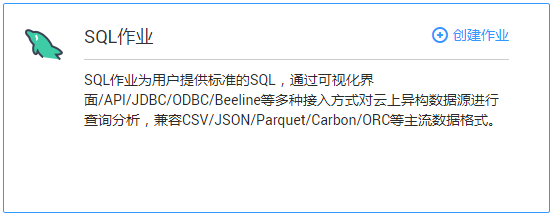
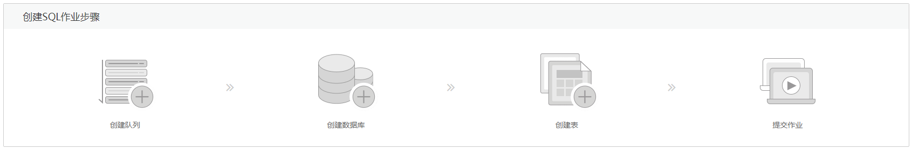

# SQL作业总览

SQL作业页面可为用户提供标准的SQL语句。用户可以通过可视化界面、Restful API、JDBC、ODBC、Beeline等多种接入方式对云上DLI、CloudTable、RDS和DWS等异构数据源进行查询分析，数据格式兼容CSV、JSON、Parquet、Carbon、ORC等主流数据格式。

单击[图1](#fig75551325203)所示SQL作业区域或其右上角的，可进入“作业编辑器”页面，具体操作请参考[SQL作业编辑器](SQL作业编辑器.md)。

**图 1**  SQL作业介绍  

创建SQL作业步骤请参考[图2](#fig182651741318)。

**图 2**  创建SQL作业步骤  

