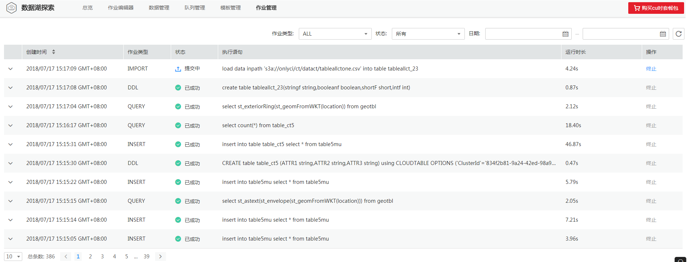

# SQL作业管理

## 操作场景

SQL作业包括在SQL作业编辑窗口执行的SQL语句，导入数据和导出数据等操作。

## 作业列表

作业列表显示所有的SQL作业，作业数量较多时，系统分页显示，可根据需要跳转至指定页面。您可以查看任何状态下的作业。作业列表默认按创建时间降序排列，创建时间最近的作业显示在最前端。

**表 1**  作业列表参数

<table><thead align="left"><tr id="row2555468715120"><th class="cellrowborder" valign="top" width="21.18%" id="mcps1.2.3.1.1">
参数

</th>
<th class="cellrowborder" valign="top" width="78.82000000000001%" id="mcps1.2.3.1.2">
参数说明

</th>
</tr>
</thead>
<tbody><tr id="row46758327132"><td class="cellrowborder" valign="top" width="21.18%" headers="mcps1.2.3.1.1 ">
创建时间

</td>
<td class="cellrowborder" valign="top" width="78.82000000000001%" headers="mcps1.2.3.1.2 ">
每个作业的创建时间，可按创建时间顺序或倒序显示作业列表。

</td>
</tr>
<tr id="row32873162171713"><td class="cellrowborder" valign="top" width="21.18%" headers="mcps1.2.3.1.1 ">
作业类型

</td>
<td class="cellrowborder" valign="top" width="78.82000000000001%" headers="mcps1.2.3.1.2 ">
作业的类型，包括如下。

<ul id="ul29348869174358"><li>IMPORT：导入数据到DLI的作业。</li><li>EXPORT：从DLI导出数据的作业。</li><li>DCL：包括传统DCL，以及队列权限相关的操作。</li><li>DDL：与传统DDL操作一致，即创建和删除数据库，创建和删除表的作业。</li><li>QUERY：执行SQL查询数据的作业。</li><li>INSERT：执行SQL插入数据的作业。</li></ul>
</td>
</tr>
<tr id="row31011923151038"><td class="cellrowborder" valign="top" width="21.18%" headers="mcps1.2.3.1.1 ">
状态

</td>
<td class="cellrowborder" valign="top" width="78.82000000000001%" headers="mcps1.2.3.1.2 ">
作业的状态信息，包括如下。

<ul id="ul32930526154023"><li>提交中</li><li>运行中</li><li>已取消</li><li>已成功</li><li>已失败</li></ul>
</td>
</tr>
<tr id="row36301606171658"><td class="cellrowborder" valign="top" width="21.18%" headers="mcps1.2.3.1.1 ">
执行语句

</td>
<td class="cellrowborder" valign="top" width="78.82000000000001%" headers="mcps1.2.3.1.2 ">
作业的具体SQL语句以及导出、建表的操作，此处展示操作的描述。

单击可复制对应的语句。

</td>
</tr>
<tr id="row6424839516213"><td class="cellrowborder" valign="top" width="21.18%" headers="mcps1.2.3.1.1 ">
运行时长

</td>
<td class="cellrowborder" valign="top" width="78.82000000000001%" headers="mcps1.2.3.1.2 ">
作业的运行时长。

</td>
</tr>
<tr id="row1662880815250"><td class="cellrowborder" valign="top" width="21.18%" headers="mcps1.2.3.1.1 ">
操作

</td>
<td class="cellrowborder" valign="top" width="78.82000000000001%" headers="mcps1.2.3.1.2 ">
终止。

<ul id="ul181927155164"><li>当作业状态在“提交中”和“运行中”时，“终止”按钮才生效。</li><li>当作业状态为“已成功”、“已失败”、“已取消”的作业不能终止。</li><li>当“终止”按钮为灰色时，表示无法执行终止操作。</li></ul>
</td>
</tr>
</tbody>
</table>

## 查找作业

1.  在DLI管理控制台顶部菜单栏中，选择“作业管理“。
2.  在“SQL“页面，选择作业类型、状态或者定义时间范围。

    系统将根据设置的过滤条件，在作业列表显示符合对应条件的作业。

    **图 1**  查找SQL作业结果  
    

## 查看作业详情

在“作业管理“页面，选中一条作业，单击该作业对应的，可查看该条作业的详细信息。

不同类型的作业，显示的作业详情不同。以导入数据作业，建表作业和查询作业为例说明。

-   导入数据（load data）作业，包括以下信息：队列名称，作业ID，创建时间，作业类型，作业状态，执行语句，运行时长，执行用户，数据库名称，表名，文件格式，表头，引用字符，分隔符，数据源路径，转义字符，导入开始时间，导入结束时间，日期格式，时间戳格式。
-   建表（create table）作业，包括以下信息：队列名称，作业ID，创建时间，作业类型，作业状态，执行语句，运行时长，已扫描数据，执行用户。
-   查询（select）作业，包括以下信息：队列名称，作业ID，创建时间，作业类型，作业状态，执行语句，运行时长，结果条数（运行成功，可导出结果），已扫描数据，执行用户，结果状态（运行成功，可查看结果；运行失败，显示失败原因）。

## 终止作业

在“作业管理“页面，可单击“操作”列的“终止“，终止“运行中”的作业。

