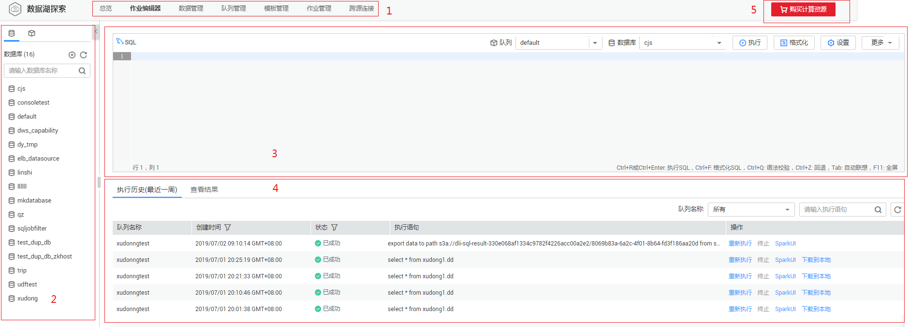
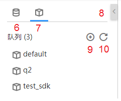
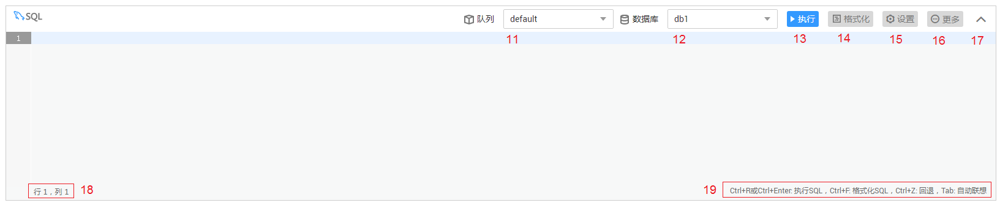
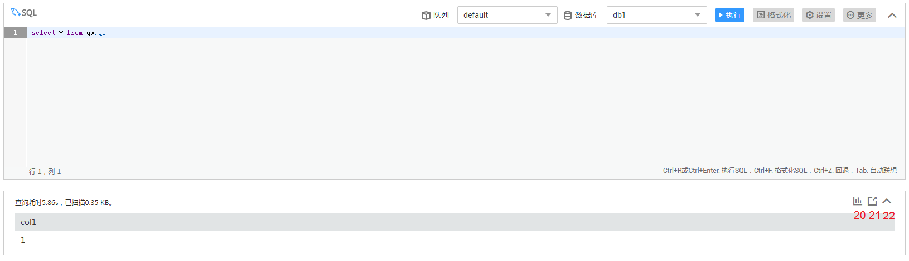
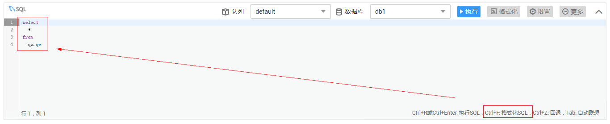
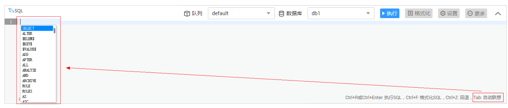

# SQL作业编辑器

SQL作业编辑器支持使用SQL语句执行数据查询操作。支持SQL2003，兼容SparkSQL，详细语法描述请参见[《数据湖探索SQL语法参考》](https://support.huaweicloud.com/sqlreference-uquery/uquery_08_0001.html)。

## 界面说明

介绍“作业编辑器“页面中的区域和按键功能。

**图 1**  SQL作业编辑器页面  

**表 1**  页面区域说明

<table><thead align="left"><tr id="zh-cn_topic_0093946815_row3857138316587"><th class="cellrowborder" valign="top" width="7.000000000000001%" id="mcps1.2.4.1.1">
序号

</th>
<th class="cellrowborder" valign="top" width="17%" id="mcps1.2.4.1.2">
区域

</th>
<th class="cellrowborder" valign="top" width="76%" id="mcps1.2.4.1.3">
描述

</th>
</tr>
</thead>
<tbody><tr id="zh-cn_topic_0093946815_row1198630416587"><td class="cellrowborder" valign="top" width="7.000000000000001%" headers="mcps1.2.4.1.1 ">
1

</td>
<td class="cellrowborder" valign="top" width="17%" headers="mcps1.2.4.1.2 ">
菜单栏

</td>
<td class="cellrowborder" valign="top" width="76%" headers="mcps1.2.4.1.3 ">
SQL作业的菜单栏，包括总览、作业编辑器、数据管理、队列管理、模板管理和作业管理。

</td>
</tr>
<tr id="zh-cn_topic_0093946815_row4924339316587"><td class="cellrowborder" valign="top" width="7.000000000000001%" headers="mcps1.2.4.1.1 ">
2

</td>
<td class="cellrowborder" valign="top" width="17%" headers="mcps1.2.4.1.2 ">
导航栏

</td>
<td class="cellrowborder" valign="top" width="76%" headers="mcps1.2.4.1.3 ">
左侧导航栏，包括队列、数据库和数据库中的表。

</td>
</tr>
<tr id="zh-cn_topic_0093946815_row1318571216587"><td class="cellrowborder" valign="top" width="7.000000000000001%" headers="mcps1.2.4.1.1 ">
3

</td>
<td class="cellrowborder" valign="top" width="17%" headers="mcps1.2.4.1.2 ">
作业编辑窗口

</td>
<td class="cellrowborder" valign="top" width="76%" headers="mcps1.2.4.1.3 ">
作业编辑窗口中可输入并执行SQL语句。

</td>
</tr>
<tr id="row1146182415594"><td class="cellrowborder" valign="top" width="7.000000000000001%" headers="mcps1.2.4.1.1 ">
4

</td>
<td class="cellrowborder" valign="top" width="17%" headers="mcps1.2.4.1.2 ">
增加作业编辑窗口

</td>
<td class="cellrowborder" valign="top" width="76%" headers="mcps1.2.4.1.3 ">
增加SQL作业编辑窗口。

 NOTE: 

最多可同时开启10个作业编辑窗口。

</td>
</tr>
<tr id="row10930163551711"><td class="cellrowborder" valign="top" width="7.000000000000001%" headers="mcps1.2.4.1.1 ">
5

</td>
<td class="cellrowborder" valign="top" width="17%" headers="mcps1.2.4.1.2 ">
购买CU时套餐包

</td>
<td class="cellrowborder" valign="top" width="76%" headers="mcps1.2.4.1.3 ">
根据需要购买CU时套餐包。如果不购买，则按需计费。计费详情请参考<a href="https://support.huaweicloud.com/pg-uquery/uquery_06_0001.html" target="_blank" rel="noopener noreferrer">《数据湖探索购买指南》</a>。

</td>
</tr>
<tr id="row1441425852013"><td class="cellrowborder" valign="top" width="7.000000000000001%" headers="mcps1.2.4.1.1 ">
23

</td>
<td class="cellrowborder" valign="top" width="17%" headers="mcps1.2.4.1.2 ">
执行历史

</td>
<td class="cellrowborder" valign="top" width="76%" headers="mcps1.2.4.1.3 ">
显示已提交的作业状态。

</td>
</tr>
</tbody>
</table>

**图 2**  SQL作业导航栏  

**表 2**  导航栏按键说明

<table><thead align="left"><tr id="row105761087712"><th class="cellrowborder" valign="top" width="8%" id="mcps1.2.4.1.1">
序号

</th>
<th class="cellrowborder" valign="top" width="25%" id="mcps1.2.4.1.2">
按键

</th>
<th class="cellrowborder" valign="top" width="67%" id="mcps1.2.4.1.3">
描述

</th>
</tr>
</thead>
<tbody><tr id="row5510457102015"><td class="cellrowborder" valign="top" width="8%" headers="mcps1.2.4.1.1 ">
6

</td>
<td class="cellrowborder" valign="top" width="25%" headers="mcps1.2.4.1.2 ">
数据库

</td>
<td class="cellrowborder" valign="top" width="67%" headers="mcps1.2.4.1.3 ">
显示已有的数据库及其下所有的表。

 NOTE: 
<ul id="ul10186152210479"><li>单击数据库名，将显示该数据库中的表。</li><li>单击表名，将在表名下显示该表中的元数据，最多可显示20个元数据。</li><li>双击表名，将在作业编辑窗口自动输入SQL查询语句。</li></ul>

</td>
</tr>
<tr id="row0576181717"><td class="cellrowborder" valign="top" width="8%" headers="mcps1.2.4.1.1 ">
7

</td>
<td class="cellrowborder" valign="top" width="25%" headers="mcps1.2.4.1.2 ">
队列

</td>
<td class="cellrowborder" valign="top" width="67%" headers="mcps1.2.4.1.3 ">
显示已有的队列。

</td>
</tr>
<tr id="row1157678977"><td class="cellrowborder" valign="top" width="8%" headers="mcps1.2.4.1.1 ">
8

</td>
<td class="cellrowborder" valign="top" width="25%" headers="mcps1.2.4.1.2 ">
隐藏/显示

</td>
<td class="cellrowborder" valign="top" width="67%" headers="mcps1.2.4.1.3 ">
隐藏/显示导航栏。

</td>
</tr>
<tr id="row95761281676"><td class="cellrowborder" valign="top" width="8%" headers="mcps1.2.4.1.1 ">
9

</td>
<td class="cellrowborder" valign="top" width="25%" headers="mcps1.2.4.1.2 ">
创建

</td>
<td class="cellrowborder" valign="top" width="67%" headers="mcps1.2.4.1.3 ">
包括创建队列、数据库和表。

</td>
</tr>
<tr id="row1857619810717"><td class="cellrowborder" valign="top" width="8%" headers="mcps1.2.4.1.1 ">
10

</td>
<td class="cellrowborder" valign="top" width="25%" headers="mcps1.2.4.1.2 ">
刷新

</td>
<td class="cellrowborder" valign="top" width="67%" headers="mcps1.2.4.1.3 ">
包括刷新已有的队列、数据库和表列表。

</td>
</tr>
</tbody>
</table>

**图 3**  SQL作业编辑窗口  

**表 3**  作业编辑窗口说明

<table><thead align="left"><tr id="row169141932105516"><th class="cellrowborder" valign="top" width="7.920792079207921%" id="mcps1.2.4.1.1">
序号

</th>
<th class="cellrowborder" valign="top" width="14.85148514851485%" id="mcps1.2.4.1.2">
按键

</th>
<th class="cellrowborder" valign="top" width="77.22772277227723%" id="mcps1.2.4.1.3">
描述

</th>
</tr>
</thead>
<tbody><tr id="row1591463215551"><td class="cellrowborder" valign="top" width="7.920792079207921%" headers="mcps1.2.4.1.1 ">
11

</td>
<td class="cellrowborder" valign="top" width="14.85148514851485%" headers="mcps1.2.4.1.2 ">
队列名

</td>
<td class="cellrowborder" valign="top" width="77.22772277227723%" headers="mcps1.2.4.1.3 ">
下拉选择需要使用的队列。如果没有可用队列，此处显示“请选择队列”，请先创建队列。

</td>
</tr>
<tr id="row79141324554"><td class="cellrowborder" valign="top" width="7.920792079207921%" headers="mcps1.2.4.1.1 ">
12

</td>
<td class="cellrowborder" valign="top" width="14.85148514851485%" headers="mcps1.2.4.1.2 ">
数据库名

</td>
<td class="cellrowborder" valign="top" width="77.22772277227723%" headers="mcps1.2.4.1.3 ">
下拉选择需要使用的数据库。如果没有可用数据库，此处显示“请选择数据库”，请先创建数据库。

 NOTE: 

如果SQL语句中指定了表所在的数据库，则此处选择的数据库无效。

</td>
</tr>
<tr id="row79148327558"><td class="cellrowborder" valign="top" width="7.920792079207921%" headers="mcps1.2.4.1.1 ">
13

</td>
<td class="cellrowborder" valign="top" width="14.85148514851485%" headers="mcps1.2.4.1.2 ">
执行

</td>
<td class="cellrowborder" valign="top" width="77.22772277227723%" headers="mcps1.2.4.1.3 ">
执行作业编辑窗口中的SQL语句。

 NOTE: 

若窗口中没有SQL语句，该按键禁用。

</td>
</tr>
<tr id="row591433295513"><td class="cellrowborder" valign="top" width="7.920792079207921%" headers="mcps1.2.4.1.1 ">
14

</td>
<td class="cellrowborder" valign="top" width="14.85148514851485%" headers="mcps1.2.4.1.2 ">
格式化

</td>
<td class="cellrowborder" valign="top" width="77.22772277227723%" headers="mcps1.2.4.1.3 ">
格式化SQL语句。

 NOTE: 

若窗口中没有SQL语句，该按键禁用。

</td>
</tr>
<tr id="row17600951132211"><td class="cellrowborder" valign="top" width="7.920792079207921%" headers="mcps1.2.4.1.1 ">
15

</td>
<td class="cellrowborder" valign="top" width="14.85148514851485%" headers="mcps1.2.4.1.2 ">
设置

</td>
<td class="cellrowborder" valign="top" width="77.22772277227723%" headers="mcps1.2.4.1.3 ">
以“key/value”的形式设置提交SQL作业的属性。详细内容请参见《数据湖探索API参考》&gt;<a href="https://support.huaweicloud.com/api-uquery/uquery_02_0102.html" target="_blank" rel="noopener noreferrer">《提交SQL作业（推荐）》</a>&gt;“表2 请求参数”中“conf”参数的说明。最多可设置10个属性。

</td>
</tr>
<tr id="row1791418324558"><td class="cellrowborder" valign="top" width="7.920792079207921%" headers="mcps1.2.4.1.1 ">
16

</td>
<td class="cellrowborder" valign="top" width="14.85148514851485%" headers="mcps1.2.4.1.2 ">
更多

</td>
<td class="cellrowborder" valign="top" width="77.22772277227723%" headers="mcps1.2.4.1.3 ">
包括“语义校验”，“设为模板”和“选择模板”。

<ul id="ul59151629162312"><li>语义校验：判断SQL语句编写是否正确。</li><li>设为模板：将常用的SQL语句设为模板。</li><li>选择模板：选择已保存为模板的SQL语句。</li></ul>
</td>
</tr>
<tr id="row1520319811149"><td class="cellrowborder" valign="top" width="7.920792079207921%" headers="mcps1.2.4.1.1 ">
17

</td>
<td class="cellrowborder" valign="top" width="14.85148514851485%" headers="mcps1.2.4.1.2 ">
闭合/展开

</td>
<td class="cellrowborder" valign="top" width="77.22772277227723%" headers="mcps1.2.4.1.3 ">
闭合/展开当前的作业编辑窗口。

</td>
</tr>
<tr id="row102037812149"><td class="cellrowborder" valign="top" width="7.920792079207921%" headers="mcps1.2.4.1.1 ">
18

</td>
<td class="cellrowborder" valign="top" width="14.85148514851485%" headers="mcps1.2.4.1.2 ">
光标位置

</td>
<td class="cellrowborder" valign="top" width="77.22772277227723%" headers="mcps1.2.4.1.3 ">
标识光标在作业编辑窗口中的位置。

</td>
</tr>
<tr id="row52031287149"><td class="cellrowborder" valign="top" width="7.920792079207921%" headers="mcps1.2.4.1.1 ">
19

</td>
<td class="cellrowborder" valign="top" width="14.85148514851485%" headers="mcps1.2.4.1.2 ">
快捷键

</td>
<td class="cellrowborder" valign="top" width="77.22772277227723%" headers="mcps1.2.4.1.3 ">
快捷键介绍具体请参考<a href="#dli_01_0320__table209301155311">表5</a>。

</td>
</tr>
</tbody>
</table>

**图 4**  SQL语句执行结果窗口  

**表 4**  SQL语句执行结果窗口说明

<table><thead align="left"><tr id="row1517115405378"><th class="cellrowborder" valign="top" width="7.5200000000000005%" id="mcps1.2.4.1.1">
序号

</th>
<th class="cellrowborder" valign="top" width="26.82%" id="mcps1.2.4.1.2">
按键

</th>
<th class="cellrowborder" valign="top" width="65.66%" id="mcps1.2.4.1.3">
描述

</th>
</tr>
</thead>
<tbody><tr id="row6171164015374"><td class="cellrowborder" valign="top" width="7.5200000000000005%" headers="mcps1.2.4.1.1 ">
20

</td>
<td class="cellrowborder" valign="top" width="26.82%" headers="mcps1.2.4.1.2 ">
图表展示/展示结果

</td>
<td class="cellrowborder" valign="top" width="65.66%" headers="mcps1.2.4.1.3 ">
以图形/表格的形式展示查询结果。

</td>
</tr>
<tr id="row21719402371"><td class="cellrowborder" valign="top" width="7.5200000000000005%" headers="mcps1.2.4.1.1 ">
21

</td>
<td class="cellrowborder" valign="top" width="26.82%" headers="mcps1.2.4.1.2 ">
导出结果

</td>
<td class="cellrowborder" valign="top" width="65.66%" headers="mcps1.2.4.1.3 ">
将查询结果导出到OBS。

</td>
</tr>
<tr id="row19172540193712"><td class="cellrowborder" valign="top" width="7.5200000000000005%" headers="mcps1.2.4.1.1 ">
22

</td>
<td class="cellrowborder" valign="top" width="26.82%" headers="mcps1.2.4.1.2 ">
闭合/展开

</td>
<td class="cellrowborder" valign="top" width="65.66%" headers="mcps1.2.4.1.3 ">
闭合/展开当前SQL语句执行结果显示窗口。

</td>
</tr>
</tbody>
</table>

**表 5**  快捷键说明

<table><thead align="left"><tr id="row3931151518319"><th class="cellrowborder" valign="top" width="28.000000000000004%" id="mcps1.2.3.1.1">
快捷键

</th>
<th class="cellrowborder" valign="top" width="72%" id="mcps1.2.3.1.2">
描述

</th>
</tr>
</thead>
<tbody><tr id="row119311915038"><td class="cellrowborder" valign="top" width="28.000000000000004%" headers="mcps1.2.3.1.1 ">
Ctrl+R或Ctrl+Enter

</td>
<td class="cellrowborder" valign="top" width="72%" headers="mcps1.2.3.1.2 ">
执行SQL。具体操作请参考<a href="#dli_01_0320__zh-cn_topic_0093946815_li1692825313355">作业编辑器页面中的常用操作快捷键</a>。

</td>
</tr>
<tr id="row1793118157315"><td class="cellrowborder" valign="top" width="28.000000000000004%" headers="mcps1.2.3.1.1 ">
Ctrl+F

</td>
<td class="cellrowborder" valign="top" width="72%" headers="mcps1.2.3.1.2 ">
格式化SQL。具体操作请参考<a href="#dli_01_0320__zh-cn_topic_0093946815_li1692825313355">作业编辑器页面中的常用操作快捷键</a>。

</td>
</tr>
<tr id="row159326153319"><td class="cellrowborder" valign="top" width="28.000000000000004%" headers="mcps1.2.3.1.1 ">
Ctrl+Z

</td>
<td class="cellrowborder" valign="top" width="72%" headers="mcps1.2.3.1.2 ">
回退。具体操作请参考<a href="#dli_01_0320__zh-cn_topic_0093946815_li1692825313355">作业编辑器页面中的常用操作快捷键</a>。

</td>
</tr>
<tr id="row166952451254"><td class="cellrowborder" valign="top" width="28.000000000000004%" headers="mcps1.2.3.1.1 ">
Tab

</td>
<td class="cellrowborder" valign="top" width="72%" headers="mcps1.2.3.1.2 ">
自动联想。具体操作请参考<a href="#dli_01_0320__zh-cn_topic_0093946815_li1692825313355">作业编辑器页面中的常用操作快捷键</a>。

</td>
</tr>
</tbody>
</table>

## 操作步骤

1.  登录数据湖探索管理控制台，选择SQL作业，单击，进入“作业编辑器“页面。
2.  在当前SQL作业编辑窗口右上方的“队列”列表中选择所使用的队列，默认选择“default“，创建队列详细信息请参见[创建队列](创建队列.md)。
3.  在“数据库”列表中选择所使用的数据库，例如选择选择“qw“。
4.  在SQL作业编辑窗口输入SQL查询语句：

    **SELECT \* FROM qw.qw**

    或者双击左侧表名“qw”，上述查询语句会自动在作业编辑窗口输入。

    > **说明：**   
    >当作业编辑窗口没有输入SQL语句时，和两个按钮不可用。  

5.  单击中的“语义校验“，确认SQL语句书写是否正确。
    1.  若校验失败，请参考[《数据湖探索SQL语法参考》](https://support.huaweicloud.com/sqlreference-uquery/uquery_08_0001.html)，检查SQL语句准确性。
    2.  若校验通过，单击，执行SQL语句。
    3.  SQL语句执行成功后，在SQL作业编辑窗口下方会显示执行结果。

6.  （可选）在执行结果窗口，单击右上，查询结果将以图形形式呈现。再单击，查询结果可切换回表格形式。

    > **说明：**   
    >-   若执行结果中无数值列，则无法进行图形化。  
    >-   图形类型包括柱状图、折线图、扇形图。  
    >-   柱状图和折线图的X轴可为任意一列，Y轴仅支持数值类型的列，扇形图对应图例和指标。  

## 作业编辑窗口操作技巧

-   在SQL作业编辑窗口中导入SQL查询语句的简便方法

    您可以双击左侧导航栏列表中的表名，即可将选定表的查询语句导入SQL语句编辑窗口中，单击，即可完成查询；也可以通过单击，选择“设为模板”，将对应的查询语句保存为模板，供将来执行使用。

    除了查询语句，其他SQL语句也可以通过单击，选择“设为模板”保存为模板。需要使用时，通过单击，选择“选择模板”，在已有模板中双击所需的SQL语句，导入SQL作业编辑窗口中，单击，或根据需要进行修改后执行。

-   作业编辑窗口中的常用快捷键

    在作业编辑窗口右下角可以看到常用快捷键的提示。请参见[图3](#fig12259471592)。

    -   Ctrl+R或Ctrl+Enter 【执行SQL】- 通过按下键盘上的Ctrl + Enter，您可以执行SQL语句。
    -   Ctrl+F 【格式化SQL】- 通过按下键盘上的Ctrl + F，您可以将SQL语句格式化。请参见[图5](#zh-cn_topic_0093946815_fig793511119913)。

        **图 5**  SQL语句格式化  
        

    -   Ctrl+Z 【回退】- 通过按下键盘上的Ctrl + Z，您可以将作业编辑窗口中的SQL语句回退到前一步操作的状态。例如，将格式化的SQL语句，回退到格式化之前。类似于常用的撤销功能。
    -   Tab【自动联想】 - 通过按下键盘上的Tab键，您可以快速寻找所需的SQL语句关键词，数据库名和表名。请参见[图6](#zh-cn_topic_0093946815_fig6151125218507)。

        **图 6**  关键字自动联想  
        

        > **说明：**   
        >-   按下Tab键时，需保证鼠标光标位于作业编辑窗口中。  
        >-   若在作业编辑窗口中没有内容，提示的内容将按照数字，字母顺序排列。  
        >-   若在作业编辑窗口中给出关键词的首字母，提示的内容将包含以此首字母开头的SQL语句关键词，数据库名和表名。  

-   作业编辑窗口的特点

    作业编辑窗口具有以下三个特点。

    -   颜色突出显示 - 常用语法采用不同颜色突出显示。
    -   注释支持 - 支持单行注释和多行注释。以“--”开头，后续内容即为注释。
    -   光标位置显示 - 可以用于确认位于作业编辑窗口内的鼠标光标的列号和行号。

