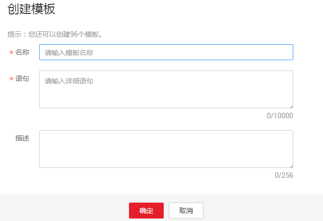
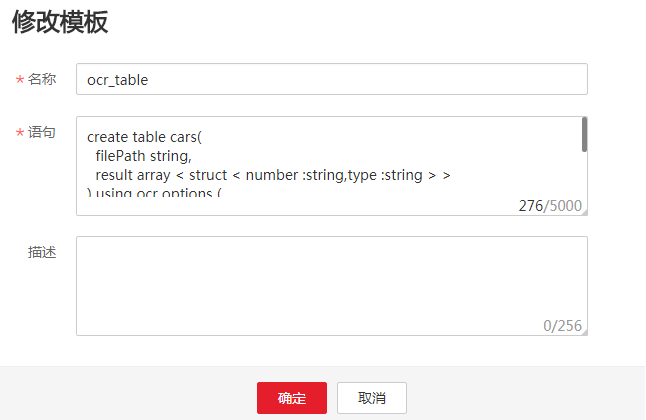

# SQL模板管理

## 操作场景

为了便捷快速的执行SQL操作，DLI支持定制模板或将正在使用的SQL语句保存为模板。保存模板后，不需编写SQL语句，可通过模板直接执行SQL操作。

## 创建模板

创建模板的操作入口有两个，分别在“作业编辑器“和“模板管理“页面。

-   在“作业编辑器“页面创建模板。
    1.  在DLI管理控制台的顶部菜单栏中，选择“作业编辑器“。
    2.  单击SQL作业编辑窗口右上方的，选择“设为模板”，可将编辑窗口中的SQL语句设置为模板。

        **图 1**  创建模板  
        

        输入模板名称和描述信息，详细介绍请参见[表1](#table8760202135313)。 

        **表 1**  参数说明

        
        <table><thead align="left"><tr id="row1175916216534"><th class="cellrowborder" valign="top" width="21%" id="mcps1.2.3.1.1">
参数名称

        </th>
        <th class="cellrowborder" valign="top" width="79%" id="mcps1.2.3.1.2">
描述

        </th>
        </tr>
        </thead>
        <tbody><tr id="row1776092113537"><td class="cellrowborder" valign="top" width="21%" headers="mcps1.2.3.1.1 ">
名称

        </td>
        <td class="cellrowborder" valign="top" width="79%" headers="mcps1.2.3.1.2 ">
模板名称。

        <ul id="ul176014214537"><li>模板名称只能包含数字、英文字母和下划线，但不能是纯数字，不能以下划线开头，且不能为空。</li><li>输入长度不能超过50个字符。</li></ul>
        </td>
        </tr>
        <tr id="row8760122115310"><td class="cellrowborder" valign="top" width="21%" headers="mcps1.2.3.1.1 ">
描述

        </td>
        <td class="cellrowborder" valign="top" width="79%" headers="mcps1.2.3.1.2 ">
该模板的相应描述。

        </td>
        </tr>
        </tbody>
        </table>

    3.  单击“确定“，完成模板创建。

-   在“模板管理“页面创建模板。
    1.  在DLI管理控制台的顶部菜单栏中，选择“模板管理“。
    2.  在“模板管理“页面，单击创建模板。

        输入模板名称和描述信息，详细参数介绍请参见[表1](#table8760202135313)。

    3.  单击“确定“，完成模板创建。

## 执行模板

执行模板的操作入口有两个，分别在“作业编辑器“和“模板管理“页面。

-   通过“作业编辑器“页面执行模板。
    1.  在DLI管理控制台的顶部菜单栏中，选择“作业编辑器“。
    2.  单击SQL作业编辑窗口右上方的，选择“选择模板“。
    3.  在选择模板对话框中单击对应的SQL语句模板，其将自动输入SQL作业编辑窗口。
    4.  单击运行SQL语句，执行结束后，可以在“执行结果“窗口中查看执行结果。

-   通过“模板管理“页面执行模板。
    1.  在DLI管理控制台的顶部菜单栏中，选择“模板管理“。
    2.  在“模板管理“页面，勾选相应的模板，单击“操作“列的“执行“，将跳转至“作业编辑器“页面，并在SQL作业编辑窗口中自动输入对应的SQL语句。
    3.  在SQL作业编辑窗口右上方，单击运行SQL语句，执行结束后，可以在“执行结果“窗口中查看执行结果。

## 查找模板

在“模板管理“页面，可在搜索框中输入模板名称关键字，查找与之匹配的模板。

## 修改模板

1.  在“模板管理“页面，选中需修改的模板，单击“操作“列的“修改“。
2.  在弹出的“修改模板“对话框中，根据需要修改模板的信息。如[图2](#fig184448122429)所示。

    **图 2**  修改模板  
    

3.  单击“确定“，保存修改结果。

## 删除模板

在“模板管理“页面，勾选一个或多个待删除的模板，单击，可删除选中的模板。

