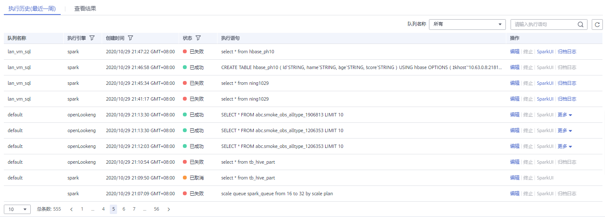

# SQL编辑器<a name="dli_01_0320"></a>

SQL作业编辑器支持使用SQL语句执行数据查询操作。支持SQL2003，兼容SparkSQL，详细语法描述请参见[《数据湖探索SQL语法参考》](https://support.huaweicloud.com/sqlreference-dli/dli_08_0001.html)。

在总览页面，单击左侧导航栏中的“SQL编辑器”或SQL作业简介右上角的“创建作业”，可进入“SQL编辑器”页面。

进入SQL编辑器，页面会提示系统将创建DLI临时数据桶。该桶用于存储使用DLI服务产生的临时数据，例如：作业日志、作业结果等。如果不创建该桶，将无法查看作业日志。可以通过[配置生命周期规则](https://support.huaweicloud.com/usermanual-obs/obs_03_0335.html)，实现定时删除OBS桶中的对象或者定时转换对象的存储类别。桶名称为系统默认。

如果不需要创建DLI临时数据桶，并且希望不再收到该提示，可以勾选“下次不再提示”并单击“取消“。

“SQL编辑器“页面中的区域和按键功能介绍如下：

## 导航栏<a name="zh-cn_topic_0093946815_section56922894165137"></a>

页面左侧的导航栏包括“库表”列表和“队列”列表，说明如下。

**图 1**  SQL作业导航栏<a name="fig452563612140"></a>  


**表 1**  导航栏按键说明

<a name="table1357419814715"></a>
<table><thead align="left"><tr id="row105761087712"><th class="cellrowborder" valign="top" width="7.219278072192781%" id="mcps1.2.5.1.1"><p id="p1545152013421"><a name="p1545152013421"></a><a name="p1545152013421"></a>序号</p>
</th>
<th class="cellrowborder" valign="top" width="12.068793120687932%" id="mcps1.2.5.1.2"><p id="p6536192015152"><a name="p6536192015152"></a><a name="p6536192015152"></a>页签/按键</p>
</th>
<th class="cellrowborder" valign="top" width="13.368663133686635%" id="mcps1.2.5.1.3"><p id="p13367259163218"><a name="p13367259163218"></a><a name="p13367259163218"></a>页签/按键名称</p>
</th>
<th class="cellrowborder" valign="top" width="67.34326567343265%" id="mcps1.2.5.1.4"><p id="p5539122041514"><a name="p5539122041514"></a><a name="p5539122041514"></a>描述</p>
</th>
</tr>
</thead>
<tbody><tr id="row5510457102015"><td class="cellrowborder" valign="top" width="7.219278072192781%" headers="mcps1.2.5.1.1 "><p id="p0545142084214"><a name="p0545142084214"></a><a name="p0545142084214"></a>1</p>
</td>
<td class="cellrowborder" valign="top" width="12.068793120687932%" headers="mcps1.2.5.1.2 "><p id="p451112576203"><a name="p451112576203"></a><a name="p451112576203"></a><a name="image4618185015428"></a><a name="image4618185015428"></a><span></span></p>
</td>
<td class="cellrowborder" valign="top" width="13.368663133686635%" headers="mcps1.2.5.1.3 "><p id="p7367105953210"><a name="p7367105953210"></a><a name="p7367105953210"></a>库表</p>
</td>
<td class="cellrowborder" valign="top" width="67.34326567343265%" headers="mcps1.2.5.1.4 "><p id="p75761589710"><a name="p75761589710"></a><a name="p75761589710"></a>显示已有的数据库及其下所有的表。</p>
<a name="ul10186152210479"></a><a name="ul10186152210479"></a><ul id="ul10186152210479"><li>单击数据库名，将显示该数据库中的表。</li><li>单击表名，将在表名下显示该表中的元数据，最多可显示20个元数据。</li><li>双击表名，将在作业编辑窗口自动输入SQL查询语句。</li></ul>
</td>
</tr>
<tr id="row0576181717"><td class="cellrowborder" valign="top" width="7.219278072192781%" headers="mcps1.2.5.1.1 "><p id="p754512016421"><a name="p754512016421"></a><a name="p754512016421"></a>2</p>
</td>
<td class="cellrowborder" valign="top" width="12.068793120687932%" headers="mcps1.2.5.1.2 "><p id="p2576081473"><a name="p2576081473"></a><a name="p2576081473"></a><a name="image6365175412431"></a><a name="image6365175412431"></a><span></span></p>
</td>
<td class="cellrowborder" valign="top" width="13.368663133686635%" headers="mcps1.2.5.1.3 "><p id="p536713594324"><a name="p536713594324"></a><a name="p536713594324"></a>队列</p>
</td>
<td class="cellrowborder" valign="top" width="67.34326567343265%" headers="mcps1.2.5.1.4 "><p id="p582103264711"><a name="p582103264711"></a><a name="p582103264711"></a>显示已有的队列。</p>
</td>
</tr>
<tr id="row89791568382"><td class="cellrowborder" valign="top" width="7.219278072192781%" headers="mcps1.2.5.1.1 "><p id="p12980105617385"><a name="p12980105617385"></a><a name="p12980105617385"></a>3</p>
</td>
<td class="cellrowborder" valign="top" width="12.068793120687932%" headers="mcps1.2.5.1.2 "><p id="p18980125617385"><a name="p18980125617385"></a><a name="p18980125617385"></a><a name="image1771165413441"></a><a name="image1771165413441"></a><span></span></p>
</td>
<td class="cellrowborder" valign="top" width="13.368663133686635%" headers="mcps1.2.5.1.3 "><p id="p898035616384"><a name="p898035616384"></a><a name="p898035616384"></a>模板</p>
</td>
<td class="cellrowborder" valign="top" width="67.34326567343265%" headers="mcps1.2.5.1.4 "><p id="p598085615380"><a name="p598085615380"></a><a name="p598085615380"></a>内置的SQL样例模板，目前包含22条标准的TPC-H查询语句。</p>
</td>
</tr>
<tr id="row95761281676"><td class="cellrowborder" valign="top" width="7.219278072192781%" headers="mcps1.2.5.1.1 "><p id="p15545520164216"><a name="p15545520164216"></a><a name="p15545520164216"></a>4</p>
</td>
<td class="cellrowborder" valign="top" width="12.068793120687932%" headers="mcps1.2.5.1.2 "><p id="p17576168971"><a name="p17576168971"></a><a name="p17576168971"></a><a name="image55231147114515"></a><a name="image55231147114515"></a><span></span></p>
</td>
<td class="cellrowborder" valign="top" width="13.368663133686635%" headers="mcps1.2.5.1.3 "><p id="p133671759173212"><a name="p133671759173212"></a><a name="p133671759173212"></a>创建</p>
</td>
<td class="cellrowborder" valign="top" width="67.34326567343265%" headers="mcps1.2.5.1.4 "><p id="p1740318544551"><a name="p1740318544551"></a><a name="p1740318544551"></a>包括创建队列、数据库和表。具体操作请分别参考<a href="创建队列.md">创建队列</a>和<a href="创建数据库和表.md">创建数据库和表</a>。</p>
</td>
</tr>
<tr id="row1857619810717"><td class="cellrowborder" valign="top" width="7.219278072192781%" headers="mcps1.2.5.1.1 "><p id="p1654572011426"><a name="p1654572011426"></a><a name="p1654572011426"></a>5</p>
</td>
<td class="cellrowborder" valign="top" width="12.068793120687932%" headers="mcps1.2.5.1.2 "><p id="p189637104529"><a name="p189637104529"></a><a name="p189637104529"></a><a name="image727244354620"></a><a name="image727244354620"></a><span></span></p>
</td>
<td class="cellrowborder" valign="top" width="13.368663133686635%" headers="mcps1.2.5.1.3 "><p id="p43672059133214"><a name="p43672059133214"></a><a name="p43672059133214"></a>刷新</p>
</td>
<td class="cellrowborder" valign="top" width="67.34326567343265%" headers="mcps1.2.5.1.4 "><p id="p1296341016522"><a name="p1296341016522"></a><a name="p1296341016522"></a>包括刷新已有的队列、数据库和表列表。</p>
</td>
</tr>
<tr id="row49051511201819"><td class="cellrowborder" valign="top" width="7.219278072192781%" headers="mcps1.2.5.1.1 "><p id="p390641115180"><a name="p390641115180"></a><a name="p390641115180"></a>6</p>
</td>
<td class="cellrowborder" valign="top" width="12.068793120687932%" headers="mcps1.2.5.1.2 "><p id="p169061411101816"><a name="p169061411101816"></a><a name="p169061411101816"></a><a name="image27384114714"></a><a name="image27384114714"></a><span></span></p>
</td>
<td class="cellrowborder" valign="top" width="13.368663133686635%" headers="mcps1.2.5.1.3 "><p id="p53681595329"><a name="p53681595329"></a><a name="p53681595329"></a>搜索</p>
</td>
<td class="cellrowborder" valign="top" width="67.34326567343265%" headers="mcps1.2.5.1.4 "><p id="p890618114180"><a name="p890618114180"></a><a name="p890618114180"></a>可输入关键字查找对应的数据库和表。</p>
</td>
</tr>
</tbody>
</table>

## SQL作业编辑窗口<a name="section1643344184212"></a>

页面右侧上方为SQL作业编辑窗口，按照从上至下，从左至右的顺序，说明如下。

**图 2**  SQL作业编辑窗口<a name="fig12259471592"></a>  


**表 2**  SQL作业编辑窗口说明

<a name="table18913103220552"></a>
<table><thead align="left"><tr id="row169141932105516"><th class="cellrowborder" valign="top" width="6.297029702970297%" id="mcps1.2.4.1.1"><p id="p233145451119"><a name="p233145451119"></a><a name="p233145451119"></a>序号</p>
</th>
<th class="cellrowborder" valign="top" width="16.33663366336634%" id="mcps1.2.4.1.2"><p id="p660634117106"><a name="p660634117106"></a><a name="p660634117106"></a>按键</p>
</th>
<th class="cellrowborder" valign="top" width="77.36633663366337%" id="mcps1.2.4.1.3"><p id="p1161019414106"><a name="p1161019414106"></a><a name="p1161019414106"></a>描述</p>
</th>
</tr>
</thead>
<tbody><tr id="row14147104075715"><td class="cellrowborder" valign="top" width="6.297029702970297%" headers="mcps1.2.4.1.1 "><p id="p93385451112"><a name="p93385451112"></a><a name="p93385451112"></a>1</p>
</td>
<td class="cellrowborder" valign="top" width="16.33663366336634%" headers="mcps1.2.4.1.2 "><p id="p1214718400577"><a name="p1214718400577"></a><a name="p1214718400577"></a>执行引擎</p>
</td>
<td class="cellrowborder" valign="top" width="77.36633663366337%" headers="mcps1.2.4.1.3 "><p id="p163765475813"><a name="p163765475813"></a><a name="p163765475813"></a>SQL作业支持spark和openLookeng（基于Apache Presto）两种引擎：</p>
<a name="ul12895716185919"></a><a name="ul12895716185919"></a><ul id="ul12895716185919"><li>spark引擎适用于离线分析。</li><li>openLookeng引擎适用于交互式分析，当前仅支持default队列以及查询hive表。</li></ul>
</td>
</tr>
<tr id="row1591463215551"><td class="cellrowborder" valign="top" width="6.297029702970297%" headers="mcps1.2.4.1.1 "><p id="p1233654161115"><a name="p1233654161115"></a><a name="p1233654161115"></a>2</p>
</td>
<td class="cellrowborder" valign="top" width="16.33663366336634%" headers="mcps1.2.4.1.2 "><p id="zh-cn_topic_0093946815_p42476751171120"><a name="zh-cn_topic_0093946815_p42476751171120"></a><a name="zh-cn_topic_0093946815_p42476751171120"></a>队列</p>
</td>
<td class="cellrowborder" valign="top" width="77.36633663366337%" headers="mcps1.2.4.1.3 "><p id="p1045411185210"><a name="p1045411185210"></a><a name="p1045411185210"></a>下拉选择需要使用的队列。如果没有可用队列，此处显示“请选择队列”，请先创建队列。</p>
</td>
</tr>
<tr id="row79141324554"><td class="cellrowborder" valign="top" width="6.297029702970297%" headers="mcps1.2.4.1.1 "><p id="p73375471110"><a name="p73375471110"></a><a name="p73375471110"></a>3</p>
</td>
<td class="cellrowborder" valign="top" width="16.33663366336634%" headers="mcps1.2.4.1.2 "><p id="zh-cn_topic_0093946815_p15920355171120"><a name="zh-cn_topic_0093946815_p15920355171120"></a><a name="zh-cn_topic_0093946815_p15920355171120"></a>数据库</p>
</td>
<td class="cellrowborder" valign="top" width="77.36633663366337%" headers="mcps1.2.4.1.3 "><p id="zh-cn_topic_0093946815_p14480403171120"><a name="zh-cn_topic_0093946815_p14480403171120"></a><a name="zh-cn_topic_0093946815_p14480403171120"></a>下拉选择需要使用的数据库。如果没有可用数据库，此处显示“请选择数据库”，请先创建数据库。</p>
<div class="note" id="note163344794910"><a name="note163344794910"></a><a name="note163344794910"></a><span class="notetitle"> 说明： </span><div class="notebody"><p id="p563324794919"><a name="p563324794919"></a><a name="p563324794919"></a>如果SQL语句中指定了表所在的数据库，则此处选择的数据库无效。</p>
</div></div>
</td>
</tr>
<tr id="row79148327558"><td class="cellrowborder" valign="top" width="6.297029702970297%" headers="mcps1.2.4.1.1 "><p id="p163325401111"><a name="p163325401111"></a><a name="p163325401111"></a>4</p>
</td>
<td class="cellrowborder" valign="top" width="16.33663366336634%" headers="mcps1.2.4.1.2 "><p id="zh-cn_topic_0093946815_p20122653171120"><a name="zh-cn_topic_0093946815_p20122653171120"></a><a name="zh-cn_topic_0093946815_p20122653171120"></a>执行</p>
</td>
<td class="cellrowborder" valign="top" width="77.36633663366337%" headers="mcps1.2.4.1.3 "><p id="zh-cn_topic_0093946815_p19322157171120"><a name="zh-cn_topic_0093946815_p19322157171120"></a><a name="zh-cn_topic_0093946815_p19322157171120"></a>执行作业编辑窗口中的SQL语句。</p>
</td>
</tr>
<tr id="row591433295513"><td class="cellrowborder" valign="top" width="6.297029702970297%" headers="mcps1.2.4.1.1 "><p id="p11510146522"><a name="p11510146522"></a><a name="p11510146522"></a>5</p>
</td>
<td class="cellrowborder" valign="top" width="16.33663366336634%" headers="mcps1.2.4.1.2 "><p id="zh-cn_topic_0093946815_p10118717157"><a name="zh-cn_topic_0093946815_p10118717157"></a><a name="zh-cn_topic_0093946815_p10118717157"></a>格式化</p>
</td>
<td class="cellrowborder" valign="top" width="77.36633663366337%" headers="mcps1.2.4.1.3 "><p id="zh-cn_topic_0093946815_p819621917157"><a name="zh-cn_topic_0093946815_p819621917157"></a><a name="zh-cn_topic_0093946815_p819621917157"></a>格式化SQL语句。</p>
</td>
</tr>
<tr id="row121419147521"><td class="cellrowborder" valign="top" width="6.297029702970297%" headers="mcps1.2.4.1.1 "><p id="p1600115118227"><a name="p1600115118227"></a><a name="p1600115118227"></a>6</p>
</td>
<td class="cellrowborder" valign="top" width="16.33663366336634%" headers="mcps1.2.4.1.2 "><p id="p1715141418529"><a name="p1715141418529"></a><a name="p1715141418529"></a>语法参考</p>
</td>
<td class="cellrowborder" valign="top" width="77.36633663366337%" headers="mcps1.2.4.1.3 "><p id="p515161410521"><a name="p515161410521"></a><a name="p515161410521"></a>可跳转至《数据湖探索SQL语法参考》手册。</p>
</td>
</tr>
<tr id="row17600951132211"><td class="cellrowborder" valign="top" width="6.297029702970297%" headers="mcps1.2.4.1.1 "><p id="p1933175491115"><a name="p1933175491115"></a><a name="p1933175491115"></a>7</p>
</td>
<td class="cellrowborder" valign="top" width="16.33663366336634%" headers="mcps1.2.4.1.2 "><p id="p14722170162310"><a name="p14722170162310"></a><a name="p14722170162310"></a>设置</p>
</td>
<td class="cellrowborder" valign="top" width="77.36633663366337%" headers="mcps1.2.4.1.3 "><p id="p14485154542713"><a name="p14485154542713"></a><a name="p14485154542713"></a>包括设置“配置项”和“标签”。</p>
<p id="p78072442815"><a name="p78072442815"></a><a name="p78072442815"></a>配置项：以“key/value”的形式设置提交SQL作业的配置项。详细内容请参见《<a href="https://support.huaweicloud.com/sqlreference-dli/dli_08_0266.html" target="_blank" rel="noopener noreferrer">数据湖探索SQL语法参考</a>》。最多可设置10个属性。</p>
<p id="p4851133818289"><a name="p4851133818289"></a><a name="p4851133818289"></a>标签：以“key/value”的形式设置SQL作业的标签。</p>
</td>
</tr>
<tr id="row1791418324558"><td class="cellrowborder" valign="top" width="6.297029702970297%" headers="mcps1.2.4.1.1 "><p id="p1336311522179"><a name="p1336311522179"></a><a name="p1336311522179"></a>8</p>
</td>
<td class="cellrowborder" valign="top" width="16.33663366336634%" headers="mcps1.2.4.1.2 "><p id="zh-cn_topic_0093946815_p60099992171120"><a name="zh-cn_topic_0093946815_p60099992171120"></a><a name="zh-cn_topic_0093946815_p60099992171120"></a>更多</p>
</td>
<td class="cellrowborder" valign="top" width="77.36633663366337%" headers="mcps1.2.4.1.3 "><p id="zh-cn_topic_0093946815_p36261170171120"><a name="zh-cn_topic_0093946815_p36261170171120"></a><a name="zh-cn_topic_0093946815_p36261170171120"></a>包括：</p>
<a name="ul59151629162312"></a><a name="ul59151629162312"></a><ul id="ul59151629162312"><li>语法校验：判断SQL语句编写是否正确。</li><li>设为模板：将常用的SQL语句设为模板。具体操作请参见<a href="SQL模板管理.md">SQL模板管理</a>。</li><li>选择模板：选择已保存为模板的SQL语句。</li><li>切换主题：选择白底黑字或黑底白字。</li></ul>
</td>
</tr>
<tr id="row123633527176"><td class="cellrowborder" valign="top" width="6.297029702970297%" headers="mcps1.2.4.1.1 "><p id="p3334540115"><a name="p3334540115"></a><a name="p3334540115"></a>9</p>
</td>
<td class="cellrowborder" valign="top" width="16.33663366336634%" headers="mcps1.2.4.1.2 "><p id="p16364552131720"><a name="p16364552131720"></a><a name="p16364552131720"></a>SQL语句编辑区</p>
</td>
<td class="cellrowborder" valign="top" width="77.36633663366337%" headers="mcps1.2.4.1.3 "><p id="p4364952131716"><a name="p4364952131716"></a><a name="p4364952131716"></a>编辑SQL语句的区域。</p>
</td>
</tr>
<tr id="row102037812149"><td class="cellrowborder" valign="top" width="6.297029702970297%" headers="mcps1.2.4.1.1 "><p id="p1133175471115"><a name="p1133175471115"></a><a name="p1133175471115"></a>10</p>
</td>
<td class="cellrowborder" valign="top" width="16.33663366336634%" headers="mcps1.2.4.1.2 "><p id="p1920319815141"><a name="p1920319815141"></a><a name="p1920319815141"></a>光标位置</p>
</td>
<td class="cellrowborder" valign="top" width="77.36633663366337%" headers="mcps1.2.4.1.3 "><p id="p1420316811418"><a name="p1420316811418"></a><a name="p1420316811418"></a>标识光标在SQL语句编辑区中的位置（行，列）。</p>
</td>
</tr>
<tr id="row52031287149"><td class="cellrowborder" valign="top" width="6.297029702970297%" headers="mcps1.2.4.1.1 "><p id="p956211284192"><a name="p956211284192"></a><a name="p956211284192"></a>11</p>
</td>
<td class="cellrowborder" valign="top" width="16.33663366336634%" headers="mcps1.2.4.1.2 "><p id="p414053541419"><a name="p414053541419"></a><a name="p414053541419"></a>快捷键</p>
</td>
<td class="cellrowborder" valign="top" width="77.36633663366337%" headers="mcps1.2.4.1.3 "><p id="p142031189146"><a name="p142031189146"></a><a name="p142031189146"></a>快捷键介绍具体请参考<a href="#table209301155311">表3</a>。</p>
</td>
</tr>
</tbody>
</table>

**表 3**  快捷键说明

<a name="table209301155311"></a>
<table><thead align="left"><tr id="row3931151518319"><th class="cellrowborder" valign="top" width="22.759999999999998%" id="mcps1.2.3.1.1"><p id="p49315151839"><a name="p49315151839"></a><a name="p49315151839"></a>快捷键</p>
</th>
<th class="cellrowborder" valign="top" width="77.24%" id="mcps1.2.3.1.2"><p id="p119313159314"><a name="p119313159314"></a><a name="p119313159314"></a>描述</p>
</th>
</tr>
</thead>
<tbody><tr id="row119311915038"><td class="cellrowborder" valign="top" width="22.759999999999998%" headers="mcps1.2.3.1.1 "><p id="p1393131514314"><a name="p1393131514314"></a><a name="p1393131514314"></a>Ctrl+Enter</p>
</td>
<td class="cellrowborder" valign="top" width="77.24%" headers="mcps1.2.3.1.2 "><p id="p15931161514320"><a name="p15931161514320"></a><a name="p15931161514320"></a>执行SQL。通过按下键盘上的Ctrl+R或Ctrl + Enter，您可以执行SQL语句。</p>
</td>
</tr>
<tr id="row1793118157315"><td class="cellrowborder" valign="top" width="22.759999999999998%" headers="mcps1.2.3.1.1 "><p id="p093181512318"><a name="p093181512318"></a><a name="p093181512318"></a>Ctrl+F</p>
</td>
<td class="cellrowborder" valign="top" width="77.24%" headers="mcps1.2.3.1.2 "><p id="p179321615337"><a name="p179321615337"></a><a name="p179321615337"></a>搜索SQL。通过按下键盘上的Ctrl + F，您可以搜索需要的SQL语句。</p>
</td>
</tr>
<tr id="row175095184542"><td class="cellrowborder" valign="top" width="22.759999999999998%" headers="mcps1.2.3.1.1 "><p id="p1050914180548"><a name="p1050914180548"></a><a name="p1050914180548"></a>Shift+Alt+F</p>
</td>
<td class="cellrowborder" valign="top" width="77.24%" headers="mcps1.2.3.1.2 "><p id="p1951021816540"><a name="p1951021816540"></a><a name="p1951021816540"></a>格式化SQL。通过按下键盘上的Shift+Alt+F，您可以将SQL语句格式化。</p>
</td>
</tr>
<tr id="row19751851161216"><td class="cellrowborder" valign="top" width="22.759999999999998%" headers="mcps1.2.3.1.1 "><p id="p1977172910156"><a name="p1977172910156"></a><a name="p1977172910156"></a>Ctrl+Q</p>
</td>
<td class="cellrowborder" valign="top" width="77.24%" headers="mcps1.2.3.1.2 "><p id="p1977152921516"><a name="p1977152921516"></a><a name="p1977152921516"></a>语法校验。通过按下键盘上的Ctrl + Q，您可以对SQL语句进行语法校验。</p>
</td>
</tr>
<tr id="row10251103142919"><td class="cellrowborder" valign="top" width="22.759999999999998%" headers="mcps1.2.3.1.1 "><p id="p172521317293"><a name="p172521317293"></a><a name="p172521317293"></a>F11</p>
</td>
<td class="cellrowborder" valign="top" width="77.24%" headers="mcps1.2.3.1.2 "><p id="p16252231112914"><a name="p16252231112914"></a><a name="p16252231112914"></a>全屏。通过按下键盘上的F11，您可将SQL作业编辑器窗口全屏。再次按下F11，将从全屏复原。</p>
</td>
</tr>
</tbody>
</table>

## “执行历史”和“查看结果”<a name="section1349425519436"></a>

页面右侧下方为SQL作业“执行历史（最近一周）”页签和“查看结果”页签，说明如下。

-   执行历史

    **图 3**  SQL作业执行历史<a name="fig20565174552915"></a>  
    

    **表 4**  SQL作业执行历史说明

    <a name="table1326105014228"></a>
    <table><thead align="left"><tr id="row72623501226"><th class="cellrowborder" valign="top" width="22.84%" id="mcps1.2.3.1.1"><p id="p14262750172213"><a name="p14262750172213"></a><a name="p14262750172213"></a>区域</p>
    </th>
    <th class="cellrowborder" valign="top" width="77.16%" id="mcps1.2.3.1.2"><p id="p72631250142216"><a name="p72631250142216"></a><a name="p72631250142216"></a>描述</p>
    </th>
    </tr>
    </thead>
    <tbody><tr id="row182641050102219"><td class="cellrowborder" valign="top" width="22.84%" headers="mcps1.2.3.1.1 "><p id="p22643505228"><a name="p22643505228"></a><a name="p22643505228"></a>执行历史（最近一周）</p>
    </td>
    <td class="cellrowborder" valign="top" width="77.16%" headers="mcps1.2.3.1.2 "><div class="p" id="p197425215379"><a name="p197425215379"></a><a name="p197425215379"></a>执行历史（最近一周）：显示最近一周提交的作业的信息。包括：<a name="ul18264135092218"></a><a name="ul18264135092218"></a><ul id="ul18264135092218"><li>队列名称</li><li>执行引擎（目前只有上海一支持该功能）</li><li>创建时间</li><li>状态</li><li>执行语句</li><li>操作：<a name="ul178563823013"></a><a name="ul178563823013"></a><ul id="ul178563823013"><li>编辑：重新编辑SQL语句</li><li>终止：停止执行SQL语句</li><li>SparkUI：跳转至SparkUI查看SQL语句执行进程<div class="note" id="note151024818191"><a name="note151024818191"></a><a name="note151024818191"></a><span class="notetitle"> 说明： </span><div class="notebody"><p id="p181031586197"><a name="p181031586197"></a><a name="p181031586197"></a>新建队列，运行作业时会重新拉集群，大概需要10分钟左右才能拉好集群，在集群创建好之前单击SparkUI会导致缓存空的projectID，从而导致无法查看SparkUI。建议使用专属队列，集群不会被释放，就不会有该问题，或者提交作业后等一段时间再查看SparkUI，确保集群已经拉好了，不要立即单击SparkUI。</p>
    <p id="p12382173531617"><a name="p12382173531617"></a><a name="p12382173531617"></a>目前DLI配置SparkUI只展示最新的100条作业信息。</p>
    </div></div>
    </li><li>导出日志：导出SQL语句运行日志</li><li>异步DDL和QUERY语句支持将结果下载到本地</li></ul>
    </li></ul>
    </div>
    </td>
    </tr>
    </tbody>
    </table>

    异步DDL和QUERY语句支持将结果下载到本地。操作如下：

    1.  单击执行成功的异步DDL或QUERY语句“操作”列中的“下载到本地”，在提示窗口单击“确认”。此时，“操作”列中的“下载到本地”将变为“立即下载”。

        

    2.  单击“立即下载”，将对应结果下载到本地。

    可以通过以下方式筛选执行历史：

    -   在右上角选择队列名称或输入执行语句
    -   在列表中选择创建时间顺序/倒序排列
    -   在列表中选择作业状态


-   查看结果

    **图 4**  SQL作业查看结果<a name="fig262581715111"></a>  
    

    **表 5**  SQL作业查看结果说明

    <a name="table191717406376"></a>
    <table><thead align="left"><tr id="row1517115405378"><th class="cellrowborder" valign="top" width="6.856695072974826%" id="mcps1.2.4.1.1"><p id="p193410351747"><a name="p193410351747"></a><a name="p193410351747"></a>序号</p>
    </th>
    <th class="cellrowborder" valign="top" width="22.17651092173572%" id="mcps1.2.4.1.2"><p id="p9265164803810"><a name="p9265164803810"></a><a name="p9265164803810"></a>按键</p>
    </th>
    <th class="cellrowborder" valign="top" width="70.96679400528944%" id="mcps1.2.4.1.3"><p id="p15268114814387"><a name="p15268114814387"></a><a name="p15268114814387"></a>描述</p>
    </th>
    </tr>
    </thead>
    <tbody><tr id="row156221643340"><td class="cellrowborder" valign="top" width="6.856695072974826%" headers="mcps1.2.4.1.1 "><p id="p66224431446"><a name="p66224431446"></a><a name="p66224431446"></a>1</p>
    </td>
    <td class="cellrowborder" valign="top" width="22.17651092173572%" headers="mcps1.2.4.1.2 "><p id="p196237436410"><a name="p196237436410"></a><a name="p196237436410"></a>清空</p>
    </td>
    <td class="cellrowborder" valign="top" width="70.96679400528944%" headers="mcps1.2.4.1.3 "><p id="p26239431643"><a name="p26239431643"></a><a name="p26239431643"></a>清空显示的SQL语句执行结果。</p>
    </td>
    </tr>
    <tr id="row6171164015374"><td class="cellrowborder" valign="top" width="6.856695072974826%" headers="mcps1.2.4.1.1 "><p id="p143417351841"><a name="p143417351841"></a><a name="p143417351841"></a>2</p>
    </td>
    <td class="cellrowborder" valign="top" width="22.17651092173572%" headers="mcps1.2.4.1.2 "><p id="p171584213411"><a name="p171584213411"></a><a name="p171584213411"></a>结果图形化/表格展示</p>
    </td>
    <td class="cellrowborder" valign="top" width="70.96679400528944%" headers="mcps1.2.4.1.3 "><p id="p6715114283415"><a name="p6715114283415"></a><a name="p6715114283415"></a>以图形/表格的形式展示查询结果。</p>
    </td>
    </tr>
    <tr id="row21719402371"><td class="cellrowborder" valign="top" width="6.856695072974826%" headers="mcps1.2.4.1.1 "><p id="p1434183515413"><a name="p1434183515413"></a><a name="p1434183515413"></a>3</p>
    </td>
    <td class="cellrowborder" valign="top" width="22.17651092173572%" headers="mcps1.2.4.1.2 "><p id="zh-cn_topic_0093946815_p31901983172641"><a name="zh-cn_topic_0093946815_p31901983172641"></a><a name="zh-cn_topic_0093946815_p31901983172641"></a>导出结果</p>
    </td>
    <td class="cellrowborder" valign="top" width="70.96679400528944%" headers="mcps1.2.4.1.3 "><p id="zh-cn_topic_0093946815_p33923791172641"><a name="zh-cn_topic_0093946815_p33923791172641"></a><a name="zh-cn_topic_0093946815_p33923791172641"></a>将查询结果导出到OBS。具体操作介绍请参考<a href="SQL作业管理.md#section1152211221244">导出查询结果</a>。</p>
    </td>
    </tr>
    </tbody>
    </table>


## SQL查询操作步骤<a name="zh-cn_topic_0093946815_section6030699152035"></a>

1.  登录数据湖探索管理控制台，选择SQL作业，单击“创建作业”，进入“SQL编辑器“页面。
2.  进入“SQL编辑器“页面后，系统会提示“创建DLI临时数据桶”，用于存储使用DLI服务产生的临时数据，如：作业日志、作业结果。如果不创建该桶，您将无法查看作业日志。单击“确定”。系统将提示创建临时桶成功。
3.  在SQL作业编辑窗口右上方的“队列”列表中选择所使用的队列。创建队列操作步骤请参见[创建队列](创建队列.md)。

    

4.  在SQL作业编辑窗口右上方的“数据库”列表中选择所使用的数据库，例如选择数据库“qw“。
5.  创建表，例如表名为“qw”。创建数据库和表操作步骤请参见[创建数据库和表](创建数据库和表.md)。
6.  在SQL作业编辑窗口输入表“qw”的SQL查询语句：

    ```
    SELECT * FROM qw.qw LIMIT 10;
    ```

    或者双击左侧表名“qw”，上述查询语句会自动在作业编辑窗口中输入。

7.  单击“更多”中的“语法校验“，确认SQL语句书写是否正确。

    1.  若语法校验失败，请参考[《数据湖探索SQL语法参考》](https://support.huaweicloud.com/sqlreference-dli/dli_08_0002.html)，检查SQL语句准确性。
    2.  若语法校验通过，单击“执行”，阅读并同意隐私协议，单击“确定”后执行SQL语句。
    3.  SQL语句执行成功后，在SQL作业编辑窗口下方会显示执行结果。

    > **说明：** 
    >当作业编辑窗口没有输入SQL语句时，单击“执行”按钮会提示“请先输入执行语句”。

8.  （可选）在查看结果页签，单击右上侧“结果图形化”，查询结果将以图形形式呈现。再单击“表格展示”，查询结果可切换回表格形式。

    > **说明：** 
    >-   若执行结果中无数值列，则无法进行图形化。
    >-   图形类型包括柱状图、折线图、扇形图。
    >-   柱状图和折线图的X轴可为任意一列，Y轴仅支持数值类型的列，扇形图对应图例和指标。


## 作业编辑窗口操作技巧<a name="zh-cn_topic_0093946815_section6563159171817"></a>

-   在SQL作业编辑窗口中导入SQL语句的简便方法
    -   可以双击左侧导航栏列表中的表名，即可将选定表的查询语句导入SQL语句编辑窗口中，单击“执行”，即可完成查询。
    -   可以将表名、列名直接拖拽入作业编辑窗口中，编写SQL语句。
    -   可以通过单击“更多”，选择“设为模板”，将对应的SQL语句保存为模板，供将来执行使用。

        需要使用时，通过单击“更多”，选择“选择模板”，在已有模板中双击所需的SQL语句，导入SQL作业编辑窗口中，单击“执行”，或根据需要进行修改后执行。

        

    -   可以批量执行SQL语句。

-   作业编辑窗口的特点

    作业编辑窗口具有以下三个特点。

    -   颜色突出显示 - 常用语法采用不同颜色突出显示。
    -   注释支持 - 支持单行注释和多行注释。以“--”开头，后续内容即为注释。
    -   光标位置显示 - 可以用于确认位于作业编辑窗口内的鼠标光标的列号和行号。


