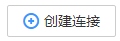
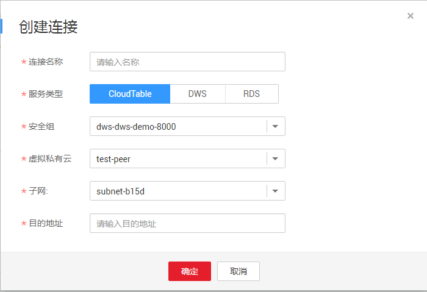
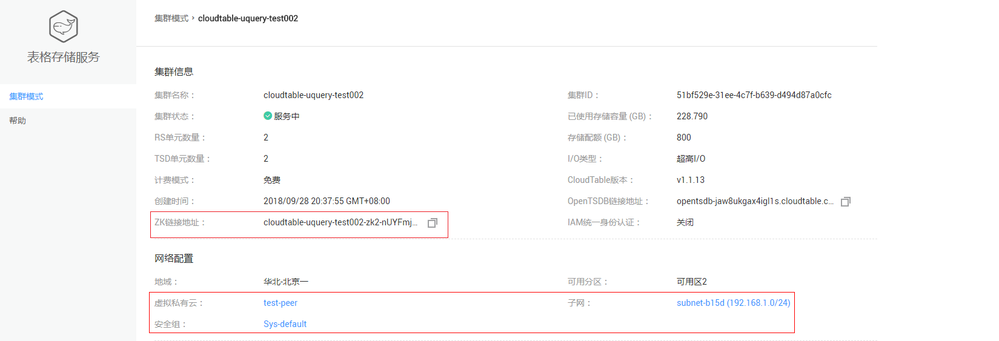

# SQL跨源连接

## 操作场景

DLI SQL跨源连接可用于访问CloudTable，DWS，RDS等其他数据源。具体的SQL语法参考请参考[CloudTable表](https://support.huaweicloud.com/sqlreference-dli/dli_08_0119.html)，[DWS表](https://support.huaweicloud.com/sqlreference-dli/dli_08_0192.html)和[RDS表](https://support.huaweicloud.com/sqlreference-dli/dli_08_0196.html)。

## 连接列表

连接列表显示创建的所有跨源连接，连接数量较多时，系统分页显示。

**表 1**  SQL跨源连接列表参数

<table><thead align="left"><tr id="row2555468715120"><th class="cellrowborder" valign="top" width="21.18%" id="mcps1.2.3.1.1">
参数

</th>
<th class="cellrowborder" valign="top" width="78.82000000000001%" id="mcps1.2.3.1.2">
参数说明

</th>
</tr>
</thead>
<tbody><tr id="row46758327132"><td class="cellrowborder" valign="top" width="21.18%" headers="mcps1.2.3.1.1 ">
连接名称

</td>
<td class="cellrowborder" valign="top" width="78.82000000000001%" headers="mcps1.2.3.1.2 ">
所创建的跨源连接名称。

<ul id="ul109681518191720"><li>名称只能包含数字、英文字母、下划线和中划线。不能为空。</li><li>输入长度不能超过64个字符。</li></ul>
</td>
</tr>
<tr id="row32873162171713"><td class="cellrowborder" valign="top" width="21.18%" headers="mcps1.2.3.1.1 ">
连接状态

</td>
<td class="cellrowborder" valign="top" width="78.82000000000001%" headers="mcps1.2.3.1.2 ">
跨源连接的状态信息，包括如下三种状态。

<ul id="ul32930526154023"><li>创建中</li><li>已激活</li><li>失败</li></ul>
</td>
</tr>
<tr id="row31011923151038"><td class="cellrowborder" valign="top" width="21.18%" headers="mcps1.2.3.1.1 ">
服务类型

</td>
<td class="cellrowborder" valign="top" width="78.82000000000001%" headers="mcps1.2.3.1.2 ">
目前支持访问三种类型数据源。

<ul id="ul127459715563"><li>表格存储服务 CloudTable</li><li>数据仓库服务 DWS</li><li>关系型数据库 RDS</li></ul>
</td>
</tr>
<tr id="row36301606171658"><td class="cellrowborder" valign="top" width="21.18%" headers="mcps1.2.3.1.1 ">
连接地址

</td>
<td class="cellrowborder" valign="top" width="78.82000000000001%" headers="mcps1.2.3.1.2 ">
使用DLI访问其他数据源的地址。

 说明： 
<ul id="ul18891815103110"><li>跨源链接创建成功后显示连接地址。</li><li>创建CloudTable关联表时，指定连接地址或目的地址均可。</li><li>创建DWS或RD关联表时，只能指定连接地址。</li></ul>

</td>
</tr>
<tr id="row6424839516213"><td class="cellrowborder" valign="top" width="21.18%" headers="mcps1.2.3.1.1 ">
目的地址

</td>
<td class="cellrowborder" valign="top" width="78.82000000000001%" headers="mcps1.2.3.1.2 ">
连接其他数据源的地址。不同服务的地址略有不同。

<ul id="ul67221730122312"><li>表格存储服务 CloudTable：ZK链接地址</li><li>数据仓库服务 DWS：内网IP：端口
 说明： 

DWS有两个内网IP，不能同时使用两个内网IP，任意选择其中一个即可。

</li><li>关系型数据库 RDS：内网地址：数据库端口</li></ul>
</td>
</tr>
<tr id="row2449114254419"><td class="cellrowborder" valign="top" width="21.18%" headers="mcps1.2.3.1.1 ">
创建时间

</td>
<td class="cellrowborder" valign="top" width="78.82000000000001%" headers="mcps1.2.3.1.2 ">
每个连接的创建时间，可按创建时间顺序或倒序显示连接列表。

</td>
</tr>
<tr id="row1883611569448"><td class="cellrowborder" valign="top" width="21.18%" headers="mcps1.2.3.1.1 ">
进度

</td>
<td class="cellrowborder" valign="top" width="78.82000000000001%" headers="mcps1.2.3.1.2 ">
连接创建的进度， 用百分比表示。

</td>
</tr>
<tr id="row1662880815250"><td class="cellrowborder" valign="top" width="21.18%" headers="mcps1.2.3.1.1 ">
操作

</td>
<td class="cellrowborder" valign="top" width="78.82000000000001%" headers="mcps1.2.3.1.2 ">
删除。当连接状态在“创建中”时，连接不可删除。

</td>
</tr>
</tbody>
</table>

## 创建连接

1.  创建需要访问的数据源。例如，需要访问CloudTable数据源，请先在CloudTable服务中购买集群。

    **图 1**  CloudTable购买集群  
    

    如果已有可用集群，可不用重新购买。

2.  在SQL作业的顶部菜单栏中，选择“跨源连接“。
3.  在“跨源连接“页面，单击创建连接。

    输入连接名称，选择服务类型，安全组，虚拟私有云，子网，输入目的地址，详细参数介绍请参见[表2](#table24931148155220)。

    **图 2**  SQL创建连接  
    

    **表 2**  参数说明

    
    <table><thead align="left"><tr id="row1149712486527"><th class="cellrowborder" valign="top" width="15.920000000000002%" id="mcps1.2.3.1.1">
参数

    </th>
    <th class="cellrowborder" valign="top" width="84.08%" id="mcps1.2.3.1.2">
参数说明

    </th>
    </tr>
    </thead>
    <tbody><tr id="row1350324845215"><td class="cellrowborder" valign="top" width="15.920000000000002%" headers="mcps1.2.3.1.1 ">
连接名称

    </td>
    <td class="cellrowborder" valign="top" width="84.08%" headers="mcps1.2.3.1.2 ">
所创建的跨源连接名称。

    <ul id="ul185072486523"><li>名称只能包含数字、英文字母、下划线和中划线。不能为空。</li><li>输入长度不能超过64个字符。</li></ul>
    </td>
    </tr>
    <tr id="row105181748125210"><td class="cellrowborder" valign="top" width="15.920000000000002%" headers="mcps1.2.3.1.1 ">
服务类型

    </td>
    <td class="cellrowborder" valign="top" width="84.08%" headers="mcps1.2.3.1.2 ">
目前支持访问三种类型数据源。

    <ul id="ul25191248185210"><li>表格存储服务 CloudTable</li><li>数据仓库服务 DWS</li><li>关系型数据库 RDS</li></ul>
    </td>
    </tr>
    <tr id="row85241748185212"><td class="cellrowborder" valign="top" width="15.920000000000002%" headers="mcps1.2.3.1.1 ">
安全组

    </td>
    <td class="cellrowborder" valign="top" width="84.08%" headers="mcps1.2.3.1.2 ">
选择对应的安全组信息。不同服务的安全组信息，可在创建对应的服务集群或实例时由系统提供，或查看已有集群或数据库实例信息。请参考<a href="#fig87571359173616">图3</a>。

    </td>
    </tr>
    <tr id="row7764655142317"><td class="cellrowborder" valign="top" width="15.920000000000002%" headers="mcps1.2.3.1.1 ">
虚拟私有云

    </td>
    <td class="cellrowborder" valign="top" width="84.08%" headers="mcps1.2.3.1.2 ">
选择对应的虚拟私有云信息。不同服务的虚拟私有云信息，可在创建对应的服务集群或实例时由系统提供，或查看已有集群或数据库实例信息。请参考<a href="#fig87571359173616">图3</a>。

    </td>
    </tr>
    <tr id="row1095810374248"><td class="cellrowborder" valign="top" width="15.920000000000002%" headers="mcps1.2.3.1.1 ">
子网

    </td>
    <td class="cellrowborder" valign="top" width="84.08%" headers="mcps1.2.3.1.2 ">
选择对应的子网信息。不同服务的子网信息，可在创建对应的服务集群或实例时由系统提供，或查看已有集群或数据库实例信息。请参考<a href="#fig87571359173616">图3</a>。

    </td>
    </tr>
    <tr id="row135261748155213"><td class="cellrowborder" valign="top" width="15.920000000000002%" headers="mcps1.2.3.1.1 ">
目的地址

    </td>
    <td class="cellrowborder" valign="top" width="84.08%" headers="mcps1.2.3.1.2 ">
连接其他数据源的地址。不同服务的地址略有不同。请参考<a href="#fig87571359173616">图3</a>。

    <ul id="ul9527124812520"><li>表格存储服务 CloudTable：ZK链接地址</li><li>数据仓库服务 DWS：内网IP：端口</li><li>关系型数据库 RDS：内网地址：数据库端口</li></ul>
    </td>
    </tr>
    </tbody>
    </table>

    **图 3**  CloudTable集群信息  
    

4.  单击“确定“，完成连接创建。

## 查找连接

在“跨源连接“页面，可在搜索框中输入连接名称关键字，查找与之匹配的连接。

## 查看连接详情

在“跨源连接“页面，选中一条连接，单击该连接对应的，可查看该条连接的详细信息。

包括：连接名称，连接地址，服务类型，连接ID，目的地址，日志详情。

> **说明：**   
>当“连接状态“为“失败“，“日志详情“显示“失败原因“。  

## 删除连接

在“跨源连接“页面，可单击“操作”列的“删除“，删除不需要的连接。

> **说明：**   
>当“连接状态“为“创建中“时，连接不可删除。  

