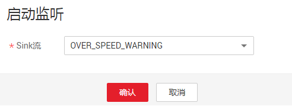
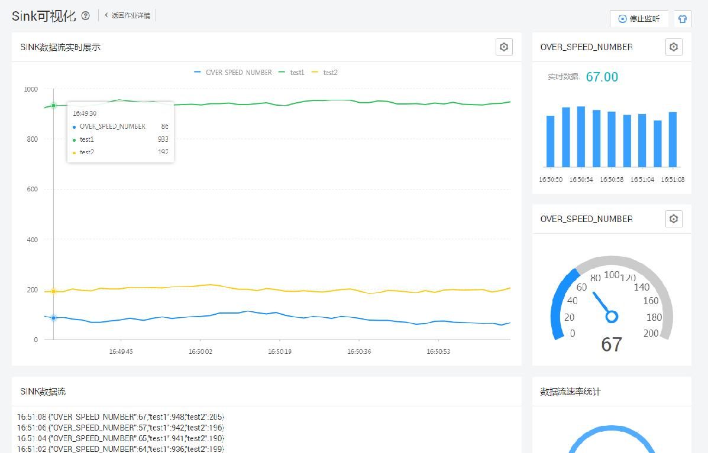
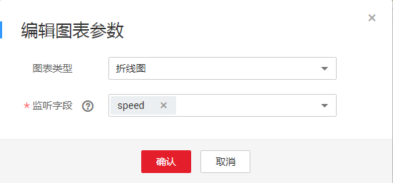

# Sink可视化

Sink可视化是将Sink流中的数据，实时展示出来，其中流中的数字类型的数据可以以图表方式展示。

> **说明：**   
>目前本功能暂时只支持Sink流类型为“apig“的Flink SQL作业类型。如何对接APIG服务，请参见《数据湖探索开发指南》中“APIG输出流“章节。  

## 操作步骤

1.  在DLI管理控制台的左侧导航栏中，单击“作业管理“\>“Flink作业“，进入“Flink作业“页面。
2.  在已运行并支持Sink可视化的Flink SQL作业的“操作”列中，单击“更多 \> Sink可视化“，进入Sink可视化页面。

    也可以单击作业名称，进入“作业详情“页，在页面右上角，单击“Sink可视化“。

3.  在弹出的“启动监听“窗口，根据需求选择需要启动的Sink流。

    **图 1**  启动Sink流  
    

4.  单击“确定“，开始监听数据并以图表的方式进行展示。

    **图 2**  实时数据展示  
    

5.  （可选）单击各图表显示区域右上角，可以编辑图表类型和监听字段。

    **图 3**  编辑图表参数  
    

    -   图表类型暂时支持如下：折线图、柱状图和仪表盘。
    -   监听字段：可以选择Sink流中的数字类型的数据。

6.  （可选）如果用户想停止对数据的监听，可以在Sink可视化页面右上角，单击“停止监听“。

