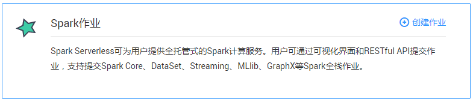
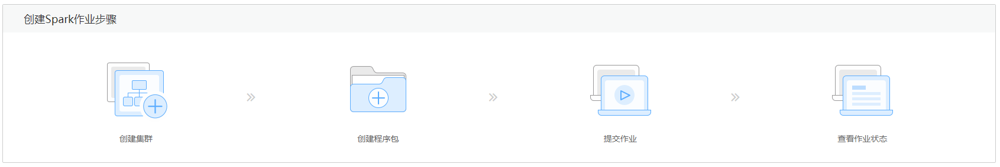

# Spark作业总览

Spark作业页面可为用户提供全托管式的Spark计算服务。用户可以通过可视化界面和Restful API提交计算任务，支持session和batch两种作业，一键创建集群，自动伸缩，无需运维。

> **说明：**   
>Spark集群是一个无状态的集群, 用户创建的逻辑上的集群与实际上的物理集群并不一一对应。因此不推荐用户在内部组件中维持持久化状态, 例如：  
>-   集群之中存有HDFS组件，DLI服务推荐用户将持久化的数据写入到OBS服务之中，将部分缓存文件写入到HDFS。  
>-   当DLI服务后台升级集群的时候，有可能清空集群中的状态，因此应用层需要检查SparkSQL的元数据是否存在，并执行正常的初始化。  

单击[图1](#fig71678123258)所示Spark作业区域或其右上角的，可进入“作业编辑器”页面，具体操作请参考[Spark作业编辑器](Spark作业编辑器.md)。

**图 1**  Spark作业介绍  

创建Spark作业的步骤请参考[图2](#fig040011258154)。

**图 2**  创建Spark作业步骤  

