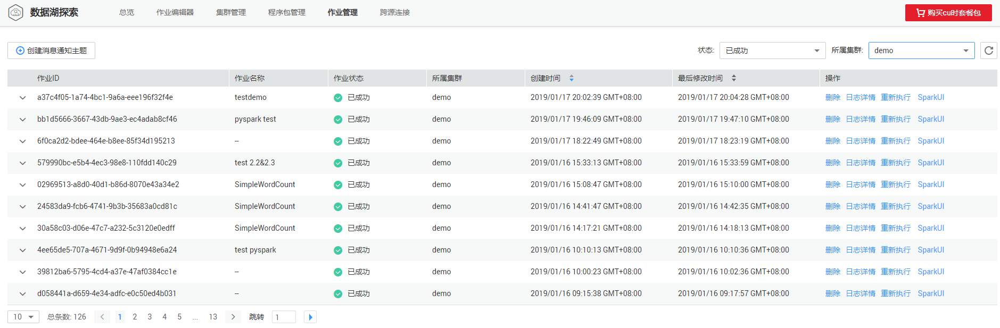

# Spark作业管理

## 操作场景

Spark作业为在Spark作业编辑窗口中提交的作业。

## 作业列表

作业列表显示所有的Spark作业，作业数量较多时，系统分页显示，您可以查看任何状态下的作业。

> **说明：**   
>作业执行成功后，作业记录只保存6小时。  

**表 1**  作业列表参数

<table><thead align="left"><tr id="zh-cn_topic_0122090417_row2555468715120"><th class="cellrowborder" valign="top" width="21.18%" id="mcps1.2.3.1.1">
参数

</th>
<th class="cellrowborder" valign="top" width="78.82000000000001%" id="mcps1.2.3.1.2">
参数说明

</th>
</tr>
</thead>
<tbody><tr id="zh-cn_topic_0122090417_row46758327132"><td class="cellrowborder" valign="top" width="21.18%" headers="mcps1.2.3.1.1 ">
作业ID

</td>
<td class="cellrowborder" valign="top" width="78.82000000000001%" headers="mcps1.2.3.1.2 ">
所提交Spark作业的ID，由系统默认生成。

</td>
</tr>
<tr id="zh-cn_topic_0122090417_row32873162171713"><td class="cellrowborder" valign="top" width="21.18%" headers="mcps1.2.3.1.1 ">
作业名称

</td>
<td class="cellrowborder" valign="top" width="78.82000000000001%" headers="mcps1.2.3.1.2 ">
所提交Spark作业的名称。

</td>
</tr>
<tr id="zh-cn_topic_0122090417_row31011923151038"><td class="cellrowborder" valign="top" width="21.18%" headers="mcps1.2.3.1.1 ">
作业状态

</td>
<td class="cellrowborder" valign="top" width="78.82000000000001%" headers="mcps1.2.3.1.2 ">
作业的状态信息，包括如下。

<ul id="zh-cn_topic_0122090417_ul32930526154023"><li>starting：正在启动</li><li>running：正在执行任务</li><li>dead：session已退出</li><li>success：session运行成功</li></ul>
</td>
</tr>
<tr id="zh-cn_topic_0122090417_row36301606171658"><td class="cellrowborder" valign="top" width="21.18%" headers="mcps1.2.3.1.1 ">
所属集群

</td>
<td class="cellrowborder" valign="top" width="78.82000000000001%" headers="mcps1.2.3.1.2 ">
所提交Spark作业所在的集群。

</td>
</tr>
<tr id="zh-cn_topic_0122090417_row6424839516213"><td class="cellrowborder" valign="top" width="21.18%" headers="mcps1.2.3.1.1 ">
创建时间

</td>
<td class="cellrowborder" valign="top" width="78.82000000000001%" headers="mcps1.2.3.1.2 ">
每个作业的创建时间，可按创建时间顺序或倒序显示作业列表。

</td>
</tr>
<tr id="zh-cn_topic_0122090417_row1662880815250"><td class="cellrowborder" valign="top" width="21.18%" headers="mcps1.2.3.1.1 ">
操作

</td>
<td class="cellrowborder" valign="top" width="78.82000000000001%" headers="mcps1.2.3.1.2 "><ul id="zh-cn_topic_0122090417_ul181927155164"><li>删除</li><li>日志详情<ul id="zh-cn_topic_0122090417_ul94511619309"><li>当作业状态在“starting”，显示“提交日志”。</li><li>当作业状态在“success”，显示“提交日志”和“运行日志”。</li></ul>
</li></ul>
</td>
</tr>
</tbody>
</table>

## 查找作业

1.  在DLI管理控制台的顶部菜单栏中，选择“作业管理“。
2.  在“作业管理“页面，选择“状态”、“作业条数”和“所属集群”，输入“作业ID”。

    系统将根据设置的过滤条件，在作业列表显示符合对应条件的作业。

    **图 1**  查找Spark作业结果  
    

## 查看作业详情

在“作业管理“页面，选中一条作业，单击该作业ID左侧的或在“操作”列中单击“日志详情”，可查看该条作业的相关日志。

## 终止作业

在“作业管理“页面，单击“操作”列的“删除“，删除作业。

