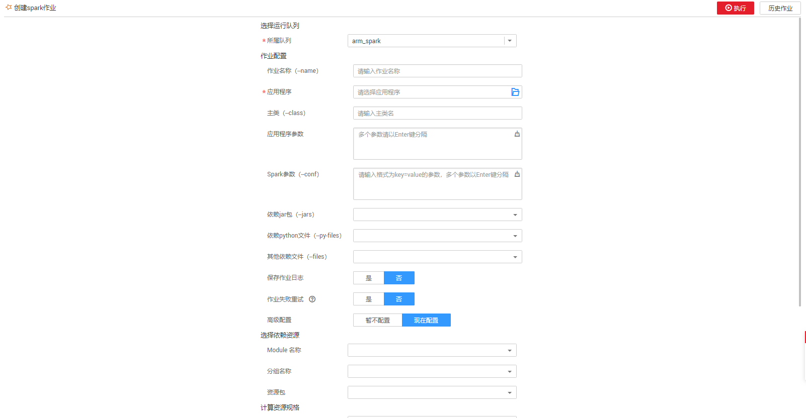

# Spark作业编辑器

Spark作业编辑器支持提交Spark作业，为用户提供全托管式的Spark计算服务。

## 界面说明

介绍“作业编辑器“页面中的区域和按键功能。

**图 1**  Spark作业编辑器页面  

**表 1**  区域说明

<table><thead align="left"><tr id="zh-cn_topic_0115200017_zh-cn_topic_0093946815_row3857138316587"><th class="cellrowborder" valign="top" width="7.920792079207921%" id="mcps1.2.4.1.1">
序号

</th>
<th class="cellrowborder" valign="top" width="16.13861386138614%" id="mcps1.2.4.1.2">
区域

</th>
<th class="cellrowborder" valign="top" width="75.94059405940594%" id="mcps1.2.4.1.3">
描述

</th>
</tr>
</thead>
<tbody><tr id="zh-cn_topic_0115200017_zh-cn_topic_0093946815_row1198630416587"><td class="cellrowborder" valign="top" width="7.920792079207921%" headers="mcps1.2.4.1.1 ">
1

</td>
<td class="cellrowborder" valign="top" width="16.13861386138614%" headers="mcps1.2.4.1.2 ">
菜单栏

</td>
<td class="cellrowborder" valign="top" width="75.94059405940594%" headers="mcps1.2.4.1.3 ">
Spark作业的菜单栏，包括总览、作业编辑器、队列管理、程序包管理、作业管理和跨源连接。

</td>
</tr>
<tr id="zh-cn_topic_0115200017_zh-cn_topic_0093946815_row4924339316587"><td class="cellrowborder" valign="top" width="7.920792079207921%" headers="mcps1.2.4.1.1 ">
2

</td>
<td class="cellrowborder" valign="top" width="16.13861386138614%" headers="mcps1.2.4.1.2 ">
导航栏

</td>
<td class="cellrowborder" valign="top" width="75.94059405940594%" headers="mcps1.2.4.1.3 ">
左侧导航栏，包括队列和程序包。

</td>
</tr>
<tr id="zh-cn_topic_0115200017_zh-cn_topic_0093946815_row1318571216587"><td class="cellrowborder" valign="top" width="7.920792079207921%" headers="mcps1.2.4.1.1 ">
3

</td>
<td class="cellrowborder" valign="top" width="16.13861386138614%" headers="mcps1.2.4.1.2 ">
作业编辑窗口

</td>
<td class="cellrowborder" valign="top" width="75.94059405940594%" headers="mcps1.2.4.1.3 ">
作业编辑窗口可选择保存在OBS服务中的程序包资源并设置参数。

</td>
</tr>
<tr id="zh-cn_topic_0115200017_row1146182415594"><td class="cellrowborder" valign="top" width="7.920792079207921%" headers="mcps1.2.4.1.1 ">
4

</td>
<td class="cellrowborder" valign="top" width="16.13861386138614%" headers="mcps1.2.4.1.2 ">
增加作业编辑窗口

</td>
<td class="cellrowborder" valign="top" width="75.94059405940594%" headers="mcps1.2.4.1.3 ">
增加Spark作业编辑窗口。

 说明： 

最多可同时开启5个作业编辑窗口。

</td>
</tr>
<tr id="row011171014312"><td class="cellrowborder" valign="top" width="7.920792079207921%" headers="mcps1.2.4.1.1 ">
14

</td>
<td class="cellrowborder" valign="top" width="16.13861386138614%" headers="mcps1.2.4.1.2 ">
购买CU时套餐包

</td>
<td class="cellrowborder" valign="top" width="75.94059405940594%" headers="mcps1.2.4.1.3 ">
根据需要购买CU时套餐包。如果不购买，则按需计费。计费详情请参考<a href="https://support.huaweicloud.com/price-dli/dli_06_0001.html" target="_blank" rel="noopener noreferrer">《数据湖探索价格说明》</a>。

</td>
</tr>
<tr id="row910191019434"><td class="cellrowborder" valign="top" width="7.920792079207921%" headers="mcps1.2.4.1.1 ">
15

</td>
<td class="cellrowborder" valign="top" width="16.13861386138614%" headers="mcps1.2.4.1.2 ">
执行历史

</td>
<td class="cellrowborder" valign="top" width="75.94059405940594%" headers="mcps1.2.4.1.3 ">
显示已提交的作业状态。

</td>
</tr>
</tbody>
</table>

**图 2**  Spark作业编辑器导航栏  

**表 2**  导航栏说明

<table><thead align="left"><tr id="zh-cn_topic_0115200017_row105761087712"><th class="cellrowborder" valign="top" width="7.920792079207921%" id="mcps1.2.4.1.1">
序号

</th>
<th class="cellrowborder" valign="top" width="27.722772277227726%" id="mcps1.2.4.1.2">
按键

</th>
<th class="cellrowborder" valign="top" width="64.35643564356435%" id="mcps1.2.4.1.3">
描述

</th>
</tr>
</thead>
<tbody><tr id="zh-cn_topic_0115200017_row5510457102015"><td class="cellrowborder" valign="top" width="7.920792079207921%" headers="mcps1.2.4.1.1 ">
5

</td>
<td class="cellrowborder" valign="top" width="27.722772277227726%" headers="mcps1.2.4.1.2 ">
隐藏/显示

</td>
<td class="cellrowborder" valign="top" width="64.35643564356435%" headers="mcps1.2.4.1.3 ">
隐藏/显示导航栏。

</td>
</tr>
<tr id="zh-cn_topic_0115200017_row0576181717"><td class="cellrowborder" valign="top" width="7.920792079207921%" headers="mcps1.2.4.1.1 ">
6

</td>
<td class="cellrowborder" valign="top" width="27.722772277227726%" headers="mcps1.2.4.1.2 ">
队列

</td>
<td class="cellrowborder" valign="top" width="64.35643564356435%" headers="mcps1.2.4.1.3 ">
显示已有的队列。

</td>
</tr>
<tr id="zh-cn_topic_0115200017_row1157678977"><td class="cellrowborder" valign="top" width="7.920792079207921%" headers="mcps1.2.4.1.1 ">
7

</td>
<td class="cellrowborder" valign="top" width="27.722772277227726%" headers="mcps1.2.4.1.2 ">
程序包

</td>
<td class="cellrowborder" valign="top" width="64.35643564356435%" headers="mcps1.2.4.1.3 ">
显示已有的程序包

</td>
</tr>
<tr id="zh-cn_topic_0115200017_row95761281676"><td class="cellrowborder" valign="top" width="7.920792079207921%" headers="mcps1.2.4.1.1 ">
8

</td>
<td class="cellrowborder" valign="top" width="27.722772277227726%" headers="mcps1.2.4.1.2 ">
购买队列/创建程序包

</td>
<td class="cellrowborder" valign="top" width="64.35643564356435%" headers="mcps1.2.4.1.3 ">
创建队列/程序包。

</td>
</tr>
<tr id="zh-cn_topic_0115200017_row1857619810717"><td class="cellrowborder" valign="top" width="7.920792079207921%" headers="mcps1.2.4.1.1 ">
9

</td>
<td class="cellrowborder" valign="top" width="27.722772277227726%" headers="mcps1.2.4.1.2 ">
刷新

</td>
<td class="cellrowborder" valign="top" width="64.35643564356435%" headers="mcps1.2.4.1.3 ">
包括刷新已有的队列和程序包列表。

</td>
</tr>
</tbody>
</table>

**图 3**  Spark作业编辑窗口  

**表 3**  作业编辑窗口说明

<table><thead align="left"><tr id="zh-cn_topic_0115200017_row169141932105516"><th class="cellrowborder" valign="top" width="7.5200000000000005%" id="mcps1.2.4.1.1">
序号

</th>
<th class="cellrowborder" valign="top" width="16.04%" id="mcps1.2.4.1.2">
按键

</th>
<th class="cellrowborder" valign="top" width="76.44%" id="mcps1.2.4.1.3">
描述

</th>
</tr>
</thead>
<tbody><tr id="zh-cn_topic_0115200017_row102037812149"><td class="cellrowborder" valign="top" width="7.5200000000000005%" headers="mcps1.2.4.1.1 ">
10

</td>
<td class="cellrowborder" valign="top" width="16.04%" headers="mcps1.2.4.1.2 ">
队列名

</td>
<td class="cellrowborder" valign="top" width="76.44%" headers="mcps1.2.4.1.3 ">
下拉选择要使用的队列。

</td>
</tr>
<tr id="zh-cn_topic_0115200017_row52031287149"><td class="cellrowborder" valign="top" width="7.5200000000000005%" headers="mcps1.2.4.1.1 ">
11

</td>
<td class="cellrowborder" valign="top" width="16.04%" headers="mcps1.2.4.1.2 ">
执行

</td>
<td class="cellrowborder" valign="top" width="76.44%" headers="mcps1.2.4.1.3 ">
提交Spark作业。

</td>
</tr>
<tr id="zh-cn_topic_0115200017_row1520311820141"><td class="cellrowborder" valign="top" width="7.5200000000000005%" headers="mcps1.2.4.1.1 ">
12

</td>
<td class="cellrowborder" valign="top" width="16.04%" headers="mcps1.2.4.1.2 ">
设置

</td>
<td class="cellrowborder" valign="top" width="76.44%" headers="mcps1.2.4.1.3 ">
以“key/value”的形式设置提交Spark作业的属性。详细内容请参见《数据湖探索API参考》&gt;《提交Spark作业相关API》&gt;<a href="https://support.huaweicloud.com/api-dli/dli_02_0124.html" target="_blank" rel="noopener noreferrer">《创建批处理作业》</a>&gt;“表2 请求参数说明”。

</td>
</tr>
<tr id="zh-cn_topic_0115200017_row16218165101513"><td class="cellrowborder" valign="top" width="7.5200000000000005%" headers="mcps1.2.4.1.1 ">
13

</td>
<td class="cellrowborder" valign="top" width="16.04%" headers="mcps1.2.4.1.2 ">
闭合/展开

</td>
<td class="cellrowborder" valign="top" width="76.44%" headers="mcps1.2.4.1.3 ">
闭合/展开当前Spark作业编辑窗口。

</td>
</tr>
</tbody>
</table>

## 操作步骤

1.  登录数据湖探索管理控制台，选择Spark作业，单击，进入“作业编辑器“页面。
2.  若是第一次提交Spark作业，需要先创建队列和上传程序包，具体请参见[创建队列](创建队列-3.md)和[创建程序包](创建程序包.md)。
3.  在当前编辑窗口右上方选择所使用的队列。
4.  在编辑窗口中，输入相关参数，具体如[图4](#zh-cn_topic_0115200017_fig138651058151411)所示。

    **图 4**  编辑Spark作业  
    

5.  单击编辑窗口右上方提交作业，页面显示“批量提交成功”。
6.  （可选）可到“作业管理”页面查看提交作业的状态及日志。

