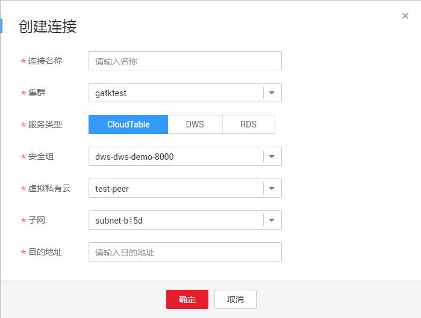

# Spark跨源连接

## 操作场景

DLI Spark跨源连接可用于访问CloudTable，DWS，RDS，CSS数据源。具体功能介绍请参考《数据湖探索开发指南》\>[《使用DLI跨源能力》](https://support.huaweicloud.com/devg-dli/dli_09_0020.html)。

## 连接列表

连接列表显示创建的所有跨源连接，连接数量较多时，系统分页显示。

**表 1**  Spark跨源连接列表参数

<table><thead align="left"><tr id="zh-cn_topic_0142697328_row2555468715120"><th class="cellrowborder" valign="top" width="21.18%" id="mcps1.2.3.1.1">
参数

</th>
<th class="cellrowborder" valign="top" width="78.82000000000001%" id="mcps1.2.3.1.2">
参数说明

</th>
</tr>
</thead>
<tbody><tr id="zh-cn_topic_0142697328_row46758327132"><td class="cellrowborder" valign="top" width="21.18%" headers="mcps1.2.3.1.1 ">
连接名称

</td>
<td class="cellrowborder" valign="top" width="78.82000000000001%" headers="mcps1.2.3.1.2 ">
所创建的跨源连接名称。

<ul id="zh-cn_topic_0142697328_ul109681518191720"><li>名称只能包含数字、英文字母、下划线和中划线。不能为空。</li><li>输入长度不能超过64个字符。</li></ul>
</td>
</tr>
<tr id="zh-cn_topic_0142697328_row32873162171713"><td class="cellrowborder" valign="top" width="21.18%" headers="mcps1.2.3.1.1 ">
连接状态

</td>
<td class="cellrowborder" valign="top" width="78.82000000000001%" headers="mcps1.2.3.1.2 ">
跨源连接的状态信息，包括如下三种状态。

<ul id="zh-cn_topic_0142697328_ul32930526154023"><li>创建中</li><li>已激活</li><li>失败</li></ul>
</td>
</tr>
<tr id="zh-cn_topic_0142697328_row31011923151038"><td class="cellrowborder" valign="top" width="21.18%" headers="mcps1.2.3.1.1 ">
服务类型

</td>
<td class="cellrowborder" valign="top" width="78.82000000000001%" headers="mcps1.2.3.1.2 ">
目前支持访问四种类型数据源。

<ul id="zh-cn_topic_0142697328_ul127459715563"><li>表格存储服务 CloudTable</li><li>数据仓库服务 DWS</li><li>云数据库（关系型数据库） RDS</li><li>云搜索服务 CSS</li></ul>
</td>
</tr>
<tr id="zh-cn_topic_0142697328_row36301606171658"><td class="cellrowborder" valign="top" width="21.18%" headers="mcps1.2.3.1.1 ">
连接地址

</td>
<td class="cellrowborder" valign="top" width="78.82000000000001%" headers="mcps1.2.3.1.2 ">
跨源连接创建成功后将显示连接地址，可用于DLI访问其他数据源。

</td>
</tr>
<tr id="zh-cn_topic_0142697328_row6424839516213"><td class="cellrowborder" valign="top" width="21.18%" headers="mcps1.2.3.1.1 ">
目的地址

</td>
<td class="cellrowborder" valign="top" width="78.82000000000001%" headers="mcps1.2.3.1.2 ">
连接其他数据源的地址。不同服务的地址略有不同。

<ul id="zh-cn_topic_0142697328_ul67221730122312"><li>表格存储服务 CloudTable：ZK链接地址</li><li>数据仓库服务 DWS：内网IP：端口
 说明： 

DWS有两个内网IP，不能同时使用两个内网IP，任意选择其中一个即可。

</li><li>云数据库（关系型数据库） RDS：内网地址：数据库端口</li><li>云搜索服务 CSS：内网地址：端口</li></ul>
</td>
</tr>
<tr id="zh-cn_topic_0142697328_row2449114254419"><td class="cellrowborder" valign="top" width="21.18%" headers="mcps1.2.3.1.1 ">
创建时间

</td>
<td class="cellrowborder" valign="top" width="78.82000000000001%" headers="mcps1.2.3.1.2 ">
每个连接的创建时间，可按创建时间顺序或倒序显示连接列表。

</td>
</tr>
<tr id="zh-cn_topic_0142697328_row1883611569448"><td class="cellrowborder" valign="top" width="21.18%" headers="mcps1.2.3.1.1 ">
进度

</td>
<td class="cellrowborder" valign="top" width="78.82000000000001%" headers="mcps1.2.3.1.2 ">
连接创建的进度， 用百分比表示。

</td>
</tr>
<tr id="zh-cn_topic_0142697328_row1662880815250"><td class="cellrowborder" valign="top" width="21.18%" headers="mcps1.2.3.1.1 ">
操作

</td>
<td class="cellrowborder" valign="top" width="78.82000000000001%" headers="mcps1.2.3.1.2 ">
删除。当连接状态在“创建中”时，连接不可删除。

</td>
</tr>
</tbody>
</table>

## 创建连接

1.  创建需要访问的数据源。例如，需要访问CloudTable数据源，请先在CloudTable服务中购买集群。

    **图 1**  CloudTable购买集群  
    

    如果已有可用集群，可不用重新购买。

2.  在Spark作业的顶部菜单栏中，选择“跨源连接“。
3.  在“跨源连接“页面，单击。

    输入连接名称，选择服务类型，安全组，虚拟私有云，子网，输入目的地址，详细参数介绍请参见[表2](#zh-cn_topic_0142697328_table24931148155220)。

    **图 2**  Spark创建连接  
    

    **表 2**  Spark跨源连接参数说明

    
    <table><thead align="left"><tr id="zh-cn_topic_0142697328_row1149712486527"><th class="cellrowborder" valign="top" width="15.24%" id="mcps1.2.3.1.1">
参数

    </th>
    <th class="cellrowborder" valign="top" width="84.76%" id="mcps1.2.3.1.2">
参数说明

    </th>
    </tr>
    </thead>
    <tbody><tr id="zh-cn_topic_0142697328_row1350324845215"><td class="cellrowborder" valign="top" width="15.24%" headers="mcps1.2.3.1.1 ">
连接名称

    </td>
    <td class="cellrowborder" valign="top" width="84.76%" headers="mcps1.2.3.1.2 ">
所创建的跨源连接名称。

    <ul id="zh-cn_topic_0142697328_ul185072486523"><li>名称只能包含数字、英文字母、下划线和中划线。不能为空。</li><li>输入长度不能超过64个字符。</li></ul>
    </td>
    </tr>
    <tr id="row791816590583"><td class="cellrowborder" valign="top" width="15.24%" headers="mcps1.2.3.1.1 ">
队列

    </td>
    <td class="cellrowborder" valign="top" width="84.76%" headers="mcps1.2.3.1.2 ">
提交Spark作业所在的队列。

    </td>
    </tr>
    <tr id="zh-cn_topic_0142697328_row105181748125210"><td class="cellrowborder" valign="top" width="15.24%" headers="mcps1.2.3.1.1 ">
服务类型

    </td>
    <td class="cellrowborder" valign="top" width="84.76%" headers="mcps1.2.3.1.2 ">
目前支持访问四种类型数据源。

    <ul id="zh-cn_topic_0142697328_ul25191248185210"><li>表格存储服务 CloudTable</li><li>数据仓库服务 DWS</li><li>云数据库（关系型数据库） RDS</li><li>云搜索服务 CSS</li></ul>
    </td>
    </tr>
    <tr id="zh-cn_topic_0142697328_row85241748185212"><td class="cellrowborder" valign="top" width="15.24%" headers="mcps1.2.3.1.1 ">
安全组

    </td>
    <td class="cellrowborder" valign="top" width="84.76%" headers="mcps1.2.3.1.2 ">
选择对应的安全组信息。不同服务的安全组信息，可在创建对应的服务集群或实例时由系统提供，或查看已有集群或数据库实例信息。请参考<a href="#zh-cn_topic_0142697328_fig87571359173616">图3</a>。

    </td>
    </tr>
    <tr id="zh-cn_topic_0142697328_row7764655142317"><td class="cellrowborder" valign="top" width="15.24%" headers="mcps1.2.3.1.1 ">
虚拟私有云

    </td>
    <td class="cellrowborder" valign="top" width="84.76%" headers="mcps1.2.3.1.2 ">
选择对应的虚拟私有云信息。不同服务的虚拟私有云信息，可在创建对应的服务集群或实例时由系统提供，或查看已有集群或数据库实例信息。请参考<a href="#zh-cn_topic_0142697328_fig87571359173616">图3</a>。

    </td>
    </tr>
    <tr id="zh-cn_topic_0142697328_row1095810374248"><td class="cellrowborder" valign="top" width="15.24%" headers="mcps1.2.3.1.1 ">
子网

    </td>
    <td class="cellrowborder" valign="top" width="84.76%" headers="mcps1.2.3.1.2 ">
选择对应的子网信息。不同服务的子网信息，可在创建对应的服务集群或实例时由系统提供，或查看已有集群或数据库实例信息。请参考<a href="#zh-cn_topic_0142697328_fig87571359173616">图3</a>。

    </td>
    </tr>
    <tr id="zh-cn_topic_0142697328_row135261748155213"><td class="cellrowborder" valign="top" width="15.24%" headers="mcps1.2.3.1.1 ">
目的地址

    </td>
    <td class="cellrowborder" valign="top" width="84.76%" headers="mcps1.2.3.1.2 ">
连接其他数据源的地址。不同服务的地址略有不同。请参考<a href="#zh-cn_topic_0142697328_fig87571359173616">图3</a>。

    <ul id="zh-cn_topic_0142697328_ul9527124812520"><li>表格存储服务 CloudTable：ZK链接地址</li><li>数据仓库服务 DWS：内网IP：端口</li><li>云数据库（关系型数据库） RDS：内网地址：数据库端口</li><li>云搜索服务 CSS：内网地址：端口</li></ul>
    </td>
    </tr>
    </tbody>
    </table>

    **图 3**  CloudTable集群信息  
    

4.  单击“确定“，完成连接创建。

## 查找连接

在“跨源连接“页面，可在搜索框中输入连接名称关键字，查找与之匹配的连接。

## 查看连接详情

在“跨源连接“页面，选中一条连接，单击该连接对应的，可查看该条连接的详细信息。

包括：连接名称，连接地址，服务类型，连接ID，目的地址，日志详情。

> **说明：**   
>当“连接状态“为“失败“，“日志详情“显示“失败原因“。  

## 删除连接

在“跨源连接“页面，可单击“操作”列的“删除“，删除不需要的连接。

> **说明：**   
>当“连接状态“为“创建中“时，连接不可删除。  

