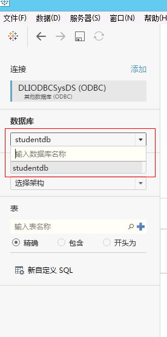
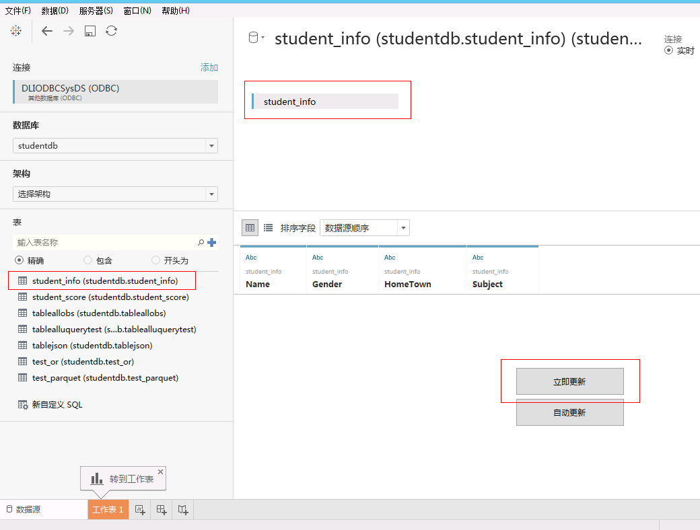
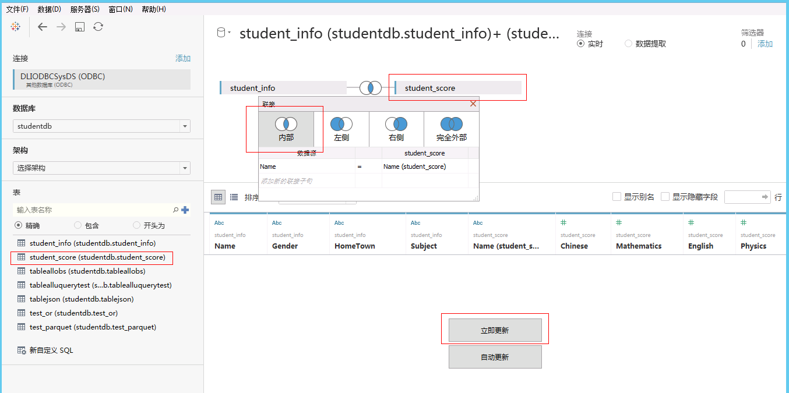
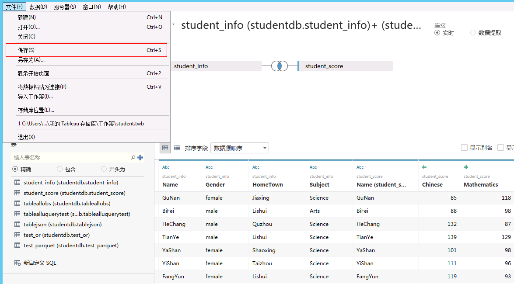

# Tableau Desktop创建数据集

## 操作场景

在Tableau Desktop中创建DLI的数据集。

## 操作步骤

1.  完成Tableau Desktop登录后，单击左侧导航栏中的“数据库”下拉框，选择数据库。请参见[图1](#zh-cn_topic_0093946768_fig4211415082250)。

    **图 1**  选择数据库  
    

2.  单击左侧导航栏中的“表”的图标，查询所有表。请参见[图2](#zh-cn_topic_0093946768_fig1465197582631)。

    **图 2**  查询表  
    

3.  将需要分析的表“student\_info”拖动到右侧上方，单击“立即更新”查看表数据，请参见[图3](#zh-cn_topic_0093946768_fig1842401582723)。

    **图 3**  查询表数据  
    

4.  将需要分析的表“student\_score”拖动到右侧上方与“student\_info”进行关联，单击“立即更新”查看关联结果，请参见[图4](#zh-cn_topic_0093946768_fig728945783040)。

    **图 4**  查询表关联结果  
    

5.  单击“文件”下拉菜单中的“保存”，保存数据工作簿，请参见[图5](#zh-cn_topic_0093946768_fig4635614384015)。

    **图 5**  保存数据工作簿  
    

