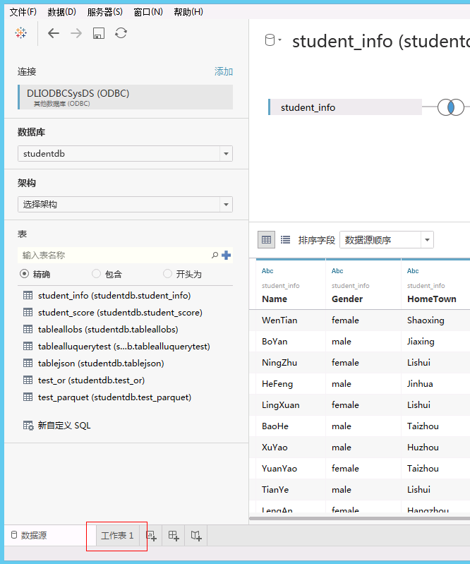
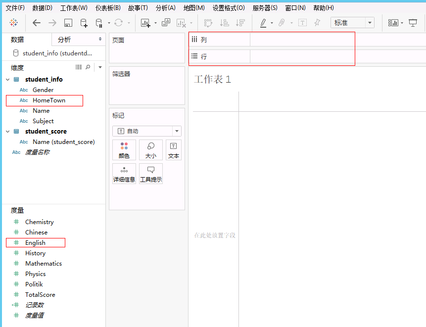
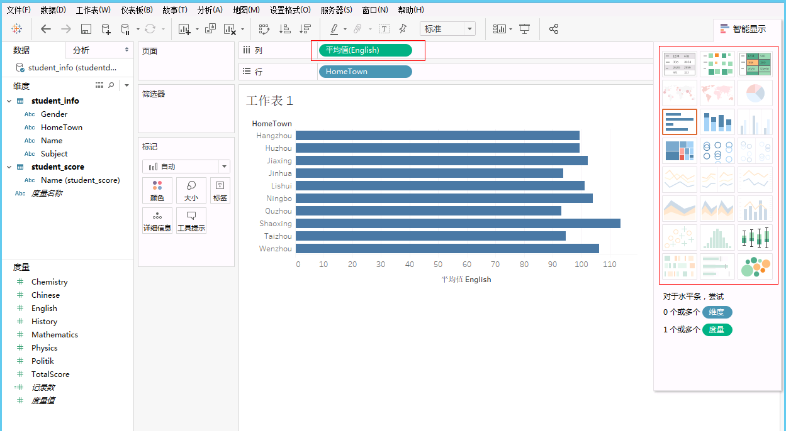
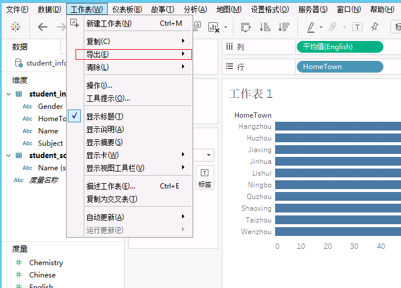

# Tableau Desktop制作图表

## 操作场景

在Tableau Desktop中创建DLI的数据度量图表。

## 操作步骤

1.  在完成数据集工作簿制作后，单击下方的“工作表”按钮，请参见[图1](#zh-cn_topic_0093946783_fig984750184512)。

    **图 1**  制作度量图表  
    

2.  进入工作表窗口后，将维度“HomeTown”拖到右侧上方“行”；将度量“English”拖到右侧上方“列”，请参见[图2](#zh-cn_topic_0093946783_fig5689860384555)。

    **图 2**  选择度量维度  
    

3.  将“English”成绩维度设置为平均值，通过右侧选择图表类型，生成各地区英语成绩平均值度量图表，请参见[图3](#zh-cn_topic_0093946783_fig3564869785136)。

    **图 3**  生成度量图表  
    

4.  通过“工作表”下拉菜单中的“导出”，可将度量图表导出为图片或Excel表格，请参见[图4](#zh-cn_topic_0093946783_fig93223185930)。

    **图 4**  保存度量图表  
    

