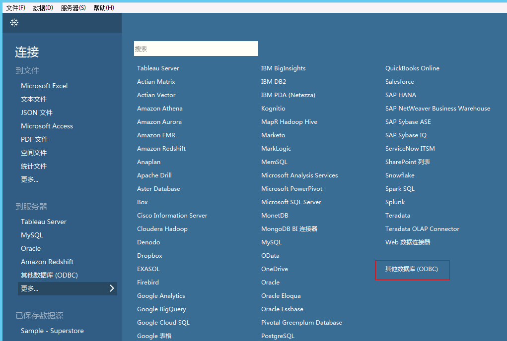
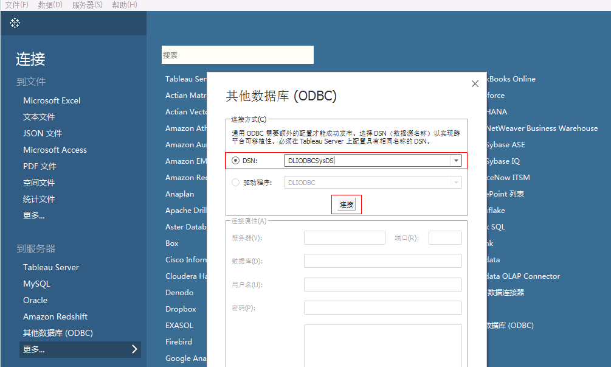
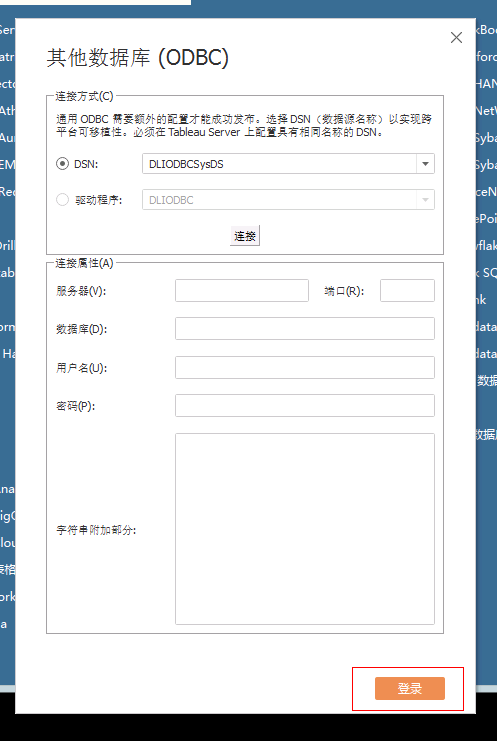

# Tableau Desktop添加数据源

## 操作场景

在Tableau Desktop中添加DLI的数据源。

## 操作步骤

1.  打开Tableau Desktop，单击左侧导航栏中的“其他数据库\(ODBC\)”，请参见[图1](#fig18532445192713)。

    **图 1**  选择ODBC数据源  
    

2.  在“其他数据库\(ODBC\)”窗口中，选择DSN：“DLIODBCSysDS”（名称以DLI ODBC安装时实际注册为准），单击“连接”。请参见[图2](#fig164122132810)。

    **图 2**  选择DSN连接  
    

3.  完成连接后，单击“登录”，登录数据库，请参见[图3](#zh-cn_topic_0093946956_fig3754626481542)。

    **图 3**  登录数据库  
    

