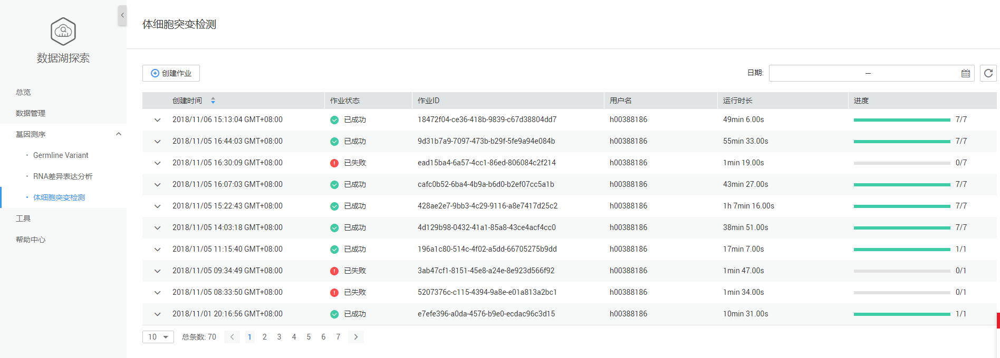
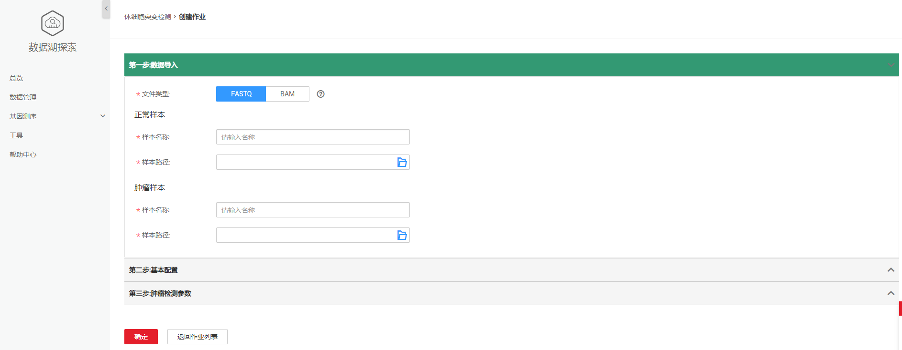
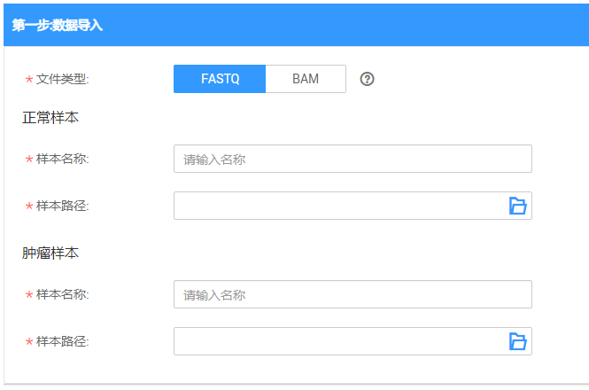
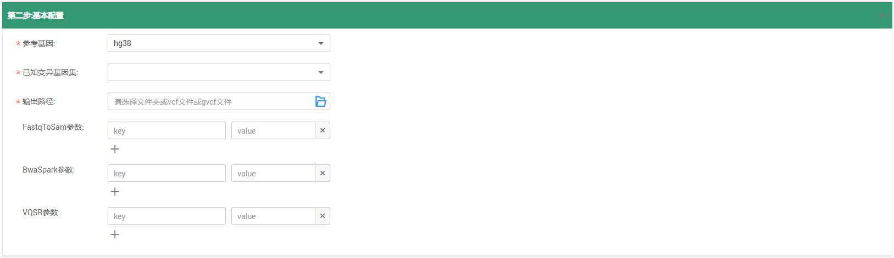
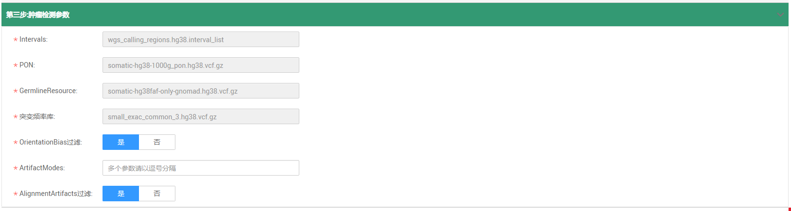
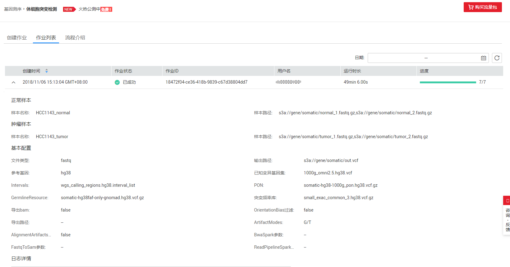

# 体细胞突变检测

## 体细胞突变检测页面说明

DLI全托管的体细胞肿瘤检测流程，该流程支持一键式地完成FASTQ文件参考基因组的对齐，体细胞突变检测，以及突变位点的过滤，最终输出突变检测结果。

**图 1**  体细胞突变检测  

体细胞突变检测页面显示所有的体细胞突变检测作业，作业数量较多时，系统分页显示，您可以查看所有历史提交的作业。作业列表默认按创建时间排列，可选择升序或降序排列；也可以选择时间范围，查看特定时间范围内提交的作业。

**表 1**  作业列表参数

<table><thead align="left"><tr id="row2555468715120"><th class="cellrowborder" valign="top" width="21.18%" id="mcps1.2.3.1.1">
参数

</th>
<th class="cellrowborder" valign="top" width="78.82000000000001%" id="mcps1.2.3.1.2">
参数说明

</th>
</tr>
</thead>
<tbody><tr id="row46758327132"><td class="cellrowborder" valign="top" width="21.18%" headers="mcps1.2.3.1.1 ">
创建时间

</td>
<td class="cellrowborder" valign="top" width="78.82000000000001%" headers="mcps1.2.3.1.2 ">
每个作业的创建时间，目前按创建时间倒序显示作业列表。

</td>
</tr>
<tr id="row31011923151038"><td class="cellrowborder" valign="top" width="21.18%" headers="mcps1.2.3.1.1 ">
作业状态

</td>
<td class="cellrowborder" valign="top" width="78.82000000000001%" headers="mcps1.2.3.1.2 ">
作业的状态信息，包括如下五种状态。

<ul id="ul691214351291"><li>提交中（launching）</li><li>运行中（running）</li><li>已成功（finished）</li><li>已失败（failed）</li></ul>
</td>
</tr>
<tr id="row36301606171658"><td class="cellrowborder" valign="top" width="21.18%" headers="mcps1.2.3.1.1 ">
作业ID

</td>
<td class="cellrowborder" valign="top" width="78.82000000000001%" headers="mcps1.2.3.1.2 ">
所提交作业的ID，由系统默认生成的唯一标识。

</td>
</tr>
<tr id="row2019117553311"><td class="cellrowborder" valign="top" width="21.18%" headers="mcps1.2.3.1.1 ">
用户名

</td>
<td class="cellrowborder" valign="top" width="78.82000000000001%" headers="mcps1.2.3.1.2 ">
提交作业的用户名称。

</td>
</tr>
<tr id="row6424839516213"><td class="cellrowborder" valign="top" width="21.18%" headers="mcps1.2.3.1.1 ">
运行时长

</td>
<td class="cellrowborder" valign="top" width="78.82000000000001%" headers="mcps1.2.3.1.2 ">
作业运行的时间长度。

</td>
</tr>
<tr id="row1662880815250"><td class="cellrowborder" valign="top" width="21.18%" headers="mcps1.2.3.1.1 ">
进度

</td>
<td class="cellrowborder" valign="top" width="78.82000000000001%" headers="mcps1.2.3.1.2 ">
作业运行的进度， 例如：1/1表示该作业有一个步骤，当前已完成。

</td>
</tr>
</tbody>
</table>

## 创建作业

在[图1](#fig48381724346)中，单击，进入[图2](#fig5850193418534)页面。

**图 2**  创建体细胞突变检测作业  

1.  数据导入

    **图 3**  体细胞突变检测数据导入  
    

    参见[表2](#table67331330132118)输入相关参数。

    **表 2**  参数说明

    
    <table><thead align="left"><tr id="row147341730192117"><th class="cellrowborder" valign="top" width="13.09130913091309%" id="mcps1.2.4.1.1">
参数名称

    </th>
    <th class="cellrowborder" valign="top" width="63.406340634063405%" id="mcps1.2.4.1.2">
描述

    </th>
    <th class="cellrowborder" valign="top" width="23.5023502350235%" id="mcps1.2.4.1.3">
示例

    </th>
    </tr>
    </thead>
    <tbody><tr id="row873403014212"><td class="cellrowborder" valign="top" width="13.09130913091309%" headers="mcps1.2.4.1.1 ">
文件类型

    </td>
    <td class="cellrowborder" valign="top" width="63.406340634063405%" headers="mcps1.2.4.1.2 ">
有FASTQ和BAM两种类型的输入文件。

    
 NOTE: 

文件类型为BAM时，必须提供BQSR比对之后的BAM文件。

    

    </td>
    <td class="cellrowborder" valign="top" width="23.5023502350235%" headers="mcps1.2.4.1.3 ">
FASTQ

    </td>
    </tr>
    <tr id="row12737163015215"><td class="cellrowborder" colspan="3" valign="top" headers="mcps1.2.4.1.1 mcps1.2.4.1.2 mcps1.2.4.1.3 ">
<strong id="b1223852922314">正常样本</strong>

    </td>
    </tr>
    <tr id="row173823012215"><td class="cellrowborder" valign="top" width="13.09130913091309%" headers="mcps1.2.4.1.1 ">
样本名称

    </td>
    <td class="cellrowborder" valign="top" width="63.406340634063405%" headers="mcps1.2.4.1.2 ">
正常样本对应的SM值。

    </td>
    <td class="cellrowborder" valign="top" width="23.5023502350235%" headers="mcps1.2.4.1.3 ">
-

    </td>
    </tr>
    <tr id="row473853072119"><td class="cellrowborder" valign="top" width="13.09130913091309%" headers="mcps1.2.4.1.1 ">
样本路径

    </td>
    <td class="cellrowborder" valign="top" width="63.406340634063405%" headers="mcps1.2.4.1.2 ">
输入正常样本文件OBS路径。

    </td>
    <td class="cellrowborder" valign="top" width="23.5023502350235%" headers="mcps1.2.4.1.3 ">
-

    </td>
    </tr>
    <tr id="row8738113010210"><td class="cellrowborder" colspan="3" valign="top" headers="mcps1.2.4.1.1 mcps1.2.4.1.2 mcps1.2.4.1.3 ">
<strong id="b16015112247">肿瘤样本</strong>

    </td>
    </tr>
    <tr id="row7738730192110"><td class="cellrowborder" valign="top" width="13.09130913091309%" headers="mcps1.2.4.1.1 ">
样本名称

    </td>
    <td class="cellrowborder" valign="top" width="63.406340634063405%" headers="mcps1.2.4.1.2 ">
肿瘤样本对应的SM值。

    </td>
    <td class="cellrowborder" valign="top" width="23.5023502350235%" headers="mcps1.2.4.1.3 ">
-

    </td>
    </tr>
    <tr id="row1738193092116"><td class="cellrowborder" valign="top" width="13.09130913091309%" headers="mcps1.2.4.1.1 ">
样本路径

    </td>
    <td class="cellrowborder" valign="top" width="63.406340634063405%" headers="mcps1.2.4.1.2 ">
输入肿瘤样本文件OBS路径。

    </td>
    <td class="cellrowborder" valign="top" width="23.5023502350235%" headers="mcps1.2.4.1.3 ">
-

    </td>
    </tr>
    </tbody>
    </table>

2.  基本配置

    **图 4**  体细胞突变检测基本配置  
    

    参见[表3](#table34159998103738)输入相关参数。

    **表 3**  参数说明

    
    <table><thead align="left"><tr id="row18398987103738"><th class="cellrowborder" valign="top" width="16.393939393939394%" id="mcps1.2.4.1.1">
参数名称

    </th>
    <th class="cellrowborder" valign="top" width="58.01010101010101%" id="mcps1.2.4.1.2">
描述

    </th>
    <th class="cellrowborder" valign="top" width="25.5959595959596%" id="mcps1.2.4.1.3">
示例

    </th>
    </tr>
    </thead>
    <tbody><tr id="row16943758105944"><td class="cellrowborder" valign="top" width="16.393939393939394%" headers="mcps1.2.4.1.1 ">
参考基因

    </td>
    <td class="cellrowborder" valign="top" width="58.01010101010101%" headers="mcps1.2.4.1.2 ">
基因行业内标准的基因库，目前仅支持hg38。

    </td>
    <td class="cellrowborder" valign="top" width="25.5959595959596%" headers="mcps1.2.4.1.3 ">
hg38

    </td>
    </tr>
    <tr id="row172161944183112"><td class="cellrowborder" valign="top" width="16.393939393939394%" headers="mcps1.2.4.1.1 ">
已知变异基因集

    </td>
    <td class="cellrowborder" valign="top" width="58.01010101010101%" headers="mcps1.2.4.1.2 ">
根据给定的下拉框，选择需要进行比对的已知变异基因集合，可以多选。

    </td>
    <td class="cellrowborder" valign="top" width="25.5959595959596%" headers="mcps1.2.4.1.3 ">
-

    </td>
    </tr>
    <tr id="row8664577112415"><td class="cellrowborder" valign="top" width="16.393939393939394%" headers="mcps1.2.4.1.1 ">
输出路径

    </td>
    <td class="cellrowborder" valign="top" width="58.01010101010101%" headers="mcps1.2.4.1.2 ">
存放分析结果的OBS路径。可以指定OBS上已经存在的文件夹路径，或者OBS上一个vcf文件的路径。

    </td>
    <td class="cellrowborder" valign="top" width="25.5959595959596%" headers="mcps1.2.4.1.3 ">
-

    </td>
    </tr>
    <tr id="row1161063874114"><td class="cellrowborder" valign="top" width="16.393939393939394%" headers="mcps1.2.4.1.1 ">
FastqToSam参数

    </td>
    <td class="cellrowborder" valign="top" width="58.01010101010101%" headers="mcps1.2.4.1.2 ">
执行FastqToSam过程中业务相关的配置项，用户可手动添加。

    </td>
    <td class="cellrowborder" valign="top" width="25.5959595959596%" headers="mcps1.2.4.1.3 ">
-

    </td>
    </tr>
    <tr id="row208095231057"><td class="cellrowborder" valign="top" width="16.393939393939394%" headers="mcps1.2.4.1.1 ">
BwaSpark参数

    </td>
    <td class="cellrowborder" valign="top" width="58.01010101010101%" headers="mcps1.2.4.1.2 ">
执行GATK BwaSpark方法中业务相关的配置项，用户可手动添加。

    
 NOTE: 

暂不支持关于输出文件格式以及输入输出路径相关的配置项。

    

    </td>
    <td class="cellrowborder" valign="top" width="25.5959595959596%" headers="mcps1.2.4.1.3 ">
-

    </td>
    </tr>
    <tr id="row562270711021"><td class="cellrowborder" valign="top" width="16.393939393939394%" headers="mcps1.2.4.1.1 ">
ReadsPipelineSpark参数

    </td>
    <td class="cellrowborder" valign="top" width="58.01010101010101%" headers="mcps1.2.4.1.2 ">
执行GATK ReadsPipelineSpark方法中业务相关的配置项，用户可手动添加。

    
 NOTE: 

暂不支持关于输出文件格式以及输入输出路径相关的配置项。

    

    </td>
    <td class="cellrowborder" valign="top" width="25.5959595959596%" headers="mcps1.2.4.1.3 ">
-

    </td>
    </tr>
    </tbody>
    </table>

3.  肿瘤检测参数设置

    **图 5**  肿瘤检测参数设置  
    

    **表 4**  参数说明

    
    <table><thead align="left"><tr id="row523924012390"><th class="cellrowborder" valign="top" width="23.080808080808083%" id="mcps1.2.4.1.1">
参数名称

    </th>
    <th class="cellrowborder" valign="top" width="39.97979797979798%" id="mcps1.2.4.1.2">
描述

    </th>
    <th class="cellrowborder" valign="top" width="36.939393939393945%" id="mcps1.2.4.1.3">
示例

    </th>
    </tr>
    </thead>
    <tbody><tr id="row15246940133915"><td class="cellrowborder" valign="top" width="23.080808080808083%" headers="mcps1.2.4.1.1 ">
Intervals

    </td>
    <td class="cellrowborder" valign="top" width="39.97979797979798%" headers="mcps1.2.4.1.2 ">
索引文件的名称，目前仅支持给定的索引，暂不支持用户指定自己的索引文件。

    </td>
    <td class="cellrowborder" valign="top" width="36.939393939393945%" headers="mcps1.2.4.1.3 ">
wgs_calling_regions.hg38.interval_list

    </td>
    </tr>
    <tr id="row125618401396"><td class="cellrowborder" valign="top" width="23.080808080808083%" headers="mcps1.2.4.1.1 ">
PON

    </td>
    <td class="cellrowborder" valign="top" width="39.97979797979798%" headers="mcps1.2.4.1.2 ">
肿瘤检测Mutect中用到的PON文件，暂不支持用户指定自己的PON文件。

    </td>
    <td class="cellrowborder" valign="top" width="36.939393939393945%" headers="mcps1.2.4.1.3 ">
somatic-hg38-1000g_pon.hg38.vcf.gz

    </td>
    </tr>
    <tr id="row126184014393"><td class="cellrowborder" valign="top" width="23.080808080808083%" headers="mcps1.2.4.1.1 ">
GermlineResource

    </td>
    <td class="cellrowborder" valign="top" width="39.97979797979798%" headers="mcps1.2.4.1.2 ">
肿瘤检测Mutect中用到的GermlineResource文件，暂不支持用户指定自己的GermlineResource文件。

    </td>
    <td class="cellrowborder" valign="top" width="36.939393939393945%" headers="mcps1.2.4.1.3 ">
somatic-hg38faf-only-gnomad.hg38.vcf.gz

    </td>
    </tr>
    <tr id="row122671940103919"><td class="cellrowborder" valign="top" width="23.080808080808083%" headers="mcps1.2.4.1.1 ">
突变频率库

    </td>
    <td class="cellrowborder" valign="top" width="39.97979797979798%" headers="mcps1.2.4.1.2 ">
根据突变频率进行过滤时使用的突变频率库。目前默认使用ExAC突变频率库，暂不支持用户指定自己的频率库。

    </td>
    <td class="cellrowborder" valign="top" width="36.939393939393945%" headers="mcps1.2.4.1.3 ">
small_exac_common_3.hg38.vcf.gz

    </td>
    </tr>
    <tr id="row027314018395"><td class="cellrowborder" valign="top" width="23.080808080808083%" headers="mcps1.2.4.1.1 ">
OrientationBias过滤

    </td>
    <td class="cellrowborder" valign="top" width="39.97979797979798%" headers="mcps1.2.4.1.2 ">
选择是否进行OrientationBias过滤。

    </td>
    <td class="cellrowborder" valign="top" width="36.939393939393945%" headers="mcps1.2.4.1.3 ">
False

    </td>
    </tr>
    <tr id="row52791240173910"><td class="cellrowborder" valign="top" width="23.080808080808083%" headers="mcps1.2.4.1.1 ">
ArtifactModes

    </td>
    <td class="cellrowborder" valign="top" width="39.97979797979798%" headers="mcps1.2.4.1.2 ">
如果选择进行OrientationBias过滤，则需填入ArtifactModes参数，多个参数请以逗号分隔。

    </td>
    <td class="cellrowborder" valign="top" width="36.939393939393945%" headers="mcps1.2.4.1.3 ">
-

    </td>
    </tr>
    <tr id="row1575105974219"><td class="cellrowborder" valign="top" width="23.080808080808083%" headers="mcps1.2.4.1.1 ">
AlignmentArtifacts过滤

    </td>
    <td class="cellrowborder" valign="top" width="39.97979797979798%" headers="mcps1.2.4.1.2 ">
选择是否进行OrientationBias过滤。

    </td>
    <td class="cellrowborder" valign="top" width="36.939393939393945%" headers="mcps1.2.4.1.3 ">
False

    </td>
    </tr>
    </tbody>
    </table>

4.  单击“确定”。

> **说明：**   
>提交体细胞突变检测作业需进行实名认证，并且需要进行委托授权。具体操作请参考[准备工作](准备工作.md)。  

## 查找作业

在[图1](#fig48381724346)右上侧“日期”栏，单击选择“开始时间”和“结束时间”，可查找对应时间段内提交的作业。

## 查看作业详情

在[图1](#fig48381724346)页面，选中一条作业，单击该作业对应的，可查看该条作业的详细信息。

-   正常样本

    包括：样本名称，样本路径。

-   肿瘤样本

    包括：样本名称，样本路径。

-   基本配置

    包括：文件类型，输出路径，参考基因，已知变异基因集，Intervals，PON，GermlineResource，突变频率库，导出bam，OrientationBias过滤，导出路径，ArtifactModes，AlignmentArtifacts过滤，BwaSpark参数，FastqToSam参数，ReadPipelineSpark参数。

-   日志详情

**图 6**  体细胞突变检测作业详情  

