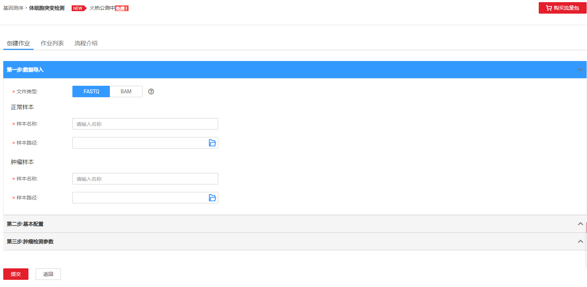
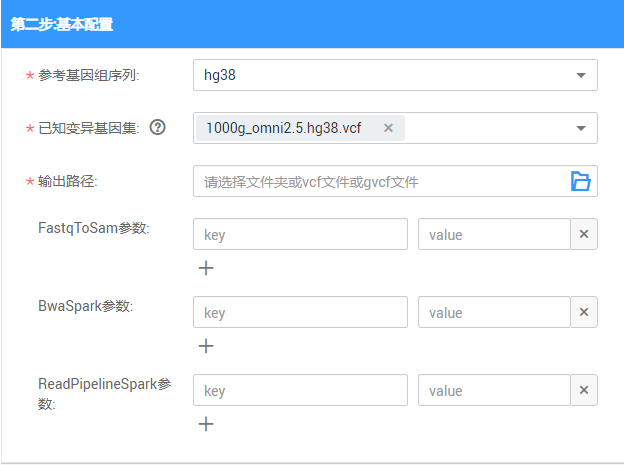
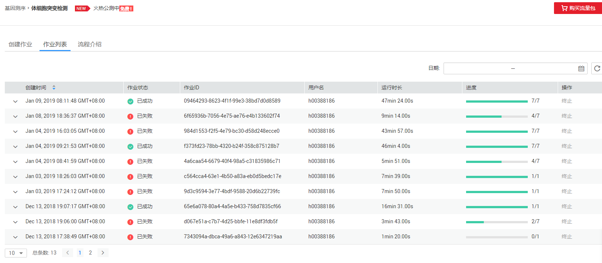
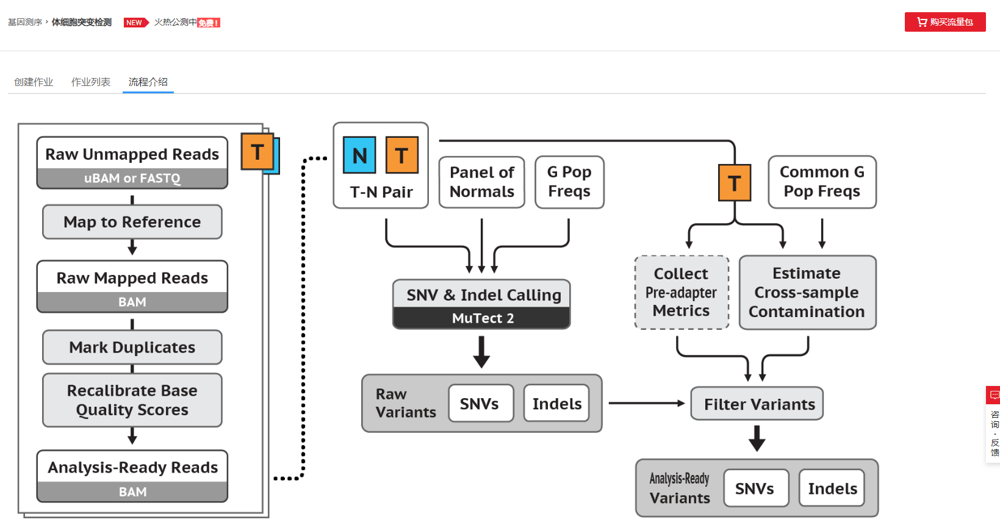

# 体细胞突变检测

## 体细胞突变检测概述

GATK官方的肿瘤体细胞突变检测分析流程, 用于分析正肿瘤样本与正常样本基因组间差异, 可用于获取潜在导致肿瘤的基因突变。

> **说明：**   
>提交体细胞突变检测作业需进行实名认证，并且需要进行委托授权。具体操作请参考[准备工作](准备工作.md)。  

## 创建作业

**图 1**  体细胞突变检测创建作业  

1.  数据导入

    **图 2**  体细胞突变检测数据导入  
    

    **表 1**  参数说明

    
    <table><thead align="left"><tr id="row1957153114610"><th class="cellrowborder" valign="top" width="17.11%" id="mcps1.2.3.1.1">
参数名称

    </th>
    <th class="cellrowborder" valign="top" width="82.89%" id="mcps1.2.3.1.2">
描述

    </th>
    </tr>
    </thead>
    <tbody><tr id="row126414314469"><td class="cellrowborder" valign="top" width="17.11%" headers="mcps1.2.3.1.1 ">
文件类型

    </td>
    <td class="cellrowborder" valign="top" width="82.89%" headers="mcps1.2.3.1.2 ">
有FASTQ和BAM两种类型的输入文件。

    
 说明： 

文件类型为BAM时，必须提供BQSR比对之后的BAM文件。

    

    </td>
    </tr>
    <tr id="row7773318462"><td class="cellrowborder" colspan="2" valign="top" headers="mcps1.2.3.1.1 mcps1.2.3.1.2 ">
<strong id="b147912315464">正常样本</strong>

    </td>
    </tr>
    <tr id="row178193114610"><td class="cellrowborder" valign="top" width="17.11%" headers="mcps1.2.3.1.1 ">
样本名称

    </td>
    <td class="cellrowborder" valign="top" width="82.89%" headers="mcps1.2.3.1.2 ">
正常样本对应的SM值。

    </td>
    </tr>
    <tr id="row108533134617"><td class="cellrowborder" valign="top" width="17.11%" headers="mcps1.2.3.1.1 ">
样本路径

    </td>
    <td class="cellrowborder" valign="top" width="82.89%" headers="mcps1.2.3.1.2 ">
输入正常样本文件OBS路径。

    </td>
    </tr>
    <tr id="row98913316468"><td class="cellrowborder" colspan="2" valign="top" headers="mcps1.2.3.1.1 mcps1.2.3.1.2 ">
<strong id="b6924317464">肿瘤样本</strong>

    </td>
    </tr>
    <tr id="row149363134610"><td class="cellrowborder" valign="top" width="17.11%" headers="mcps1.2.3.1.1 ">
样本名称

    </td>
    <td class="cellrowborder" valign="top" width="82.89%" headers="mcps1.2.3.1.2 ">
肿瘤样本对应的SM值。

    </td>
    </tr>
    <tr id="row610063104616"><td class="cellrowborder" valign="top" width="17.11%" headers="mcps1.2.3.1.1 ">
样本路径

    </td>
    <td class="cellrowborder" valign="top" width="82.89%" headers="mcps1.2.3.1.2 ">
输入肿瘤样本文件OBS路径。

    </td>
    </tr>
    </tbody>
    </table>

2.  基本参数配置

    **图 3**  体细胞突变检测基本参数配置  
    

    **表 2**  参数说明

    
    <table><thead align="left"><tr id="row18398987103738"><th class="cellrowborder" valign="top" width="25.130000000000003%" id="mcps1.2.3.1.1">
参数名称

    </th>
    <th class="cellrowborder" valign="top" width="74.87%" id="mcps1.2.3.1.2">
描述

    </th>
    </tr>
    </thead>
    <tbody><tr id="row16943758105944"><td class="cellrowborder" valign="top" width="25.130000000000003%" headers="mcps1.2.3.1.1 ">
参考基因组序列

    </td>
    <td class="cellrowborder" valign="top" width="74.87%" headers="mcps1.2.3.1.2 ">
基因行业内标准的基因库，目前支持hg38和hg19两种。

    </td>
    </tr>
    <tr id="row172161944183112"><td class="cellrowborder" valign="top" width="25.130000000000003%" headers="mcps1.2.3.1.1 ">
已知变异基因集

    </td>
    <td class="cellrowborder" valign="top" width="74.87%" headers="mcps1.2.3.1.2 ">
用于GATK流程的参考变异集，建议全选。

    </td>
    </tr>
    <tr id="row8664577112415"><td class="cellrowborder" valign="top" width="25.130000000000003%" headers="mcps1.2.3.1.1 ">
输出路径

    </td>
    <td class="cellrowborder" valign="top" width="74.87%" headers="mcps1.2.3.1.2 ">
存放分析结果的OBS路径。可以指定OBS上已经存在的文件夹路径，或者OBS上一个vcf文件的路径。

    </td>
    </tr>
    <tr id="row1161063874114"><td class="cellrowborder" valign="top" width="25.130000000000003%" headers="mcps1.2.3.1.1 ">
FastqToSam参数

    </td>
    <td class="cellrowborder" valign="top" width="74.87%" headers="mcps1.2.3.1.2 ">
执行FastqToSam过程中业务相关的配置项，用户可手动添加。

    </td>
    </tr>
    <tr id="row208095231057"><td class="cellrowborder" valign="top" width="25.130000000000003%" headers="mcps1.2.3.1.1 ">
BwaSpark参数

    </td>
    <td class="cellrowborder" valign="top" width="74.87%" headers="mcps1.2.3.1.2 ">
执行GATK BwaSpark方法中业务相关的配置项，用户可手动添加。

    
 说明： 

暂不支持关于输出文件格式以及输入输出路径相关的配置项。

    

    </td>
    </tr>
    <tr id="row562270711021"><td class="cellrowborder" valign="top" width="25.130000000000003%" headers="mcps1.2.3.1.1 ">
ReadsPipelineSpark参数

    </td>
    <td class="cellrowborder" valign="top" width="74.87%" headers="mcps1.2.3.1.2 ">
执行GATK ReadsPipelineSpark方法中业务相关的配置项，用户可手动添加。

    
 说明： 

暂不支持关于输出文件格式以及输入输出路径相关的配置项。

    

    </td>
    </tr>
    </tbody>
    </table>

3.  肿瘤检测参数设置

    **图 4**  肿瘤检测参数设置  
    

    **表 3**  参数说明

    
    <table><thead align="left"><tr id="row523924012390"><th class="cellrowborder" valign="top" width="21.19191919191919%" id="mcps1.2.4.1.1">
参数名称

    </th>
    <th class="cellrowborder" valign="top" width="52.727272727272734%" id="mcps1.2.4.1.2">
描述

    </th>
    <th class="cellrowborder" valign="top" width="26.080808080808083%" id="mcps1.2.4.1.3">
示例

    </th>
    </tr>
    </thead>
    <tbody><tr id="row15246940133915"><td class="cellrowborder" valign="top" width="21.19191919191919%" headers="mcps1.2.4.1.1 ">
Intervals

    </td>
    <td class="cellrowborder" valign="top" width="52.727272727272734%" headers="mcps1.2.4.1.2 ">
突变检测区域，当参考基因组序列为hg38且该值为空时，默认值为wgs_calling_regions.hg38.interval_list。

    </td>
    <td class="cellrowborder" valign="top" width="26.080808080808083%" headers="mcps1.2.4.1.3 ">
wgs_calling_regions.hg38.interval_list

    </td>
    </tr>
    <tr id="row125618401396"><td class="cellrowborder" valign="top" width="21.19191919191919%" headers="mcps1.2.4.1.1 ">
PON

    </td>
    <td class="cellrowborder" valign="top" width="52.727272727272734%" headers="mcps1.2.4.1.2 ">
Panel of Normals（该文件通过作为胚系突变位点的过滤参考及人为技术上的引入的错误的过滤参考来提高体细胞突变检测的效果，根据GATK官方推荐，一个好的PON文件样本集最好有40个正常样本以上，并且这些正常样本采用与肿瘤样本的测序技术一致的技术进行测序），当参考基因组序列为hg38且该值为空时，默认值为somatic-hg38-1000g_pon.hg38.vcf.gz。

    </td>
    <td class="cellrowborder" valign="top" width="26.080808080808083%" headers="mcps1.2.4.1.3 ">
somatic-hg38-1000g_pon.hg38.vcf.gz

    </td>
    </tr>
    <tr id="row126184014393"><td class="cellrowborder" valign="top" width="21.19191919191919%" headers="mcps1.2.4.1.1 ">
GermlineResource

    </td>
    <td class="cellrowborder" valign="top" width="52.727272727272734%" headers="mcps1.2.4.1.2 ">
用于过滤的胚系突变参考集，当参考基因组序列为hg38且该值为空时，默认值为somatic-hg38faf-only-gnomad.hg38.vcf.gz。

    </td>
    <td class="cellrowborder" valign="top" width="26.080808080808083%" headers="mcps1.2.4.1.3 ">
somatic-hg38faf-only-gnomad.hg38.vcf.gz

    </td>
    </tr>
    <tr id="row122671940103919"><td class="cellrowborder" valign="top" width="21.19191919191919%" headers="mcps1.2.4.1.1 ">
突变频率库

    </td>
    <td class="cellrowborder" valign="top" width="52.727272727272734%" headers="mcps1.2.4.1.2 ">
用于计算肿瘤样本和正常样本间的污染情况，当参考基因组序列为hg38且该值为空时，默认值为small_exac_common_3.hg38.vcf.gz。

    </td>
    <td class="cellrowborder" valign="top" width="26.080808080808083%" headers="mcps1.2.4.1.3 ">
small_exac_common_3.hg38.vcf.gz

    </td>
    </tr>
    <tr id="row027314018395"><td class="cellrowborder" valign="top" width="21.19191919191919%" headers="mcps1.2.4.1.1 ">
OrientationBias过滤

    </td>
    <td class="cellrowborder" valign="top" width="52.727272727272734%" headers="mcps1.2.4.1.2 ">
GATK官方肿瘤体细胞突变检测流程可选的一个过滤步骤，主要用于可能的人为引起的检测错误（如石蜡样本易出现C-&gt;T的转换）。

    </td>
    <td class="cellrowborder" valign="top" width="26.080808080808083%" headers="mcps1.2.4.1.3 ">
否

    </td>
    </tr>
    <tr id="row52791240173910"><td class="cellrowborder" valign="top" width="21.19191919191919%" headers="mcps1.2.4.1.1 ">
ArtifactModes

    </td>
    <td class="cellrowborder" valign="top" width="52.727272727272734%" headers="mcps1.2.4.1.2 ">
如果选择进行OrientationBias过滤，则需填入ArtifactModes参数，多个参数请以逗号分隔。

    </td>
    <td class="cellrowborder" valign="top" width="26.080808080808083%" headers="mcps1.2.4.1.3 ">
-

    </td>
    </tr>
    <tr id="row1575105974219"><td class="cellrowborder" valign="top" width="21.19191919191919%" headers="mcps1.2.4.1.1 ">
AlignmentArtifacts过滤

    </td>
    <td class="cellrowborder" valign="top" width="52.727272727272734%" headers="mcps1.2.4.1.2 ">
GATK官方肿瘤体细胞突变检测流程可选的一个过滤步骤，主要用于可能的比对造成的检测错误。

    </td>
    <td class="cellrowborder" valign="top" width="26.080808080808083%" headers="mcps1.2.4.1.3 ">
否

    </td>
    </tr>
    <tr id="row1434354762513"><td class="cellrowborder" valign="top" width="21.19191919191919%" headers="mcps1.2.4.1.1 ">
导出bam

    </td>
    <td class="cellrowborder" valign="top" width="52.727272727272734%" headers="mcps1.2.4.1.2 ">
是否导出bam文件。

    </td>
    <td class="cellrowborder" valign="top" width="26.080808080808083%" headers="mcps1.2.4.1.3 ">
否

    </td>
    </tr>
    <tr id="row22371040165915"><td class="cellrowborder" valign="top" width="21.19191919191919%" headers="mcps1.2.4.1.1 ">
导出路径

    </td>
    <td class="cellrowborder" valign="top" width="52.727272727272734%" headers="mcps1.2.4.1.2 ">
选择导出bam文件存放的路径。

    </td>
    <td class="cellrowborder" valign="top" width="26.080808080808083%" headers="mcps1.2.4.1.3 ">
-

    </td>
    </tr>
    </tbody>
    </table>

4.  单击“提交”。

## 作业列表

**图 5**  体细胞突变检测作业列表  

作业列表显示所有体细胞突变检测作业，作业数量较多时，系统分页显示，您可以查看所有历史提交的作业。作业列表默认按创建时间降序排列，可切换为按时间升序排列；也可以选择时间范围，查看特定时间范围内提交的作业。

**表 4**  作业列表参数

<table><thead align="left"><tr id="row1021119582117"><th class="cellrowborder" valign="top" width="21.18%" id="mcps1.2.3.1.1">
参数

</th>
<th class="cellrowborder" valign="top" width="78.82000000000001%" id="mcps1.2.3.1.2">
参数说明

</th>
</tr>
</thead>
<tbody><tr id="row3211145810117"><td class="cellrowborder" valign="top" width="21.18%" headers="mcps1.2.3.1.1 ">
创建时间

</td>
<td class="cellrowborder" valign="top" width="78.82000000000001%" headers="mcps1.2.3.1.2 ">
每个作业的创建时间，目前按创建时间倒序显示作业列表。

</td>
</tr>
<tr id="row32115581915"><td class="cellrowborder" valign="top" width="21.18%" headers="mcps1.2.3.1.1 ">
作业状态

</td>
<td class="cellrowborder" valign="top" width="78.82000000000001%" headers="mcps1.2.3.1.2 ">
作业的状态信息，包括如下五种状态。

<ul id="ul4211135814117"><li>提交中（launching）</li><li>运行中（running）</li><li>已成功（finished）</li><li>已失败（failed）</li><li>取消中（cancelling）</li><li>已取消（cancelled）</li></ul>
</td>
</tr>
<tr id="row1121118581312"><td class="cellrowborder" valign="top" width="21.18%" headers="mcps1.2.3.1.1 ">
作业ID

</td>
<td class="cellrowborder" valign="top" width="78.82000000000001%" headers="mcps1.2.3.1.2 ">
所提交作业的ID，由系统默认生成的唯一标识。

</td>
</tr>
<tr id="row4211958813"><td class="cellrowborder" valign="top" width="21.18%" headers="mcps1.2.3.1.1 ">
用户名

</td>
<td class="cellrowborder" valign="top" width="78.82000000000001%" headers="mcps1.2.3.1.2 ">
提交作业的用户名称。

</td>
</tr>
<tr id="row192110581013"><td class="cellrowborder" valign="top" width="21.18%" headers="mcps1.2.3.1.1 ">
运行时长

</td>
<td class="cellrowborder" valign="top" width="78.82000000000001%" headers="mcps1.2.3.1.2 ">
作业运行的时间长度。

</td>
</tr>
<tr id="row18211165811117"><td class="cellrowborder" valign="top" width="21.18%" headers="mcps1.2.3.1.1 ">
进度

</td>
<td class="cellrowborder" valign="top" width="78.82000000000001%" headers="mcps1.2.3.1.2 ">
作业运行的进度， 例如：1/1表示该作业有一个步骤，当前已完成。

</td>
</tr>
</tbody>
</table>

-   查找作业

    在[图5](#fig1121113581819)右上侧“日期”栏，单击选择“开始时间”和“结束时间”，可查找对应时间段内提交的作业。

-   查看作业详情

    在[图5](#fig1121113581819)页面，选中一条作业，单击该作业对应的，可查看该条作业的详细信息。

    -   正常样本

        包括：样本名称，样本路径。

    -   肿瘤样本

        包括：样本名称，样本路径。

    -   基本配置

        包括：文件类型，输出路径，参考基因组序列，已知变异基因集，Intervals，PON，GermlineResource，突变频率库，导出bam，OrientationBias过滤，导出路径，ArtifactModes，AlignmentArtifacts过滤，BwaSpark参数，FastqToSam参数，ReadPipelineSpark参数。

    -   日志详情

        **图 6**  体细胞突变检测作业详情  
        

## 流程介绍

**图 7**  体细胞突变检测流程介绍  

