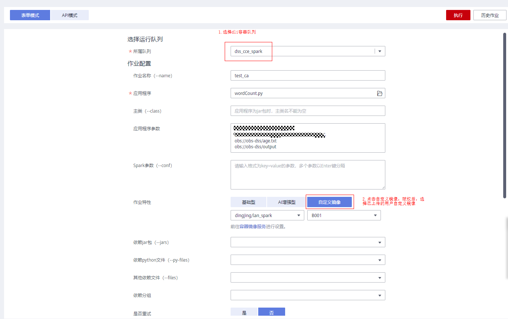
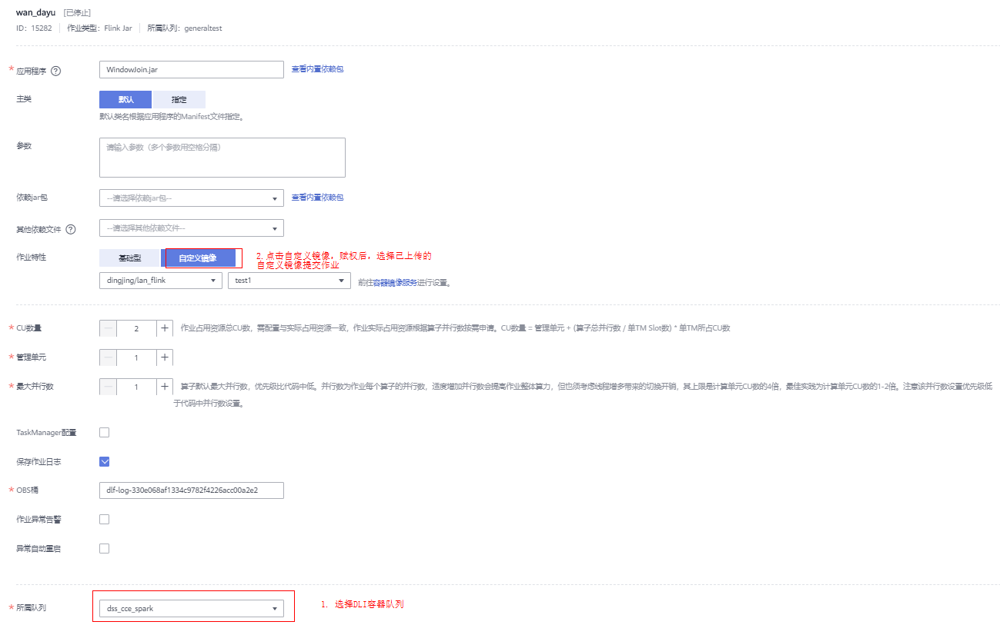

# 使用自定义镜像<a name="dli_01_0496"></a>

## 使用自定义镜像的场景<a name="section87516301066"></a>

使用DLI提供的自定义镜像功能提交作业，用户可以依赖DLI提供的Spark或者Flink基础镜像，使用Dockerfile将作业运行需要的依赖（文件、jar包或者软件）打包到镜像中，生成自己的自定义镜像，然后将镜像发布到SWR（容器镜像服务）中，最后在DLI服务作业编辑页面选择自己生成的镜像，运行作业。用户可以将一些私有能力内置到自定义镜像中，从而增强作业的功能、性能。

> **说明：** 
>用户使用自定义镜像功能需要具备[Docker](https://www.docker.com/)相关的基础知识。

## 使用自定义镜像的限制条件<a name="section75871440183"></a>

-   只支持容器化队列。
-   只支持Spark、Flink jar作业，即jar包作业。

## 使用自定义镜像操作步骤<a name="section166281274710"></a>

以tensorflow为例，说明如何将tensorflow打包进镜像，生成安装了tensorflow的自定义镜像，在DLI作业中使用该镜像运行作业。

1.  获取DLI基础镜像。

    使用以下命令获取：

    命令格式：

    ```
    docker pull [swr仓库地址]/[组织名称]/[镜像名称]:[镜像版本]
    ```

    示例：

    ```
    docker pull swr.cn-north-1.huaweicloud.com/dli/spark:2.3.2-1.0.0-euler-2.9-x86_64
    ```

    **表 1**  基础镜像列表

    <a name="table799234718552"></a>
    <table><thead align="left"><tr id="row19993124715551"><th class="cellrowborder" valign="top" width="11.6011601160116%" id="mcps1.2.4.1.1"><p id="p109931647125515"><a name="p109931647125515"></a><a name="p109931647125515"></a>组织名称</p>
    </th>
    <th class="cellrowborder" valign="top" width="15.601560156015601%" id="mcps1.2.4.1.2"><p id="p12993134735516"><a name="p12993134735516"></a><a name="p12993134735516"></a>镜像名称</p>
    </th>
    <th class="cellrowborder" valign="top" width="72.79727972797279%" id="mcps1.2.4.1.3"><p id="p20993114725520"><a name="p20993114725520"></a><a name="p20993114725520"></a>镜像版本</p>
    </th>
    </tr>
    </thead>
    <tbody><tr id="row189936475556"><td class="cellrowborder" rowspan="4" valign="top" width="11.6011601160116%" headers="mcps1.2.4.1.1 "><p id="p1699314472552"><a name="p1699314472552"></a><a name="p1699314472552"></a>dli</p>
    </td>
    <td class="cellrowborder" rowspan="2" valign="top" width="15.601560156015601%" headers="mcps1.2.4.1.2 "><p id="p1899311473555"><a name="p1899311473555"></a><a name="p1899311473555"></a>spark</p>
    </td>
    <td class="cellrowborder" valign="top" width="72.79727972797279%" headers="mcps1.2.4.1.3 "><p id="p4522931682"><a name="p4522931682"></a><a name="p4522931682"></a>2.3.2-1.0.0-euler-2.9-20.04-x86_64</p>
    </td>
    </tr>
    <tr id="row196357149815"><td class="cellrowborder" valign="top" headers="mcps1.2.4.1.1 "><p id="p663615148820"><a name="p663615148820"></a><a name="p663615148820"></a>2.3.2-1.0.0-euler-2.9-aarch64</p>
    </td>
    </tr>
    <tr id="row599315475552"><td class="cellrowborder" rowspan="2" valign="top" headers="mcps1.2.4.1.1 "><p id="p11994947165519"><a name="p11994947165519"></a><a name="p11994947165519"></a>flink</p>
    </td>
    <td class="cellrowborder" valign="top" headers="mcps1.2.4.1.2 "><p id="p23437015912"><a name="p23437015912"></a><a name="p23437015912"></a>1.10-1.0.0-euler-2.9-x86_64</p>
    </td>
    </tr>
    <tr id="row36541744581"><td class="cellrowborder" valign="top" headers="mcps1.2.4.1.1 "><p id="p17655844582"><a name="p17655844582"></a><a name="p17655844582"></a>1.10-1.0.0-euler-2.9-aarch64</p>
    </td>
    </tr>
    </tbody>
    </table>

    镜像命名说明：

    <swr-registry\>/<org\>/<compoent\>:<component-ver\>-<imagever\>-<os\>-<os-ver\>-<arch\>

    -   swr-registry：对应的swr仓库地址，例如：swr.cn-north-1.huaweicloud.com
    -   org：组织名称，默认为dli
    -   compoent：镜像名称为spark或者flink
    -   component-ver：镜像版本，spark为2.3.x，2.4.x； flink为1.10
    -   imagever：1.0.0，递增
    -   os：euler
    -   os-ver: os版本
    -   arch: x86\_64或aarch64

2.  编写Dockerfile文件。

    具体的Dockerfile内容示例如下：

    ```
    ARG BASE_IMG=spark:latest
    
    FROM ${BASE_IMG} as builder
    USER root
    RUN set -ex && \
        mkdir -p /root/.pip && \
        echo "[global]" >> /root/.pip/pip.conf && \
        echo "index-url = https://mirrors.huaweicloud.com/repository/pypi/simple" >> /root/.pip/pip.conf && \
        pip3 install --user --no-cache-dir tensorflow==1.13.1
    
    FROM ${BASE_IMG}
    USER root
    COPY --from=builder --chown=omm:ficommon /root/.local /home/omm/.local
    USER omm
    ```

    其中，主要包含了以下步骤：

    1.  设置pip的可用仓库地址。
    2.  使用pip3安装tensorflow算法包。
    3.  将安装了算法包的临时镜像builder里的内容拷贝到基础镜像中（这一步主要是为了减小镜像体积），用于生成最终的自定义镜像。

3.  利用Dockerfile生成自定义镜像。

    镜像打包命令格式：

    ```
    docker build -t [组织名称]/[镜像名称]:[镜像版本] --build-arg BASE_IMG=[DLI基础镜像地址] -f Dockerfile . 
    ```

    镜像打包命令示例：

    ```
    docker build -t mydli/spark:1.0 --build-arg BASE_IMG=swr.cn-north-1.huaweicloud.com/dli/spark:2.3.2-1.0.0-euler-2.9-x86_64 -f Dockerfile . 
    ```

4.  将自定义镜像上传到SWR（容器镜像）服务中。SWR服务提供了两种上传方式：
    -   客户端上传镜像。

        1.  连接容器镜像服务。

            命令格式：

            ```
            docker login -u xxxxxx@xxxxxxx -p xxxxxxxxxxxxx
            ```

        2.  在安装docker的机器给spark镜像打标签。

            命令格式：

            ```
            docker tag [镜像名称:版本名称] [镜像仓库地址]/[组织名称]/[镜像名称:版本名称]
            ```

            命令示例：

            ```
            docker tag mydli/spark:1.0 swr.cn-north-1.huaweicloud.com/mydli/spark:1.0
            ```

        3.  上传镜像至镜像仓库。

            命令格式：

            ```
            docker push [镜像仓库地址]/[组织名称]/[镜像名称:版本名称]
            ```

            命令示例：

            ```
            docker push swr.cn-north-1.huaweicloud.com/mydli/spark:1.0 
            ```

        客户端上传镜像具体请参考《[容器镜像服务用户指南](https://support.huaweicloud.com/usermanual-swr/swr_01_0011.html)》。

    -   页面上传镜像。

        页面上传镜像具体请参考《[容器镜像服务用户指南](https://support.huaweicloud.com/usermanual-swr/swr_01_0012.html)》。

5.  在DLI服务中提交Spark或者Flink jar作业时选择自定义镜像。
    -   打开管理控制台的Spark作业或者Flink作业编辑页面，在自定义镜像列表中选择已上传并共享的镜像，运行作业，即可使用自定义镜像运行作业。如果没有共享镜像，单击“授权”并填写对应的配置参数，也可运行作业。

        **图 1**  在DLI Spark作业编辑页面，选择自定义镜像<a name="fig127129192520"></a>  
        

        **图 2**  在DLI Flink jar作业编辑页面，选择自定义镜像<a name="fig612385412362"></a>  
        

    -   在使用API时，在作业参数中指定image参数，即可使用自定义镜像运行作业。Spark作业请参考《[创建批处理作业](https://support.huaweicloud.com/api-dli/dli_02_0124.html)》，Flink jar作业请参考《[创建Flink Jar作业](https://support.huaweicloud.com/api-dli/dli_02_0230.html)》。


