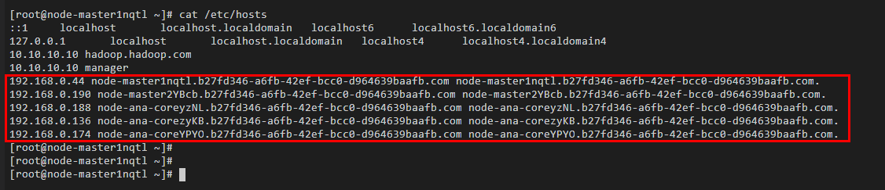
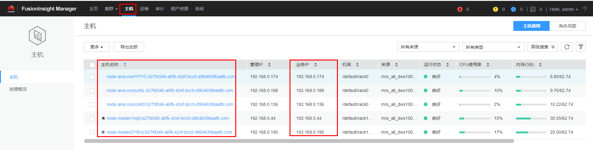

# 修改主机信息

## 修改主机信息

**方法一：通过MRS节点的“/etc/hosts”信息填写**

1.  以root用户登录MRS的任意一个主机节点。
2.  执行以下命令获取MRS对应主机节点的hosts信息，复制保存。

    **cat /etc/hosts**

    

3.  在“增强型跨源“页面，选择一条连接，单击该连接“操作”列中的“修改主机信息”，在弹出的对话框中，将[2](#li5236194744818)中复制的MRS主机信息粘贴进去。单击“确定”完成。

**方法二：登录MRS的FusionInsight Manager获取主机信息填写**

1.  登录MRS的FusionInsight Manager界面。
2.  在FusionInsight Manager界面，单击“主机”。在主机页面，分别获取MRS的“主机名称”和“业务IP”。

    

3.  在“增强型跨源“页面，选择一条连接，单击该连接“操作”列中的“修改主机信息”，在弹出的对话框中，填写主机信息。单击“确定”完成。

    主机信息格式为：“[2](#li207601326501)中获取的业务IP   [2](#li207601326501)中获取的主机名称”，多条信息之间以换行分隔。

    例如：

    192.168.0.22 node-masterxxx1.com

    192.168.0.23 node-masterxxx2.com

> **说明：** 
>-   修改主机信息每次均为全量覆盖。
>-   主机名/域名限制为长度128，数字字母下划线\("\_"\)横杠\("-"\)句点\("."\)组成，字母开头。
>-   填写的主机信息格式为：“IP 主机名/域名”，多条信息之间以换行分隔。

