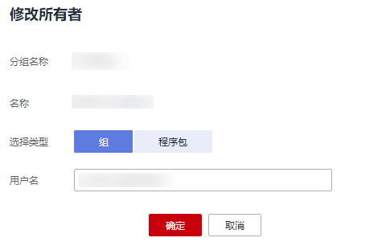

# 修改所有者

在“程序包管理“页面，单击程序包“操作”列中的“修改所有者“，可以修改对应程序包的所有者。

**图 1**  修改程序包所有者  

**表 1**  参数说明

<table><thead align="left"><tr id="zh-cn_topic_0122016946_zh-cn_topic_0093946917_row15177266171536"><th class="cellrowborder" valign="top" width="17.05%" id="mcps1.2.3.1.1">
参数名称

</th>
<th class="cellrowborder" valign="top" width="82.95%" id="mcps1.2.3.1.2">
描述

</th>
</tr>
</thead>
<tbody><tr id="row0411835105712"><td class="cellrowborder" valign="top" width="17.05%" headers="mcps1.2.3.1.1 ">
用户名

</td>
<td class="cellrowborder" valign="top" width="82.95%" headers="mcps1.2.3.1.2 ">
程序包所有者的名称。

 说明： 

该用户名称是已存在的IAM用户名称。

</td>
</tr>
</tbody>
</table>

