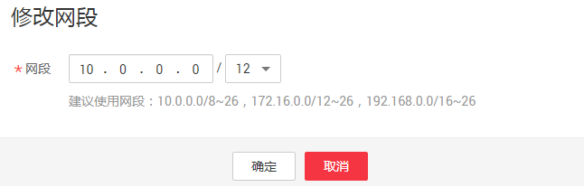

# 修改队列网段

## 操作场景

根据实际使用情况，您可以通过修改网段操作更改包年包月队列的网段。

> **说明：**   
>如果待修改网段的队列中有正在提交或正在运行的作业，或者改队列已经绑定了增强型跨源，将不支持修改网段操作。  

## 操作步骤

1.  在DLI管理控制台的顶部菜单栏中，选择“队列管理“。
2.  选择待修改的队列，单击“操作“列中的“修改网段“。

    **图 1**  修改网段  
    

3.  填写需要的网段后，单击“确定“。

    不同CU规格队列支持的网段范围如下：

    -   64cu

        10.0.0.0/8 \~ 10.255.255.0/24

        172.16.0.0/12 \~ 172.31.255.0/24

        192.168.0.0/16 \~ 192.168.255.0/24

    -   256cu

        10.0.0.0/8 \~ 10.255.252.0/22

        172.16.0.0/12 \~ 172.31.252.0/22

        192.168.0.0/16 \~ 192.168.252.0/22

    -   512cu

        10.0.0.0/8 \~ 10.255.252.0/21

        172.16.0.0/12 \~ 172.31.252.0/21

        192.168.0.0/16 \~ 192.168.252.0/21

