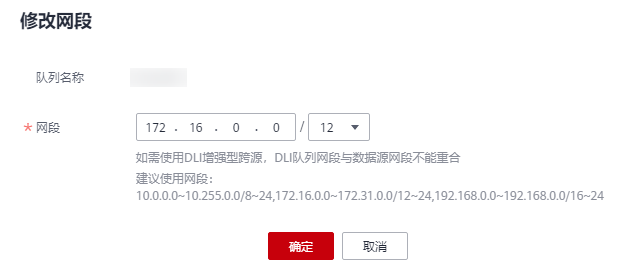

# 修改队列网段

使用增强型跨源时，如果DLI队列的网段和用户数据源的网段发生冲突，您可以通过修改网段操作更改包年包月队列的网段。

> **说明：** 
>如果待修改网段的队列中有正在提交或正在运行的作业，或者改队列已经绑定了增强型跨源，将不支持修改网段操作。

## 修改队列网段步骤

1.  在DLI管理控制台左侧，选择“队列管理“。
2.  选择待修改的队列，单击“操作“列“更多”中的“修改网段“。

    **图 1**  修改网段  
    

3.  填写需要的网段后，单击“确定“。

    建议使用网段：

    10.0.0.0\~10.255.0.0/8\~24

    172.16.0.0\~172.31.0.0/12\~24

    192.168.0.0\~192.168.0.0/16\~24

