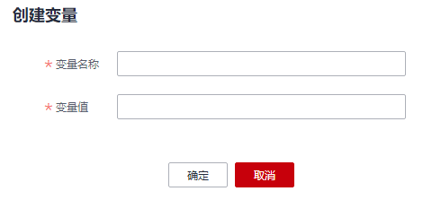

# 全局变量<a name="dli_01_0476"></a>

全局变量可用于替换SQL作业中的敏感数据，保护用户关键信息。

## 创建变量<a name="section1910480202411"></a>

1.  在DLI控制台左侧导航栏中单击“全局变量”。
2.  在“全局变量”页面，单击右上角“创建变量”，可创建新的全局变量。

    **图 1**  创建全局变量<a name="fig9497181162010"></a>  
    

    **表 1**  创建变量参数说明

    <a name="table15710625151416"></a>
    <table><thead align="left"><tr id="row1771212551410"><th class="cellrowborder" valign="top" width="20%" id="mcps1.2.3.1.1"><p id="p4713132520147"><a name="p4713132520147"></a><a name="p4713132520147"></a>参数名称</p>
    </th>
    <th class="cellrowborder" valign="top" width="80%" id="mcps1.2.3.1.2"><p id="p1971410256146"><a name="p1971410256146"></a><a name="p1971410256146"></a>描述</p>
    </th>
    </tr>
    </thead>
    <tbody><tr id="row207191525121418"><td class="cellrowborder" valign="top" width="20%" headers="mcps1.2.3.1.1 "><p id="p5721152541411"><a name="p5721152541411"></a><a name="p5721152541411"></a>变量名称</p>
    </td>
    <td class="cellrowborder" valign="top" width="80%" headers="mcps1.2.3.1.2 "><p id="p856985812415"><a name="p856985812415"></a><a name="p856985812415"></a>所创建的全局变量名称。</p>
    </td>
    </tr>
    <tr id="row18950651122515"><td class="cellrowborder" valign="top" width="20%" headers="mcps1.2.3.1.1 "><p id="p179511651202515"><a name="p179511651202515"></a><a name="p179511651202515"></a>变量值</p>
    </td>
    <td class="cellrowborder" valign="top" width="80%" headers="mcps1.2.3.1.2 "><p id="p495112513251"><a name="p495112513251"></a><a name="p495112513251"></a>全局变量的值。</p>
    </td>
    </tr>
    </tbody>
    </table>

3.  创建全局变量之后，在SQL语法中使用“\{\{xxxx\}\}”代替设置为全局变量的参数值即可，其中“xxxx”为变量名称。例如，在DWS跨源建表语句中，设置参数“password”的值“123”为全局变量“abc”，即可用“\{\{abc\}\}”代替实际的变量值。

    ```
    CREATE TABLE 'dws_test_var'
      USING dws
      OPTIONS (
        'url' '****', //实际使用时，请配置对应的URL 
        'dbtable' 'dbadmin.customer',  
        'user' 'dbadmin',  
        'password' '{{abc}}'
    )
    ```

    > **说明：** 
    >建表时，建议不要在OPTIONS中使用加密变量，因为在使用show table语句时可能会泄露信息。


## 修改变量<a name="section17117296169"></a>

在“全局变量”页面，单击变量“操作”列中的“修改变量”，可修改对应的变量值。

## 删除变量<a name="section15942174351618"></a>

在“全局变量”页面，单击变量“操作”列中的“删除变量”，可删除对应的变量。

> **说明：** 
>-   只有创建全局变量的用户才可以删除对应的变量。
>-   变量删除后，SQL中将无法使用该变量。

