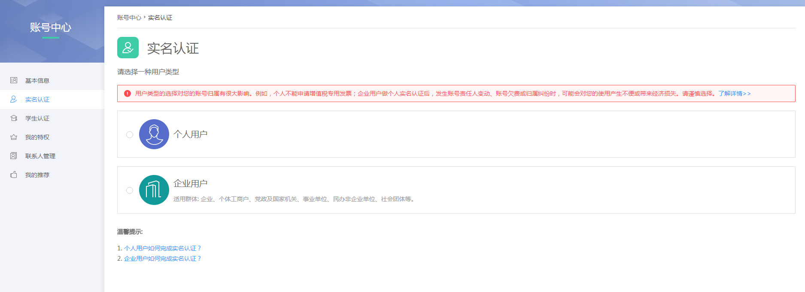
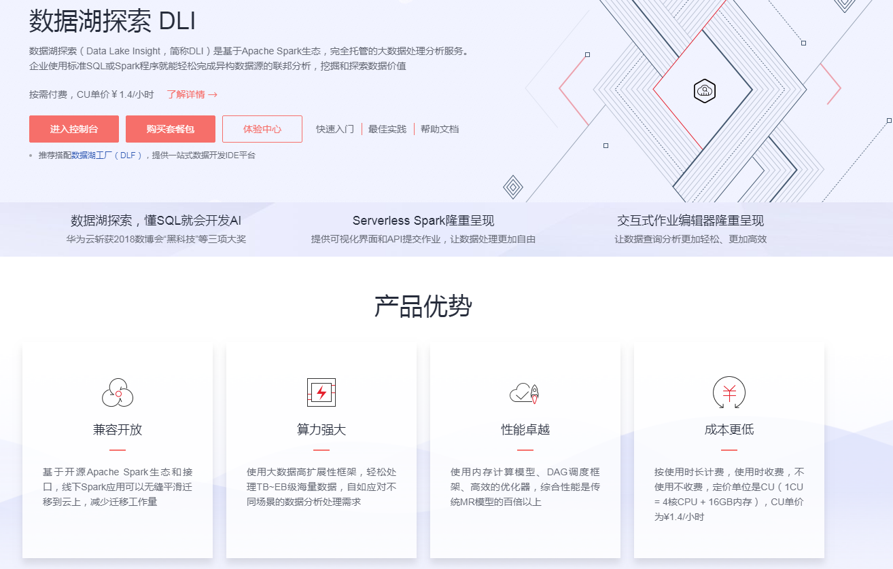
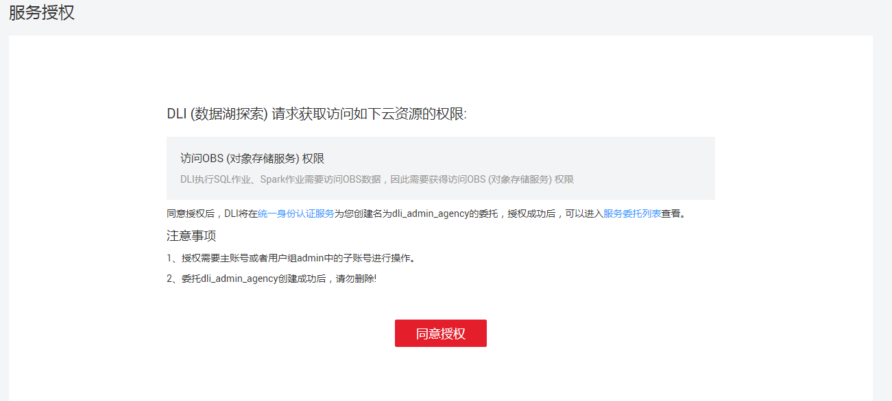

# 准备工作

使用数据湖探索服务之前，您需要注册华为云账号，进行实名认证并授权。

## 注册华为云账号

1.  登录华为云官方网站[http://www.huaweicloud.com/](http://www.huaweicloud.com/)。
2.  单击华为云官网右上角“注册”进入注册页面。

    **图 1**  华为云注册页面  
    

3.  填写“账号名”、“密码”和“手机号”，单击“免费获取短信验证码”按钮，系统将会发送验证码至手机，填写验证码，勾选“我已阅读并同意《华为云用户协议》和《隐私政策声明》”，单击“同意协议并注册”。

## 实名认证

根据国家法律规定，所有用户必须完成实名认证后才能使用云服务。

1.  登录华为云后，单击界面右上角用户名，再单击“实名认证”。
2.  在[图2](#zh-cn_topic_0093130136_fig7281694145818)中选择“个人用户”或“企业用户”。

    **图 2**  实名认证  
    

3.  根据提示信息完成实名认证。

## 授权

登录华为云，第一次进入数据湖探索管理控制台需要进行授权。

1.  账号登录后，在[数据湖探索产品页面](https://www.huaweicloud.com/product/dli.html)，单击“进入控制台”。

    **图 3**  数据湖探索产品页面  
    

2.  第一次进入管理控制台，会跳转到“服务授权”页面，如[图4](#fig3222348151611)所示，单击“同意授权”，进入管理控制台“总览”页面。

    **图 4**  服务授权  
    

