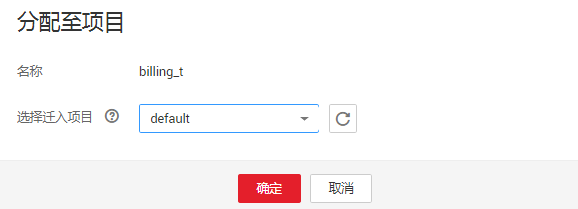

# 分配至项目

## 操作场景

根据实际使用情况，您可以通过分配至项目操作更改队列所属项目。

> **说明：**   
>企业项目是一种云资源管理方式，企业项目管理服务提供统一的云资源按项目管理，以及项目内的资源管理、成员管理。  
>只有开通了企业管理服务的用户才显示该参数。  

## 操作步骤

1.  在DLI管理控制台的顶部菜单栏中，选择“队列管理“。
2.  选择待修改的队列，单击“操作“列中的“分配至项目“。

    **图 1**  分配至项目  
    

3.  选择需要迁入的项目后，单击“确定“。

