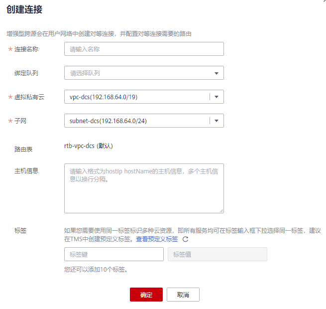

# 创建/查找/删除增强型跨源连接

## 创建增强型跨源连接

以创建MRS服务HBase跨源连接为例进行说明。

> **说明：** 
>只支持通过增强型跨源访问MRS HBase。

1.  在MRS服务中购买集群。

    如果已有可用集群，可不用重新购买。

2.  在DLI管理控制台左侧导航栏中，选择“跨源连接“。
3.  选择“增强型跨源”页签，单击左上角的“创建”按钮。

    输入连接名称，选择绑定队列（可选），虚拟私有云，子网，输入主机信息（可选），详细参数介绍请参见[表1](#table24931148155220)。

    **图 1**  创建跨源连接  
    

    **表 1**  参数说明

    
    <table><thead align="left"><tr id="row1149712486527"><th class="cellrowborder" valign="top" width="15.920000000000002%" id="mcps1.2.3.1.1">
参数

    </th>
    <th class="cellrowborder" valign="top" width="84.08%" id="mcps1.2.3.1.2">
参数说明

    </th>
    </tr>
    </thead>
    <tbody><tr id="row1350324845215"><td class="cellrowborder" valign="top" width="15.920000000000002%" headers="mcps1.2.3.1.1 ">
连接名称

    </td>
    <td class="cellrowborder" valign="top" width="84.08%" headers="mcps1.2.3.1.2 ">
所创建的跨源连接名称。

    <ul id="ul185072486523"><li>名称只能包含数字、英文字母、下划线。不能为空。</li><li>输入长度不能超过64个字符。</li></ul>
    </td>
    </tr>
    <tr id="row113282120419"><td class="cellrowborder" valign="top" width="15.920000000000002%" headers="mcps1.2.3.1.1 ">
绑定队列

    </td>
    <td class="cellrowborder" valign="top" width="84.08%" headers="mcps1.2.3.1.2 ">
可选参数，用于绑定需要使用跨源的包年包月或按需专属队列。

    
 说明： 

使用增强型跨源连接之前必须绑定队列且对等连接的状态是“active”。

    

    </td>
    </tr>
    <tr id="row7764655142317"><td class="cellrowborder" valign="top" width="15.920000000000002%" headers="mcps1.2.3.1.1 ">
虚拟私有云

    </td>
    <td class="cellrowborder" valign="top" width="84.08%" headers="mcps1.2.3.1.2 ">
目的数据源所使用的虚拟私有云。

    </td>
    </tr>
    <tr id="row1095810374248"><td class="cellrowborder" valign="top" width="15.920000000000002%" headers="mcps1.2.3.1.1 ">
子网

    </td>
    <td class="cellrowborder" valign="top" width="84.08%" headers="mcps1.2.3.1.2 ">
目的数据源所使用的子网。

    </td>
    </tr>
    <tr id="row66632128462"><td class="cellrowborder" valign="top" width="15.920000000000002%" headers="mcps1.2.3.1.1 ">
路由表

    </td>
    <td class="cellrowborder" valign="top" width="84.08%" headers="mcps1.2.3.1.2 ">
显示子网实际绑定的路由表。

    
 说明： 
<ul id="ul17762151184110"><li>此处的路由表为目的数据源子网关联的路由表，不同于“路由信息”中的路由。“路由信息”中的路由为所绑定的队列下子网关联的路由表中的路由。</li><li>目的数据源子网与队列所在子网为不同的子网，否则会造成网段冲突。</li></ul>
    

    </td>
    </tr>
    <tr id="row11771019513"><td class="cellrowborder" valign="top" width="15.920000000000002%" headers="mcps1.2.3.1.1 ">
主机信息

    </td>
    <td class="cellrowborder" valign="top" width="84.08%" headers="mcps1.2.3.1.2 ">
可选参数，访问MRS的HBase集群时需要配置Zookeeper实例的主机名与对应的IP地址。每行填写一条记录，填写格式为：“IP 主机名/域名”。

    
获取MRS集群主机名与IP地址，步骤如下：

    <ol id="ol34131830476"><li>登录MRS管理控制台页面。</li><li>单击“集群列表 &gt; 现有集群”，在集群列表中单击指定的集群名称，进入集群信息页面。</li><li>选择“服务管理”页签；</li><li>单击进入“Zookeeper”服务；</li><li>选择“实例”页签，可以查看对应业务IP，可选择任意一个业务IP。</li></ol>
    
 说明： 

如果MapReduce服务集群存在多个IP，创建跨源连接时填写其中任意一个业务IP即可。

    

    </td>
    </tr>
    <tr id="row342117278453"><td class="cellrowborder" valign="top" width="15.920000000000002%" headers="mcps1.2.3.1.1 ">
标签

    </td>
    <td class="cellrowborder" valign="top" width="84.08%" headers="mcps1.2.3.1.2 ">
使用标签标识云资源。包括“标签键”和“标签值”。如果您需要使用同一标签标识多种云资源，即所有服务均可在标签输入框下拉选择同一标签，建议在标签管理服务（TMS）中创建预定义标签。具体请参考《<a href="https://support.huaweicloud.com/usermanual-tms/zh-cn_topic_0056266269.html" target="_blank" rel="noopener noreferrer">标签管理服务用户指南</a>》。

    
 说明： 
<ul id="ul1972873412320"><li>最多支持10个标签。</li><li>一个“键”只能添加一个“值”。</li></ul>
    

    <ul id="ul55819552289"><li>标签键：在输入框中输入标签键名称。
 说明： 

标签键的最大长度为36个字符 ，只能包含大小写字母，数字，中划线“-”，下划线“_”，中文，且首尾字符不能为空格。

    

    </li><li>标签值：在输入框中输入标签值。
 说明： 

标签值的最大长度为43个字符，只能包含大小写字母，数字，中划线“-”，下划线“_”，点“.”中文，且首尾字符不能为空格。

    

    </li></ul>
    </td>
    </tr>
    </tbody>
    </table>

4.  单击“确定“，完成连接创建。
5.  （可选）创建增强型跨源连接之后，如需进行进一步的跨源分析，请参考[跨源分析开发方式参考](跨源连接和跨源分析概述.md#section12839810151415)。

## 查找增强型跨源连接

在“增强型跨源“页面，可在搜索框中输入连接名称关键字，查找与之匹配的连接。

## 查看增强型跨源连接详情

在“增强型跨源“页面，选中一条连接，单击该连接对应的，可查看该条连接的详细信息。包括：连接ID和主机信息。

## 删除增强型跨源连接

在“增强型跨源“页面，可单击“操作”列的“删除连接“，删除不需要的连接。

> **说明：** 
>当“连接状态“为“创建中“时，连接不可删除。

