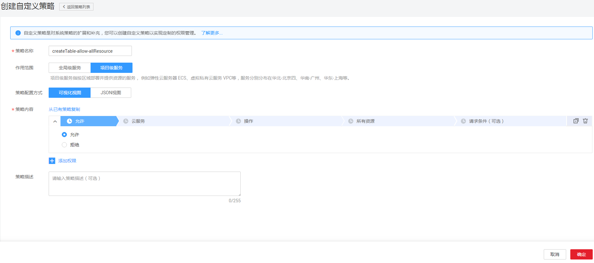
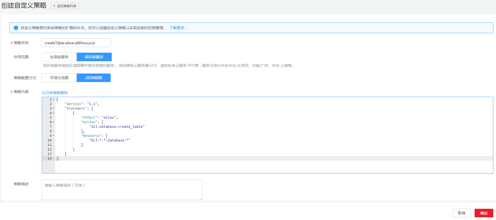

# 创建DLI自定义策略<a name="dli_01_0451"></a>

如果系统预置的DLI权限，不满足您的授权要求，可以创建自定义策略。自定义策略中可以添加的授权项（Action）请参考[权限策略和授权项](https://support.huaweicloud.com/api-dli/dli_02_0201.html)。

目前华为云支持以下两种方式创建自定义策略：

-   可视化视图创建自定义策略：无需了解策略语法，按可视化视图导航栏选择云服务、操作、资源、条件等策略内容，可自动生成策略。
-   JSON视图创建自定义策略：可以在选择策略模板后，根据具体需求编辑策略内容；也可以直接在编辑框内编写JSON格式的策略内容。

以下以定制一个用户创建“createTable-allow-allResource”的策略为例，创建一个仅支持创建表的自定义策略。

分别采用可视化视图和JSON视图的配置方式创建自定义策略。

## 前提条件<a name="section1783020250912"></a>

-   请先在IAM控制台中开通细粒度策略，开通方法请参见：[申请细粒度访问控制公测](https://support.huaweicloud.com/usermanual-iam/iam_01_019.html)。
-   自定义策略需要编写策略（JSON格式），请您先熟悉策略结构，具体请参见[细粒度策略语法](https://support.huaweicloud.com/usermanual-iam/iam_01_0017.html)。
-   请确定自定义策略需要允许哪些操作，拒绝哪些操作，并获取操作对应的授权项。授权项请参见[权限策略和授权项](https://support.huaweicloud.com/api-dli/dli_02_0201.html)。

## 可视化视图配置自定义策略<a name="section1685812251199"></a>

1.  在IAM控制台，单击左侧导航栏的“权限”，在右上角选择“创建自定义策略”。

    **图 1**  创建自定义策略<a name="fig6544184319582"></a>  
    

2.  在“创建自定义策略”中，填写如下参数。

    **图 2**  可视化视图<a name="fig8827151112591"></a>  
    

    -   “策略名称”：填写“createTable-allow-allResource”。
    -   “作用范围”：根据服务的属性填写，DLI为项目级服务，选择“项目级服务”。
    -   策略配置方式：选择“可视化视图”。
    -   策略内容：
        1.  选择“允许”。
        2.  在“云服务”中选择“数据湖探索”。
        3.  在“操作”中勾选“ReadWrite”中的“dli:database:create\_table”,即“创建表”。

3.  单击“确定”，自定义策略创建成功。

## JSON视图配置自定义策略<a name="section43511232165010"></a>

1.  在IAM控制台，单击左侧导航栏的“策略”，在右上角选择“创建自定义策略”。

    **图 3**  创建自定义策略<a name="fig119085995011"></a>  
    

2.  在“创建自定义策略”中，填写如下参数。

    **图 4**  JSON视图<a name="fig1721735861511"></a>  
    

    -   策略名称：填写“createTable-allow-allResource”。
    -   作用范围：根据服务的属性填写，DLI为项目级服务，选择“项目级服务”。
    -   策略配置方式：选择“Json视图”。
    -   策略内容：

        -   将如下内容拷贝至策略内容中。如下策略表示允许创建表。

            ```
            {
                    "Version": "1.1",
                    "Statement": [
                            {
                                   "Effect": "Allow",
                                   "Action": [
                                             "dli:database:create_table"
                                   ],
                                   "Resource": [
                                              "DLI:*:*:database:*"
                                   ]
                            }
                    ]
            }
            ```

        -   从已有策略复制：可选择已有策略复制后，再根据需要修改。

        系统会自动校验语法，若有错误，对应行号将会标红。

3.  单击“确定”，如跳转到策略列表，则自定义策略创建成功；如提示“策略内容错误”，请按照语法规范进行修改。

## 验证定义策略权限<a name="section194697331146"></a>

1.  将新创建的自定义策略授予用户组，使得用户组中的用户仅具备创建表的权限。
2.  用户登录并验证自定义策略定义的权限：createTable-allow-allResource。

    权限授予成功后，用户可以通过控制台以及REST API等多种方式验证。此处以登录控制台为例，介绍用户如何验证编辑作业的权限。

    1.  使用新创建的用户登录华为云，登录方法选择为“IAM用户登录”。
        -   账号名为该IAM用户所属华为云账号的名称。
        -   用户名和密码为账号在IAM创建用户时输入的用户名和密码。

    2.  在DLI管理控制台，进行创建表操作，操作成功，权限配置正确并已生效。
    3.  尝试进行其他操作，例如：导入数据。

        系统显示“权限不足”，权限配置正确并已生效。

        > **说明：**   
        >由于缓存的存在，对用户和用户组授予OBS相关的RBAC策略后，大概需要等待13分钟RBAC策略才能生效；授予细粒度策略后，大概需要等待5分钟细粒度策略才能生效。  


## 策略样例<a name="section1493518251395"></a>

-   示例1：允许
    -   授权用户拥有在所有区域中所有数据库的创建表权限

        ```
        {
            "Version": "1.1",
            "Statement": [
                {
                    "Effect": "Allow",
                    "Action": [
                        "dli:database:create_table"
                    ],
                    "Resource": [
                        "dli:*:*:database:*"
                    ]
                }
            ]
        }
        ```

    -   授权用户拥有在所在区域中数据库db中表tb中列col的查询权限

        ```
        {
            "Version": "1.1",
            "Statement": [
                {
                    "Effect": "Allow",
                    "Action": [
                        "dli:column:select"
                    ],
                    "Resource": [
                        "dli:cn-north-7:*:column:databases.db.tables.tb.columns.col"
                    ]
                }
            ]
        }
        ```


-   示例2：拒绝

    拒绝策略需要同时配合其他策略使用，否则没有实际作用。用户被授予的策略中，一个授权项的作用如果同时存在Allow和Deny，则遵循Deny优先。

-   授权用户不能创建数据库，删除数据库，提交作业（default队列除外），删除表

    ```
    {
        "Version": "1.1",
        "Statement": [
            {
                "Effect": "Deny",
                "Action": [
                    "dli:database:create_database",
                    "dli:database:drop_database",
                    "dli:queue:submit_job",
                    "dli:table:drop_table"
                ],
                "Resource": [
                    "dli:*:*:database:*",
                    "dli:*:*:queue:*",
                    "dli:*:*:table:*"
                ]
            }
        ]
    }
    ```

-   授权用户不能在队列名为demo的队列上提交作业

    ```
    {
        "Version": "1.1",
        "Statement": [
            {
                "Effect": "Deny",
                "Action": [
                    "dli:queue:submit_job"
                ],
                "Resource": [
                    "dli:*:*:queue:queues.demo"
                ]
            }
        ]
    }
    ```


