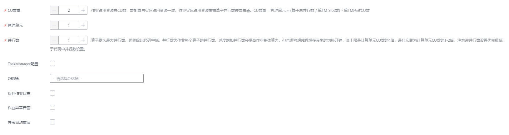

# 创建Flink Jar作业

本章节介绍如何新建Flink Jar作业。用户可以基于Flink的API进行二次开发，构建自己的应用Jar包并提交到DLI的队列运行，DLI完全兼容开源社区接口。此功能需要用户自己编写并构建应用Jar包，适合对Flink二次开发有一定了解，并对流计算处理复杂度要求较高的用户。

## 前提条件

-   确保已创建独享队列。
-   创建Flink Jar作业，访问其他外部数据源时，如访问OpenTSDB、HBase、Kafka、DWS、RDS、CSS、CloudTable、DCS Redis、DDS Mongo等，需要先创建跨源连接，打通作业运行队列到外部数据源之间的网络。

    -   当前Flink作业支持访问的外部数据源详情请参考[跨源连接和跨源分析概述](跨源连接和跨源分析概述.md)。
    -   创建跨源连接操作请参见[增强型跨源连接（推荐）](增强型跨源连接（推荐）.md)。

        创建完跨源连接后，可以通过“队列管理“页面，单击“操作“列“更多”中的“测试地址连通性”，验证队列到外部数据源之间的网络连通是否正常。详细操作可以参考[测试地址连通性](测试地址连通性.md)。

-   用户运行Flink Jar作业时，需要将二次开发的应用代码构建为Jar包，上传到已经创建的OBS桶中。并在DLI“数据管理”\>“程序包管理”页面创建程序包，具体请参考[创建程序包](创建程序包.md)。

    > **说明：** 
    >DLI不支持下载功能，如果需要更新已上传的数据文件，可以将本地文件更新后重新上传。

-   由于DLI服务端已经内置了Flink的依赖包，并且基于开源社区版本做了安全加固。为了避免依赖包兼容性问题或日志输出及转储问题，打包时请注意排除以下文件：
    -   系统内置的依赖包，或者在Maven或者Sbt构建工具中将scope设为provided
    -   日志配置文件（例如：“log4j.properties”或者“logback.xml”等）
    -   日志输出实现类JAR包（例如：log4j等）

## 创建Flink Jar作业

1.  在DLI管理控制台的左侧导航栏中，单击“作业管理“\>“Flink作业“，进入“Flink作业“页面。
2.  在“Flink作业“页面右上角单击“新建作业“，弹出“新建作业“对话框。

    **图 1**  新建Flink Jar作业  
    

3.  配置作业信息。

    **表 1**  作业配置信息

    
    <table><thead align="left"><tr id="row13672324503"><th class="cellrowborder" valign="top" width="14.48%" id="mcps1.2.3.1.1">
参数

    </th>
    <th class="cellrowborder" valign="top" width="85.52%" id="mcps1.2.3.1.2">
参数说明

    </th>
    </tr>
    </thead>
    <tbody><tr id="row206721244013"><td class="cellrowborder" valign="top" width="14.48%" headers="mcps1.2.3.1.1 ">
类型

    </td>
    <td class="cellrowborder" valign="top" width="85.52%" headers="mcps1.2.3.1.2 ">
选择Flink Jar。

    </td>
    </tr>
    <tr id="row96731524306"><td class="cellrowborder" valign="top" width="14.48%" headers="mcps1.2.3.1.1 ">
名称

    </td>
    <td class="cellrowborder" valign="top" width="85.52%" headers="mcps1.2.3.1.2 ">
作业名称，只能由英文、中文、数字、中划线和下划线组成，并且长度为1～57字节。

    
 说明： 

作业名称必须是唯一的。

    

    </td>
    </tr>
    <tr id="row9673142411010"><td class="cellrowborder" valign="top" width="14.48%" headers="mcps1.2.3.1.1 ">
描述

    </td>
    <td class="cellrowborder" valign="top" width="85.52%" headers="mcps1.2.3.1.2 ">
作业的相关描述，且长度为0～512字节。

    </td>
    </tr>
    <tr id="row19732328111712"><td class="cellrowborder" valign="top" width="14.48%" headers="mcps1.2.3.1.1 ">
标签

    </td>
    <td class="cellrowborder" valign="top" width="85.52%" headers="mcps1.2.3.1.2 ">
使用标签标识云资源。包括“标签键”和“标签值”。如果您需要使用同一标签标识多种云资源，即所有服务均可在标签输入框下拉选择同一标签，建议在标签管理服务（TMS）中创建预定义标签。具体请参考《<a href="https://support.huaweicloud.com/usermanual-tms/zh-cn_topic_0056266269.html" target="_blank" rel="noopener noreferrer">标签管理服务用户指南</a>》。

    
 说明： 
<ul id="ul1972873412320"><li>最多支持10个标签。</li><li>一个“键”只能添加一个“值”。</li></ul>
    

    <ul id="ul55819552289"><li>标签键：在输入框中输入标签键名称。
 说明： 

标签键的最大长度为36个字符 ，只能包含大小写字母，数字，中划线“-”，下划线“_”，中文，且首尾字符不能为空格。

    

    </li><li>标签值：在输入框中输入标签值。
 说明： 

标签值的最大长度为43个字符，只能包含大小写字母，数字，中划线“-”，下划线“_”，点“.”中文，且首尾字符不能为空格。

    

    </li></ul>
    </td>
    </tr>
    </tbody>
    </table>

4.  单击“确定“，进入“编辑“页面。
5.  选择队列。Flink Jar作业只能运行在通用队列上。

    > **说明：** 
    >-   Flink Jar作业只能运行在预先创建的独享队列上。
    >-   如果“所属队列“下拉框中无可用的独享队列，请先创建一个独享队列并将该队列绑定到当前用户。

    **图 2**  选择队列  
    

6.  上传Jar包。

    **图 3**  上传Jar包  
    

    **表 2**  参数说明

    
    <table><thead align="left"><tr id="row93797534586"><th class="cellrowborder" valign="top" width="16.59%" id="mcps1.2.3.1.1">
名称

    </th>
    <th class="cellrowborder" valign="top" width="83.41%" id="mcps1.2.3.1.2">
描述

    </th>
    </tr>
    </thead>
    <tbody><tr id="row15461316185210"><td class="cellrowborder" valign="top" width="16.59%" headers="mcps1.2.3.1.1 ">
应用程序

    </td>
    <td class="cellrowborder" valign="top" width="83.41%" headers="mcps1.2.3.1.2 ">
用户自定义的程序包。在选择程序包之前需要将对应的Jar包上传至OBS桶中，并在“数据管理&gt;程序包管理”中创建程序包，具体操作请参考<a href="创建程序包.md">创建程序包</a>。内置依赖包请参考<a href="内置依赖包.md#section38822016193611">Flink 1.7.2 依赖包</a>和<a href="内置依赖包.md#section269411551620">Flink 1.10依赖包</a>。

    </td>
    </tr>
    <tr id="row192231446165220"><td class="cellrowborder" valign="top" width="16.59%" headers="mcps1.2.3.1.1 ">
主类

    </td>
    <td class="cellrowborder" valign="top" width="83.41%" headers="mcps1.2.3.1.2 ">
指定加载的Jar包类名，如KafkaMessageStreaming。

    <ul id="ul5801313537"><li>默认：根据Jar包文件的Manifest文件指定。</li><li>指定：必须输入“类名”并确定类参数列表（参数间用空格分隔）。</li></ul>
    
 说明： 

当类属于某个包时，需携带包路径，例如：packagePath.KafkaMessageStreaming

    

    </td>
    </tr>
    <tr id="row15380135310587"><td class="cellrowborder" valign="top" width="16.59%" headers="mcps1.2.3.1.1 ">
参数

    </td>
    <td class="cellrowborder" valign="top" width="83.41%" headers="mcps1.2.3.1.2 ">
指定类的参数列表，参数之间使用空格分隔。

    
Flink参数支持全局变量替换。例如，在“全局配置”&gt;“全局变量”中新增全局变量windowsize，Flink Jar作业就可以添加参数-windowsSize {{windowsize}}。

    </td>
    </tr>
    <tr id="row12301623195314"><td class="cellrowborder" valign="top" width="16.59%" headers="mcps1.2.3.1.1 ">
依赖jar包

    </td>
    <td class="cellrowborder" valign="top" width="83.41%" headers="mcps1.2.3.1.2 ">
用户自定义的依赖程序包。依赖jar包将会放至classpath下。

    
在选择程序包之前需要将对应的Jar包上传至OBS桶中，并在“数据管理&gt;程序包管理”中创建程序包，包类型选择“jar”。具体操作请参考<a href="创建程序包.md">创建程序包</a>。

    
内置依赖包请参考<a href="内置依赖包.md#section38822016193611">Flink 1.7.2 依赖包</a>和<a href="内置依赖包.md#section269411551620">Flink 1.10依赖包</a>。

    </td>
    </tr>
    <tr id="row13931205210125"><td class="cellrowborder" valign="top" width="16.59%" headers="mcps1.2.3.1.1 ">
其他依赖文件

    </td>
    <td class="cellrowborder" valign="top" width="83.41%" headers="mcps1.2.3.1.2 ">
用户自定义的依赖文件。其他依赖文件需要自行在代码中引用。

    
在选择依赖文件之前需要将对应的文件上传至OBS桶中，并在“数据管理&gt;程序包管理”中创建程序包，包类型没有限制。具体操作请参考<a href="创建程序包.md">创建程序包</a>。

    
通过在应用程序中添加以下内容可访问对应的依赖文件。其中，“fileName”为需要访问的文件名，“ClassName”为需要访问该文件的类名。

    <pre class="screen" id="screen43817144438">ClassName.class.getClassLoader().getResource("userData/fileName")</pre>
    </td>
    </tr>
    <tr id="row10591165961212"><td class="cellrowborder" valign="top" width="16.59%" headers="mcps1.2.3.1.1 ">
作业特性

    </td>
    <td class="cellrowborder" valign="top" width="83.41%" headers="mcps1.2.3.1.2 ">
队列为CCE队列时，显示该参数。

    <ul id="ul0567338162420"><li>基础型</li><li>自定义镜像：选择镜像名称和镜像版本。用户可在“容器镜像服务”设置的镜像。具体操作请参考《<a href="https://support.huaweicloud.com/usermanual-swr/swr_01_0012.html" target="_blank" rel="noopener noreferrer">容器镜像服务用户指南</a>》。</li></ul>
    </td>
    </tr>
    <tr id="row1519191642610"><td class="cellrowborder" valign="top" width="16.59%" headers="mcps1.2.3.1.1 ">
Flink版本

    </td>
    <td class="cellrowborder" valign="top" width="83.41%" headers="mcps1.2.3.1.2 ">
选择Flink版本前，需要先选择所属的队列。当前支持“1.10”和“1.11”版本。

    </td>
    </tr>
    <tr id="row5287183685317"><td class="cellrowborder" valign="top" width="16.59%" headers="mcps1.2.3.1.1 ">
自定义配置

    </td>
    <td class="cellrowborder" valign="top" width="83.41%" headers="mcps1.2.3.1.2 ">
用户自定义的优化参数。参数格式为key=value。

    
Flink优化参数支持全局变量替换。例如，在“全局配置”&gt;“全局变量”中新增全局变量phase，Flink Jar作业就可以添加优化参数table.optimizer.agg-phase.strategy={{phase}}。

    </td>
    </tr>
    </tbody>
    </table>

7.  配置作业参数。

    **图 4**  配置参数  
    

    **表 3**  参数说明

    
    <table><thead align="left"><tr id="row145620521843"><th class="cellrowborder" valign="top" width="16.24%" id="mcps1.2.3.1.1">
名称

    </th>
    <th class="cellrowborder" valign="top" width="83.76%" id="mcps1.2.3.1.2">
描述

    </th>
    </tr>
    </thead>
    <tbody><tr id="row359118526411"><td class="cellrowborder" valign="top" width="16.24%" headers="mcps1.2.3.1.1 ">
CU数量

    </td>
    <td class="cellrowborder" valign="top" width="83.76%" headers="mcps1.2.3.1.2 ">
一个CU为1核4G的资源量。CU数量范围为2~400个。

    </td>
    </tr>
    <tr id="row14595175219417"><td class="cellrowborder" valign="top" width="16.24%" headers="mcps1.2.3.1.1 ">
管理单元

    </td>
    <td class="cellrowborder" valign="top" width="83.76%" headers="mcps1.2.3.1.2 ">
设置管理单元的CU数，支持设置1~4个CU，默认值为1个CU。

    </td>
    </tr>
    <tr id="row959914521147"><td class="cellrowborder" valign="top" width="16.24%" headers="mcps1.2.3.1.1 ">
最大并行数

    </td>
    <td class="cellrowborder" valign="top" width="83.76%" headers="mcps1.2.3.1.2 ">
作业中每个算子的最大并行数。

    
 说明： 
<ul id="ul1660513521547"><li>并行数不能大于计算单元（CU数量-管理单元CU数量）的4倍。</li><li>并行数最好大于用户作业里设置的并发数，否则有可能提交失败。</li></ul>
    

    </td>
    </tr>
    <tr id="row1533272464411"><td class="cellrowborder" valign="top" width="16.24%" headers="mcps1.2.3.1.1 ">
TaskManager配置

    </td>
    <td class="cellrowborder" valign="top" width="83.76%" headers="mcps1.2.3.1.2 ">
用于设置TaskManager资源参数。

    
勾选后需配置下列参数：

    <ul id="ul206731739155015"><li>“单TM所占CU数”：每个TaskManager占用的资源数量。</li><li>“单TM Slot”：每个TaskManager包含的Slot数量。</li></ul>
    </td>
    </tr>
    <tr id="row1760615210415"><td class="cellrowborder" valign="top" width="16.24%" headers="mcps1.2.3.1.1 ">
保存作业日志

    </td>
    <td class="cellrowborder" valign="top" width="83.76%" headers="mcps1.2.3.1.2 ">
设置是否将作业运行时的日志信息保存到OBS桶。

    
勾选后需配置下列参数：

    
<strong id="b24618332610">“OBS桶”</strong>：选择OBS桶用于保存用户作业日志信息。如果选择的OBS桶是未授权状态，需要单击“OBS授权”。

    </td>
    </tr>
    <tr id="row13189114720391"><td class="cellrowborder" valign="top" width="16.24%" headers="mcps1.2.3.1.1 ">
作业异常告警

    </td>
    <td class="cellrowborder" valign="top" width="83.76%" headers="mcps1.2.3.1.2 ">
设置是否将作业异常告警信息，如作业出现运行异常或者欠费情况，以SMN的方式通知用户。

    
勾选后需配置下列参数：

    
“SMN主题”：

    
选择一个自定义的SMN主题。如何自定义SMN主题，请参见<a href="https://support.huaweicloud.com/usermanual-smn/smn_ug_42000.html" target="_blank" rel="noopener noreferrer">《消息通知服务用户指南》</a>中“创建主题”章节。

    </td>
    </tr>
    <tr id="row51981436589"><td class="cellrowborder" valign="top" width="16.24%" headers="mcps1.2.3.1.1 ">
异常自动重启

    </td>
    <td class="cellrowborder" valign="top" width="83.76%" headers="mcps1.2.3.1.2 ">
设置是否启动异常自动重启功能，当作业异常时将自动重启并恢复作业。

    
勾选后需配置下列参数：

    <ul id="ul12114713615"><li>“异常重试最大次数”：配置异常重试最大次数。单位为“次/小时”。<ul id="ul1442116221967"><li>无限：无限次重试。</li><li>有限：自定义重试次数。</li></ul>
    </li><li>“从Checkpoint恢复”：从保存的checkpoint恢复作业。
勾选该参数后，还需要选择“Checkpoint路径”。

    
“Checkpoint路径”：选择checkpoint保存路径。必须和应用程序中配置的Checkpoint地址相对应。且不同作业的路径不可一致，否则无法获取准确的Checkpoint。

    </li></ul>
    </td>
    </tr>
    </tbody>
    </table>

8.  单击右上角“保存“，保存作业和相关参数。
9.  单击右上角“启动“，进入“启动Flink作业“页面，确认作业规格和费用，单击“立即启动“，启动作业。

    启动作业后，系统将自动跳转到Flink作业管理页面，新创建的作业将显示在作业列表中，在“状态“列中可以查看作业状态。作业提交成功后，状态将由“提交中“变为“运行中“。运行完成后显示“已完成”。

    如果作业状态为“提交失败“或“运行异常“，表示作业提交或运行失败。用户可以在作业列表中的“状态“列中，将鼠标移动到状态图标上查看错误信息，单击可以复制错误信息。根据错误信息解决故障后，重新提交。

    > **说明：** 
    >其他功能按钮说明如下：
    >另存为：将新建作业另存为一个新作业。

