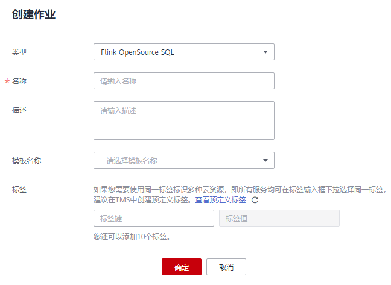
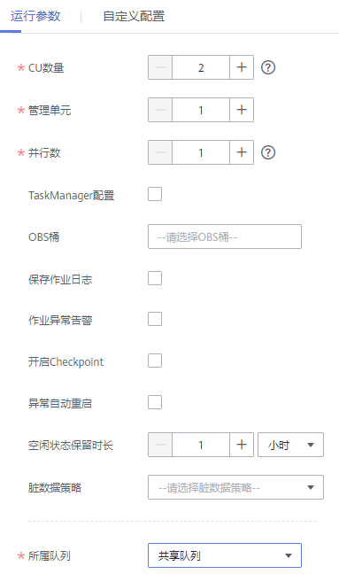
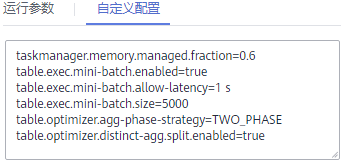
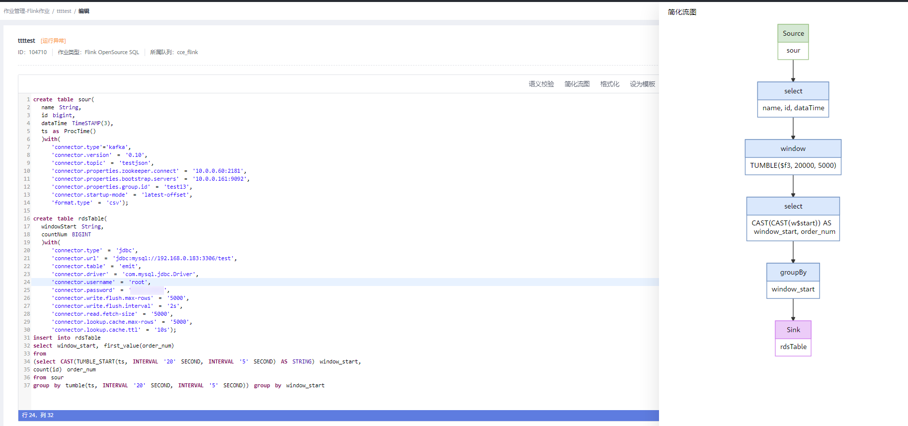
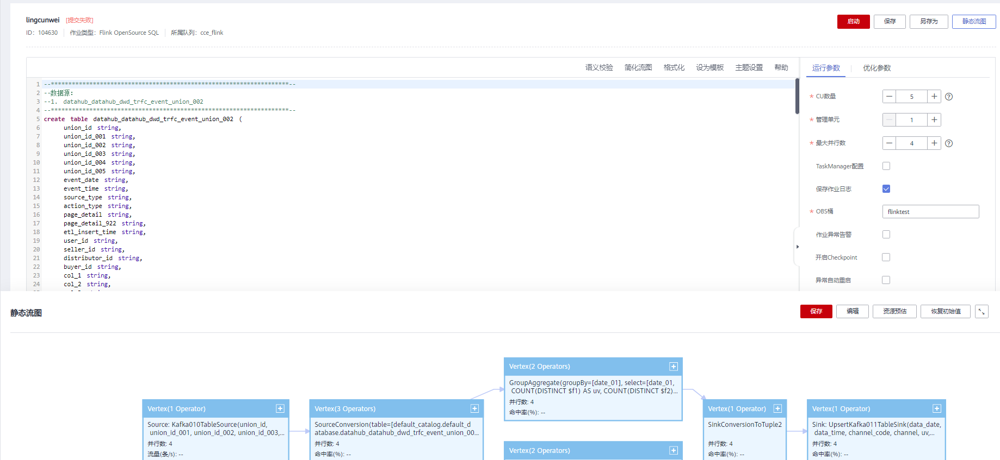

# 创建Flink OpenSource SQL作业

本章节介绍如何新建Flink OpenSource SQL作业。DLI Flink OpenSource SQL类型作业完全兼容社区Flink 1.10版本语法，并在社区connector基础之上，新增了Redis、DWS\(GaussDb\)和DIS数据源类型。社区Flink SQL DDL/DML/函数等语法说明及限制可参考[Table API & SQL](https://ci.apache.org/projects/flink/flink-docs-release-1.10/dev/table/sql/)。新增Redis、DWS\(GaussDb\)和DIS数据源语法请参考《数据湖探索Flink OpenSource SQL语法参考》。

## 前提条件

-   Flink OpenSource SQL类型作业仅支持在K8s集群上提交，使用前，需联系DLI 技术支持开通白名单，创建CCE类型队列。
-   创建Flink OpenSource SQL作业时，需要事先准备数据源以及数据输出通道，具体内容请参见[准备Flink作业数据](准备Flink作业数据.md)。
-   创建Flink OpenSource SQL作业，访问其他外部数据源时，如访问OpenTSDB、HBase、Kafka、DWS、RDS、CSS、CloudTable、DCS Redis、DDS Mongo等，需要先创建跨源连接，打通作业运行队列到外部数据源之间的网络。
    -   当前Flink作业支持访问的外部数据源详情请参考[跨源连接和跨源分析概述](跨源连接和跨源分析概述.md)。
    -   创建跨源连接操作请参见[增强型跨源连接（推荐）](增强型跨源连接（推荐）.md)。

        创建完跨源连接后，可以通过“队列管理“页面，单击“操作“列“更多”中的“测试地址连通性”，验证队列到外部数据源之间的网络连通是否正常。详细操作可以参考[测试地址连通性](测试地址连通性.md)。

## 创建Flink OpenSource SQL作业

1.  在DLI管理控制台的左侧导航栏中，单击“作业管理“\>“Flink作业“，进入“Flink作业“页面。
2.  在“Flink作业“页面右上角单击“创建作业“，弹出“创建作业“对话框。

    **图 1**  创建Flink OpenSource SQL作业  
    

3.  配置作业信息。

    **表 1**  作业配置信息

    
    <table><thead align="left"><tr id="row43591258104111"><th class="cellrowborder" valign="top" width="20%" id="mcps1.2.3.1.1">
参数

    </th>
    <th class="cellrowborder" valign="top" width="80%" id="mcps1.2.3.1.2">
参数说明

    </th>
    </tr>
    </thead>
    <tbody><tr id="row16360958134110"><td class="cellrowborder" valign="top" width="20%" headers="mcps1.2.3.1.1 ">
类型

    </td>
    <td class="cellrowborder" valign="top" width="80%" headers="mcps1.2.3.1.2 ">
选择“Flink OpenSource SQL”：用户通过编辑SQL语句来启动作业。

    </td>
    </tr>
    <tr id="row18361135814119"><td class="cellrowborder" valign="top" width="20%" headers="mcps1.2.3.1.1 ">
名称

    </td>
    <td class="cellrowborder" valign="top" width="80%" headers="mcps1.2.3.1.2 ">
作业名称，只能由字母、中文、数字、中划线和下划线组成，并且长度为1～57字节。

    
 说明： 

作业名称必须是唯一的。

    

    </td>
    </tr>
    <tr id="row93625589418"><td class="cellrowborder" valign="top" width="20%" headers="mcps1.2.3.1.1 ">
描述

    </td>
    <td class="cellrowborder" valign="top" width="80%" headers="mcps1.2.3.1.2 ">
作业的相关描述，长度为0～512字节。

    </td>
    </tr>
    <tr id="row1327063544111"><td class="cellrowborder" valign="top" width="20%" headers="mcps1.2.3.1.1 ">
模板名称

    </td>
    <td class="cellrowborder" valign="top" width="80%" headers="mcps1.2.3.1.2 ">
用户可以选择样例模板或自定义的作业模板。关于模板的详细信息，请参见<a href="Flink模板管理.md">Flink模板管理</a>。

    </td>
    </tr>
    <tr id="row258931813218"><td class="cellrowborder" valign="top" width="20%" headers="mcps1.2.3.1.1 ">
标签

    </td>
    <td class="cellrowborder" valign="top" width="80%" headers="mcps1.2.3.1.2 ">
使用标签标识云资源。包括“标签键”和“标签值”。如果您需要使用同一标签标识多种云资源，即所有服务均可在标签输入框下拉选择同一标签，建议在标签管理服务（TMS）中创建预定义标签。具体请参考《<a href="https://support.huaweicloud.com/usermanual-tms/zh-cn_topic_0056266269.html" target="_blank" rel="noopener noreferrer">标签管理服务用户指南</a>》。

    
 说明： 
<ul id="ul1972873412320"><li>最多支持10个标签。</li><li>一个“键”只能添加一个“值”。</li></ul>
    

    <ul id="ul55819552289"><li>标签键：在输入框中输入标签键名称。
 说明： 

标签键的最大长度为36个字符 ，只能包含大小写字母，数字，中划线“-”，下划线“_”，中文，且首尾字符不能为空格。

    

    </li><li>标签值：在输入框中输入标签值。
 说明： 

标签值的最大长度为43个字符，只能包含大小写字母，数字，中划线“-”，下划线“_”，点“.”中文，且首尾字符不能为空格。

    

    </li></ul>
    </td>
    </tr>
    </tbody>
    </table>

4.  单击“确定“，进入作业“编辑“页面。
5.  编辑OpenSource SQL作业。

    在SQL语句编辑区域，输入详细的SQL语句。相关SQL语句请参考《数据湖探索Flink OpenSource SQL语法参考》。

6.  单击“语义校验“，确保语义校验成功。
    -   只有语义校验成功后，才可以执行“启动“作业的操作。
    -   如果校验成功，提示“SQL语义校验成功”。
    -   如果校验失败，会在错误的SQL语句前面显示红色的“X”记号，鼠标移动到“X”号上可查看详细错误，请根据错误提示修改SQL语句。

7.  设置作业运行参数。

    **图 2**  设置Flink OpenSource SQL作业运行参数  
    

    **表 2**  作业运行参数说明

    
    <table><thead align="left"><tr id="row9220121016203"><th class="cellrowborder" valign="top" width="22.189999999999998%" id="mcps1.2.3.1.1">
参数

    </th>
    <th class="cellrowborder" valign="top" width="77.81%" id="mcps1.2.3.1.2">
参数说明

    </th>
    </tr>
    </thead>
    <tbody><tr id="row1922015100201"><td class="cellrowborder" valign="top" width="22.189999999999998%" headers="mcps1.2.3.1.1 ">
CU数量

    </td>
    <td class="cellrowborder" valign="top" width="77.81%" headers="mcps1.2.3.1.2 ">
CU数量为DLI的计算单元数量和管理单元数量总和，CU也是DLI的计费单位，1CU=1核4G。

    </td>
    </tr>
    <tr id="row13718033152913"><td class="cellrowborder" valign="top" width="22.189999999999998%" headers="mcps1.2.3.1.1 ">
管理单元

    </td>
    <td class="cellrowborder" valign="top" width="77.81%" headers="mcps1.2.3.1.2 ">
管理单元CU数量。

    </td>
    </tr>
    <tr id="row192221910132017"><td class="cellrowborder" valign="top" width="22.189999999999998%" headers="mcps1.2.3.1.1 ">
最大并行数

    </td>
    <td class="cellrowborder" valign="top" width="77.81%" headers="mcps1.2.3.1.2 ">
最大并行数是指同时运行Flink OpenSource SQL作业的最大任务数。

    
 说明： 

最大并行数不能大于计算单元（CU数量-管理单元）的4倍。

    

    </td>
    </tr>
    <tr id="row12186125884412"><td class="cellrowborder" valign="top" width="22.189999999999998%" headers="mcps1.2.3.1.1 ">
TaskManager配置

    </td>
    <td class="cellrowborder" valign="top" width="77.81%" headers="mcps1.2.3.1.2 ">
用于设置TaskManager资源参数。

    
勾选后需配置下列参数：

    <ul id="ul206731739155015"><li>“单TM所占CU数”：每个TaskManager占用的资源数量。</li><li>“单TM Slot”：每个TaskManager包含的Slot数量。</li></ul>
    </td>
    </tr>
    <tr id="row1836772817456"><td class="cellrowborder" valign="top" width="22.189999999999998%" headers="mcps1.2.3.1.1 ">
保存作业日志

    </td>
    <td class="cellrowborder" valign="top" width="77.81%" headers="mcps1.2.3.1.2 ">
设置是否将作业运行时的日志信息保存到OBS。

    
勾选后需配置下列参数：

    
“OBS桶”：选择OBS桶用于保存用户作业日志信息。如果选择的OBS桶是未授权状态，需要单击“OBS授权”。
 说明： 

如果同时勾选了“开启Checkpoint”和“保存作业日志”，OBS授权一次即可。

    

    

    </td>
    </tr>
    <tr id="row9415135074517"><td class="cellrowborder" valign="top" width="22.189999999999998%" headers="mcps1.2.3.1.1 ">
作业异常告警

    </td>
    <td class="cellrowborder" valign="top" width="77.81%" headers="mcps1.2.3.1.2 ">
设置是否将作业异常告警信息，如作业出现运行异常或者欠费情况，以SMN的方式通知用户。

    
勾选后需配置下列参数：

    
“SMN主题”：

    
选择一个自定义的SMN主题。如何自定义SMN主题，请参见<a href="https://support.huaweicloud.com/usermanual-smn/smn_ug_42000.html" target="_blank" rel="noopener noreferrer">《消息通知服务用户指南》</a>中“创建主题”章节。

    </td>
    </tr>
    <tr id="row322751016206"><td class="cellrowborder" valign="top" width="22.189999999999998%" headers="mcps1.2.3.1.1 ">
开启Checkpoint

    </td>
    <td class="cellrowborder" valign="top" width="77.81%" headers="mcps1.2.3.1.2 ">
设置是否开启作业快照，开启后可基于Checkpoint（一致性检查点）恢复作业。

    
勾选后需配置下列参数：<ul id="ul1922641017209"><li>“Checkpoint间隔”：Checkpoint的时间间隔，单位为秒，输入范围 1~999999，默认值为10s。</li><li>“Checkpoint 模式”：支持如下两种模式：<ul id="ul1022611017200"><li>AtLeastOnce：事件至少被处理一次。</li><li>ExactlyOnce：事件仅被处理一次。</li></ul>
    </li></ul>
    <ul id="ul181514594015"><li>“OBS桶”：选择OBS桶用于保存用户Checkpoint。如果选择的OBS桶是未授权状态，需要单击“OBS授权”。
 说明： 

如果同时勾选了“开启Checkpoint”和“保存作业日志”，OBS授权一次即可。

    

    </li></ul>
    

    </td>
    </tr>
    <tr id="row12227171052018"><td class="cellrowborder" valign="top" width="22.189999999999998%" headers="mcps1.2.3.1.1 ">
异常自动重启

    </td>
    <td class="cellrowborder" valign="top" width="77.81%" headers="mcps1.2.3.1.2 ">
设置是否启动异常自动重启功能，当作业异常时将自动重启并恢复作业。

    
勾选后需配置下列参数：

    <ul id="ul12114713615"><li>“异常重试最大次数”：配置异常重试最大次数。单位为“次/小时”。<ul id="ul1442116221967"><li>无限：无限次重试。</li><li>有限：自定义重试次数。</li></ul>
    </li><li>“从Checkpoint恢复”：需要同时勾选“开启Checkpoint”才可配置该参数。</li></ul>
    </td>
    </tr>
    <tr id="row106731444114614"><td class="cellrowborder" valign="top" width="22.189999999999998%" headers="mcps1.2.3.1.1 ">
空闲状态保留时长

    </td>
    <td class="cellrowborder" valign="top" width="77.81%" headers="mcps1.2.3.1.2 ">
用于清除GroupBy或Window经过最大保留时间后仍未更新的中间状态，默认设置为1小时。

    </td>
    </tr>
    <tr id="row46321485471"><td class="cellrowborder" valign="top" width="22.189999999999998%" headers="mcps1.2.3.1.1 ">
脏数据策略

    </td>
    <td class="cellrowborder" valign="top" width="77.81%" headers="mcps1.2.3.1.2 ">
选择处理脏数据的策略。支持如下三种策略：“忽略”，“抛出异常”和“保存”。

    
“脏数据策略”选择“保存”时，配置“脏数据转储地址”。单击地址框选择保存脏数据的OBS路径。

    </td>
    </tr>
    <tr id="row1922816108200"><td class="cellrowborder" valign="top" width="22.189999999999998%" headers="mcps1.2.3.1.1 ">
所属队列

    </td>
    <td class="cellrowborder" valign="top" width="77.81%" headers="mcps1.2.3.1.2 ">
默认选择“共享队列”，用户需要选择自定义的CCE独享队列，并配置以下参数。

    
“UDF Jar”：用户自定义UDF文件，在选择UDF Jar之前需要将对应的jar包上传至OBS桶中，并在“数据管理&gt;程序包管理”中创建程序包，具体操作请参考<a href="创建程序包.md">创建程序包</a>。

    
用户可以在SQL中调用插入Jar包中的自定义函数。

    
 说明： 

当子用户在创建作业时，子用户只能选择已经被分配的队列。

    
当所选择队列的剩余容量不能满足作业需求时，系统会自动扩容，将按照增加的容量计费。当队列空闲时，系统也会自动缩容。

    

    </td>
    </tr>
    </tbody>
    </table>

8.  （可选）根据需要设置自定义配置。自定义配置为用户自定义。

    **图 3**  自定义配置-2.3.1  
    

9.  单击“保存“，保存作业和相关参数。
10. 单击“启动“，进入“启动Flink作业“页面，确认作业规格和费用后，单击“立即启动“，启动作业。

    启动作业后，系统将自动跳转到Flink作业管理页面，新创建的作业将显示在作业列表中，在“状态“列中可以查看作业状态。作业提交成功后，状态将由“提交中“变为“运行中“。运行完成后显示“已完成”。

    如果作业状态为“提交失败“或“运行异常“，表示作业提交或运行失败。用户可以在作业列表中的“状态“列中，将鼠标移动到状态图标上查看错误信息，单击可以复制错误信息。根据错误信息解决故障后，重新提交。

    > **说明：** 
    >其他功能按钮说明如下：
    >-   另存为：将新建作业另存为一个新作业。
    >-   静态流图：提供静态资源预估功能和流图展示功能。如[图5](#fig3536144516563)所示。
    >-   简化流图： 展示source到sink的数据处理流程。如[图4](#fig96891753164917)所示。
    >-   格式化：对SQL语句进行格式化。
    >-   设为模板：将新创建的作业设置为作业模板。
    >-   主题设置：设置页面主题，可以设置字体大小，自动换行和页面风格。
    >-   帮助：跳转至帮助中心，为用户提供SQL语法参考。

## 简化流图

在OpenSource SQL作业编辑页面，单击“简化流图”按钮即可展示。

**图 4**  简化流图  

## 静态流图

在OpenSource SQL作业编辑页面，单击“静态流图”按钮即可展示。

“静态流图”页面还支持以下功能：

-   支持资源预估。通过单击“静态流图”页面中的“资源预估”按钮，可进行资源预估。单击“恢复初始值”按钮，可在资源预估后恢复初始值。
-   支持展示页面缩放。
-   支持根据算子链展开/合并。
-   支持编辑“并行数”，“流量”和“命中率”。
    -   并行数：一个任务的并发数。
    -   流量：算子的数据流量，单位：条/s。
    -   命中率：数据经过算子处理之后的保留率。命中率=算子的数据流出量/流入量，单位：%。

**图 5**  静态流图  

