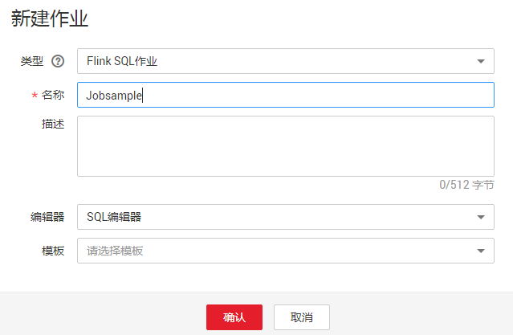
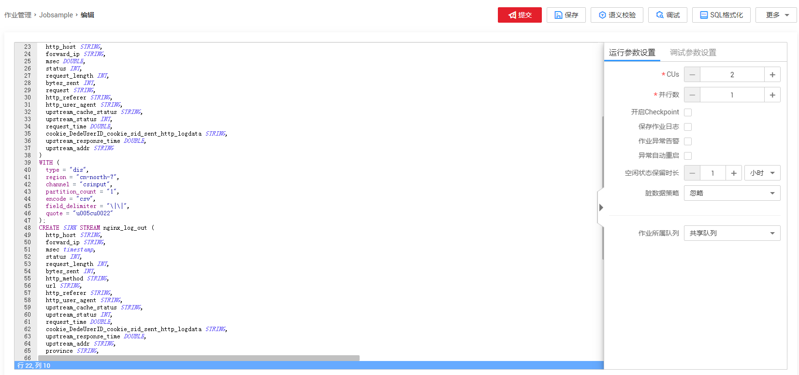
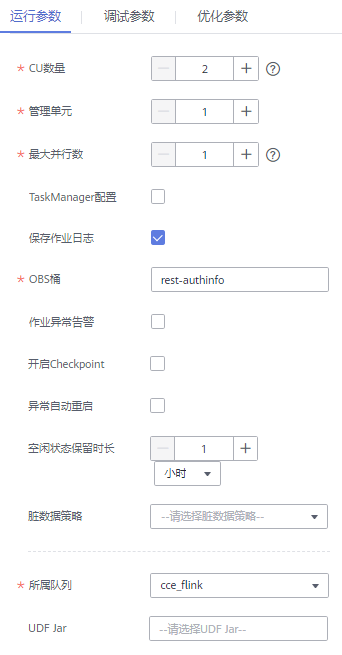

# 创建Flink SQL作业

本章节介绍如何新建Flink SQL作业。Flink SQL是一种由用户根据自己的逻辑需求编写作业的方式。用SQL表达业务逻辑，可以简便快捷的实现业务。目前Flink SQL作业支持两种Flink SQL语句编辑方式：SQL编辑器和可视化编辑器。本章节主要介绍使用SQL编辑器编写Flink SQL作业的方式。

关于可视化编辑器的介绍请参见[可视化编辑器](可视化编辑器.md)。

## 前提条件

创建Flink SQL作业时，需要事先准备数据源以及数据输出通道，具体内容请参见[准备数据](准备数据.md)。

## 操作步骤

1.  在DLI管理控制台的左侧导航栏中，单击“作业管理“\>“Flink作业“，进入“Flink作业“页面。
2.  在“Flink作业“页面右上角单击“新建作业“，弹出“新建作业“对话框。

    **图 1**  新建Flink SQL作业  
    

3.  配置作业信息。

    **表 1**  作业配置信息

    
    <table><thead align="left"><tr id="row43591258104111"><th class="cellrowborder" valign="top" width="20%" id="mcps1.2.3.1.1">
参数

    </th>
    <th class="cellrowborder" valign="top" width="80%" id="mcps1.2.3.1.2">
参数说明

    </th>
    </tr>
    </thead>
    <tbody><tr id="row16360958134110"><td class="cellrowborder" valign="top" width="20%" headers="mcps1.2.3.1.1 ">
类型

    </td>
    <td class="cellrowborder" valign="top" width="80%" headers="mcps1.2.3.1.2 ">
Flink SQL作业：用户采用编辑SQL语句来启动作业。

    </td>
    </tr>
    <tr id="row18361135814119"><td class="cellrowborder" valign="top" width="20%" headers="mcps1.2.3.1.1 ">
名称

    </td>
    <td class="cellrowborder" valign="top" width="80%" headers="mcps1.2.3.1.2 ">
作业名称，只能由字母、中文、数字、中划线和下划线组成，并且长度为1～57字节。

    
 说明： 

作业名称必须是唯一的。

    

    </td>
    </tr>
    <tr id="row93625589418"><td class="cellrowborder" valign="top" width="20%" headers="mcps1.2.3.1.1 ">
描述

    </td>
    <td class="cellrowborder" valign="top" width="80%" headers="mcps1.2.3.1.2 ">
作业的相关描述，长度为0～512字节。

    </td>
    </tr>
    <tr id="row936416582415"><td class="cellrowborder" valign="top" width="20%" headers="mcps1.2.3.1.1 ">
编辑器

    </td>
    <td class="cellrowborder" valign="top" width="80%" headers="mcps1.2.3.1.2 ">
支持“SQL编辑器”和“可视化编辑器”，默认选择“SQL编辑器”。

    </td>
    </tr>
    <tr id="row53646587415"><td class="cellrowborder" valign="top" width="20%" headers="mcps1.2.3.1.1 ">
模板

    </td>
    <td class="cellrowborder" valign="top" width="80%" headers="mcps1.2.3.1.2 ">
当编辑器选择“SQL编辑器”时，该参数有效。

    
用户可以选择样例模板或自定义的作业模板。关于模板的详细信息，请参见<a href="Flink模板管理.md">Flink模板管理</a>。

    </td>
    </tr>
    </tbody>
    </table>

4.  单击“确认“，进入作业“编辑“页面。
5.  编辑作业。

    **图 2**  作业编辑  
    

    在SQL语句编辑区域，输入详细的SQL语句。相关SQL语句请参考[《数据湖探索SQL语法参考》](https://support.huaweicloud.com/sqlreference-dli/dli_08_0219.html)。

6.  单击“语义校验“，确保语义校验成功。
    -   只有语义校验成功后，才可以执行“调试“或“提交“作业的操作。
    -   如果校验成功，提示“SQL语义校验成功”。
    -   如果校验失败，会在错误的SQL语句前面显示红色的“X”记号，鼠标移动到“X”号上可查看详细错误，请根据错误提示修改SQL语句。

7.  设置作业运行参数。

    **图 3**  设置Flink SQL作业运行参数  
    

    **表 2**  作业运行参数说明

    
    <table><thead align="left"><tr id="row9220121016203"><th class="cellrowborder" valign="top" width="22.189999999999998%" id="mcps1.2.3.1.1">
参数

    </th>
    <th class="cellrowborder" valign="top" width="77.81%" id="mcps1.2.3.1.2">
参数说明

    </th>
    </tr>
    </thead>
    <tbody><tr id="row1922015100201"><td class="cellrowborder" valign="top" width="22.189999999999998%" headers="mcps1.2.3.1.1 ">
CUs

    </td>
    <td class="cellrowborder" valign="top" width="77.81%" headers="mcps1.2.3.1.2 ">
CUs为DLI计费单位，1核4G的资源配置。

    </td>
    </tr>
    <tr id="row192221910132017"><td class="cellrowborder" valign="top" width="22.189999999999998%" headers="mcps1.2.3.1.1 ">
并行数

    </td>
    <td class="cellrowborder" valign="top" width="77.81%" headers="mcps1.2.3.1.2 ">
并行数是指同时运行Flink SQL作业的任务数。

    
 说明： 

并行数不能大于计算单元（CUs-1）的4倍。

    

    </td>
    </tr>
    <tr id="row322751016206"><td class="cellrowborder" valign="top" width="22.189999999999998%" headers="mcps1.2.3.1.1 ">
开启Checkpoint

    </td>
    <td class="cellrowborder" valign="top" width="77.81%" headers="mcps1.2.3.1.2 ">
设置是否开启作业快照，开启后可基于Checkpoint（一致性检查点）恢复作业。

    
如下两个参数是勾选“开启Checkpoint”后有效：<ul id="ul1922641017209"><li>Checkpoint间隔：Checkpoint的时间间隔，单位为秒，输入范围 1~999999，默认值为10s。</li><li>Checkpoint 模式：支持如下两种模式：<ul id="ul1022611017200"><li>AtLeastOnce：事件至少被处理一次。</li><li>ExactlyOnce：事件仅被处理一次。</li></ul>
    </li></ul>
    

    </td>
    </tr>
    <tr id="row12227171052018"><td class="cellrowborder" valign="top" width="22.189999999999998%" headers="mcps1.2.3.1.1 ">
保存作业日志

    </td>
    <td class="cellrowborder" valign="top" width="77.81%" headers="mcps1.2.3.1.2 ">
设置是否将作业运行时的日志信息保存到OBS。
 说明： 

如果同时勾选了“开启Checkpoint”和“保存作业日志”，OBS授权一次即可。

    

    

    </td>
    </tr>
    <tr id="row1922816108200"><td class="cellrowborder" valign="top" width="22.189999999999998%" headers="mcps1.2.3.1.1 ">
OBS桶

    </td>
    <td class="cellrowborder" valign="top" width="77.81%" headers="mcps1.2.3.1.2 ">
当勾选“开启Checkpoint”或“保存作业日志”时，该参数有效。

    
选择OBS桶用于保存用户Checkpoint和作业日志信息。

    
如果选择的OBS桶是未授权状态，需要单击“OBS授权”。

    </td>
    </tr>
    <tr id="row1788112311913"><td class="cellrowborder" valign="top" width="22.189999999999998%" headers="mcps1.2.3.1.1 ">
作业异常告警

    </td>
    <td class="cellrowborder" valign="top" width="77.81%" headers="mcps1.2.3.1.2 ">
设置是否将作业异常告警信息，如作业出现运行异常或者欠费情况，以SMN的方式通知用户。

    </td>
    </tr>
    <tr id="row1756231145112"><td class="cellrowborder" valign="top" width="22.189999999999998%" headers="mcps1.2.3.1.1 ">
主题名称

    </td>
    <td class="cellrowborder" valign="top" width="77.81%" headers="mcps1.2.3.1.2 ">
当勾选“开启作业异常告警”时，该参数有效。

    
选择一个自定义的SMN主题。如何自定义SMN主题，请参见<a href="https://support.huaweicloud.com/smn/index.html" target="_blank" rel="noopener noreferrer">《消息通知服务用户指南》</a>中“创建主题”章节。

    </td>
    </tr>
    <tr id="row1325629124615"><td class="cellrowborder" valign="top" width="22.189999999999998%" headers="mcps1.2.3.1.1 ">
异常自动重启

    </td>
    <td class="cellrowborder" valign="top" width="77.81%" headers="mcps1.2.3.1.2 ">
设置是否启动异常自动重启功能，当作业异常时将自动重启并恢复作业。

    </td>
    </tr>
    <tr id="row421610457473"><td class="cellrowborder" valign="top" width="22.189999999999998%" headers="mcps1.2.3.1.1 ">
空闲状态保留时长

    </td>
    <td class="cellrowborder" valign="top" width="77.81%" headers="mcps1.2.3.1.2 ">
用于清除GroupBy或Window经过最大保留时间后仍未更新的中间状态，默认设置为1小时。

    </td>
    </tr>
    <tr id="row060951717141"><td class="cellrowborder" valign="top" width="22.189999999999998%" headers="mcps1.2.3.1.1 ">
脏数据策略

    </td>
    <td class="cellrowborder" valign="top" width="77.81%" headers="mcps1.2.3.1.2 ">
选择处理脏数据的策略。支持如下三种策略：忽略，抛出异常和保存脏数据到OBS。默认选择忽略。

    </td>
    </tr>
    <tr id="row112293102204"><td class="cellrowborder" valign="top" width="22.189999999999998%" headers="mcps1.2.3.1.1 ">
作业所属队列

    </td>
    <td class="cellrowborder" valign="top" width="77.81%" headers="mcps1.2.3.1.2 ">
默认选择“共享队列”，用户也可以选择自定义的独享队列。

    
 说明： 

当子用户在创建作业时，子用户只能选择已经被分配的队列。

    

    </td>
    </tr>
    <tr id="row13260161215"><td class="cellrowborder" valign="top" width="22.189999999999998%" headers="mcps1.2.3.1.1 ">
UDF Jar

    </td>
    <td class="cellrowborder" valign="top" width="77.81%" headers="mcps1.2.3.1.2 ">
当作业所属集群选择独享集群时，该参数有效。在选择UDF Jar之前需要将对应的jar包上传至OBS桶中，并在“数据管理&gt;程序包管理”中创建程序包，具体操作请参考<a href="创建程序包.md">创建程序包</a>。

    
用户可以在SQL中调用插入Jar包中的自定义函数。

    
关于自定义函数的详细内容，请参见《<a href="https://support.huaweicloud.com/sqlreference-dli/dli_08_0099.html" target="_blank" rel="noopener noreferrer">数据湖探索SQL语法参考</a>》。

    </td>
    </tr>
    </tbody>
    </table>

8.  单击“保存“，保存作业和相关参数。
9.  单击“提交“，进入“作业配置清单“页面，单击“确认“，将作业提交并启动。

    提交作业后，系统将自动跳转到Flink作业管理页面，新创建的作业将显示在作业列表中，在“状态“列中可以查看作业状态。作业提交成功后，状态将由“提交中“变为“运行中“。运行完成后显示“已完成”。

    如果作业状态为“提交失败“或“运行异常“，表示作业提交或运行失败。用户可以在作业列表中的“状态“列中，将鼠标移动到状态图标上查看错误信息，单击可以复制错误信息。根据错误信息解决故障后，重新提交。

    > **说明：**   
    >其他功能按钮说明如下：  
    >-   调试：对作业进行调试。具体操作请参见[调试作业](调试作业.md)。  
    >-   SQL格式化：将SQL格式化，将SQL语句格式化后，需要重新编辑SQL语句。  
    >-   更多 \> 名称和描述修改：修改作业名称和描述。  
    >-   更多 \> 另存为：将新建作业另存为一个新作业。  
    >-   更多 \> 设为模板：将新创建的作业设置为作业模板。  
    >-   更多 \> 主题设置：设置页面主题，可以设置字体大小，自动换行和页面风格。  
    >-   更多 \> 帮助：跳转至帮助中心，为用户提供SQL语法参考。  

