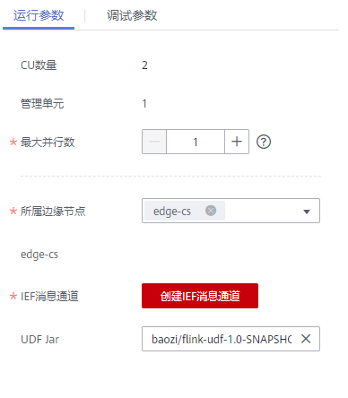

# 创建Flink SQL边缘作业<a name="dli_01_0456"></a>

本章节介绍如何新建Flink SQL边缘作业。Flink SQL边缘作业是一种处理边缘设备产生大量的数据时，为了减少数据上云的数据量或提高数据处理实时性，在靠近数据产生的地方对其进行分析处理的作业。

该作业是数据湖探索与智能边缘平台结合，通过在边缘节点上部署系统提供的流计算应用，将Flink计算能力从云端延伸到边缘。然后通过数据湖探索编辑Flink作业并下发到边缘执行，可以帮助用户在边缘快速实现对流数据的实时、快速、准确地分析处理。

## 前提条件<a name="section9243114805018"></a>

-   已开通智能边缘平台服务（IEF）。
-   已成功创建边缘节点和纳管边缘节点。具体操作步骤，请参见《智能边缘平台用户指南》中[边缘节点](https://support.huaweicloud.com/usermanual-ief/ief_01_0003.html)。
-   已成功部署边缘流计算应用。具体操作步骤，请参见《智能边缘平台用户指南》中[应用部署](https://support.huaweicloud.com/usermanual-ief/ief_01_0011.html)。
-   IEF服务必须具有Tenant Administrator权限才能运行作业。

## 注意事项<a name="section15350165714362"></a>

部署边缘应用时，需要注意以下几点：

-   通过系统模板部署应用时，容器规格不得小于默认值，否则会造成实例部署失败。
-   应用名称需要以“edge-dli-”为前缀，以保证DLI侧能获取相关边缘节点信息。
-   需要指定环境变量：PROJECT\_ID（其值为用户账户对应项目的project\_id，可以在控制台右上角“我的凭证”页面获取）。
-   需要挂载容器  “/opt/flink/edgecsa“  目录到终端节点本地目录，赋予读写权限，以保证容器异常重启情况下，系统能够自动重新拉起Flink作业。
-   需要在边缘节点部署Mosquitto软件，以保证容器能正常收发消息。mosquitto软件的下载请参见：[https://mosquitto.org/download/](https://mosquitto.org/download/)。
-   应用部署时，“容器网络“配置中“网络类型“选择“主机网络“，以保证容器应用能正常访问Mosquitto。
-   当前版本仅支持专业版IEF实例，铂金版实例后续版本提供支持。

边缘流计算应用部署时支持通过容器环境变量自定义Flink部分参数配置，支持的参数列表如下：

**表 1**  参数说明

<a name="table17530317365"></a>
<table><thead align="left"><tr id="row12530810369"><th class="cellrowborder" valign="top" width="30.259999999999998%" id="mcps1.2.3.1.1"><p id="p953018112367"><a name="p953018112367"></a><a name="p953018112367"></a>参数名</p>
</th>
<th class="cellrowborder" valign="top" width="69.74000000000001%" id="mcps1.2.3.1.2"><p id="p2053012163616"><a name="p2053012163616"></a><a name="p2053012163616"></a>参数说明</p>
</th>
</tr>
</thead>
<tbody><tr id="row7530414361"><td class="cellrowborder" valign="top" width="30.259999999999998%" headers="mcps1.2.3.1.1 "><p id="p165311617364"><a name="p165311617364"></a><a name="p165311617364"></a>JobManagerHeapSize</p>
</td>
<td class="cellrowborder" valign="top" width="69.74000000000001%" headers="mcps1.2.3.1.2 "><p id="p65311114369"><a name="p65311114369"></a><a name="p65311114369"></a>Jobmanager堆内存大小，默认值：1024m</p>
</td>
</tr>
<tr id="row65317143612"><td class="cellrowborder" valign="top" width="30.259999999999998%" headers="mcps1.2.3.1.1 "><p id="p853181183619"><a name="p853181183619"></a><a name="p853181183619"></a>TaskManagerMemoryProcessSize</p>
</td>
<td class="cellrowborder" valign="top" width="69.74000000000001%" headers="mcps1.2.3.1.2 "><p id="p12531101193611"><a name="p12531101193611"></a><a name="p12531101193611"></a>TaskManager进程内存大小，默认值：2048m</p>
</td>
</tr>
<tr id="row358201443720"><td class="cellrowborder" valign="top" width="30.259999999999998%" headers="mcps1.2.3.1.1 "><p id="p1858114193714"><a name="p1858114193714"></a><a name="p1858114193714"></a>TaskManagerMemoryMetaSize</p>
</td>
<td class="cellrowborder" valign="top" width="69.74000000000001%" headers="mcps1.2.3.1.2 "><p id="p145851443711"><a name="p145851443711"></a><a name="p145851443711"></a>TaskManager元空间内存大小，默认值：256m</p>
</td>
</tr>
<tr id="row496361673713"><td class="cellrowborder" valign="top" width="30.259999999999998%" headers="mcps1.2.3.1.1 "><p id="p12963416103717"><a name="p12963416103717"></a><a name="p12963416103717"></a>TaskManagerNetworkBufferNum</p>
</td>
<td class="cellrowborder" valign="top" width="69.74000000000001%" headers="mcps1.2.3.1.2 "><p id="p2010163434117"><a name="p2010163434117"></a><a name="p2010163434117"></a>TaskManager网络缓存数，默认值：2048</p>
</td>
</tr>
<tr id="row8242235183713"><td class="cellrowborder" valign="top" width="30.259999999999998%" headers="mcps1.2.3.1.1 "><p id="p102421035103713"><a name="p102421035103713"></a><a name="p102421035103713"></a>NumberOfTaskSlots</p>
</td>
<td class="cellrowborder" valign="top" width="69.74000000000001%" headers="mcps1.2.3.1.2 "><p id="p179637169373"><a name="p179637169373"></a><a name="p179637169373"></a>TaskManager task slot数量，默认值：1</p>
</td>
</tr>
<tr id="row19423193783713"><td class="cellrowborder" valign="top" width="30.259999999999998%" headers="mcps1.2.3.1.1 "><p id="p15423183714379"><a name="p15423183714379"></a><a name="p15423183714379"></a>RestartStrategy</p>
</td>
<td class="cellrowborder" valign="top" width="69.74000000000001%" headers="mcps1.2.3.1.2 "><p id="p12947101174218"><a name="p12947101174218"></a><a name="p12947101174218"></a>重启策略，默认值：fixed-delay</p>
</td>
</tr>
<tr id="row961014432373"><td class="cellrowborder" valign="top" width="30.259999999999998%" headers="mcps1.2.3.1.1 "><p id="p19611104323719"><a name="p19611104323719"></a><a name="p19611104323719"></a>RestartAttemptsNum</p>
</td>
<td class="cellrowborder" valign="top" width="69.74000000000001%" headers="mcps1.2.3.1.2 "><p id="p66111343163719"><a name="p66111343163719"></a><a name="p66111343163719"></a>重启次数，默认值：3</p>
</td>
</tr>
<tr id="row370019531371"><td class="cellrowborder" valign="top" width="30.259999999999998%" headers="mcps1.2.3.1.1 "><p id="p2070095353711"><a name="p2070095353711"></a><a name="p2070095353711"></a>RestartInterval</p>
</td>
<td class="cellrowborder" valign="top" width="69.74000000000001%" headers="mcps1.2.3.1.2 "><p id="p15700145373714"><a name="p15700145373714"></a><a name="p15700145373714"></a>重启间隔，默认值：10s</p>
</td>
</tr>
<tr id="row1945111276489"><td class="cellrowborder" valign="top" width="30.259999999999998%" headers="mcps1.2.3.1.1 "><p id="p5451327184810"><a name="p5451327184810"></a><a name="p5451327184810"></a>TimeZone</p>
</td>
<td class="cellrowborder" valign="top" width="69.74000000000001%" headers="mcps1.2.3.1.2 "><p id="p1545113276485"><a name="p1545113276485"></a><a name="p1545113276485"></a>时区，linux系统标准格式，默认值：Asia/Shanghai</p>
</td>
</tr>
</tbody>
</table>

## 创建Flink SQL边缘作业<a name="section28145411519"></a>

1.  在DLI管理控制台的左侧导航栏中，单击“作业管理“\>“Flink作业“，进入“Flink作业“页面。
2.  在“Flink作业“页面右上角单击“新建作业“，弹出“新建作业“对话框。

    **图 1**  新建Flink SQL边缘作业<a name="fig3908154618511"></a>  
    

3.  配置作业信息。

    **表 2**  作业配置信息

    <a name="table068753673318"></a>
    <table><thead align="left"><tr id="row176881936143310"><th class="cellrowborder" valign="top" width="15.28%" id="mcps1.2.3.1.1"><p id="p4688336193317"><a name="p4688336193317"></a><a name="p4688336193317"></a>参数</p>
    </th>
    <th class="cellrowborder" valign="top" width="84.72%" id="mcps1.2.3.1.2"><p id="p068814368336"><a name="p068814368336"></a><a name="p068814368336"></a>参数说明</p>
    </th>
    </tr>
    </thead>
    <tbody><tr id="row46921836113319"><td class="cellrowborder" valign="top" width="15.28%" headers="mcps1.2.3.1.1 "><p id="p2693113616339"><a name="p2693113616339"></a><a name="p2693113616339"></a>类型</p>
    </td>
    <td class="cellrowborder" valign="top" width="84.72%" headers="mcps1.2.3.1.2 "><p id="p18693193616333"><a name="p18693193616333"></a><a name="p18693193616333"></a>选择“Flink Edge SQL”：用户通过编辑SQL语句来启动作业。</p>
    </td>
    </tr>
    <tr id="row3695103619331"><td class="cellrowborder" valign="top" width="15.28%" headers="mcps1.2.3.1.1 "><p id="p1069523653314"><a name="p1069523653314"></a><a name="p1069523653314"></a>名称</p>
    </td>
    <td class="cellrowborder" valign="top" width="84.72%" headers="mcps1.2.3.1.2 "><p id="p369543633316"><a name="p369543633316"></a><a name="p369543633316"></a>作业名称，只能由字母、中文、数字、中划线和下划线组成，并且长度为1～57字节。</p>
    <div class="note" id="note8695836183314"><a name="note8695836183314"></a><a name="note8695836183314"></a><span class="notetitle"> 说明： </span><div class="notebody"><p id="p15697636183316"><a name="p15697636183316"></a><a name="p15697636183316"></a>作业名称必须是唯一的。</p>
    </div></div>
    </td>
    </tr>
    <tr id="row769723619339"><td class="cellrowborder" valign="top" width="15.28%" headers="mcps1.2.3.1.1 "><p id="p176971363333"><a name="p176971363333"></a><a name="p176971363333"></a>描述</p>
    </td>
    <td class="cellrowborder" valign="top" width="84.72%" headers="mcps1.2.3.1.2 "><p id="p669883603313"><a name="p669883603313"></a><a name="p669883603313"></a>作业的相关描述，且长度为0～512字节。</p>
    </td>
    </tr>
    <tr id="row1362515491434"><td class="cellrowborder" valign="top" width="15.28%" headers="mcps1.2.3.1.1 "><p id="p36261491333"><a name="p36261491333"></a><a name="p36261491333"></a>编辑器</p>
    </td>
    <td class="cellrowborder" valign="top" width="84.72%" headers="mcps1.2.3.1.2 "><p id="p136265491239"><a name="p136265491239"></a><a name="p136265491239"></a>支持<span class="parmvalue" id="parmvalue1736265817414"><a name="parmvalue1736265817414"></a><a name="parmvalue1736265817414"></a>“SQL编辑器”</span>和<span class="parmvalue" id="parmvalue4362658194111"><a name="parmvalue4362658194111"></a><a name="parmvalue4362658194111"></a>“可视化编辑器”</span>，默认选择<span class="parmvalue" id="parmvalue10364758194110"><a name="parmvalue10364758194110"></a><a name="parmvalue10364758194110"></a>“SQL编辑器”</span>。</p>
    </td>
    </tr>
    <tr id="row37021836183311"><td class="cellrowborder" valign="top" width="15.28%" headers="mcps1.2.3.1.1 "><p id="p77021362335"><a name="p77021362335"></a><a name="p77021362335"></a>模板名称</p>
    </td>
    <td class="cellrowborder" valign="top" width="84.72%" headers="mcps1.2.3.1.2 "><p id="p184821439162612"><a name="p184821439162612"></a><a name="p184821439162612"></a>当编辑器选择<span class="parmvalue" id="parmvalue83644587419"><a name="parmvalue83644587419"></a><a name="parmvalue83644587419"></a>“SQL编辑器”</span>时，该参数有效。</p>
    <p id="p1702736153320"><a name="p1702736153320"></a><a name="p1702736153320"></a>用户可以选择样例模板或自定义的作业模板。关于模板的详细信息，请参见<a href="Flink模板管理.md">Flink模板管理</a>。</p>
    </td>
    </tr>
    </tbody>
    </table>

4.  单击“确认“，进入“编辑“页面。
5.  编辑作业。

    根据需要编辑Flink SQL边缘作业，处理边缘设备数据。

    当前支持的DDL如下：

    -   输入输出流：edgehub；用户自定义
    -   维表：RDS（MySQL、gaussdb100）

    相关SQL语句请参考[《数据湖探索SQL语法参考》](https://support.huaweicloud.com/sqlreference-dli/dli_08_0275.html)。

    参考示例：功能为输出学生成绩大于或者等于80分的姓名和成绩。

    ```
    create source stream student_scores(name string, score int) with ( 
        type = "edgehub", 
        topic = "abc",    
        encode = "json", 
        json_config = "score = student.score; name=student.name" 
      ); 
      create sink stream excellent_students(name string, score int) with ( 
        type = "edgehub", 
        topic = "abcd", 
        encode = "csv", 
        field_delimiter = "," 
      ); 
      insert into excellent_students select name, score from student_scores where score >= 80;
    ```

6.  单击“语义校验“，确保语义校验成功。
    -   只有语义校验成功后，才可以执行“调试“、“提交“或“启动“作业的操作。
    -   如果校验成功，提示“SQL语义校验成功”。
    -   如果校验失败，会在错误的SQL语句前面显示红色的“X”记号，鼠标移动到“X”号上可查看详细错误，请根据错误提示修改SQL语句。

7.  设置作业运行参数。

    **图 2**  设置Flink SQL边缘作业运行参数<a name="fig176016241552"></a>  
    

    **表 3**  作业运行参数说明

    <a name="table1914654134116"></a>
    <table><thead align="left"><tr id="row6151254144118"><th class="cellrowborder" valign="top" width="26%" id="mcps1.2.3.1.1"><p id="p1915175411412"><a name="p1915175411412"></a><a name="p1915175411412"></a>参数</p>
    </th>
    <th class="cellrowborder" valign="top" width="74%" id="mcps1.2.3.1.2"><p id="p41545416410"><a name="p41545416410"></a><a name="p41545416410"></a>参数说明</p>
    </th>
    </tr>
    </thead>
    <tbody><tr id="row1872072617117"><td class="cellrowborder" valign="top" width="26%" headers="mcps1.2.3.1.1 "><p id="p3220610102011"><a name="p3220610102011"></a><a name="p3220610102011"></a>CU数量</p>
    </td>
    <td class="cellrowborder" valign="top" width="74%" headers="mcps1.2.3.1.2 "><p id="p1722091013204"><a name="p1722091013204"></a><a name="p1722091013204"></a>CU数量为DLI的计算单元数量和管理单元数量总和，CU也是DLI的计费单位，1CU=1核4G。</p>
    </td>
    </tr>
    <tr id="row546442171112"><td class="cellrowborder" valign="top" width="26%" headers="mcps1.2.3.1.1 "><p id="p27197337294"><a name="p27197337294"></a><a name="p27197337294"></a>管理单元</p>
    </td>
    <td class="cellrowborder" valign="top" width="74%" headers="mcps1.2.3.1.2 "><p id="p1271943319292"><a name="p1271943319292"></a><a name="p1271943319292"></a>管理单元CU数量。</p>
    </td>
    </tr>
    <tr id="row620105424112"><td class="cellrowborder" valign="top" width="26%" headers="mcps1.2.3.1.1 "><p id="p12201154164116"><a name="p12201154164116"></a><a name="p12201154164116"></a>最大并行数</p>
    </td>
    <td class="cellrowborder" valign="top" width="74%" headers="mcps1.2.3.1.2 "><p id="p1320175444115"><a name="p1320175444115"></a><a name="p1320175444115"></a>最大并行数是指同时运行Flink作业的最大任务数。</p>
    <div class="note" id="note520145414411"><a name="note520145414411"></a><a name="note520145414411"></a><span class="notetitle"> 说明： </span><div class="notebody"><p id="p419614211438"><a name="p419614211438"></a><a name="p419614211438"></a>最大并行数不能大于计算单元CU数的4倍。</p>
    </div></div>
    </td>
    </tr>
    <tr id="row536042444217"><td class="cellrowborder" valign="top" width="26%" headers="mcps1.2.3.1.1 "><p id="p1360102417422"><a name="p1360102417422"></a><a name="p1360102417422"></a>所属边缘节点</p>
    </td>
    <td class="cellrowborder" valign="top" width="74%" headers="mcps1.2.3.1.2 "><p id="p18838241444"><a name="p18838241444"></a><a name="p18838241444"></a>选择作业所属的边缘节点。</p>
    <a name="ul12671946112117"></a><a name="ul12671946112117"></a><ul id="ul12671946112117"><li>边缘节点是您自己的边缘计算设备，用于运行边缘应用，处理您的数据，并安全、便捷地和云端应用进行协同。边缘应用是您需要在边缘节点上运行的功能模块。</li></ul>
    <a name="ul1588317441"></a><a name="ul1588317441"></a><ul id="ul1588317441"><li>数据湖探索支持选择多个边缘节点部署作业，通过作业所属边缘节点的绑定，将数据湖探索Flink作业与IEF服务进行结合。</li></ul>
    </td>
    </tr>
    <tr id="row94137211106"><td class="cellrowborder" valign="top" width="26%" headers="mcps1.2.3.1.1 "><p id="p6414027105"><a name="p6414027105"></a><a name="p6414027105"></a>IEF消息通道</p>
    </td>
    <td class="cellrowborder" valign="top" width="74%" headers="mcps1.2.3.1.2 "><p id="p1041442111010"><a name="p1041442111010"></a><a name="p1041442111010"></a>创建IEF侧边云消息。</p>
    </td>
    </tr>
    <tr id="row756564410549"><td class="cellrowborder" valign="top" width="26%" headers="mcps1.2.3.1.1 "><p id="p14565124425411"><a name="p14565124425411"></a><a name="p14565124425411"></a>UDF Jar</p>
    </td>
    <td class="cellrowborder" valign="top" width="74%" headers="mcps1.2.3.1.2 "><p id="p4565154465417"><a name="p4565154465417"></a><a name="p4565154465417"></a>用户自定义UDF文件，可通过“程序包管理”功能上传到数据湖探索服务使用。</p>
    </td>
    </tr>
    </tbody>
    </table>

8.  单击“创建IEF消息通道”，创建IEF侧边云消息。
9.  单击“保存“，保存作业和相关参数。
10. 单击“提交“，进入“作业配置清单“页面，单击“确认“，将作业提交并启动。

    提交作业后，系统将自动跳转到“作业管理“页面，新创建的作业将显示在作业列表中，在“状态“列中可以查看作业状态。作业提交成功后，状态将由“提交中“变为“运行中“。运行结束显示“已完成”。

    如果作业状态为“提交失败“或“运行异常“，表示作业提交或运行失败。用户可以在作业列表中的“状态“列中，将鼠标移动到状态图标上查看错误信息，单击可以复制错误信息。根据错误信息解决故障后，重新提交。

    > **说明：** 
    >其他功能按钮说明如下：
    >-   调试：对作业进行调试。具体操作请参见[调试作业](调试作业.md)。
    >-   SQL格式化：将SQL格式化，将SQL语句格式化后，需要重新编辑SQL语句。
    >-   更多 \> 名称和描述修改：修改作业名称和描述。
    >-   更多 \> 另存为：将新建作业另存为一个新作业。
    >-   更多 \> 设为模板：将新创建的作业设置为作业模板。
    >-   更多 \> 主题设置：设置页面主题，可以设置字体大小，自动换行和页面风格。
    >-   更多 \> 帮助：帮助中心，为用户提供SQL语法参考。


## 验证作业运行效果<a name="section57921043124614"></a>

1.  在智能边缘平台中，登录任一节点（该节点需与边缘节点网络互通）。
2.  本示例使用以下命令发送数据到边缘节点。

    ```
    mosquitto_pub -h 边缘节点IP -t abc -m '{"student":{"score":90,"name":"1bc2"}}'；
    ```

    “abc“为作业中定义的topic名称。

3.  打开新的窗口，使用命令监听输出。输入以下命令，可查询到成绩大于或者等于80的学生姓名和成绩。

    ```
    mosquitto_sub -h 边缘节点IP -t abcd
    ```

    “abcd“为作业中定义的topic名称。


