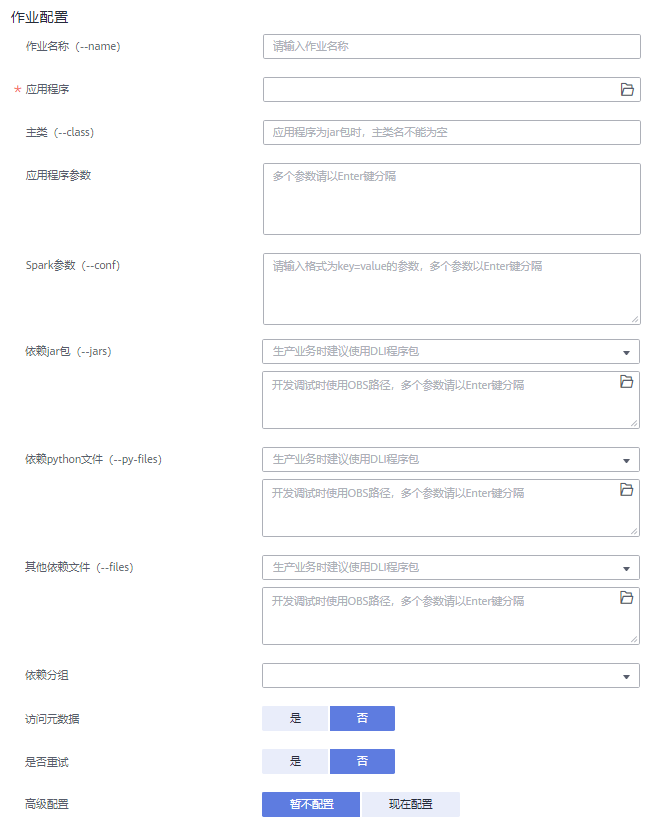

# 创建Spark作业

Spark作业编辑页面支持执行Spark作业，为用户提供全托管式的Spark计算服务。

在总览页面，单击Spark作业右上角“创建作业”，或在Spark作业管理页面右上角单击“创建作业”，可进入Spark作业编辑页面。

## 界面说明

**图 1**  Spark作业编辑页面导航栏  

**表 1**  导航栏说明

<table><thead align="left"><tr id="zh-cn_topic_0115200017_row105761087712"><th class="cellrowborder" valign="top" width="7.920792079207921%" id="mcps1.2.4.1.1">
序号

</th>
<th class="cellrowborder" valign="top" width="27.722772277227726%" id="mcps1.2.4.1.2">
按键

</th>
<th class="cellrowborder" valign="top" width="64.35643564356435%" id="mcps1.2.4.1.3">
描述

</th>
</tr>
</thead>
<tbody><tr id="zh-cn_topic_0115200017_row0576181717"><td class="cellrowborder" valign="top" width="7.920792079207921%" headers="mcps1.2.4.1.1 ">
1

</td>
<td class="cellrowborder" valign="top" width="27.722772277227726%" headers="mcps1.2.4.1.2 ">
队列

</td>
<td class="cellrowborder" valign="top" width="64.35643564356435%" headers="mcps1.2.4.1.3 ">
显示已有的队列。

</td>
</tr>
<tr id="zh-cn_topic_0115200017_row1157678977"><td class="cellrowborder" valign="top" width="7.920792079207921%" headers="mcps1.2.4.1.1 ">
2

</td>
<td class="cellrowborder" valign="top" width="27.722772277227726%" headers="mcps1.2.4.1.2 ">
程序包

</td>
<td class="cellrowborder" valign="top" width="64.35643564356435%" headers="mcps1.2.4.1.3 ">
显示已有的程序包。

</td>
</tr>
<tr id="zh-cn_topic_0115200017_row95761281676"><td class="cellrowborder" valign="top" width="7.920792079207921%" headers="mcps1.2.4.1.1 ">
3

</td>
<td class="cellrowborder" valign="top" width="27.722772277227726%" headers="mcps1.2.4.1.2 ">
创建

</td>
<td class="cellrowborder" valign="top" width="64.35643564356435%" headers="mcps1.2.4.1.3 ">
创建队列/程序包。

</td>
</tr>
<tr id="zh-cn_topic_0115200017_row1857619810717"><td class="cellrowborder" valign="top" width="7.920792079207921%" headers="mcps1.2.4.1.1 ">
4

</td>
<td class="cellrowborder" valign="top" width="27.722772277227726%" headers="mcps1.2.4.1.2 ">
刷新

</td>
<td class="cellrowborder" valign="top" width="64.35643564356435%" headers="mcps1.2.4.1.3 ">
包括刷新已有的队列和程序包列表。

</td>
</tr>
<tr id="row181911018124413"><td class="cellrowborder" valign="top" width="7.920792079207921%" headers="mcps1.2.4.1.1 ">
5

</td>
<td class="cellrowborder" valign="top" width="27.722772277227726%" headers="mcps1.2.4.1.2 ">
搜索

</td>
<td class="cellrowborder" valign="top" width="64.35643564356435%" headers="mcps1.2.4.1.3 ">
输入程序包名称进行搜索。

</td>
</tr>
</tbody>
</table>

创建Spark作业需要设置以下参数：

-   选择运行队列：具体参数请参考[表2](#zh-cn_topic_0115200017_table18913103220552)。

    **图 2**  创建Spark作业-选择运行队列  
    

    **表 2**  运行队列参数说明

    
    <table><thead align="left"><tr id="zh-cn_topic_0115200017_row169141932105516"><th class="cellrowborder" valign="top" width="17.34%" id="mcps1.2.3.1.1">
参数名称

    </th>
    <th class="cellrowborder" valign="top" width="82.66%" id="mcps1.2.3.1.2">
参数描述

    </th>
    </tr>
    </thead>
    <tbody><tr id="zh-cn_topic_0115200017_row102037812149"><td class="cellrowborder" valign="top" width="17.34%" headers="mcps1.2.3.1.1 ">
所属队列

    </td>
    <td class="cellrowborder" valign="top" width="82.66%" headers="mcps1.2.3.1.2 ">
下拉选择要使用的队列。

    </td>
    </tr>
    </tbody>
    </table>

-   作业配置：具体参数请参考[表3](#table161519411416)。

    **图 3**  创建Spark作业-作业配置  
    

    **表 3**  作业配置参数说明

    
    <table><thead align="left"><tr id="row186160413410"><th class="cellrowborder" valign="top" width="17.34%" id="mcps1.2.3.1.1">
参数名称

    </th>
    <th class="cellrowborder" valign="top" width="82.66%" id="mcps1.2.3.1.2">
参数描述

    </th>
    </tr>
    </thead>
    <tbody><tr id="row19617649416"><td class="cellrowborder" valign="top" width="17.34%" headers="mcps1.2.3.1.1 ">
作业名称

    </td>
    <td class="cellrowborder" valign="top" width="82.66%" headers="mcps1.2.3.1.2 ">
设置作业名称。

    </td>
    </tr>
    <tr id="row1461712412419"><td class="cellrowborder" valign="top" width="17.34%" headers="mcps1.2.3.1.1 ">
应用程序

    </td>
    <td class="cellrowborder" valign="top" width="82.66%" headers="mcps1.2.3.1.2 ">
选择需要执行的程序包。

    </td>
    </tr>
    <tr id="row561813464110"><td class="cellrowborder" valign="top" width="17.34%" headers="mcps1.2.3.1.1 ">
主类

    </td>
    <td class="cellrowborder" valign="top" width="82.66%" headers="mcps1.2.3.1.2 ">
输入主类名称。

    </td>
    </tr>
    <tr id="row136181414419"><td class="cellrowborder" valign="top" width="17.34%" headers="mcps1.2.3.1.1 ">
应用程序参数

    </td>
    <td class="cellrowborder" valign="top" width="82.66%" headers="mcps1.2.3.1.2 ">
用户自定义参数，多个参数以逗号分隔。

    </td>
    </tr>
    <tr id="row20647136165314"><td class="cellrowborder" valign="top" width="17.34%" headers="mcps1.2.3.1.1 ">
Spark参数

    </td>
    <td class="cellrowborder" valign="top" width="82.66%" headers="mcps1.2.3.1.2 ">
以“key/value”的形式设置提交Spark作业的属性，多个参数以Enter键分隔。详细内容请参见《数据湖探索API参考》&gt;《提交Spark作业相关API》&gt;<a href="https://support.huaweicloud.com/api-dli/dli_02_0124.html" target="_blank" rel="noopener noreferrer">《创建批处理作业》</a>&gt;“表2 请求参数说明”。

    </td>
    </tr>
    <tr id="row1981275318553"><td class="cellrowborder" valign="top" width="17.34%" headers="mcps1.2.3.1.1 ">
自定义镜像

    </td>
    <td class="cellrowborder" valign="top" width="82.66%" headers="mcps1.2.3.1.2 ">
选择在“容器镜像服务”中设置的镜像名称及版本。

    </td>
    </tr>
    <tr id="row196014274377"><td class="cellrowborder" valign="top" width="17.34%" headers="mcps1.2.3.1.1 ">
依赖jar包

    </td>
    <td class="cellrowborder" valign="top" width="82.66%" headers="mcps1.2.3.1.2 ">
运行spark作业依赖的jars。

    </td>
    </tr>
    <tr id="row12662161114381"><td class="cellrowborder" valign="top" width="17.34%" headers="mcps1.2.3.1.1 ">
依赖Python文件

    </td>
    <td class="cellrowborder" valign="top" width="82.66%" headers="mcps1.2.3.1.2 ">
运行spark作业依赖的py-files。

    </td>
    </tr>
    <tr id="row15191336193816"><td class="cellrowborder" valign="top" width="17.34%" headers="mcps1.2.3.1.1 ">
其他依赖文件

    </td>
    <td class="cellrowborder" valign="top" width="82.66%" headers="mcps1.2.3.1.2 ">
运行spark作业依赖的其他files。

    </td>
    </tr>
    <tr id="row129293017413"><td class="cellrowborder" valign="top" width="17.34%" headers="mcps1.2.3.1.1 ">
保存作业日志

    </td>
    <td class="cellrowborder" valign="top" width="82.66%" headers="mcps1.2.3.1.2 ">
是否保存作业日志。

    
选择“是”需要配置以下参数：

    
“OBS桶”：选择OBS桶用于保存用户作业日志信息。如果选择的OBS桶是未授权状态，需要单击“OBS授权”。

    </td>
    </tr>
    <tr id="row1989081215461"><td class="cellrowborder" valign="top" width="17.34%" headers="mcps1.2.3.1.1 ">
作业失败重试

    </td>
    <td class="cellrowborder" valign="top" width="82.66%" headers="mcps1.2.3.1.2 ">
作业失败后是否进行重试。

    
选择“是”需要配置以下参数：

    
“最大重试次数”：设置作业失败重试次数，最大值为“100”。

    </td>
    </tr>
    <tr id="row5835182513420"><td class="cellrowborder" valign="top" width="17.34%" headers="mcps1.2.3.1.1 ">
高级配置

    </td>
    <td class="cellrowborder" valign="top" width="82.66%" headers="mcps1.2.3.1.2 "><ul id="ul33251307256"><li>暂不配置</li><li>现在配置：包括以下两项参数<ul id="ul13639162018275"><li>选择依赖资源：具体参数请参考<a href="#table1386622213325">表4</a>。</li><li>计算资源规格：具体参数请参考<a href="#table1680231613596">表5</a>。</li></ul>
    </li></ul>
    </td>
    </tr>
    </tbody>
    </table>

    **图 4**  创建Spark作业-高级配置  
    

    **表 4**  选择依赖资源参数说明

    
    <table><thead align="left"><tr id="row686782223211"><th class="cellrowborder" valign="top" width="17.34%" id="mcps1.2.3.1.1">
参数名称

    </th>
    <th class="cellrowborder" valign="top" width="82.66%" id="mcps1.2.3.1.2">
参数描述

    </th>
    </tr>
    </thead>
    <tbody><tr id="row93181334192819"><td class="cellrowborder" valign="top" width="17.34%" headers="mcps1.2.3.1.1 ">
Module名称

    </td>
    <td class="cellrowborder" valign="top" width="82.66%" headers="mcps1.2.3.1.2 ">
DLI系统提供的用于执行跨源作业的依赖模块，访问各个不同的服务，选择不同的模块：<ul id="ul863182613314"><li>CloudTable/MRS HBase: sys.datasource.hbase</li><li>CloudTable/MRS OpenTSDB: sys.datasource.opentsdb</li><li>RDS MySQL: sys.datasource.rds</li><li>RDS PostGre: sys.datasource.rds</li><li>DWS: sys.datasource.dws</li><li>CSS: sys.datasource.css</li></ul>
    

    </td>
    </tr>
    <tr id="row1867822113215"><td class="cellrowborder" valign="top" width="17.34%" headers="mcps1.2.3.1.1 ">
分组名称

    </td>
    <td class="cellrowborder" valign="top" width="82.66%" headers="mcps1.2.3.1.2 ">
资源包所在分组的名称，默认不分组。

    </td>
    </tr>
    <tr id="row1986852214329"><td class="cellrowborder" valign="top" width="17.34%" headers="mcps1.2.3.1.1 ">
资源包

    </td>
    <td class="cellrowborder" valign="top" width="82.66%" headers="mcps1.2.3.1.2 ">
运行spark作业依赖的jar包。

    </td>
    </tr>
    </tbody>
    </table>

    **表 5**  计算资源规格参数说明

    
    <table><thead align="left"><tr id="row178031916155915"><th class="cellrowborder" valign="top" width="24.779999999999998%" id="mcps1.2.3.1.1">
参数名称

    </th>
    <th class="cellrowborder" valign="top" width="75.22%" id="mcps1.2.3.1.2">
参数描述

    </th>
    </tr>
    </thead>
    <tbody><tr id="row178035164597"><td class="cellrowborder" valign="top" width="24.779999999999998%" headers="mcps1.2.3.1.1 ">
资源规格

    </td>
    <td class="cellrowborder" valign="top" width="75.22%" headers="mcps1.2.3.1.2 ">
下拉选择所需的资源规格。系统提供3种资源规格供您选择。资源规格中如下配置项支持修改：

    <ul id="ul48974013311"><li>Executor内存</li><li>Executor CPU核数</li><li>Executor个数</li><li>driver CPU核数</li><li>driver内存</li></ul>
    
最终配置结果以修改后数据为准。

    </td>
    </tr>
    <tr id="row1480315166592"><td class="cellrowborder" valign="top" width="24.779999999999998%" headers="mcps1.2.3.1.1 ">
Executor内存

    </td>
    <td class="cellrowborder" valign="top" width="75.22%" headers="mcps1.2.3.1.2 ">
在所选资源规格基础上自定义Executor内存规格。

    </td>
    </tr>
    <tr id="row1780481665912"><td class="cellrowborder" valign="top" width="24.779999999999998%" headers="mcps1.2.3.1.1 ">
Executor CPU核数

    </td>
    <td class="cellrowborder" valign="top" width="75.22%" headers="mcps1.2.3.1.2 ">
在所选资源规格基础上自定义Executor CPU核数。

    </td>
    </tr>
    <tr id="row1680411613593"><td class="cellrowborder" valign="top" width="24.779999999999998%" headers="mcps1.2.3.1.1 ">
Executor个数

    </td>
    <td class="cellrowborder" valign="top" width="75.22%" headers="mcps1.2.3.1.2 ">
在所选资源规格基础上自定义Executor个数。

    </td>
    </tr>
    <tr id="row15805416115914"><td class="cellrowborder" valign="top" width="24.779999999999998%" headers="mcps1.2.3.1.1 ">
driver CPU核数

    </td>
    <td class="cellrowborder" valign="top" width="75.22%" headers="mcps1.2.3.1.2 ">
在所选资源规格基础上自定义Driver CPU核数。

    </td>
    </tr>
    <tr id="row1029553211514"><td class="cellrowborder" valign="top" width="24.779999999999998%" headers="mcps1.2.3.1.1 ">
driver内存

    </td>
    <td class="cellrowborder" valign="top" width="75.22%" headers="mcps1.2.3.1.2 ">
在所选资源规格基础上自定义Driver内存规格。

    </td>
    </tr>
    </tbody>
    </table>

## 创建Spark作业步骤

1.  在Spark作业编辑页面中，输入相关参数，具体请参考关于[图3](#zh-cn_topic_0115200017_fig12259471592)的说明。
2.  单击Spark作业编辑页面右上方“执行”，提交作业，页面显示“批处理作业提交成功”。
3.  （可选）可在“Spark作业”页面查看提交作业的状态及日志。

    > **说明：**   
    >作业执行成功后，作业记录只保存6小时。  

