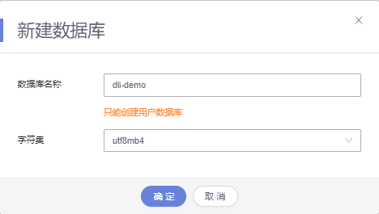

# 创建增强型跨源连接访问RDS<a name="dli_01_0020"></a>

创建增强型跨源连接访问云数据库RDS。基本流程如下：

[步骤1：登录华为云](#section3751181910618)

[步骤2：创建RDS MySQL实例](#section10891114913473)

[步骤3：创建RDS数据库表](#section18912701608)

[步骤4：登录DLI管理控制台](#section15452192134917)

[步骤5：创建队列](#section122981023152710)

[步骤6：创建增强型跨源连接](#section19012773105034)

[步骤7：提交SQL作业](#section21590507141153)

样例场景需要创建RDS MySQL实例，RDS数据库表，以及DLI增强型跨源连接，通过Spark SQL作业访问RDS数据库表。

## 步骤1：登录华为云<a name="section3751181910618"></a>

使用DLI服务，首先要登录华为云。

1.  打开[华为云](https://www.huaweicloud.com/)首页。
2.  在登录页面输入“帐号名“和“密码“，单击“登录“。

## 步骤2：创建RDS MySQL实例<a name="section10891114913473"></a>

本样例中，假设作业名称为“JobSample”，采用RDS服务作为数据源，创建RDS MySQL实例，具体操作请参见[《云数据库MySQL快速入门》](https://support.huaweicloud.com/qs-rds/zh-cn_topic_0046585334.html)中的“MySQL快速入门“章节。

1.  登录RDS管理控制台。
2.  在管理控制台左上角选择区域和项目。
3.  在页面左上角单击，选择“数据库 \> 云数据库 RDS”。进入云数据库 RDS信息页面。
4.  在“实例管理”页面，单击“购买数据库实例”。
5.  在“服务选型”页面，选择计费模式，填写并选择实例相关信息后，单击“立即购买”。

    相关信息如下：

    -   计费模式：按需计费
    -   区域：租户当前所在区域，也可在页面左上角切换
    -   实例名称：默认
    -   数据库引擎：MySQL
    -   数据库版本：8.0
    -   实例类型：单机
    -   存储类型：SSD云盘
    -   主可用区：默认
    -   备可用区：默认
    -   时区：默认
    -   性能规格：默认
    -   存储空间：默认
    -   磁盘加密：不加密
    -   虚拟私有云：创建VPC和子网的操作指导请参考[创建虚拟私有云和子网](https://support.huaweicloud.com/usermanual-vpc/zh-cn_topic_0013935842.html)，若需要在已有VPC上创建和使用新的子网，请参考[为虚拟私有云创建新的子网](https://support.huaweicloud.com/usermanual-vpc/zh-cn_topic_0013748726.html)。

        > **说明：** 
        >-   创建的VPC与使用的RDS服务应在相同的区域。
        >-   创建VPC和子网时，如无特殊需求，配置参数使用默认配置即可。

    -   内网安全组：创建安全组的操作指导请参考[创建安全组](https://support.huaweicloud.com/usermanual-vpc/zh-cn_topic_0013748715.html)，为安全组添加规则的操作指导请参考[添加安全组规则](https://support.huaweicloud.com/usermanual-vpc/zh-cn_topic_0030969470.html)。
    -   数据库端口：创建主实例加只读实例时，只读实例和主实例数据端口保持一致。
    -   设置密码：现在设置
    -   管理员账号：root
    -   管理员密码： 密码应为8\~32个字符。密码中需要包含大写字母、小写字母、数字或特殊字符中的三种。
    -   确认密码：输入同样的密码
    -   参数模板：默认
    -   表名大小写： 不区分大小写
    -   企业项目：default
    -   标签：不设置
    -   购买数量：1
    -   只读实例：暂不购买

6.  单击“立即购买”，进入“规格确认”页面。
7.  单击“提交”，完成购买RDS MySQL实例。
8.  实例创建成功后，用户可以在“实例管理”页面对其进行查看和管理。

    创建实例过程中，状态显示为“创建中”，创建完成的实例状态显示为“正常”。您可以通过“任务中心”查看详细进度和结果。


## 步骤3：创建RDS数据库表<a name="section18912701608"></a>

1.  登录RDS管理控制台。
2.  在管理控制台左上角选择区域和项目。
3.  在“实例管理页面”，找到您已经创建的RDS实例，获取其内网地址。

    **图 1**  内网地址<a name="fig888073617453"></a>  
    

4.  单击所创建RDS实例的“登录”，跳转至“数据管理服务-DAS”。输入相关账户信息，单击“测试连接”。显示连接成功后，单击“登录”，进入“实例登录”页面。

    **图 2**  登录RDS<a name="fig1483105454618"></a>  
    

    **图 3**  实例登录<a name="fig836795142020"></a>  
    

5.  登录RDS实例后，单击“新建数据库”，创建名称为“dli-demo”的数据库。

    **图 4**  创建数据库<a name="fig11115183131020"></a>  
    

6.  单击“SQL操作”\>“SQL查询”，执行如下SQL创建测试用MySQL表。

    ```
    CREATE TABLE `dli-demo`.`tabletest` (
    	`id` VARCHAR(32) NOT NULL,
    	`name` VARCHAR(32) NOT NULL,
    	PRIMARY KEY (`id`)
    )	ENGINE = InnoDB
    	DEFAULT CHARACTER SET = utf8mb4;
    ```


## 步骤4：登录DLI管理控制台<a name="section15452192134917"></a>

1.  在华为云官网首页的上方导航栏中，单击“产品“页签。
2.  在列表中，选择“大数据“\>“大数据计算“中的“数据湖探索 DLI“。
3.  在DLI服务产品页，单击“进入控制台“，进入DLI管理控制台页面。第一次进入数据湖探索管理控制台需要进行授权，以获取访问OBS的权限。

## 步骤5：创建队列<a name="section122981023152710"></a>

运行DLI SQL跨源作业，不能使用系统已有的default队列，需要您创建SQL队列，例如创建名为“test”的队列。创建队列详细介绍请参考[创建队列](创建队列.md)。

1.  在DLI管理控制台总览页，单击右上角“购买队列”进入购买队列页面。
2.  配置参数。
    -   计费模式：按需计费
    -   当前区域：默认区域
    -   队列名称：test
    -   队列类型：SQL队列。勾选“专属资源模式”。
    -   AZ策略：单AZ
    -   CPU架构：X86
    -   队列规格：16CUs
    -   企业项目：default
    -   描述：不填
    -   高级配置：自定义配置
    -   网段：配置的网段不能与RDS的子网网段冲突
    -   标签：不填

3.  单击“立即购买”，确认配置。
4.  配置确认无误，提交请求。

## 步骤6：创建增强型跨源连接<a name="section19012773105034"></a>

创建增强型跨源连接具体操作请参考[创建增强型跨源连接](创建-查找-删除增强型跨源连接.md#section73391334165211)。

> **说明：** 
>-   增强型跨源仅支持包年包月队列和按需专属队列。
>-   绑定跨源的DLI队列网段和数据源网段不能重合。
>-   系统default队列不支持创建跨源连接。
>-   访问跨源表需要使用已经创建跨源连接的队列。

1.  在DLI管理控制台左侧导航栏中，单击“队列管理”，可以在队列列表中看到您所创建的SQL队列test。
2.  单击“全局配置”\>“服务授权”，选中“VPC Administrator”，单击“更新委托权限”，赋予DLI操作用户VPC资源的权限，用于创建VPC的“对等连接”。

    **图 5**  更新委托权限<a name="fig1977338165613"></a>  
    

3.  在DLI管理控制台左侧导航栏中，选择“跨源连接”。
4.  选择“增强型跨源”页签，单击左上角的“创建”按钮。配置参数：
    -   连接名称：dlirds
    -   绑定队列：test

        > **说明：** 
        >如果创建增强型跨源连接时，不确定所绑定的队列，可先不绑定，等待跨源连接创建成功后，在对应跨源连接的“操作”列中，通过“绑定队列”操作进行绑定，具体请参考[绑定队列](绑定-解绑队列.md#section027361173415)。

    -   虚拟私有云：选择MySQL 实例所在的VPC

        > **说明：** 
        >在RDS控制台“实例管理”页面，单击对应实例名称，查看“连接信息”\>“虚拟私有云”，即可获取对应信息。

    -   子网：选择MySQL 实例所在的子网

        > **说明：** 
        >在RDS控制台“实例管理”页面，单击对应实例名称，查看“连接信息”\>“子网”，即可获取对应信息。


5.  单击“确定“，完成创建增强型跨源连接。
6.  在“增强型跨源”页签，单击创建的连接名称：dlirds，查看对等连接ID及连接状态，连接状态为“已激活”表示连接成功。
7.  测试队列与RDS实例连通性。
    1.  单击“队列管理”，选择您所绑定的队列，单击“操作”列中的“更多”\>“测试地址连通性”。

        **图 6**  检测地址连通性<a name="fig12260349458"></a>  
        

    2.  输入RDS MySQL实例内网地址，进行网络连通性测试。

        > **说明：** 
        >在RDS控制台“实例管理”页面，单击对应实例名称，查看“连接信息”\>“内网地址”，即可获取对应信息。

        测试结果显示可达，则DLI队列与MySQL实例的网络已经联通。

        **图 7**  测试结果<a name="fig1645116594718"></a>  
        

        如果测试结果不可达，需要修改实例所在VPC的安全组规则，具体操作请参考《[修改安全组规则](https://support.huaweicloud.com/usermanual-vpc/vpc_SecurityGroup_0005.html)》，DLI队列网段信息可以在队列的详情页中获取。

        **图 8**  安全组规则<a name="fig38579553215"></a>  
        


## 步骤7：提交SQL作业<a name="section21590507141153"></a>

此示例中以SQL作业为例说明如何跨源访问RDS表。通过Spark批作业跨源访问RDS的样例代码，请参考《数据湖探索开发指南》\>使用Spark作业跨源访问数据源\>[访问RDS](https://support.huaweicloud.com/devg-dli/dli_09_0084.html)。

提交SQL作业具体步骤请参考[提交SQL作业](提交SQL作业.md)。

1.  在DLI管理控制台的左侧导航栏中，单击“SQL编辑器”，进入SQL作业编辑器页面。
2.  在“SQL编辑器”页面右侧的编辑窗口中，输入如下SQL语句创建数据库db1，单击“执行”。

    ```
    create database db1;
    ```

3.  在编辑窗口中，选择队列“test”和数据库“db1”。输入如下SQL语句创建表，向RDS表插入数据，以及查询数据，单击“执行”。

    ```
    CREATE TABLE IF NOT EXISTS rds_test USING JDBC OPTIONS (
    'url' = 'jdbc:mysql://{{ip}}:{{port}}',  //RDS内网地址及端口
    'driver' = 'com.mysql.jdbc.Driver',
    'dbtable' = 'dli-demo.tabletest', //在RDS创建的库名及表名
    'user' = 'root',
    'password' = 'xxxx'  //RDS设置的密码
    )
    
    insert into rds_test VALUES ('123','abc');
    
    
    SELECT * from rds_test;
    
    ```


