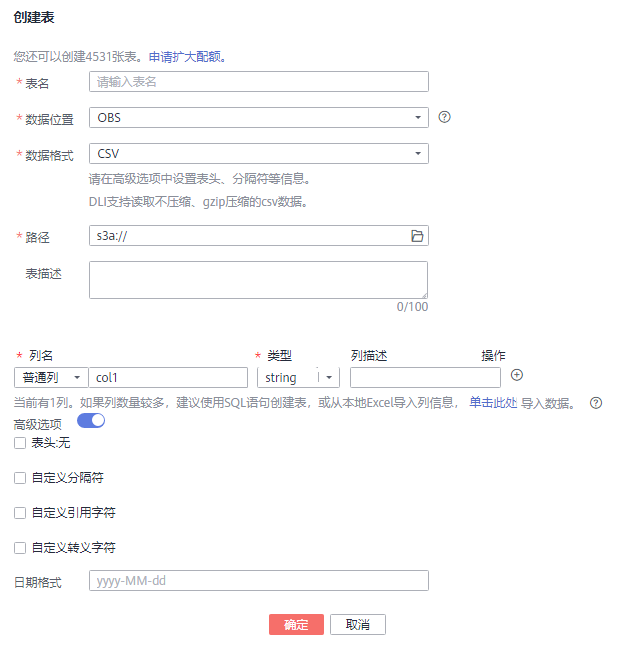

# 创建数据库和表

## 操作场景

-   数据库是按照数据结构来组织、存储和管理数据的建立在计算机存储设备上的仓库。表是数据库最重要的组成部分之一。表是由行与列组合成的。每一列被当作是一个字段。每个字段中的值代表一种类型的数据。数据库是一个框架，表是其实质内容。一个数据库包含一个或者多个表。
-   DLI中数据库的概念、基本用法与Oracle数据库基本相同，它还是DLI管理权限的基础单元，赋权以数据库为单位。
-   用户可通过管理控制台或SQL语句创建数据库和表，其中SQL语句的操作方法请参见[创建数据库](https://support.huaweicloud.com/sqlreference-dli/dli_08_0071.html)、[使用DataSource语法创建表](https://support.huaweicloud.com/sqlreference-dli/dli_08_0076.html)、[使用Hive语法创建表](https://support.huaweicloud.com/sqlreference-dli/dli_08_0077.html)和[创建表](https://support.huaweicloud.com/sqlreference-dli/dli_08_0098.html)。本章节介绍在管理控制台创建数据库和表的操作步骤。
-   当OBS的目录下有同名文件夹和文件时，创建OBS表指向该路径会优先指向文件而非文件夹。

## 创建数据库

1.  创建数据库的入口有两个，分别在“数据管理“和“作业编辑器“页面。
    -   在“数据管理“页面创建数据库。
        1.  在SQL作业管理控制台的顶部菜单栏中，选择“数据管理“。
        2.  在“数据管理“页面，显示当前已有的数据库列表，在数据库列表左上方，单击可创建数据库。

    -   在“作业编辑器“页面创建数据库。
        1.  在SQL作业管理控制台的顶部菜单栏中，选择“作业编辑器“。
        2.  在左侧导航栏单击选择“数据库”，单击右侧可创建数据库。

2.  在“创建数据库“页面，参见[表1](#table87541211210)输入数据库名称和描述信息。

    **图 1**  创建数据库  
    

    **表 1**  参数说明

    
    <table><thead align="left"><tr id="row0758124214"><th class="cellrowborder" valign="top" width="13%" id="mcps1.2.4.1.1">
参数名称

    </th>
    <th class="cellrowborder" valign="top" width="72%" id="mcps1.2.4.1.2">
描述

    </th>
    <th class="cellrowborder" valign="top" width="15%" id="mcps1.2.4.1.3">
示例

    </th>
    </tr>
    </thead>
    <tbody><tr id="row13754121829"><td class="cellrowborder" valign="top" width="13%" headers="mcps1.2.4.1.1 ">
数据库名称

    </td>
    <td class="cellrowborder" valign="top" width="72%" headers="mcps1.2.4.1.2 "><ul id="ul0758121215"><li>数据库名称只能包含数字、英文字母和下划线，但不能是纯数字，且不能以下划线开头。</li><li>数据库名称大小写不敏感且不能为空。</li><li>输入长度不能超过128个字符。</li></ul>
    </td>
    <td class="cellrowborder" valign="top" width="15%" headers="mcps1.2.4.1.3 ">
DB01

    </td>
    </tr>
    <tr id="row2750121829"><td class="cellrowborder" valign="top" width="13%" headers="mcps1.2.4.1.1 ">
描述

    </td>
    <td class="cellrowborder" valign="top" width="72%" headers="mcps1.2.4.1.2 ">
该数据库的描述。

    </td>
    <td class="cellrowborder" valign="top" width="15%" headers="mcps1.2.4.1.3 ">
-

    </td>
    </tr>
    </tbody>
    </table>

    > **说明：**   
    >“default”为内置数据库，不能创建名为“default”的数据库。  

3.  单击“确定“，完成数据库创建。

    数据库创建成功后，您可以在“数据管理“页面或者“作业编辑器”页面查看和选择使用对应的数据库。

## 创建表

创建表前，请确保数据库已创建。

1.  创建表的入口有两个，分别在“数据管理“和“作业编辑器“页面。

    > **说明：**   
    >下述两种方式不支持创建CloudTable表。可通过SQL方式创建CloudTable表，具体请参考[创建DLI表关联CloudTable](https://support.huaweicloud.com/sqlreference-dli/dli_08_0119.html)。  

    -   在“数据管理“页面创建表。
        1.  在SQL作业管理控制台的顶部菜单栏中，选择“数据管理“。
        2.  在数据库列表中，选择需要建表的数据库。在其“操作”栏中，单击“创建表”，可创建当前数据库下的表。

    -   在“作业编辑器“页面创建表。
        1.  在SQL作业管理控制台的顶部菜单栏中，选择“作业编辑器“。
        2.  在“作业编辑器“页面的左侧导航栏单击选择“数据库”，单击数据库名，在“表”区域右侧单击可创建当前数据库下的表。

2.  在“创建表“页面，填写参数。
    -   当数据位置为DLI时，请参见[表2](#table34159998103738)填写相关参数；

        **图 2**  创建表-DLI  
        

    -   当数据位置为OBS时，请参见[表2](#table34159998103738)和[表3](#table1913602718314)填写相关参数。

        **图 3**  创建表-OBS  
        

        **表 2**  通用参数说明

        
        <table><thead align="left"><tr id="row18398987103738"><th class="cellrowborder" valign="top" width="13.969999999999999%" id="mcps1.2.4.1.1">
参数名称

        </th>
        <th class="cellrowborder" valign="top" width="75.48%" id="mcps1.2.4.1.2">
描述

        </th>
        <th class="cellrowborder" valign="top" width="10.549999999999999%" id="mcps1.2.4.1.3">
示例

        </th>
        </tr>
        </thead>
        <tbody><tr id="row30303562103738"><td class="cellrowborder" valign="top" width="13.969999999999999%" headers="mcps1.2.4.1.1 ">
表名

        </td>
        <td class="cellrowborder" valign="top" width="75.48%" headers="mcps1.2.4.1.2 "><ul id="ul45217484103738"><li>表名称只能包含数字、英文字母和下划线，但不能是纯数字，且不能以下划线开头。</li><li>表名称大小写不敏感且不能为空。</li><li>输入长度不能超过128个字符。</li></ul>
        </td>
        <td class="cellrowborder" valign="top" width="10.549999999999999%" headers="mcps1.2.4.1.3 ">
table01

        </td>
        </tr>
        <tr id="row40392508173520"><td class="cellrowborder" valign="top" width="13.969999999999999%" headers="mcps1.2.4.1.1 ">
数据位置

        </td>
        <td class="cellrowborder" valign="top" width="75.48%" headers="mcps1.2.4.1.2 ">
数据存储位置，当前支持DLI和OBS。

        </td>
        <td class="cellrowborder" valign="top" width="10.549999999999999%" headers="mcps1.2.4.1.3 ">
OBS

        </td>
        </tr>
        <tr id="row16142559103738"><td class="cellrowborder" valign="top" width="13.969999999999999%" headers="mcps1.2.4.1.1 ">
表描述

        </td>
        <td class="cellrowborder" valign="top" width="75.48%" headers="mcps1.2.4.1.2 ">
该表的描述。

        </td>
        <td class="cellrowborder" valign="top" width="10.549999999999999%" headers="mcps1.2.4.1.3 ">
-

        </td>
        </tr>
        <tr id="row37659849105931"><td class="cellrowborder" valign="top" width="13.969999999999999%" headers="mcps1.2.4.1.1 ">
列名

        </td>
        <td class="cellrowborder" valign="top" width="75.48%" headers="mcps1.2.4.1.2 ">
表的列名。列名应至少包含一个字母，并允许下划线（_），但不支持纯数字，以及数字与以字母B，K，M，G或D结尾的组合。

        
 说明： 

列名不区分大小写，不能相同。

        

        </td>
        <td class="cellrowborder" valign="top" width="10.549999999999999%" headers="mcps1.2.4.1.3 ">
name

        </td>
        </tr>
        <tr id="row16943758105944"><td class="cellrowborder" valign="top" width="13.969999999999999%" headers="mcps1.2.4.1.1 ">
类型

        </td>
        <td class="cellrowborder" valign="top" width="75.48%" headers="mcps1.2.4.1.2 ">
与“列名”对应，表示该列的数据类型。

        <ul id="ul2957726293032"><li>字符串（string）：字符串类型。</li><li>有符号整数（int）：存储空间为4字节。</li><li>日期类型（date）：所表示日期的范围为0000-01-01 to 9999-12-31。</li><li>双精度浮点型（double）：存储空间为8字节。</li><li>布尔类型（boolean）：存储空间为1字节。</li><li>固定有效位数和小数位数的数据类型（decimal）：有效位数为1~38之间的正整数，包含1和38；小数位数为小于10的整数。</li><li>有符号整数（short）：存储空间为2字节。</li><li>时间戳（timestamp）：表示日期和时间，可达到小数点后6位。</li><li>有符号整数（long）：存储空间为8字节。</li><li>有符号整数（smallint）：存储空间为2字节。</li><li>有符号整数（bigint）：存储空间为8字节。</li></ul>
        </td>
        <td class="cellrowborder" valign="top" width="10.549999999999999%" headers="mcps1.2.4.1.3 ">
string

        </td>
        </tr>
        <tr id="row8664577112415"><td class="cellrowborder" valign="top" width="13.969999999999999%" headers="mcps1.2.4.1.1 ">
列描述

        </td>
        <td class="cellrowborder" valign="top" width="75.48%" headers="mcps1.2.4.1.2 ">
该列的描述。

        </td>
        <td class="cellrowborder" valign="top" width="10.549999999999999%" headers="mcps1.2.4.1.3 ">
-

        </td>
        </tr>
        <tr id="row562270711021"><td class="cellrowborder" valign="top" width="13.969999999999999%" headers="mcps1.2.4.1.1 ">
操作

        </td>
        <td class="cellrowborder" valign="top" width="75.48%" headers="mcps1.2.4.1.2 "><ul id="ul63937641112631"><li>添加列</li><li>删除列
 说明： 

当列数较多时，建议您使用SQL语句创建表，或直接从本地Excel导入列信息。

        

        </li></ul>
        </td>
        <td class="cellrowborder" valign="top" width="10.549999999999999%" headers="mcps1.2.4.1.3 ">
-

        </td>
        </tr>
        </tbody>
        </table>

        **表 3**  数据位置为OBS的参数说明

        
        <table><thead align="left"><tr id="row6603501618314"><th class="cellrowborder" valign="top" width="14.705882352941178%" id="mcps1.2.4.1.1">
参数名称

        </th>
        <th class="cellrowborder" valign="top" width="61.76470588235294%" id="mcps1.2.4.1.2">
描述

        </th>
        <th class="cellrowborder" valign="top" width="23.52941176470588%" id="mcps1.2.4.1.3">
示例

        </th>
        </tr>
        </thead>
        <tbody><tr id="row3015013618314"><td class="cellrowborder" valign="top" width="14.705882352941178%" headers="mcps1.2.4.1.1 ">
数据格式

        </td>
        <td class="cellrowborder" valign="top" width="61.76470588235294%" headers="mcps1.2.4.1.2 ">
支持以下数据格式。

        <ul id="ul4173603518455"><li>Parquet：DLI支持读取不压缩、snappy压缩、gzip压缩的parquet数据。</li><li>CSV：DLI支持读取不压缩、gzip压缩的csv数据。</li><li>ORC：DLI支持读取不压缩、snappy压缩的orc数据。</li><li>JSON：DLI支持读取不压缩、gzip压缩的json数据。</li><li>Carbon：DLI支持读取不压缩的carbon数据。</li></ul>
        </td>
        <td class="cellrowborder" valign="top" width="23.52941176470588%" headers="mcps1.2.4.1.3 ">
CSV

        </td>
        </tr>
        <tr id="row1866323018314"><td class="cellrowborder" valign="top" width="14.705882352941178%" headers="mcps1.2.4.1.1 ">
路径

        </td>
        <td class="cellrowborder" valign="top" width="61.76470588235294%" headers="mcps1.2.4.1.2 ">
直接输入路径或单击“OBS”选择OBS的路径。路径须以“s3a://”开头。

        
 说明： 

若是需要将OBS上的数据导入OBS表，则建表路径必须是文件夹。

        

        </td>
        <td class="cellrowborder" valign="top" width="23.52941176470588%" headers="mcps1.2.4.1.3 ">
s3a://obs1/sampledata.csv

        </td>
        </tr>
        <tr id="row2606533111817"><td class="cellrowborder" valign="top" width="14.705882352941178%" headers="mcps1.2.4.1.1 ">
表头

        </td>
        <td class="cellrowborder" valign="top" width="61.76470588235294%" headers="mcps1.2.4.1.2 ">
当“数据格式”为“CSV”时该参数有效。

        
设置导入数据源是否含表头。选中“高级选项”，勾选表头前的方框表示有表头，去勾选表示无表头。

        </td>
        <td class="cellrowborder" valign="top" width="23.52941176470588%" headers="mcps1.2.4.1.3 ">
-

        </td>
        </tr>
        <tr id="row34309994111832"><td class="cellrowborder" valign="top" width="14.705882352941178%" headers="mcps1.2.4.1.1 ">
自定义分隔符

        </td>
        <td class="cellrowborder" valign="top" width="61.76470588235294%" headers="mcps1.2.4.1.2 ">
当“数据格式”为“CSV”，并在自定义分隔符前的方框打勾时，该参数有效。

        
选中高级选项，支持选择如下分隔符。

        <ul id="ul44589980111836"><li>逗号(,)</li><li>竖线(|)</li><li>制表符(\t)</li><li>其他：输入自定义分隔符</li></ul>
        </td>
        <td class="cellrowborder" valign="top" width="23.52941176470588%" headers="mcps1.2.4.1.3 ">
逗号(,)

        </td>
        </tr>
        <tr id="row21739275111826"><td class="cellrowborder" valign="top" width="14.705882352941178%" headers="mcps1.2.4.1.1 ">
自定义引用字符

        </td>
        <td class="cellrowborder" valign="top" width="61.76470588235294%" headers="mcps1.2.4.1.2 ">
当“数据格式”为“CSV”，并在自定义引用字符前的方框打勾时，该参数有效。

        
选中高级选项，支持选择如下引用字符。

        <ul id="ul41920423111836"><li>单引号(')</li><li>双引号(")</li><li>其他：输入自定义引用字符</li></ul>
        </td>
        <td class="cellrowborder" valign="top" width="23.52941176470588%" headers="mcps1.2.4.1.3 ">
单引号(')

        </td>
        </tr>
        <tr id="row19930495111822"><td class="cellrowborder" valign="top" width="14.705882352941178%" headers="mcps1.2.4.1.1 ">
自定义转义字符

        </td>
        <td class="cellrowborder" valign="top" width="61.76470588235294%" headers="mcps1.2.4.1.2 ">
当“数据格式”为“CSV”，并在自定义转义字符前的方框打勾时，该参数有效。

        
选中高级选项，支持选择如下转义字符。

        <ul id="ul36433158111836"><li>反斜杠(\)</li><li>其他：输入自定义转义字符</li></ul>
        </td>
        <td class="cellrowborder" valign="top" width="23.52941176470588%" headers="mcps1.2.4.1.3 ">
反斜杠(\)

        </td>
        </tr>
        <tr id="row14602987103855"><td class="cellrowborder" valign="top" width="14.705882352941178%" headers="mcps1.2.4.1.1 ">
日期格式

        </td>
        <td class="cellrowborder" valign="top" width="61.76470588235294%" headers="mcps1.2.4.1.2 ">
当“数据格式”为“CSV”和“JSON”时此参数有效。

        
选中“高级选项”，该参数表示表中日期的格式，默认格式为“yyyy-MM-dd”。日期格式字符定义详见<a href="https://support.huaweicloud.com/sqlreference-dli/dli_08_0100.html" target="_blank" rel="noopener noreferrer">加载数据</a>中的“表3 日期及时间模式字符定义”。

        </td>
        <td class="cellrowborder" valign="top" width="23.52941176470588%" headers="mcps1.2.4.1.3 ">
2000-01-01

        </td>
        </tr>
        <tr id="row5732746810392"><td class="cellrowborder" valign="top" width="14.705882352941178%" headers="mcps1.2.4.1.1 ">
时间戳格式

        </td>
        <td class="cellrowborder" valign="top" width="61.76470588235294%" headers="mcps1.2.4.1.2 ">
当“数据格式”为“CSV”和“JSON”时此参数有效。

        
选中“高级选项”，该参数表示表中时间戳的格式，默认格式为“yyyy-MM-dd HH:mm:ss”。时间戳格式字符定义详见<a href="https://support.huaweicloud.com/sqlreference-dli/dli_08_0100.html" target="_blank" rel="noopener noreferrer">加载数据</a>中的“表3 日期及时间模式字符定义”。

        </td>
        <td class="cellrowborder" valign="top" width="23.52941176470588%" headers="mcps1.2.4.1.3 ">
2000-01-01 09:00:00

        </td>
        </tr>
        </tbody>
        </table>

3.  单击“确定“，完成表创建。

    表创建成功后，您可以在“数据管理“页面或者“作业编辑器”页面查看和选择使用对应的表。

4.  （可选）DLI表创建完成后，您可以选择是否直接向该表导入数据。

