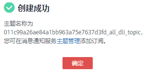

# 创建消息通知主题

确定创建消息通知主题后，您可在消息通知服务的“主题管理”页面中，对对应的主题“添加订阅”，选择不同方式（例如短信或者邮件等）进行订阅；订阅成功后，若作业失败，则系统将会自动发送消息到您指定的订阅终端。具体操作如下：

1.  在队列管理页面，单击，弹出[图1](#fig969753431112)所示对话框。

    **图 1**  创建消息通知主题  
    

2.  选择队列，单击“确定”。弹出[图2](#fig12471323125315)所示对话框。

    > **说明：**   
    >-   选择队列时，可以选择单个队列，也可以选择所有队列。如果单个队列和所有队列的终端不一致，那么，即选择了单个队列，又选择了所有队列进行订阅时，所有队列的消息通知中将不包含那个单队列的消息。  
    >-   创建消息通知主题后，只有在创建session或者创建batch失败时才会收到消息通知。  

    **图 2**  创建主题成功  
    

3.  单击[图2](#fig12471323125315)中“主题管理”，跳转至消息通知服务“主题管理”页面。

    **图 3**  主题管理  
    

4.  在[图3](#fig361113238574)对应主题的“操作”栏中，单击“添加订阅”，即可在[图4](#fig075918101718)对话框中，选择“协议”，确定订阅方式。

    -   如果选择“短信”协议，需要在“订阅终端”中填写接收确认短信的手机号码。
    -   如果选择“邮件”协议，需要在“订阅终端”中填写接收确认邮件的邮箱地址。
    -   更多信息，请参考《消息通知服务用户指南》中《[添加订阅](https://support.huaweicloud.com/usermanual-smn/smn_ug_0008.html)》章节。

    **图 4**  添加订阅  
    

5.  通过单击短信或者邮件中的链接确认后，将收到“订阅成功”的信息。
6.  返回[图3](#fig361113238574)所在页面，单击左侧“订阅”，对应的订阅状态为“已确认”，表示订阅成功。

