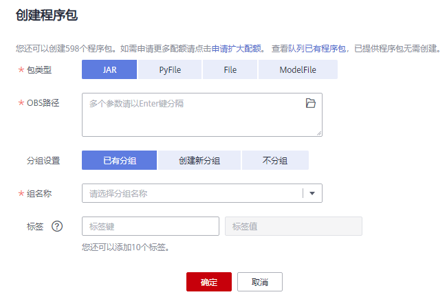

# 创建程序包

DLI支持用户通过批处理方式将程序包提交至spark队列中运行。

> **说明：** 
>如果用户需要更新程序包，可以使用相同的程序包或文件上传至DLI的同一个位置（同一个分组），直接覆盖原有的程序包或文件。

## 创建程序包步骤

1.  在管理控制台左侧，单击“数据管理“\>“程序包管理“。
2.  在“程序包管理“页面，单击右上角“创建”可创建程序包。
3.  在“创建程序包“对话框，参见[表1](#zh-cn_topic_0122016946_zh-cn_topic_0093946917_table19616613171536)设置相关参数。

    **图 1**  创建程序包  
    

    **表 1**  参数说明

    
    <table><thead align="left"><tr id="zh-cn_topic_0122016946_zh-cn_topic_0093946917_row15177266171536"><th class="cellrowborder" valign="top" width="17.05%" id="mcps1.2.3.1.1">
参数名称

    </th>
    <th class="cellrowborder" valign="top" width="82.95%" id="mcps1.2.3.1.2">
描述

    </th>
    </tr>
    </thead>
    <tbody><tr id="row0411835105712"><td class="cellrowborder" valign="top" width="17.05%" headers="mcps1.2.3.1.1 ">
包类型

    </td>
    <td class="cellrowborder" valign="top" width="82.95%" headers="mcps1.2.3.1.2 ">
支持的包类型如下：

    <ul id="zh-cn_topic_0122016946_ul19355124635412"><li>JAR：用户jar文件</li><li>PyFile：用户Python文件</li><li>File：用户文件</li><li>ModelFile：用户AI模型文件</li></ul>
    </td>
    </tr>
    <tr id="zh-cn_topic_0122016946_zh-cn_topic_0093946917_row56284350171536"><td class="cellrowborder" valign="top" width="17.05%" headers="mcps1.2.3.1.1 ">
OBS路径

    </td>
    <td class="cellrowborder" valign="top" width="82.95%" headers="mcps1.2.3.1.2 ">
选择对应程序包的OBS路径。

    
 说明： 
<ul id="ul04810218124"><li>程序包需提前上传至OBS服务中保存。</li><li>只支持选择文件。</li></ul>
    

    </td>
    </tr>
    <tr id="row415617241883"><td class="cellrowborder" valign="top" width="17.05%" headers="mcps1.2.3.1.1 ">
分组设置

    </td>
    <td class="cellrowborder" valign="top" width="82.95%" headers="mcps1.2.3.1.2 ">
可选择“已有分组”，“创建新分组”或“不分组”。

    </td>
    </tr>
    <tr id="row740151051019"><td class="cellrowborder" valign="top" width="17.05%" headers="mcps1.2.3.1.1 ">
组名称

    </td>
    <td class="cellrowborder" valign="top" width="82.95%" headers="mcps1.2.3.1.2 "><ul id="ul17658122119107"><li>选择“已有分组”：可选择已有的分组。</li><li>选择“创建新分组”：可输入自定义的组名称。</li><li>选择“不分组”：不需要选择或输入组名称。</li></ul>
    
 说明： 
<ul id="ul147622187210"><li>如果选择分组，则对应的权限管理为对应程序包组的权限管理。</li><li>如果选择不分组，则对应的权限管理为对应程序包的权限管理。</li></ul>
    
程序包组和程序包权限管理请参考<a href="程序包组和程序包权限管理.md">程序包权限管理</a>。

    

    </td>
    </tr>
    </tbody>
    </table>

4.  单击“确定“，完成创建程序包。

    程序包创建成功后，您可以在“程序包管理“页面查看和选择使用对应的包。

