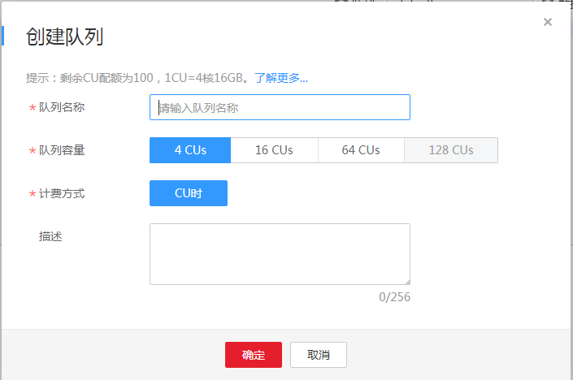

# 创建队列

## 操作场景

-   DLI服务中的队列即为计算资源，计算资源是使用DLI服务的基础，用户执行的一切作业都需要使用计算资源。
-   存储资源是DLI服务内部存储的资源，用于存储数据库和DLI表，是向DLI导入数据的必备条件，体现用户数据存储在DLI中的数据量。
-   服务预置了名为“default“的队列，资源的大小是按需分配的。用户在不确定所需队列容量或没有可创建队列空间的情况下，可以使用该队列执行作业。

    > **说明：**   
    >default队列只用作客户体验，用户间可能会出现抢占的情况，不能保证每次都可以得到资源执行相关操作。  

## 计算资源和存储资源的区别

**表 1**  区别

<table><thead align="left"><tr id="row26937981144323"><th class="cellrowborder" valign="top" width="16.351635163516352%" id="mcps1.2.5.1.1">
资源名称

</th>
<th class="cellrowborder" valign="top" width="32.14321432143215%" id="mcps1.2.5.1.2">
获取方式

</th>
<th class="cellrowborder" valign="top" width="26.502650265026507%" id="mcps1.2.5.1.3">
计费方式

</th>
<th class="cellrowborder" valign="top" width="25.002500250025%" id="mcps1.2.5.1.4">
主要作用

</th>
</tr>
</thead>
<tbody><tr id="row6525212144323"><td class="cellrowborder" valign="top" width="16.351635163516352%" headers="mcps1.2.5.1.1 ">
计算资源

</td>
<td class="cellrowborder" valign="top" width="32.14321432143215%" headers="mcps1.2.5.1.2 ">
在DLI管理控制台创建队列。

</td>
<td class="cellrowborder" valign="top" width="26.502650265026507%" headers="mcps1.2.5.1.3 ">
按扫描数据量或按CU时计费。

</td>
<td class="cellrowborder" valign="top" width="25.002500250025%" headers="mcps1.2.5.1.4 ">
执行查询。

</td>
</tr>
<tr id="row23790255144323"><td class="cellrowborder" valign="top" width="16.351635163516352%" headers="mcps1.2.5.1.1 ">
存储资源

</td>
<td class="cellrowborder" valign="top" width="32.14321432143215%" headers="mcps1.2.5.1.2 ">
DLI服务自带5G配额。

</td>
<td class="cellrowborder" valign="top" width="26.502650265026507%" headers="mcps1.2.5.1.3 ">
按存储数据量计费。

</td>
<td class="cellrowborder" valign="top" width="25.002500250025%" headers="mcps1.2.5.1.4 ">
存储DLI表。

</td>
</tr>
</tbody>
</table>

> **说明：**   
>计算资源和存储资源的计费细则可参考[《数据湖探索购买指南》](https://support.huaweicloud.com/pg-uquery/uquery_06_0001.html)。  

## 操作步骤

存储资源无需创建，DLI默认提供5G配额，若需要更大配额可提交工单申请。

下面介绍队列的创建。

1.  创建队列的操作入口有两个，分别在“队列管理“页面和“作业编辑器“页面。
    -   在“队列管理“页面创建队列。
        1.  在DLI管理控制台的顶部菜单栏中，选择“队列管理“。
        2.  在“队列管理“左侧，单击创建队列。

    -   在“作业编辑器“页面创建队列。
        1.  在DLI管理控制台的顶部菜单栏中，选择“作业编辑器“。
        2.  在左侧导航栏的页签，单击“队列”右侧的创建队列。

2.  在“创建队列“页面，参见[表2](#table19616613171536)设置相关参数。

    **图 1**  创建队列  
    

    > **说明：**   
    >创建队列需要完成华为云实名认证。  

    **表 2**  参数说明

    
    <table><thead align="left"><tr id="row15177266171536"><th class="cellrowborder" valign="top" width="25%" id="mcps1.2.3.1.1">
参数名称

    </th>
    <th class="cellrowborder" valign="top" width="75%" id="mcps1.2.3.1.2">
描述

    </th>
    </tr>
    </thead>
    <tbody><tr id="row56284350171536"><td class="cellrowborder" valign="top" width="25%" headers="mcps1.2.3.1.1 ">
名称

    </td>
    <td class="cellrowborder" valign="top" width="75%" headers="mcps1.2.3.1.2 ">
队列的名称。

    <ul id="ul6086155113624"><li>只能包含数字、英文字母和下划线，但不能是纯数字，不能以下划线开头，且不能为空。</li><li>输入长度不能超过128个字符。</li></ul>
    </td>
    </tr>
    <tr id="row6112092132926"><td class="cellrowborder" valign="top" width="25%" headers="mcps1.2.3.1.1 ">
队列容量

    </td>
    <td class="cellrowborder" valign="top" width="75%" headers="mcps1.2.3.1.2 ">
按需选择队列容量。包括<b>4CU</b>、<b>16CU</b>和<b>64CU</b>三种规格。

    </td>
    </tr>
    <tr id="row33430458171536"><td class="cellrowborder" valign="top" width="25%" headers="mcps1.2.3.1.1 ">
计费方式

    </td>
    <td class="cellrowborder" valign="top" width="75%" headers="mcps1.2.3.1.2 ">
<b>按CU时</b>计费。具体描述请参考<a href="https://support.huaweicloud.com/pg-uquery/uquery_06_0001.html" target="_blank" rel="noopener noreferrer">《数据湖探索购买指南》</a>。

    </td>
    </tr>
    <tr id="row47797635171536"><td class="cellrowborder" valign="top" width="25%" headers="mcps1.2.3.1.1 ">
描述

    </td>
    <td class="cellrowborder" valign="top" width="75%" headers="mcps1.2.3.1.2 ">
所创建队列的相应描述。输入长度不能超过256个字符。

    </td>
    </tr>
    </tbody>
    </table>

3.  单击“确定“，完成队列创建。

    队列创建成功后，您可以在“资源管理“页面或者“作业编辑器”页面查看和选择使用对应的队列。

