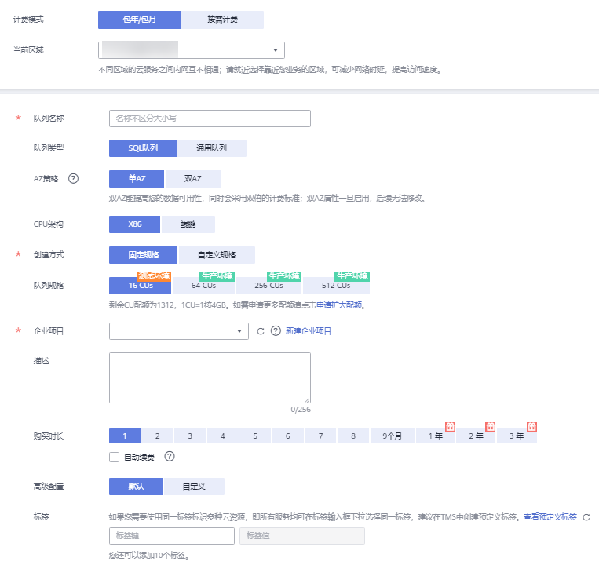
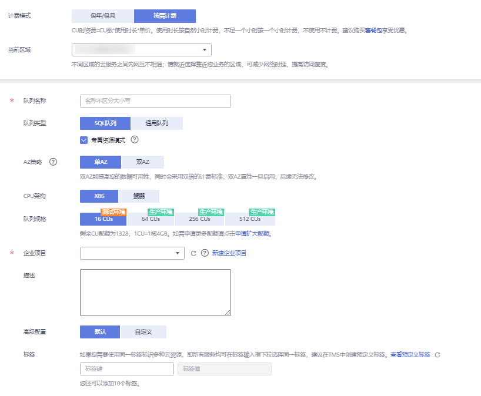

# 创建队列

执行作业前需要先创建队列。

> **说明：** 
>新队列第一次运行作业时，需要一定的时间，通常为6\~10分钟。

## 创建队列步骤

1.  创建队列的操作入口有三个，分别在“总览“页面、“SQL编辑器“页面和“队列管理“页面。
    -   单击总览页面右上角“购买队列”进行创建队列。
    -   在“队列管理“页面创建队列。
        1.  在DLI管理控制台的左侧导航栏中，选择“队列管理“。
        2.  单击“队列管理“页面右上角“购买队列”进行创建队列。

    -   在“SQL编辑器“页面创建队列。
        1.  在DLI管理控制台的顶部菜单栏中，选择“SQL编辑器“。
        2.  在左侧导航栏的队列页签，单击右侧的创建队列。

2.  在“购买队列“页面，进行资源选型，参见[表1](#table103571321132511)设置相关参数。

    **图 1**  购买队列-包年包月  
    

    **图 2**  购买队列-按需计费  
    

    > **说明：** 
    >创建队列需要完成华为云实名认证。

    **表 1**  参数说明

    
    <table><thead align="left"><tr id="row16358192162519"><th class="cellrowborder" valign="top" width="14.99%" id="mcps1.2.3.1.1">
参数名称

    </th>
    <th class="cellrowborder" valign="top" width="85.00999999999999%" id="mcps1.2.3.1.2">
描述

    </th>
    </tr>
    </thead>
    <tbody><tr id="row75931534268"><td class="cellrowborder" valign="top" width="14.99%" headers="mcps1.2.3.1.1 ">
计费模式

    </td>
    <td class="cellrowborder" valign="top" width="85.00999999999999%" headers="mcps1.2.3.1.2 "><ul id="ul114121349277"><li>包年/包月</li><li>按需计费：建议购买<a href="https://account.huaweicloud.com/usercenter/?agencyId=af8fcc08b5d9416ebdc15b3a84483263&amp;region=cn-north-1&amp;locale=zh-cn#/buyservice/commonCloud?pkgCode=dli_cuh" target="_blank" rel="noopener noreferrer">cu时套餐包</a>享受优惠。</li></ul>
    </td>
    </tr>
    <tr id="row987812482720"><td class="cellrowborder" valign="top" width="14.99%" headers="mcps1.2.3.1.1 ">
当前区域

    </td>
    <td class="cellrowborder" valign="top" width="85.00999999999999%" headers="mcps1.2.3.1.2 ">
选择创建队列的区域。不同的地域之间资源不互通，每个地域需分别购买，请根据您的实际需求慎重选择。

    </td>
    </tr>
    <tr id="row2358621122514"><td class="cellrowborder" valign="top" width="14.99%" headers="mcps1.2.3.1.1 ">
队列名称

    </td>
    <td class="cellrowborder" valign="top" width="85.00999999999999%" headers="mcps1.2.3.1.2 ">
队列的名称。

    <ul id="ul1235902112514"><li>只能包含数字、英文字母和下划线，但不能是纯数字，不能以下划线开头，且不能为空。</li><li>输入长度不能超过128个字符。</li></ul>
    </td>
    </tr>
    <tr id="row835962152512"><td class="cellrowborder" valign="top" width="14.99%" headers="mcps1.2.3.1.1 ">
队列类型

    </td>
    <td class="cellrowborder" valign="top" width="85.00999999999999%" headers="mcps1.2.3.1.2 "><ul id="ul1984112139342"><li>SQL队列：SQL作业的计算资源。</li><li>通用队列：Spark作业 、Flink 作业的计算资源。
 说明： 

按需计费时，可勾选“专属资源模式”，该模式下可创建增强型跨源。计费方式自创建起按自然小时收费。

    

    </li></ul>
    </td>
    </tr>
    <tr id="row15112368610"><td class="cellrowborder" valign="top" width="14.99%" headers="mcps1.2.3.1.1 ">
AZ策略

    </td>
    <td class="cellrowborder" valign="top" width="85.00999999999999%" headers="mcps1.2.3.1.2 ">
采用双AZ策略创建的队列，当某个AZ不可用时，仍然能够从其他AZ正常访问数据，适用于对可用性要求较高的场景。

    
 说明： 
<ul id="ul5895150989"><li>当前只有包年/包月计费模式SQL队列和按需计费专属资源模式SQL队列支持双AZ策略。</li><li>双AZ能提高您的数据可用性，同时会采用双倍的计费标准。</li><li>双AZ属性一旦启用，后续无法修改。</li></ul>
    

    </td>
    </tr>
    <tr id="row345312411461"><td class="cellrowborder" valign="top" width="14.99%" headers="mcps1.2.3.1.1 ">
CPU架构

    </td>
    <td class="cellrowborder" valign="top" width="85.00999999999999%" headers="mcps1.2.3.1.2 "><ul id="ul7329151318461"><li>X86</li><li>鲲鹏</li></ul>
    </td>
    </tr>
    <tr id="row337915461568"><td class="cellrowborder" valign="top" width="14.99%" headers="mcps1.2.3.1.1 ">
创建方式

    </td>
    <td class="cellrowborder" valign="top" width="85.00999999999999%" headers="mcps1.2.3.1.2 ">
选择“包年/包月”计费模式时，需要选择“创建方式”。可选择“固定规格”，也可以“自定义规格”。

    </td>
    </tr>
    <tr id="row535992116253"><td class="cellrowborder" valign="top" width="14.99%" headers="mcps1.2.3.1.1 ">
队列规格

    </td>
    <td class="cellrowborder" valign="top" width="85.00999999999999%" headers="mcps1.2.3.1.2 ">
按需选择队列规格。包括“16CUs”、“64CUs”、“256CUs”、“512CUs”。1CU=1核4GB。当剩余CU配额小于上述规格时，则不能创建队列。

    </td>
    </tr>
    <tr id="row21784437128"><td class="cellrowborder" valign="top" width="14.99%" headers="mcps1.2.3.1.1 ">
企业项目

    </td>
    <td class="cellrowborder" valign="top" width="85.00999999999999%" headers="mcps1.2.3.1.2 ">
若所建队列属于企业项目，可选择对应的企业项目。

    
企业项目是一种云资源管理方式，企业项目管理服务提供统一的云资源按项目管理，以及项目内的资源管理、成员管理。关于如何设置企业项目请参考《<a href="https://support.huaweicloud.com/usermanual-em/zh-cn_topic_0108763975.html" target="_blank" rel="noopener noreferrer">企业管理用户指南</a>》。

    
 说明： 

只有开通了企业管理服务的用户才显示该参数。

    

    </td>
    </tr>
    <tr id="row2362202118256"><td class="cellrowborder" valign="top" width="14.99%" headers="mcps1.2.3.1.1 ">
描述

    </td>
    <td class="cellrowborder" valign="top" width="85.00999999999999%" headers="mcps1.2.3.1.2 ">
所创建队列的相应描述。输入长度不能超过256个字符。

    </td>
    </tr>
    <tr id="row17641173612523"><td class="cellrowborder" valign="top" width="14.99%" headers="mcps1.2.3.1.1 ">
购买时长

    </td>
    <td class="cellrowborder" valign="top" width="85.00999999999999%" headers="mcps1.2.3.1.2 ">
选择“包年/包月”计费模式时，需要选择“购买时长”。购买时长约长，优惠越多。可勾选“自动续费”，按月购买，自动续费周期为1个月。按年购买，自动续费周期为1年。

    </td>
    </tr>
    <tr id="row1263194513559"><td class="cellrowborder" valign="top" width="14.99%" headers="mcps1.2.3.1.1 ">
高级配置

    </td>
    <td class="cellrowborder" valign="top" width="85.00999999999999%" headers="mcps1.2.3.1.2 ">
选择“包年/包月”计费模式，或在“按需计费”模式中，勾选“专属资源模式”时，需要选择“高级配置”。

    <ul id="ul69325112568"><li>默认配置：由系统自动配置。</li><li>自定义配置：选择“网段”。
“网段”：支持指定使用的网段范围，请参考<a href="修改队列网段.md">修改队列网段</a>。如需使用DLI增强型跨源，DLI队列网段与数据源网段不能重合。

    
不同资源可使用的网段范围分别如下：

    <ul id="ul1159910421105"><li>16CU:
10.0.0.0/8 ~ 10.255.255.0/24

    
172.16.0.0/12 ~ 172.31.255.0/24

    
192.168.0.0/16 ~ 192.168.255.0/24

    </li><li>64CU:
10.0.0.0/8 ~ 10.255.252.0/24

    
172.16.0.0/12 ~ 172.31.252.0/24

    
192.168.0.0/16 ~ 192.168.252.0/24

    </li><li>256CU:
10.0.0.0/8 ~ 10.255.252.0/22

    
172.16.0.0/12 ~ 172.31.252.0/22

    
192.168.0.0/16 ~ 192.168.252.0/22

    </li><li>512CU:
10.0.0.0/8 ~ 10.255.252.0/21

    
172.16.0.0/12 ~ 172.31.252.0/21

    
192.168.0.0/16 ~ 192.168.252.0/21

    </li></ul>
    
在“按需计费”模式中，勾选“专属资源模式”时，可选择“队列特性”。

    
“队列特性”：运行AI相关SQL作业时选择“AI增强型”队列，运行其他作业时选择“基础型”队列。

    
 说明： 

选择“AI增强型”队列时，若提示“AI feature is not supported on the queue.”请联系服务技术支持人员。

    

    </li></ul>
    </td>
    </tr>
    </tbody>
    </table>

3.  单击“立即购买“，确认配置。
4.  配置确认无误，单击“去支付“进行支付。

    如果队列名称已存在，单击“去支付“时，系统会提示“队列名称重复”错误，可返回“上一步“进行修改。

5.  队列创建成功后，您可以在“队列管理“页面或者“SQL编辑器”页面查看和选择使用对应的队列。

    > **说明：** 
    >新队列第一次运行作业时，需要一定的时间，通常为6\~10分钟。

