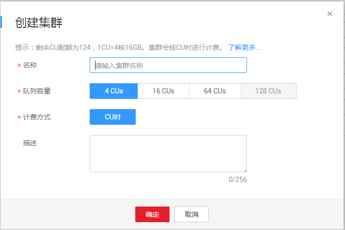

# 创建集群

## 操作场景

DLI可为用户提供全托管式的Spark计算服务。用户可在全托管Spark集群上进行数据分析。

## 操作步骤

1.  创建集群的操作入口有两个，分别在“集群管理“页面和“作业编辑器“页面。
    -   在“集群管理“页面创建集群。
        1.  在DLI管理控制台的顶部菜单栏中，选择“集群管理“。
        2.  在“集群管理“页面，单击可创建集群。

    -   在“作业编辑器“页面创建集群。
        1.  在DLI管理控制台的顶部菜单栏中，选择“作业编辑器“。
        2.  在左侧导航栏的页签，单击“集群”右侧的可创建集群。

2.  在“创建集群“页面，参见[表1](#zh-cn_topic_0122016943_zh-cn_topic_0093946917_table19616613171536)设置相关参数。

    **图 1**  创建集群  
    

    > **说明：**   
    >创建集群需要完成华为云实名认证。  

    **表 1**  参数说明

    
    <table><thead align="left"><tr id="zh-cn_topic_0122016943_zh-cn_topic_0093946917_row15177266171536"><th class="cellrowborder" valign="top" width="25%" id="mcps1.2.3.1.1">
参数名称

    </th>
    <th class="cellrowborder" valign="top" width="75%" id="mcps1.2.3.1.2">
描述

    </th>
    </tr>
    </thead>
    <tbody><tr id="zh-cn_topic_0122016943_zh-cn_topic_0093946917_row56284350171536"><td class="cellrowborder" valign="top" width="25%" headers="mcps1.2.3.1.1 ">
名称

    </td>
    <td class="cellrowborder" valign="top" width="75%" headers="mcps1.2.3.1.2 ">
集群名称。

    <ul id="zh-cn_topic_0122016943_zh-cn_topic_0093946917_ul6086155113624"><li>只能包含数字、英文字母和下划线，但不能是纯数字，不能以下划线开头，且不能为空。</li><li>输入长度不能超过128个字符。</li></ul>
    </td>
    </tr>
    <tr id="zh-cn_topic_0122016943_zh-cn_topic_0093946917_row6112092132926"><td class="cellrowborder" valign="top" width="25%" headers="mcps1.2.3.1.1 ">
队列容量

    </td>
    <td class="cellrowborder" valign="top" width="75%" headers="mcps1.2.3.1.2 ">
按需选择队列容量。包括<b>4CUs</b>、<b>16CUs</b>和<b>64CUs</b>三种规格。

    </td>
    </tr>
    <tr id="zh-cn_topic_0122016943_zh-cn_topic_0093946917_row33430458171536"><td class="cellrowborder" valign="top" width="25%" headers="mcps1.2.3.1.1 ">
计费方式

    </td>
    <td class="cellrowborder" valign="top" width="75%" headers="mcps1.2.3.1.2 ">
目前只支持<b>CU时</b>计费的方式。具体描述请参考<a href="https://support.huaweicloud.com/pg-uquery/uquery_06_0001.html" target="_blank" rel="noopener noreferrer">《数据湖探索购买指南》</a>。

    </td>
    </tr>
    <tr id="zh-cn_topic_0122016943_zh-cn_topic_0093946917_row47797635171536"><td class="cellrowborder" valign="top" width="25%" headers="mcps1.2.3.1.1 ">
描述

    </td>
    <td class="cellrowborder" valign="top" width="75%" headers="mcps1.2.3.1.2 ">
所创建集群的相应描述。输入长度不能超过256个字符。

    </td>
    </tr>
    </tbody>
    </table>

3.  单击“确定“，完成集群创建。

    集群创建成功后，您可以在“集群管理“页面或者“作业编辑器”页面查看和选择使用对应的集群。

